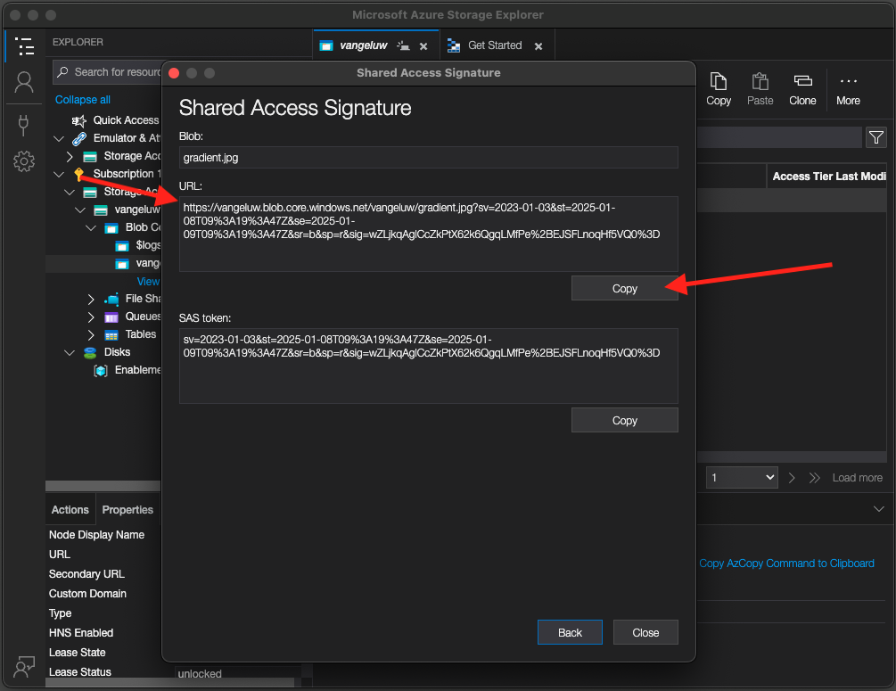
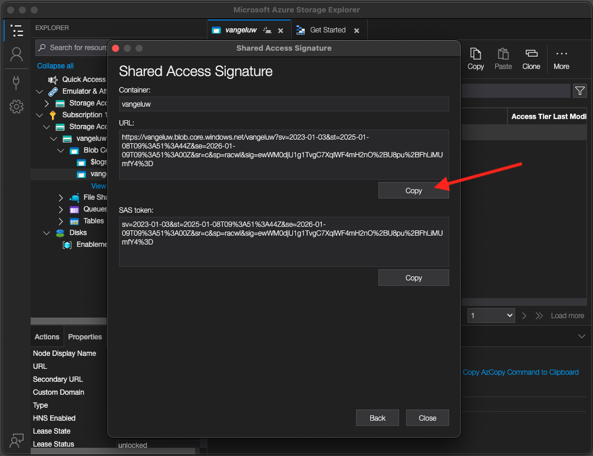

# 1.1.2 Optimize your Firefly process using Microsoft Azure and presigned URLs

## 1.1.2.1 Create an Azure Subscription

>[!NOTE]
>
>If you already have an existing Azure Subscription, you can skip this step. Please proceed with the next exercise in that case.

Go to [https://portal.azure.com](https://portal.azure.com) and login with your Azure account. If you don't have one, please use your personal email address to create your Azure account.

After successful login you'll see the following screen:

Click on the to left menu and select **All Resources**, the Azure subscription screen will appear if you are not yet subscribed. In that case select **Start with an Azure free Trial**. 

Fill in the Azure subscription form, provide your mobile phone and credit card for activation (you will have a free tier for 30 days and you will not be charged, unless you upgrade).

When the subscription process is finished you are good to go: 

## 1.1.2.2 Create Azure Storage Account

Search for `storage account` and then click **Storage accounts**.

Click **+ Create**.

Fill out the following details:

- Select your **Subscription**
- Select (or create) a **Resource group**
- **Storage account name**: use `--aepUserLdap--`

Click **Review + create**.

Click **Create**.

You'll then get a similar confirmation. Click **Go to resource**.

Your Azure Storage Account is now ready to be used.

Click **Data Storage** and then go to **Containers**. Click **+ Container**.

For the name, use `--aepUserLdap--`. Click **Create**.

Your container is now ready to be used.

## 1.1.2.3 Install Azure Storage Explorer

You'll use Microsoft Azure Storage Explorer to manage your files. You can download it via [this link](https://azure.microsoft.com/en-us/products/storage/storage-explorer#Download-4). Select the correct version for your specific OS, download it and install it.

Once the application is installed, open it. You'll see something similar to this. Click **Sign in with Azure**.

Click **Subscription**.

Select **Azure** and click **Next**.

Select your Microsoft Azure account and complete the authentication process.

Once authenticated, you'll see a message like this.

Switch back to the Microsoft Azure Storage Explorer app. Select your subscrption and click **Open Explorer**.

You'll then find your storage account under **Storage Accounts**.

Open **Blob Containers** and then click the container you created in the previous exercise.

## 1.1.2.4 Manual file upload and using a gradient file as style reference

You should now upload a gradient file of choice into your container. You can use any gradient file of choice, or you can use [this file](./images/gradient.png) by downloading it your computer.

Drop the gradient file into your container in Azure Storage Explorer.

Once uploaded, you'll see it in your container:

Right-click your file `gradient.jpg` and then click **Get Shared Access Signature**.

Under **Permissions**, only **Read** is required. Click **Create**.

You'll then see your presigned URL for this image file. Copy it as you'll need it for the next API request to Firefly.

Go back to Postman. Open the request **POST - Firefly - T2I (styleref) V3**. You'll then see this in **Body**.

Replace the placeholder URL by the presigned URL for your gradient file, that you copied from Azure Storage Explorer. You'll then have this. Click **Send**.

You'll then get a response from Firefly Services again, with a new image. Open the image file in your browser.

You'll then see another image with `horses in a field`, but this time the style will be similar to the gradient file that you provided as style reference.

## 1.1.2.5 Programmatic file upload 

In order to use programmatic file upload with Azure Storage Accounts, you'll need to create a new **Shared Access Signature (SAS)** token, with permissions that allow you to write a file.

To do so, go back to Azure Storage Explorer. Right-click your container, and then click **Get Shared Access Signature**.

Under **Permissions**, the following permissions are required:

- **Read**
- **Add**
- **Create**
- **Write**
- **List**

Click **Create**.

You'll then get your **SAS-token**. Click **Copy**.

You can now use this **SAS-token** to upload a file into your Azure Storage Account. Go back to Postman to do that.

Click to select the folder **FF - Firefly Services Tech Insiders**, then click the 3 dots **...** on the folder **Firefly** and then click **Add request**.

You'll then have an empty request. Change the name of the request to **Upload file to Azure Storage Account**, change the **Request Type** to **PUT** and paste the SAS-token URL in the URL section.

Then, click **Body**.

You will now need to select a file from your local machine. You can use a new image file of choice, or you can use another gradient file that you can find [here](./images/gradient2-p.jpg).

In **Body**, select **binary** and then click **Select file**, then click **+ New file from local machine**.

Select your file of choice and click **Open**.

You'll then see this. The next thing to do is to specify the file name that will be used in your Azure Storage Account. To do that, you need to put your cursos in front of the question mark **?** in the URL. You can currently see this there:

The URL currently looks like this, but will need to change. 

`https://vangeluw.blob.core.windows.net/vangeluw?sv=2023-01-03...`

The file name to use is `gradient2-p.jpg`, which meands that the URL needs to change to include the file name, like this:

`https://vangeluw.blob.core.windows.net/vangeluw/gradient2-p.jpg?sv=2023-01-03...`

Next, go to **Headers** where you need to add a new header manually. Use this:

x-ms-blob-type BlockBlob

Go to **Authorization** and set the **Auth Type** to **No Auth**. Click **Send**.

You'll then see this empty response in Postman, which means that your file upload went fine.

If you then go back to Azure Storage Explorer and refresh the content of your folder, you'll now find the newly uploaded file there.

Next Step: [1.1.3 ... ](./ex3.md)

[Go Back to Module 1.1](./firefly-services.md)

[Go Back to All Modules](./../../../overview.md)
