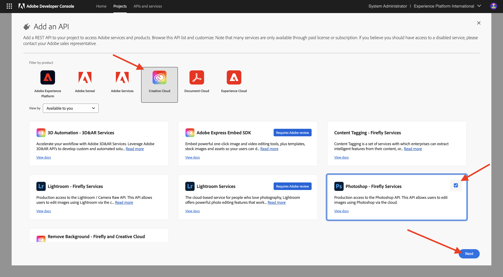
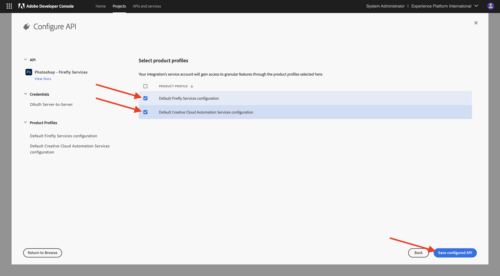
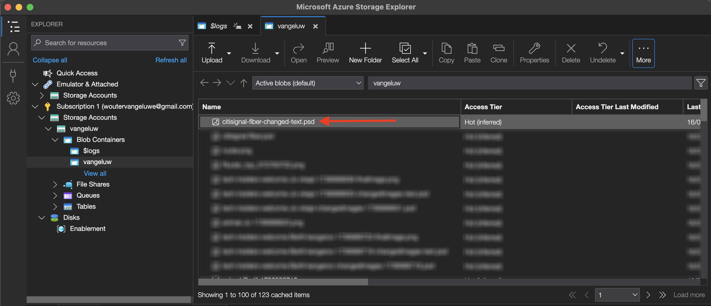

# 1.1.3 Working with Photoshop APIs

Learn how to work with the Photoshop APIs and Firefly Services.

## 1.1.3.1 Update your Adobe I/O integration

1. Go to [https://developer.adobe.com/console/home](https://developer.adobe.com/console/home){target="_blank"}.

  {zoomable="yes"}

1. Go to **Projects** and select the project you created in the previous exercise, which is called `--aepUserLdap-- Firefly`.

  {zoomable="yes"}

1. Select **+ Add to Project** and then select **API**.

  {zoomable="yes"}

1. Select **Creative Cloud** and choose **Photoshop - Firefly Services**. Select **Next**.

  {zoomable="yes"}

1. Select **Next**.

  {zoomable="yes"}

  Next, you need to select a product profile that defines what permissions are available to this integration.

1. Select **Default Firefly Services Configuration** and **Default Creative Cloud Automation Services configuration**.

1. Select **Save Configured API**.

  {zoomable="yes"}

  Your Adobe I/O project is now updated to work with Photoshop and Firefly Services APIs.

  {zoomable="yes"}

## 1.1.3.2 Programmatically interact with a PSD file

1. Download [citisignal-fiber.psd](./../../../assets/ff/citisignal-fiber.psd){target="_blank"} to your desktop.

1. Open **citisignal-fiber.psd** in Photoshop. 

  {zoomable="yes"}

  In the **Layers** pane, the designer of the file has given a unique name to each layer. You can see the layer information by opening the PSD file in Photoshop, but you can also do this programmatically.

  Let's send your first API request to Photoshop APIs.

1. In Postman, before sending API requests to Photoshop, you need to authenticate to Adobe I/O. Open the previous request with the name **POST - Get Access Token**.

1. Go to **Params** and verify that the parameter **Scope** is properly set. The **Value** for **Scope** should look like this: 

  `openid,session,AdobeID,read_organizations,additional_info.projectedProductContext, ff_apis, firefly_api`

1. Select **Send**.

  {zoomable="yes"}

  Now you have a valid access token to interact with Photoshop APIs.

  {zoomable="yes"}

### Photoshop API - Hello World

Next, let's say hello to Photoshop APIs to test if all permissions and access is set correctly. 

1. In the collection **Photoshop**, open the request  **Photoshop Hello (Test Auth.)**. Select **Send**.

  {zoomable="yes"}

  You should receive the response **Welcome to the Photoshop API!**.

  {zoomable="yes"}

Next, in order to programmatically interact with the PSD file **citisignal-fiber.psd**, you need to upload it to your storage account. You can do that manually-- by dragging and dropping it into your container using Azure Storage explorer--but this time you should do it through the API.

### Upload PSD to Azure

1. In Postman, open the request **Upload PSD to Azure Storage Account**. In the previous exercise, you configured these environment variables in Postman, which you'll use now:

  - `AZURE_STORAGE_URL`
  - `AZURE_STORAGE_CONTAINER`
  - `AZURE_STORAGE_SAS_READ`
  - `AZURE_STORAGE_SAS_WRITE`

  As you can see in the request **Upload PSD to Azure Storage Account**, the URL is configured to use these variables.

  {zoomable="yes"}

1. In **Body**, select the file **citisignal-fiber.psd**. 

  {zoomable="yes"}

1. Your screen should look like this. Select **Send**.

  {zoomable="yes"}

  You should get this empty response back from Azure, which means that your file is stored in your container in your Azure Storage account.

  {zoomable="yes"}

If you use Azure Storage Explorer to look at your file, be sure to refresh your folder.

  {zoomable="yes"}

### Photoshop API - Get manifest

Next, you need to get the manifest file of your PSD file. 

1. In Postman, open the request **Photoshop - Get PSD Manifest**. Go to **Body**.

  The body should look like this:

  ```json
  {
    "inputs": [
      {
        "storage": "external",
        "href": "{{AZURE_STORAGE_URL}}/{{AZURE_STORAGE_CONTAINER}}/citisignal-fiber.psd{{AZURE_STORAGE_SAS_READ}}"
      }
    ],
    "options": {
      "thumbnails": {
        "type": "image/jpeg"
      }
    }
  }
  ```

1. Select **Send**.

In the response, you now see a link. As operations in Photoshop can sometimes take some time to complete, Photoshop provides a status file as a response to most incoming requests. To understand what is happening with your request, you need to read the status file.

  {zoomable="yes"}

1. To read the status file, open the request **Photoshop -  Get PS Status**. You can see that this request is using a variable as a URL, which is a variable that is set by the previous request that you sent, **Photoshop - Get PSD Manifest**. Variables are set in the **Scripts** of each request. Select **Send**.

  {zoomable="yes"}

  Your screen should look like this. Currently, the status is set to **pending**, which means that the process hasn't completed yet. 

  {zoomable="yes"}

1. Select send a couple more times on **Photoshop -  Get PS Status**, until the status changes to **succeeded**. This may take a couple of minutes.

When the response is available, you can see the json file contains information on all the layers of the PSD file. This is useful information, as things like the layer name or layer ID can be identified.

  {zoomable="yes"}

  As an example, search for the text `2048x2048-cta`. Your screen should look like this:

  {zoomable="yes"}

### Photoshop API - Change Text 

Next, you need to change the text for the call to action using the APIs. 

1. In Postman, open the request **Photoshop - Change Text** and go to **Body**.

  Your screen should look like this:

  - first, an input file is specified: `citisignal-fiber.psd`
  - second, the layer to change is specified, with the text to change to
  - third, an output file is specified: `citisignal-fiber-changed-text.psd`

  ```json
  {
    "inputs": [
      {
        "storage": "external",
        "href": "{{AZURE_STORAGE_URL}}/{{AZURE_STORAGE_CONTAINER}}/citisignal-fiber.psd{{AZURE_STORAGE_SAS_READ}}"
      }
    ],
    "options": {
      "layers": [
        {
          "name": "2048x2048-cta",
          "text": {
            "content": "Get Fiber now!"
          }
        }
      ]
    },
    "outputs": [
      {
        "storage": "azure",
        "href": "{{AZURE_STORAGE_URL}}/{{AZURE_STORAGE_CONTAINER}}/citisignal-fiber-changed-text.psd{{AZURE_STORAGE_SAS_WRITE}}",
        "type": "vnd.adobe.photoshop",
        "overwrite": true
      }
    ]
  }
  ```

  The output file has a different name, because you don't want to override the original input file.

1. Select **Send**.

  {zoomable="yes"}

  Just like before, the response contains a link that points to the status file that keeps track of the progress.

  {zoomable="yes"}

1. To read the status file, open the request **Photoshop -  Get PS Status** and select **Send**. If the status isn't set to **succeeded** immediately, wait a couple of seconds and then select **Send** again.

1. Select the URL to download the output file.

  {zoomable="yes"}

1. Open **citisignal-fiber-changed-text.psd** after downloading the file to your computer. You should see the placeholder for the call to action has been replaced by the text **Get Fiber now!**.

  {zoomable="yes"}

  You can also see this file in your container using Azure Storage explorer.

  {zoomable="yes"}

## Next Steps

Go to [Firefly Custom Models API](./ex4.md){target="_blank"}

Go back to [Overview of Adobe Firefly Services](./firefly-services.md){target="_blank"}

Go back to [All Modules](./../../../overview.md){target="_blank"}
