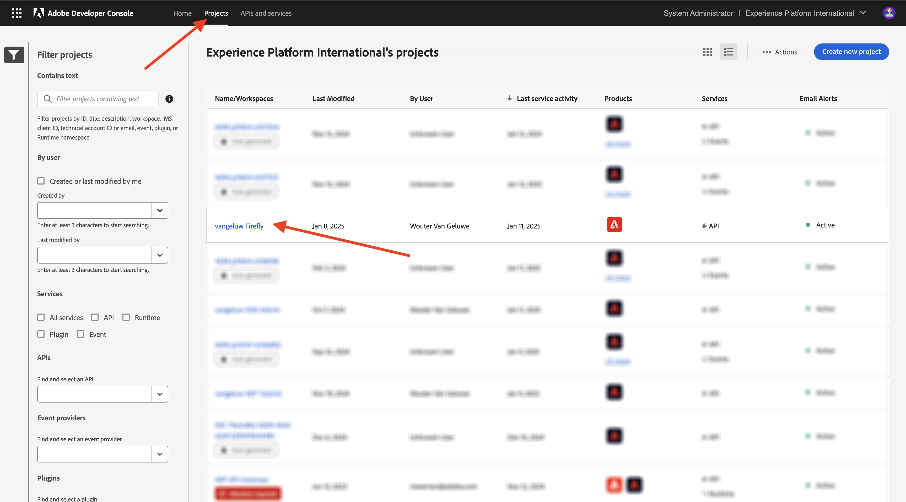
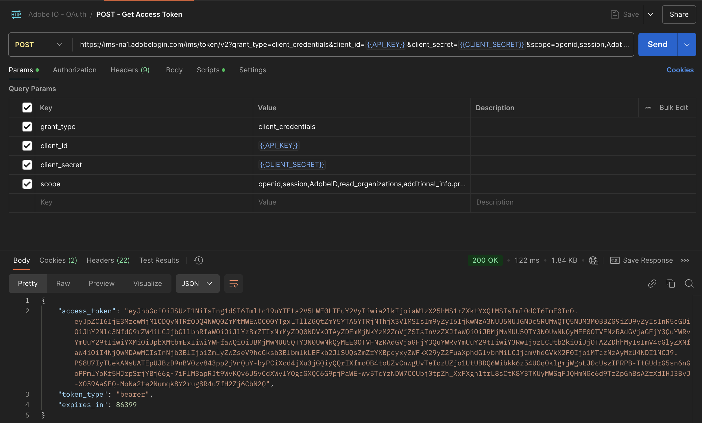
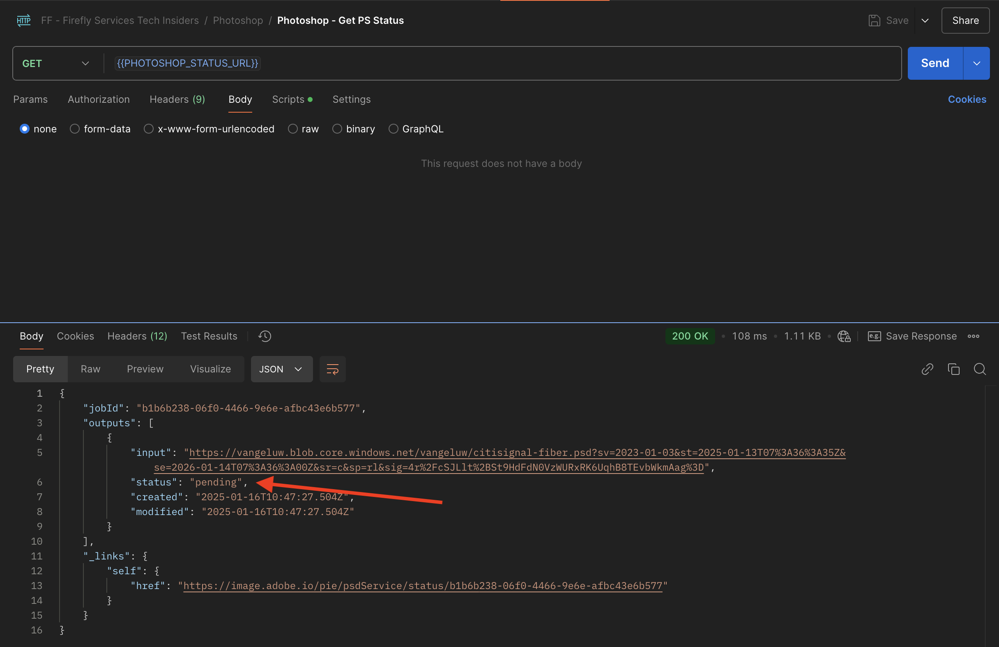
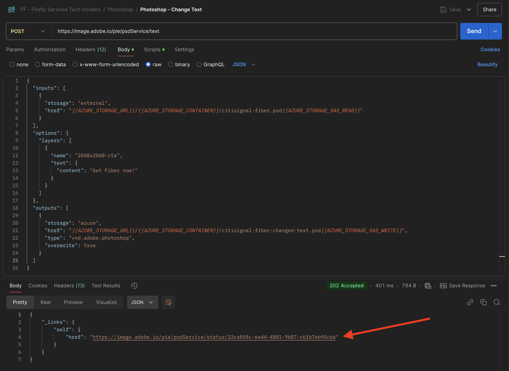

# 1.1.3 Working with Photoshop APIs

## 1.1.3.1 Update your Adobe I/O integration

Go to [https://developer.adobe.com/console/home](https://developer.adobe.com/console/home).


Go to **Projects** and click to open the project you created in the previous exercise, which is called `--aepUserLdap-- Firefly`.



Click **+ Add to Project** and then click **API**.


Select **Creative Cloud** and click **Photoshop - Firefly Services**. Click **Next**.


Click **Next**.


Next, you need to select a product profile that will define what permissions are available to this integration.

Select the profile **Default Firefly Services Configuration** and **Default Creative Cloud Automation Services configuration**.

Click **Save Configured API**.


Your Adobe I/O project is now updated to work with Photoshop & Firefly Services APIs.


## 1.1.3.2 Programmatically interact with a PSD file

Download the file Go to [citisignal-fiber.psd](./../../../assets/ff/citisignal-fiber.psd) to your desktop.

Open the file **citisignal-fiber.psd** in Photoshop. You should then have this.


In the **Layers** pane, you'll see that the designer of the file has given a unique name to each layer. You can see the layer information by opening the PSD file in Photoshop, but you can also do that programmatically.

Let's send your first API request to Photoshop APIs.

Go to Postman. Before sending API requests to Photoshop, you need to authenticate to Adobe I/O. OPen the request that you used before with the name **POST - Get Access Token**.

Go to **Params** and verify that the parameter **Scope** is properly set. The **Value** for **Scope** should look like this: 

`openid,session,AdobeID,read_organizations,additional_info.projectedProductContext, ff_apis, firefly_api`

Then, click **Send**.


You then have a valid access token to interact with Photoshop APIs.



### 1.1.3.2.1 Photoshop API - Hello World

Next, let's say hello to Photoshop APIs to test if all permissions and access is set correctly. In the collection **Photoshop**, open the request with the name **Photoshop Hello (Test Auth.)**. Click **Send**.


You should then receive this response: **Welcome to the Photoshop API!**.


Next, in order to programmatically interact with the PSD file **citisignal-fiber.psd**, you need to upload it to your storage account. You could do that manually, by dragging and dropping it into your container using Azure Storage explorer, but this time, you should do it through the API.

### 1.1.3.2.2 Upload PSD to Azure

In Postman, open the request **Upload PSD to Azure Storage Account**. In the previous exercise, you configured these environment variables in Postman, which you'll now use:

- `AZURE_STORAGE_URL`
- `AZURE_STORAGE_CONTAINER`
- `AZURE_STORAGE_SAS_READ`
- `AZURE_STORAGE_SAS_WRITE`

As you can see in the request **Upload PSD to Azure Storage Account**, the URL is configured to use these variables.


In **Body**, you should now add select the file **citisignal-fiber.psd**. 


You should then have this. Click **Send**.


You should then get this empty response back from Azure, which means that your file is stored in your container in your Azure Storage account.


If you use Azure Storage Explorer to have a look, you'll see your file after refreshing your folder.


### 1.1.3.2.3 Photoshop API - Get Manifest

Next, you need to get the manifest file of your PSD file. In Postman, open the request **Photoshop - Get PSD Manifest**. Go to **Body**.

The body should look like this:

```json
{
  "inputs": [
    {
      "storage": "external",
      "href": "{{AZURE_STORAGE_URL}}/{{AZURE_STORAGE_CONTAINER}}/citisignal-fiber.psd{{AZURE_STORAGE_SAS_READ}}"
    }
  ],
  "options": {
    "thumbnails": {
      "type": "image/jpeg"
    }
  }
}
```

Click **Send**.

In the response, you now see a link. As operations in Photoshop can sometimes take some time to complete, Photoshop will provide a status file as a response to most incoming requests. To understand what is happening with your request, you need to read the status file.


To read the status file, open the request **Photoshop -  Get PS Status**. You then see that this request is using a variable as a URL, which is a variable that is set by the previous request that you sent, **Photoshop - Get PSD Manifest**. Variables are set in the **Scripts** of each request.

Click **Send**.


You should then see this. Currently, the status is set to **pending**, which means that the process hasn't completed yet. 



You can click send a couple more times on the **Photoshop -  Get PS Status** request, until the status changes to **succeeded**. This may take a couple of minutes.

When the response is available, you'll the a json file that contains information on all the layers of the PSD file. This is useful information, as things like the layer name or layer ID can be seen in here.


As an example, search for the text `2048x2048-cta`. You should then see this.


### 1.1.3.2.4 Photoshop API - Change Text 

Next, you now need to change the text for the call to action using the APIs. In Postman, open the request **Photoshop - Change Text** and go to **Body**.

You should then see this. You can see that:

- first, an input file is specified: `citisignal-fiber.psd`
- second, the layer to change is specified, with the text to change to
- third, an output file is specified: `citisignal-fiber-changed-text.psd`

```json
{
  "inputs": [
    {
      "storage": "external",
      "href": "{{AZURE_STORAGE_URL}}/{{AZURE_STORAGE_CONTAINER}}/citisignal-fiber.psd{{AZURE_STORAGE_SAS_READ}}"
    }
  ],
  "options": {
    "layers": [
      {
        "name": "2048x2048-cta",
        "text": {
          "content": "Get Fiber now!"
        }
      }
    ]
  },
  "outputs": [
    {
      "storage": "azure",
      "href": "{{AZURE_STORAGE_URL}}/{{AZURE_STORAGE_CONTAINER}}/citisignal-fiber-changed-text.psd{{AZURE_STORAGE_SAS_WRITE}}",
      "type": "vnd.adobe.photoshop",
      "overwrite": true
    }
  ]
}
```

The output file has a different name, as you don't want to override the original input file.

Click **Send**.


Just like before, the response contains a link that points to the status file that keeps track of the progress.



To read the status file, open the request **Photoshop -  Get PS Status** again and click **Send**. If the status isn't set to **succeeded** immediately, wait a couple of seconds and then click **Send** again.

Once the status is set to **succeeded**, you should then see this. In the path `outputs[0]._links.renditions[0].href`, you should see the URL of output file that was created by Photoshop and which contains the changed text.

Click the URL to download the output file.


The file **citisignal-fiber-changed-text.psd** will then be downloaded to your computer, after which you can open it. You should then see that the placeholder for the call to action has been replaced by the text **Get Fiber now!**.


Lastly, you then also see that file in your container using Azure Storage explorer.


You've now completed this exercise. 

Next Step: [Summary & Benefits](./summary.md)

[Go Back to Module 1.1](./firefly-services.md)

[Go Back to All Modules](./../../../overview.md)
