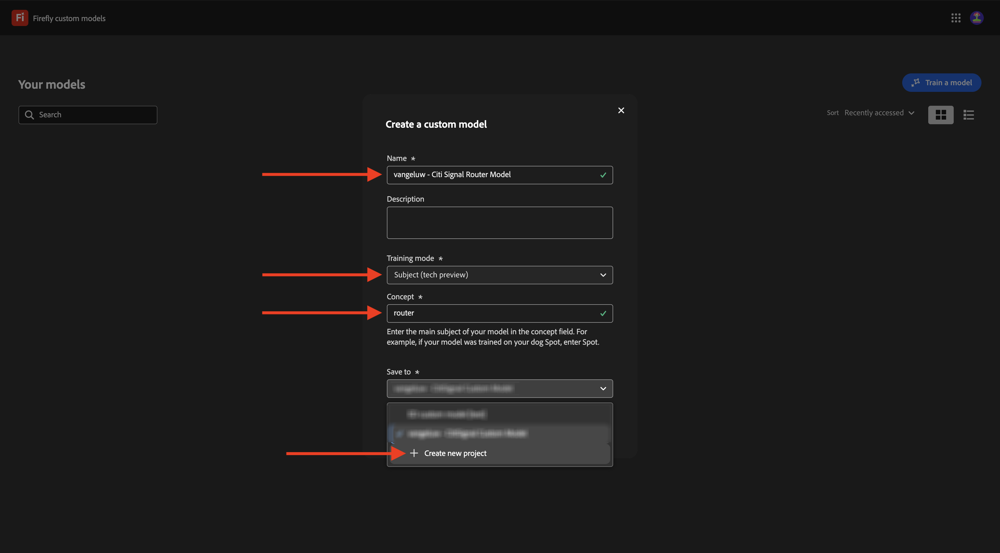
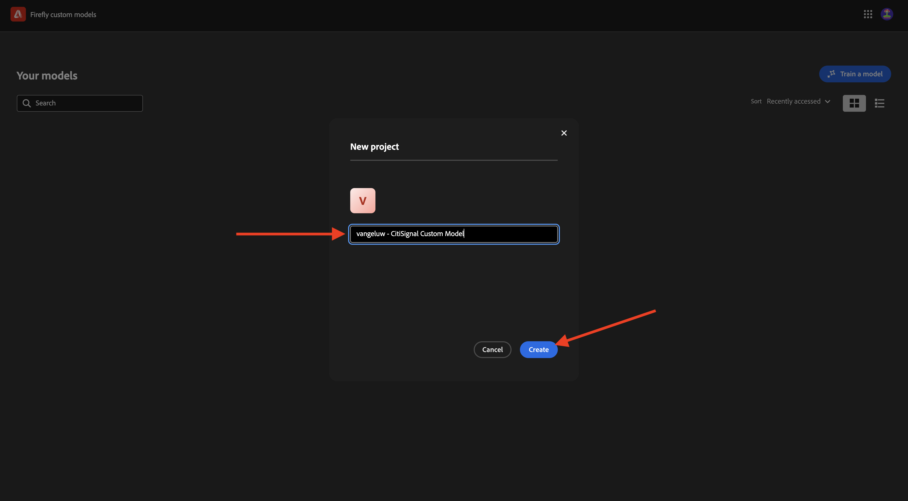
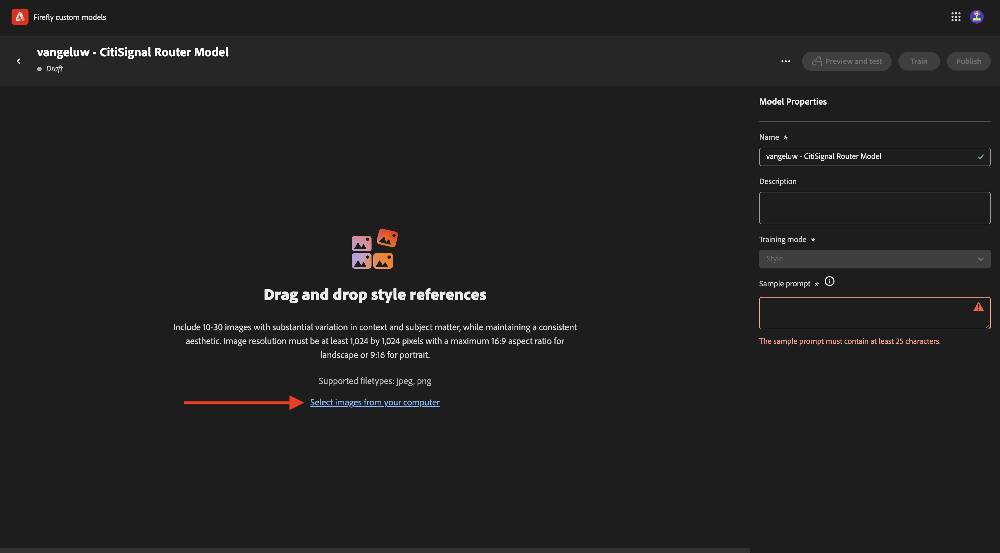
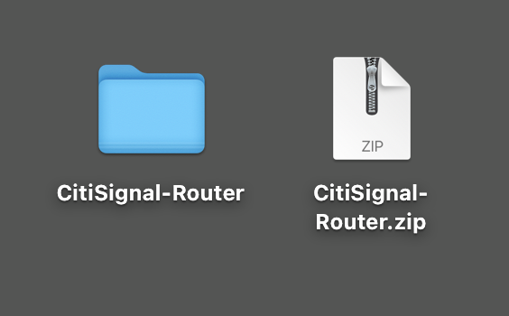
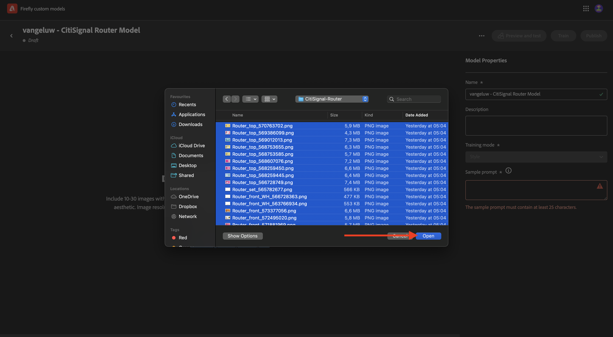
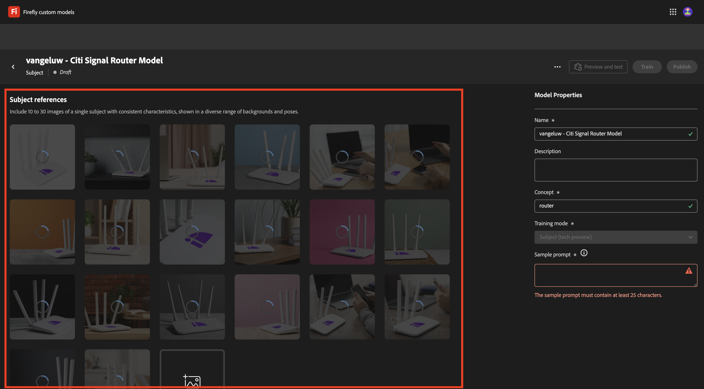

# 1.1.4 Firefly Custom Models

Go to [https://firefly.adobe.com](https://firefly.adobe.com){target="_blank"}. Go to **Custom Models**.

**Agree** to the conditions of using Firefly Custom Models.

Click **Train a model**.

Use the name `--aepUserLdap-- - CitiSignal Router Model`. Select **Style** and click **+ Create new project**.

Use the name `--aepUserLdap-- - CitiSignal Custom Model`. Click **Create**.

Click **Continue**.

Click **Select images from your computer**.

You can use these assets. Download them to your computer and extract the zip file into a folder on your desktop.

Select all the images and click **Open**.

Your images will now upload. This may take some time.

You've now completed this exercise. 

Next Step: [Summary & Benefits](./summary.md){target="_blank"}

[Go Back to Module 1.1](./firefly-services.md){target="_blank"}

[Go Back to All Modules](./../../../overview.md){target="_blank"}
