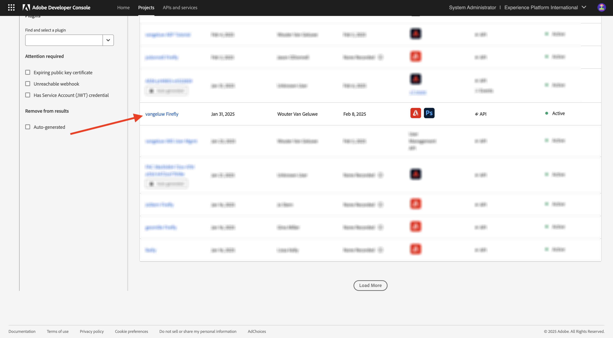
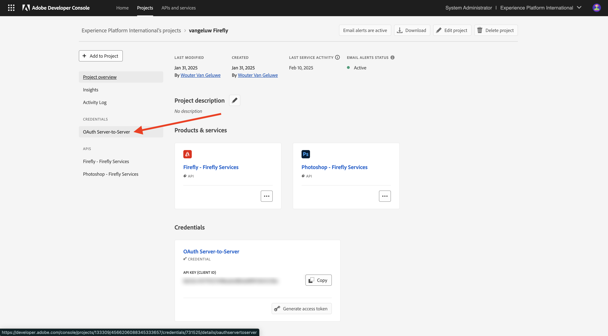
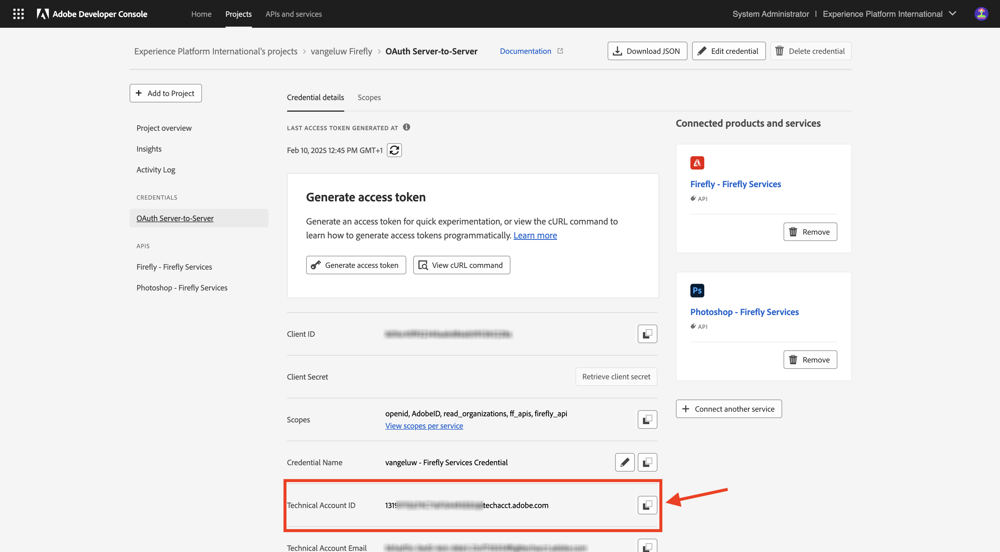
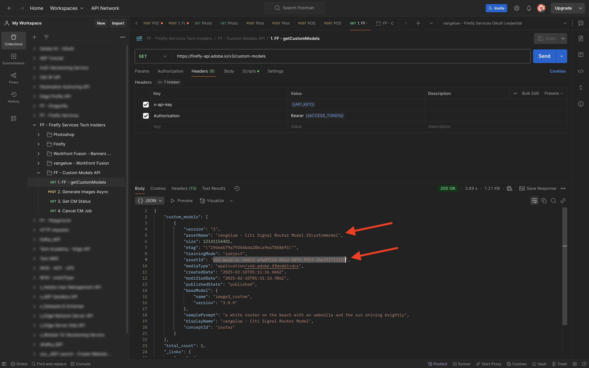
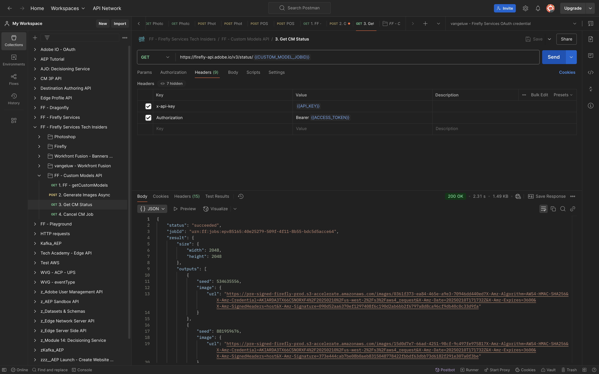

# 1.1.4 Firefly Custom Models API

## 1.1.4.1 Configure your Custom Model

Go to [https://firefly.adobe.com/](https://firefly.adobe.com/). Click **Custom Models**.

{zoomable="yes"} 

You may see this message. If you do, click **Agree** to continue.

{zoomable="yes"} 

You should then see this. Click **Train a model**.

{zoomable="yes"} 

Configure the following fields:

- **Name**: use `--aepUserLdap-- - Citi Signal Router Model`
- **Training Mode**: select **Subject (tech preview)**
- **Concept**: enter `router`
- **Save to**: open the dropdown list and click **+ Create New Project**

{zoomable="yes"} 

Give the new project a name: `--aepUserLdap-- - Custom Models`. Click **Create**.

{zoomable="yes"} 

You should then see this. Click **Create**.

{zoomable="yes"} 

You now need to provide the reference images for the Custom Model to be trained. Click **Select images from your computer**.

{zoomable="yes"} 

Download the reference images [here](https://tech-insiders.s3.us-west-2.amazonaws.com/CitiSignal_router.zip). Unzip the download file, which whould give you this.

{zoomable="yes"} 

Navigate to the folder that contains the download image files. Select them all and click **Open**.

{zoomable="yes"} 

You'll then see that your images are being loaded.

{zoomable="yes"}

After a couple of minutes, your images are loaded correctly. You may see that some images have an error, this is due to the caption for the image not having been generated, or not being long enough. Review each image with an error and enter a caption that meets the requirements and describes the image.

{zoomable="yes"} 

Once all images have captions that meet the requirements, you still need to provide a sample prompt. Enter any prompt that uses the word 'router'. Once you've done that, you can start training your model. Click **Train**.

{zoomable="yes"} 

You'll then see this. Training your model may take 20-30mins or longer.

{zoomable="yes"} 

After 20-30mins, your model is now trained and can be published. Click **Publish**.

{zoomable="yes"} 

Click **Publish** again.

{zoomable="yes"} 

Close the **Share custom model** popup.

{zoomable="yes"} 

## 1.1.4.2 Use your Custom Model in the UI

Go to [https://firefly.adobe.com/cme/train](https://firefly.adobe.com/cme/train). Click your Custom Model to open it. 

{zoomable="yes"}

Click **Preview and test**.

{zoomable="yes"}

You'll then see the sample prompt that you entered before being executed.

{zoomable="yes"} 

## 1.1.4.3 Enable your Custom Model for Firefly Services Custom Models API

Once your Custom Model is trained, it can also be used through the API. In exercise 1.1.1 you already configured your Adobe I/O project for interaction with Firefly Services through the API. 

Go to [https://firefly.adobe.com/cme/train](https://firefly.adobe.com/cme/train). Click your Custom Model to open it. 

{zoomable="yes"}

Click the 3 dots **...** and then click **Share**.

{zoomable="yes"} 

In order to access a Firefly Custom Model, the Custom Model needs to be shared to the **Technical Account ID** of our Adobe I/O Project.

To retrieve your **Technical Account ID**, go to [https://developer.adobe.com/console/projects](https://developer.adobe.com/console/projects). Click to open your Project, which is named `--aepUserLdap-- Firefly`.

{zoomable="yes"} 

Click **OAuth Server-to-Server**.

{zoomable="yes"} 

Click to copy your **Technical Account ID**.

{zoomable="yes"} 

Paste your **Technical Account ID** and click **Invite to edit**.

{zoomable="yes"} 

The **Technical Account ID** should now be able to access the Custom Model.

{zoomable="yes"}

## 1.1.4.4 Interact with Firefly Services Custom Models API

In Exercise 1.1.1 Getting started with Firefly Services, you downloaded this file: [postman-ff.zip](./../../../assets/postman/postman-ff.zip) to your local desktop and you then imported that collection in Postman.

Open Postman and go to the folder **FF - Custom Models API**.

{zoomable="yes"} 

Open the request **1. FF - getCustomModels** and click **Send**.

{zoomable="yes"} 

You should see the Custom Model that you created before, which is named `--aepUserLdap-- - Citi Signal Router Model`, as part of the response. The field **assetId** is the unique identifier of your Custom Model, which will be referenced in the next request.

{zoomable="yes"} 

Open the request **2. Generate Images Async**. In this example, you'll request 2 variations to be generated based on your Custom Model. Feel free to update the prompt which in this case is `a white router on a volcano in Africa`.

Click **Send**.

{zoomable="yes"} 

The response contains a field **jobId**. The job to generate these 2 images is now running and you can check the status by using the next request.

{zoomable="yes"} 

Open the request **3. Get CM Status** and click **Send**. You should then see that the status is set to running.

{zoomable="yes"} 

After a couple of minutes, click **Send** again for the request **3. Get CM Status**. You should then see that the status changed to **succeeded** and you should see two image URLs as part of the output. Click to open both files.

{zoomable="yes"}

This is the first image that was generated in this example.

{zoomable="yes"}

This is the second image that was generated in this example.

{zoomable="yes"}

You've now completed this exercise.

## Next Steps

Go to [Summary & benefits](./summary.md){target="_blank"}

Go back to [Working with Photoshop APIs](./ex3.md){target="_blank"}

Go back to [Overview of Adobe Firefly Services](./firefly-services.md){target="_blank"}
