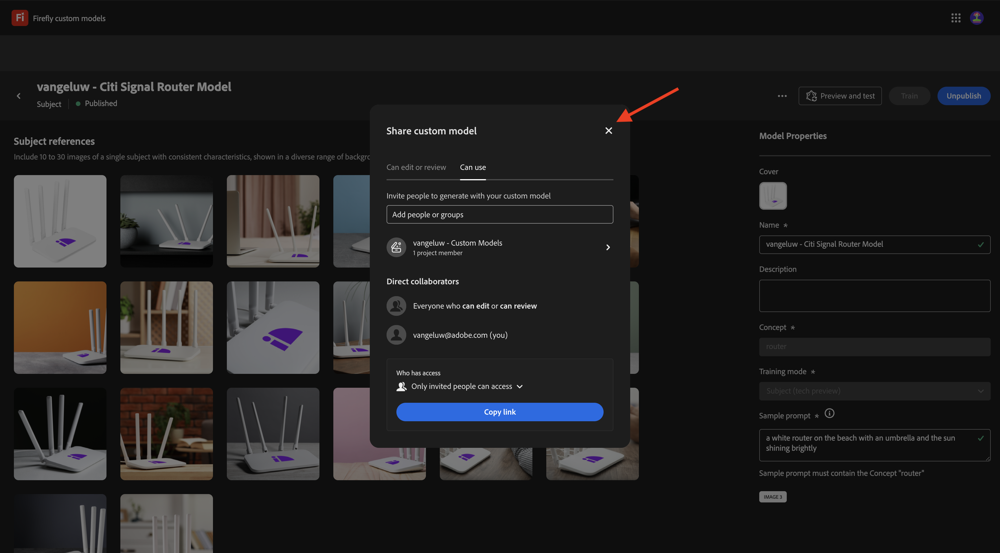

# 1.1.4 Firefly Custom Models API

## 1.1.4.1 Configure your Custom Model

Go to [https://firefly.adobe.com/](https://firefly.adobe.com/). Click **Custom Models**.

 

You may see this message. If you do, click **Agree** to continue.

 

You should then see this. Click **Train a model**.

 

Configure the following fields:

- **Name**: use `--aepUserLdap-- - Citi Signal Router Model`
- **Training Mode**: select **Subject (tech preview)**
- **Concept**: enter `router`
- **Save to**: open the dropdown list and click **+ Create New Project**

 

Give the new project a name: `--aepUserLdap-- - Custom Models`. Click **Create**.

 

You should then see this. Click **Create**.

 

You now need to provide the reference images for the Custom Model to be trained. Click **Select images from your computer**.

 

Download the reference images [here](https://tech-insiders.s3.us-west-2.amazonaws.com/CitiSignal_router.zip). Unzip the download file, which whould give you this.

 

Navigate to the folder that contains the download image files. Select them all and click **Open**.

 

You'll then see that your images are being loaded.

After a couple of minutes, your images are loaded correctly. You may see that some images have an error, this is due to the caption for the image not having been generated, or not being long enough. Review each image with an error and enter a caption that meets the requirements and describes the image.

 

Once all images have captions that meet the requirements, you still need to provide a sample prompt. Enter any prompt that uses the word 'router'. Once you've done that, you can start training your model. Click **Train**.

 

You'll then see this. Training your model may take 20-30mins or longer.

 

After 20-30mins, your model is now trained and can be published. Click **Publish**.

 

Click **Publish** again.

 

Close the **Share custom model** popup.

 

## 1.1.4.2 Use your Custom Model in the UI

Go to [https://firefly.adobe.com/cme/train](https://firefly.adobe.com/cme/train). Click your Custom Model to open it. 

Click **Preview and test**.

You'll then see the sample prompt that you entered before being executed.

 

## 1.1.4.3 Use your Custom Model with the API

Once your Custom Model is trained, it can also be used through the API. In exercise 1.1.1 you already configured your Adobe I/O project for interaction with Firefly Services through the API. 

## Next Steps

Go to [Summary & benefits](./summary.md){target="_blank"}

Go back to [Working with Photoshop APIs](./ex3.md){target="_blank"}

Go back to [Overview of Adobe Firefly Services](./firefly-services.md){target="_blank"}
