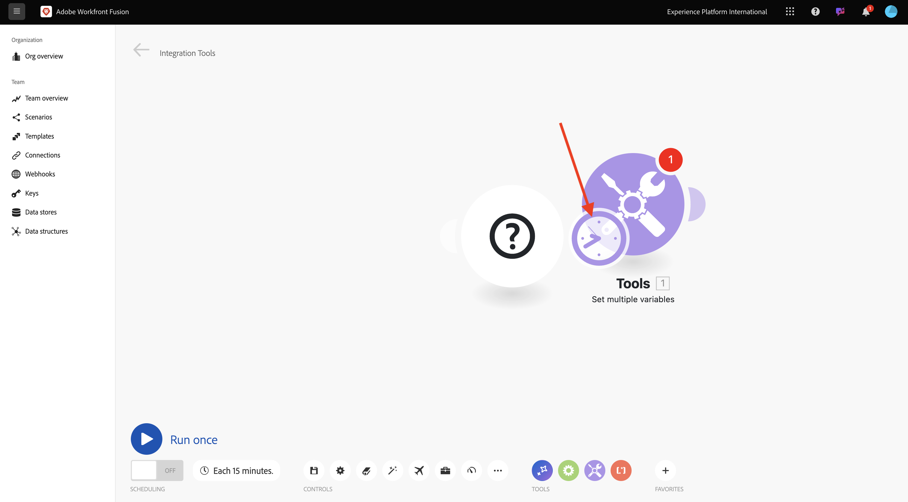

# 1.2.1 Getting started with Workfront Fusion

In this exercise, you'll use Workfront Fusion and Adobe I/O to query Adobe Firefly Services APIs.

## 1.2.1.1 Create new scenario

Go to [https://experience.adobe.com/](https://experience.adobe.com/). Click to open **Workfront Fusion**.

You should then see this. Go to **Scenarios**.

Click **Create new scenario**.

You'll then see an empty scenario. Click the **tools** icon and select **Set multiple variables**.

You now need to move the **clock** icon onto the newly added **Set multiple variables**. 

You'll then see this.

Then, right-click onto the question mark and select **Delete module**.

Next, right-click on the **Set multiple variables** object and select **Settings**.

## 1.2.1.2 Configure Adobe I/O authentication

You now need to configure the variables that are needed to authenticate against Adobe I/O. In the previous exercise, you created an Adobe I/O project. The variables of that Adobe I/O project now need to be defined in Workfront Fusion.

The following variables need to be defined:

| Key     | Value     | 
|:-------------:| :---------------:| 
| `CONST_client_id`         | your Adobe I/O project Client ID |
| `CONST_client_secret`         | your Adobe I/O project Client Secret|
| `CONST_scope`        | your Adobe I/O project Scope |

You can find these variables by going to [https://developer.adobe.com/console/projects](https://developer.adobe.com/console/projects) and opening your Adobe I/O project, which is named `--aepUserLdap-- Firefly`.

In your project, click **OAuth Serverto-Server** to see the values for the above keys.

With the above keys and values, you can configure the **Set multiple variables** object. Click **Add item**.

Enter the **Variable name**: **CONST_client_id** and its **Variable value**, click **Add**.

Click **Add item**.

Enter the **Variable name**: **CONST_client_secret** and its **Variable value**, click **Add**.

Click **Add item**.

Enter the **Variable name**: **CONST_scope** and its **Variable value**, click **Add**.

Click **OK**.

Hover over your **Set multiple variables** object and click the big **+** icon to add another module.

You should then see this.

In the search bar, enter **http**. Select **HTTP** to open it.

 and then select **Make a request**.

| Key     | Value     | 
|:-------------:| :---------------:| 
| `URL`         | `https://ims-na1.adobelogin.com/ims/token/v3` |
| `Method`         | `POST` |
| `Body Type`         | `x-www-form-urlencoded` |

Click **Add item**.

Add items for each of the below values:

| Key     | Value     | 
|:-------------:| :---------------:| 
| `client_id`         | your predefined variable for `CONST_client_id` |
| `client_secret`         | your predefined variable for `CONST_client_secret` |
| `scope`         | your predefined variable for `CONST_scope` |
| `grant_type`         | `client_credentials` |

Configuration for `client_id`.

Configuration for `client_secret`.

Configuration for `scope`.

Configuration for `grant_type`.

Configuration overview. Scroll down and check the checkbox for **Parse response**. Click **OK**.

You should then see this. Click **Run once**.

Once the scenario has run, you should see this.

Click the **question mark** icon on the **Set multiple variables** object to see what happened when that object was run.

Click the **question mark** icon on the **HTTP - Make a request** object to see what happened when that object was run. In the **OUTPUT**, you'll see the **access_token** being returned by Adobe I/O.

Hover over the **HTTP - Make a request** object and click the **+** icon to add another module.

In the search bar, search for `tools`. Select **Tools**.

Select **Set multiple variables**.

Select **Add item**.

Set the **Variable name** to `bearer_token`. Select `access_token` as the dynamic **Variable value**. CLick **Add**.

You should then have this. Click **OK**.

Click **Run once** again.

Once the scenario has run, click the **question mark** icon on the last **Set multiple variables** object. You shoudl then see that the access_token is being stored into the variable `bearer_token`.

Next, right-click on the first object **Set multiple values** and select **Rename**.

Set the name to **Initialize Constants**. Click **OK**.

Rename the second object and set the name to **Authenticate to Adobe I/O**. Click **OK**.

Rename the third object and set the name to **Set Bearer Token**. Click **OK**.

You should then have this.

Next, change the name of your scenario to `--aepUSerLdap-- - Adobe I/O Authentication`.

Click **Save**.

Next Step: [1.2.2 Use Adobe APIs within Workfront Fusion](./ex2.md)

[Go Back to Module 1.2](./automation.md)

[Go Back to All Modules](./../../../overview.md)
