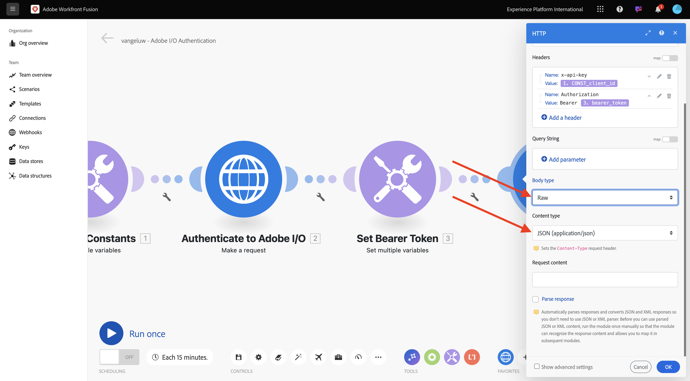
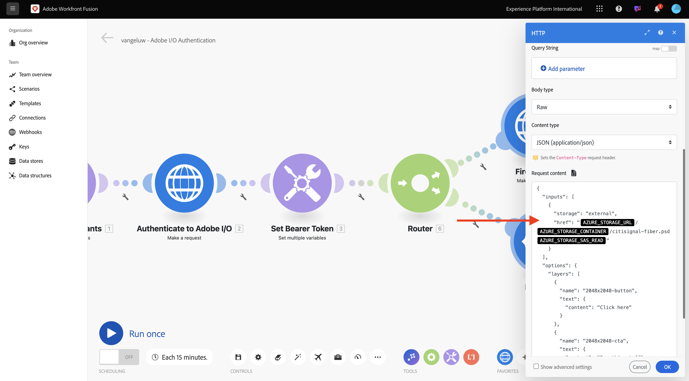

# 1.2.2 Use Adobe APIs within Workfront Fusion

## 1.2.2.1 Use Firefly Text To Image API with Workfront Fusion

Hover over the second **Set multiple variables** node and click **+** to add another module.


Search for **http**, then select **HTTP**.


Select **Make a request**.


Select these variables:

- **URL**: `https://firefly-api.adobe.io/v3/images/generate`
- **Method**: `POST`

Click **Add a header**.


You need to enter the following headers:

| Key     | Value     | 
|:-------------:| :---------------:| 
| `x-api-key`         | your stored variable for `CONST_client_id` |
| `Authorization`         | `Bearer ` + your stored variable for `bearer_token` |
| `Content-Type`         | `application/json` |
| `Accept`         | `*/*` |

Enter the details for `x-api-key`. Click **Add**.


Click **Add a header**.


Enter the details for `Authorization`. Click **Add**.


Click **Add a header**. Enter the details for `Content-Type`. Click **Add**.


Click **Add a header**. Enter the details for `Accept`. Click **Add**.


Set the **Body type** to **Raw**. For **Content type**, select **JSON (application/json)**.



Paste this payload into the **Request content** field.

```json
{
  "numVariations": 1,
  "size": {
    "width": 2048,
    "height": 2048
  },
  "prompt": "Horses in a field",
  "promptBiasingLocaleCode": "en-US"
}
```

Check the checkbox for **Parse response**. Click **OK**.


Click **Run once**.


Once your scenario has run, you should see this.


Click the **?** icon on the fourth node, HTTP, to see the response. You should see an image file in the response.


Copy the image URL and open it in a browser window. You should then see something like this:


Right-click the **HTTP** object and rename it to **Firefly T2I**.


Click **Save** to save your changes.


## 1.2.2.2 Use Photoshop API with Workfront Fusion

Click the **wrench** icon between the nodes **Set Bearer Token** and **Firefly T2I**. Select **Add a router**.


Right-click the **Firefly T2I** object and select **Clone**.


Drag and drop the cloned object close to the **Router** object, and it will auto-connect to the **Router**. You should then have this.


You now have an identical copy based on the **Firefly T2I** HTTP request. Some of the settings of the **Firefly T2I** HTTP request are similar to what you need to interact with the **Photoshop API**, which is a time saver. You now only need to change the variables that aren't the same, like the request URL and the payload.

Change the **URL** to `https://image.adobe.io/pie/psdService/text`.


Replace the **Request content** by the below payload:

```json
{
  "inputs": [
    {
      "storage": "external",
      "href": "{{AZURE_STORAGE_URL}}/{{AZURE_STORAGE_CONTAINER}}/sevoi-psd.psd{{AZURE_STORAGE_SAS_READ}}"
    }
  ],
  "options": {
    "layers": [
      {
        "name": "2048x2048-button",
        "text": {
          "content": "Click here"
        }
      },
      {
        "name": "2048x2048-cta",
        "text": {
          "content": "Buy this stuff"
        }
      }
    ]
  },
  "outputs": [
    {
      "storage": "azure",
      "href": "{{AZURE_STORAGE_URL}}/{{AZURE_STORAGE_CONTAINER}}/sevoi-psd-changed-text.psd{{AZURE_STORAGE_SAS_WRITE}}",
      "type": "vnd.adobe.photoshop",
      "overwrite": true
    }
  ]
}
```



In order for this **Request content** to function properly, there are some variables that are missing:

- `AZURE_STORAGE_URL`
- `AZURE_STORAGE_CONTAINER`
- `AZURE_STORAGE_SAS_READ`
- `AZURE_STORAGE_SAS_WRITE`

Go back to your first node, click **Initialize Constants** and then select **Add item** for each of these variables.


| Key     | Example Value     | 
|:-------------:| :---------------:| 
| `AZURE_STORAGE_URL`| `https://vangeluw.blob.core.windows.net` |
| `AZURE_STORAGE_CONTAINER`| `vangeluw` |
| `AZURE_STORAGE_SAS_READ`| `?sv=2023-01-03&st=2025-01-13T07%3A36%3A35Z&se=2026-01-14T07%3A36%3A00Z&sr=c&sp=rl&sig=4r%2FcSJLlt%2BSt9HdFdN0VzWURxRK6UqhB8TEvbWkmAag%3D` |
| `AZURE_STORAGE_SAS_WRITE`| `?sv=2023-01-03&st=2025-01-13T17%3A21%3A09Z&se=2025-01-14T17%3A21%3A09Z&sr=c&sp=racwl&sig=FD4m0YyyqUj%2B5T8YyTFJDi55RiTDC9xKtLTgW0CShps%3D` |

You can find your variables by going back to Postman, and opening your **Environment Variables**.


Copy these values across to Workfront Fusion, and add a new item for each of these 4 variables.

You should then have this. Click **OK**.


Next, go back to the cloned HTTP request to update the **Request content**. You'll notice these black variables in the **Request content**, which are the variables you copied across from Postman. You now need to change these to the variables you just defined in Workfront Fusion. Replace each variable one by one by deleting the black text and replacing it by the correct variable.


There are 3 changes to make in the **inputs** section.


There are also 3 change to make in the **outputs** section. Click **OK**.


Right-click the cloned node, and select **Rename**. Change the name to **Photoshop Change Text**.


You should then have this.


Next Step: [1.2.3 ...](./ex3.md)

[Go Back to Module 1.2](./automation.md)

[Go Back to All Modules](./../../../overview.md)
