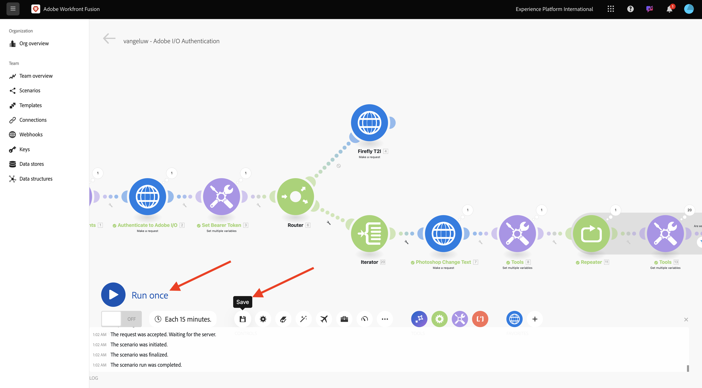

# 1.2.3 Process automation with Workfront Fusion

Your scenario now looks like this.


## 1.2.3.1 Iterating over multiple values

So far, you've changed text in a Photoshop file by a static value. In order to scale and automate your content creation workflows, it's required to iterate over a list of values and insert those values dynamically into the Photoshop file. In the next steps, you will add a wat to iterate over values in your existing scenario.

In between the **Router** node and the **Photoshop Change Text** node, click the **wrench** icon and select **Add a module**.


Search for `flow` and select **Flow Control**.


Select **Iterator**.


You should then have this.


While it is possible to read input files like CSV files, for now, you need to use a basic version of a CSV file by defining a text string and splitting that text file.

You can find the **split** function by clicking the **T** icon, where you see all available functions to manipulate text values. Click the **split** function, and you should then see this.


The split function expects an array of values before the semicolon, and expects you to specify the separator after the semicolon. For this test, you should use a simple array with 2 fields, **Buy now** and **Click here**, and the separator to use is **,**. 

Enter this in the **Array** field by replacing the currently empty **split** function: `{{split("Buy now, Click here "; ",")}}`. Click **OK**.


Your iterator is now configured and if you would run your scenario now, it would execute it twice. There is still a problem though, as you are currently using static values in your **Photoshop Change Text** node. Click **Photoshop Change Text** to add in some variables instead of static values for the input and output fields.


In the **Request content**, you'll see the text **Click here**. This text needs to be replaced by the values coming from your array.


Delete the text **Click here**, and replace it by selecting the variable **Value** from the **Iterator** node. This will ensure that the text on the button in your Photoshop document is dynamically updated.


You also need to update the filename that is used to write the file in your Azure Storage Account. If the file name is static, then every new iteration will simply overwrite the previous file and as such, you'll lose the customized files. The current static filename is **citisignal-fiber-changed-text.psd**, and you now need to update that. Put the cursor behind the word `text`.


First, add a hyphen `-` and then select the value **Bundle Order Position**. This will ensure that for the first iteration, Workfront Fusion will add `-1` to the file name, for the second iteration `-2` and so on. Click **OK**.


Save your scenario and then click **Run once**.



Once the scenario has run, go back to your Azure Storage Explorer and refresh the folder. You should then see the 2 newly created files.


Download and open each file. You should then see the various texts on the buttons. This is file `citisignal-fiber-changed-text-1.psd`.


This is file `citisignal-fiber-changed-text-2.psd`.


## 1.2.3.2 Active your scenario using a webhook

So far, you've run your scenario manually to test. Let's now update your scenario with a webhook, so that it can be activated from an external enviroment.

Click the **+** icon, search for **webhook** and then select **Webhooks**.


Select **Custom webhook**.

Drag and connect the **Custom webhook** node so that it connects to the first node on the canvas, which is called **Initialize Constants**.


Click the **Custom webhook** node. Then, click **Add**.


Set the **Webhook name** to `--aepUserLdap-- - Tutorial 1.2`.


Check the checkbox for **Get request headers**. Click **Save**.


Your webhook URL is now available. Copy the URL.


Open Postman and add a new folder in the collection **FF - Firefly Services Tech Insiders**.


Name your folder `--aepUserLdap-- - Workfront Fusion`.


In the folder that you just created, click the 3 dots **...** and select **Add request**.


Set the **Method type** to **POST** and paste the URL of your webhook in the address bar.


You need to send a custom body, so that the variable elements can be provided from an external source to your Workfront Fusion scenario. Go to **Body** and select **raw**.


Paste the below text in the body of your request. Click **Send**.

```json
{
    "psdTemplate": "placeholder",
    "xlsFile": "placeholder"
}
```


Go back to Workfront Fusion. You'll now see a message on your custom webhook that says: **Successfully determined**.


Click **Save** and then click **Run once**. Your scenario will now be active but won't run until you click **Send** again in Postman.


Go to Postman, and click **Send** again.


Your scenario will then run again, and create the 2 files just like before.


Change the name of your Postman request to `POST - Send Request to Workfront Fusion Webhook`.


You now need to start using the variable **psdTemplate**. Instead of hardcoding the location of the input file in the **Photoshop Change Text** node, you will now use the incoming variable from the Postman request.

Open the **Photoshop Change Text** node and go to **Request content**. Select the hardcoded filename **citisignal-fiber.psd** under **inputs** and delete it.


Select the variable **psdTemplate**. Click **OK** and then save your scenario.


Click **ON** to turn on your scenario. Your scenario will now be running non-stop.


Go back to Postman. Enter the filename `citisignal-fiber.psd` as the value for the variable **psdTemplate** and click **Send** again to run your scenario again. 


By specifying the PSD template as a variable that is provided by an external system, you've now built a reusable scenario.

You've now finished this exercise.

Next Step: [Summary & Benefits](./summary.md)

[Go Back to Module 1.2](./automation.md)

[Go Back to All Modules](./../../../overview.md)
