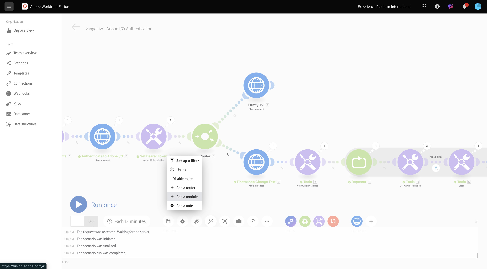
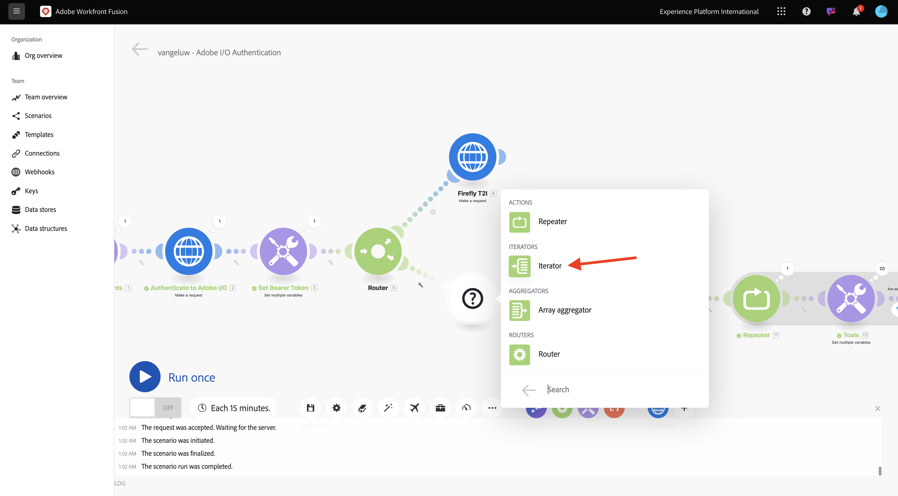

# Process automation with Workfront Fusion

Learn how to process automation with Workfront Fusion.

## Iterating over multiple values

Your scenario should look like this:


So far, you've changed text in a Photoshop file by a static value. In order to scale and automate your content creation workflows, it's required to iterate over a list of values and insert those values dynamically into the Photoshop file. In the next steps, you will add a wat to iterate over values in your existing scenario.

1. In between the **Router** node and the **Photoshop Change Text** node, select the **wrench** icon and select **Add a module**.

    

1. Search for `flow` and select **Flow Control**.

    

1. Select **Iterator**.

    

    Your screen should look like this:

    

    While it is possible to read input files like CSV files, for now, you need to use a basic version of a CSV file by defining a text string and splitting that text file.

1. You can find the **split** function by selecting the **T** icon, where you see all available functions to manipulate text values. Select the **split** function, then you should see this.

    

1. The split function expects an array of values before the semicolon, and expects you to specify the separator after the semicolon. For this test, you should use a simple array with 2 fields, **Buy now** and **Click here**, and the separator to use is **,**. 

1. Enter this in the **Array** field by replacing the currently empty **split** function: `{{split("Buy now, Click here "; ",")}}`. Select **OK**.

    

     

1. Select **Photoshop Change Text** to add in some variables instead of static values for the input and output fields.

    

    In **Request content**, is the text **Click here**. This text needs to be replaced by the values coming from your array.

    

1. Delete the text **Click here**, and replace it by selecting the variable **Value** from the **Iterator** node. This ensures that the text on the button in your Photoshop document is dynamically updated.

    

    You also need to update the filename used to write the file in your Azure Storage Account. If the file name is static, then every new iteration simply overwrites the previous file and as such, loses the customized files. The current static filename is **citisignal-fiber-changed-text.psd**, and you now need to update that. 
    
1. Put the cursor behind the word `text`.

    

1. First, add a hyphen `-` and then select the value **Bundle Order Position**. This ensures that for the first iteration, Workfront Fusion adds `-1` to the file name, for the second iteration `-2` and so on. Select **OK**.

    

1. Save your scenario and then select **Run once**.

    

    Once the scenario has run, go back to your Azure Storage Explorer and refresh the folder. You should then see the 2 newly created files.

    

1. Download and open each file. You should various texts on the buttons. This is file `citisignal-fiber-changed-text-1.psd`.

    

    This is file `citisignal-fiber-changed-text-2.psd`.

    

## Active your scenario using a webhook

So far, you've run your scenario manually to test. Let's now update your scenario with a webhook, so that it can be activated from an external enviroment.

1. Select **+**, search for **webhook** and then select **Webhooks**.

    

1. Select **Custom webhook**.

1. Drag and connect the **Custom webhook** node so that it connects to the first node on the canvas, which is called **Initialize Constants**.

    

1. Select the **Custom webhook** node. Then, select **Add**.

    

1. Set **Webhook name** to `--aepUserLdap-- - Tutorial 1.2`.

    

1. Check the box for **Get request headers**. Select **Save**.

    

1. Your webhook URL is now available. Copy the URL.

    

1. Open Postman, and add a new folder in the collection **FF - Firefly Services Tech Insiders**.

    

1. Name your folder `--aepUserLdap-- - Workfront Fusion`.

    

1. In the folder that you just created, select the 3 dots **...** and select **Add request**.

    

1. Set the **Method type** to **POST** and paste the URL of your webhook in the address bar.

    

    You need to send a custom body, so that the variable elements can be provided from an external source to your Workfront Fusion scenario. 

1. Go to **Body** and select **raw**.

    

1. Paste the below text in the body of your request. Select **Send**.

    ```json
    {
        "psdTemplate": "placeholder",
        "xlsFile": "placeholder"
    }
    ```

    

1. Back in Workfront Fusion, a message on your custom webhook appears that says: **Successfully determined**.

    

1. Select **Save** and then select **Run once**. Your scenario is now be active but won't run until you select **Send** again in Postman.

    

1. In Postman select **Send** again.

    

    Your scenario runs again and creates the 2 files just like before.

    

1. Change the name of your Postman request to `POST - Send Request to Workfront Fusion Webhook`.

    

    Now you need to start using the variable **psdTemplate**. Instead of hardcoding the location of the input file in the **Photoshop Change Text** node, you will use the incoming variable from the Postman request.

1. Open the **Photoshop Change Text** node and go to **Request content**. Select the hardcoded filename **citisignal-fiber.psd** under **inputs** and delete it.

    

1. Select the variable **psdTemplate**. Select **OK** and then save your scenario.

    

1. Select **ON** to turn on your scenario. Your scenario is now running non-stop.

    

1. Back in Postman, enter the filename `citisignal-fiber.psd` as the value for the variable **psdTemplate** and select **Send** again to run your scenario again. 

    

    By specifying the PSD template as a variable that is provided by an external system, you've now built a reusable scenario.

    Now you have completed this exercise.

## Next steps

Go to [Summary and Benefits of Firefly Services Automation](./summary.md){target="_blank"}

Go back to [Automating Adobe Firefly Services](./automation.md){target="_blank"}

Go back to [All Modules](./../../../overview.md){target="_blank"}
