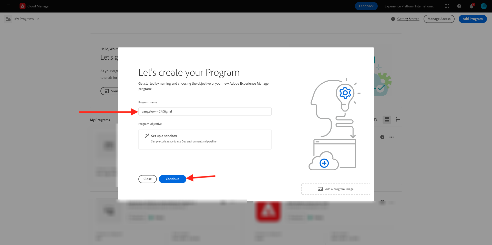
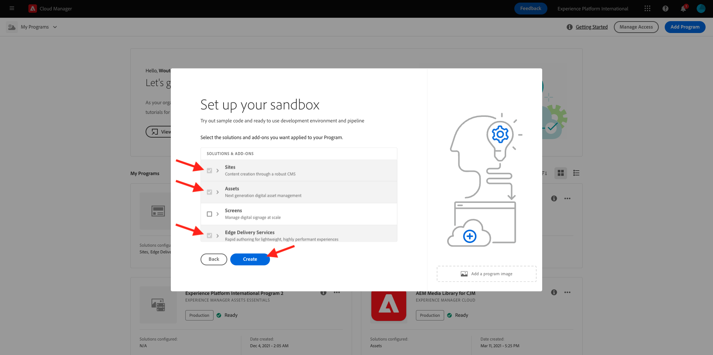
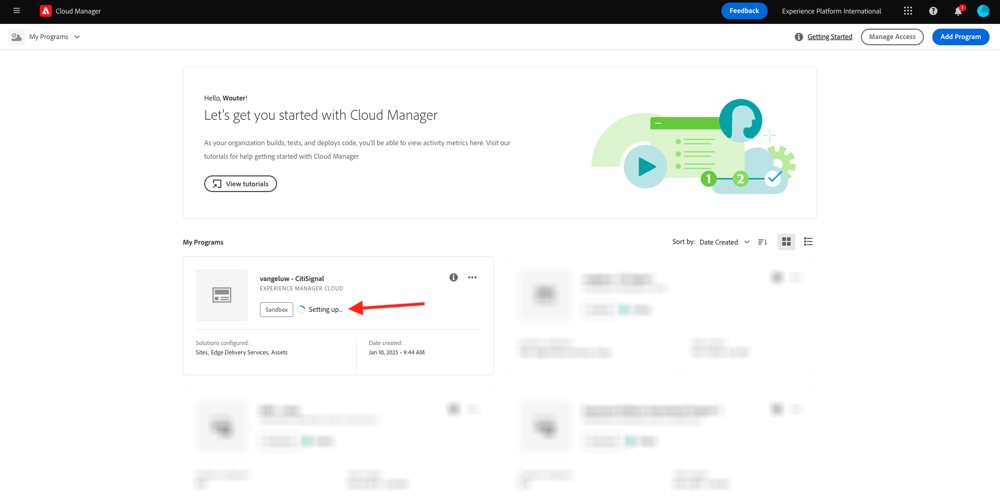
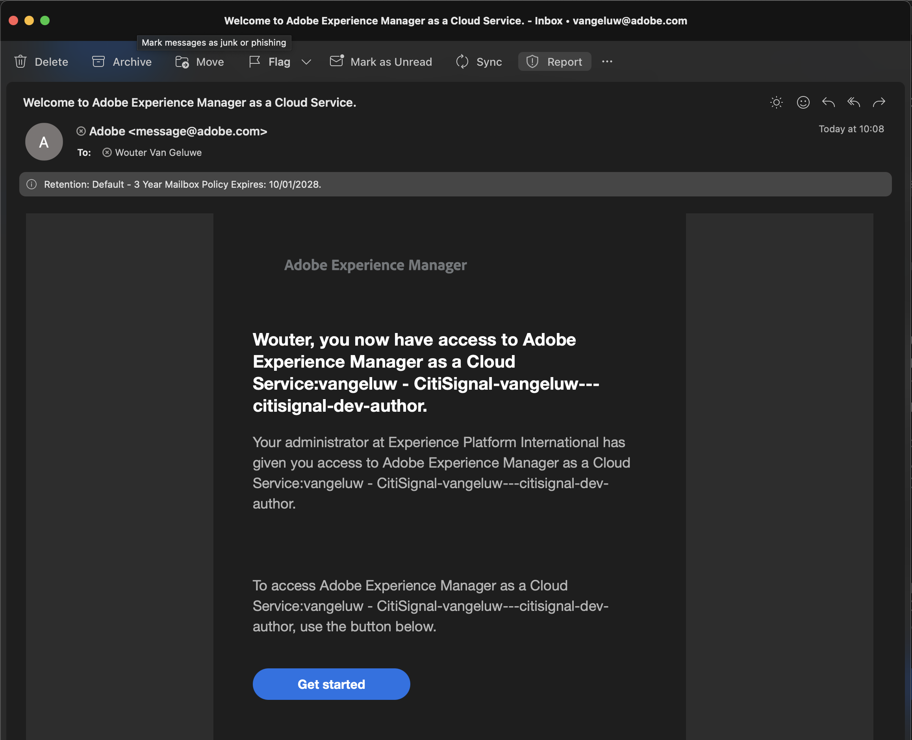
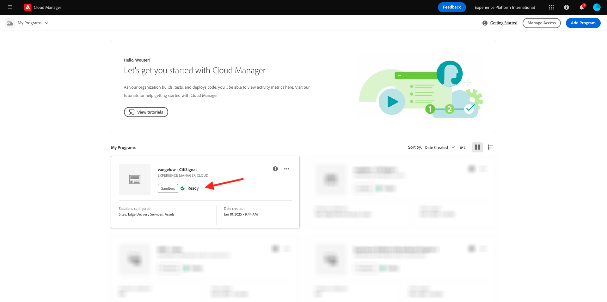

# 2.1.1 Create your Cloud Manager Program

Go to [https://my.cloudmanager.adobe.com](https://my.cloudmanager.adobe.com). The org you should select is `--aepImsOrgName--`. You'll then see something like this. Click **Add Program**.

For the **Program Name**, use `--aepUserLdap-- - CitiSignal`. Click **Continue**.

Ensure that the following options are selected:

- Sites
- Assets
- Edge Delivery Services

Click **Create**.

Creating your environments will take some time, 10-20mins.

While you wait, you can already start with exercise [2.1.2 Create your document-based website](./ex2.md).

Once the environments are created and ready to use, you'll receive an email confirmation after which you can come back here.

Once you've received your email confirmation, go back to [https://my.cloudmanager.adobe.com](https://my.cloudmanager.adobe.com). You'll then see that the status of your program has changed to **Ready**. Click your program to open it.

Have a look at the tab **Pipelines**. Click the 3 dots **...** and then click **Run**. 

Click **Run**.

Next, click the 3 dots **...** on the **Environments** tab and click **View Details**.

You'll then see your environment details, including the URL of your **Author** environment, which you'll need in the next exercise.

Once your pipeline run has finished, you can continue with the next exercise.

Next Step: [2.1.2 Create your document-based website](./ex2.md)

[Go Back to Module 2.1](./aemcs.md)

[Go Back to All Modules](./../../../overview.md)
