# 2.1.3 Setup your AEM CS environment

## 2.1.3.1 Setup your GitHub repo

Go to [https://github.com](https://github.com){target="_blank"}. Click **Sign In**.

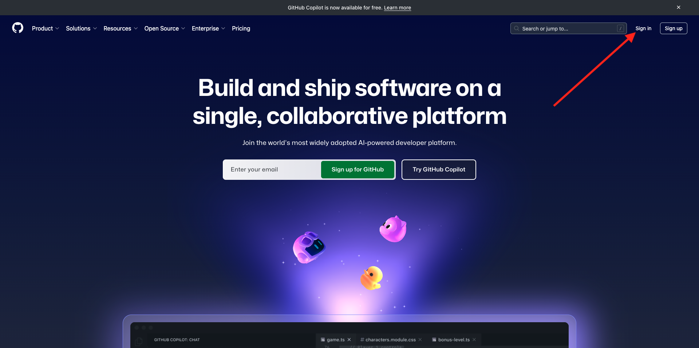{zoomable="yes"}

Enter your credentials. Click **Sign In**. 

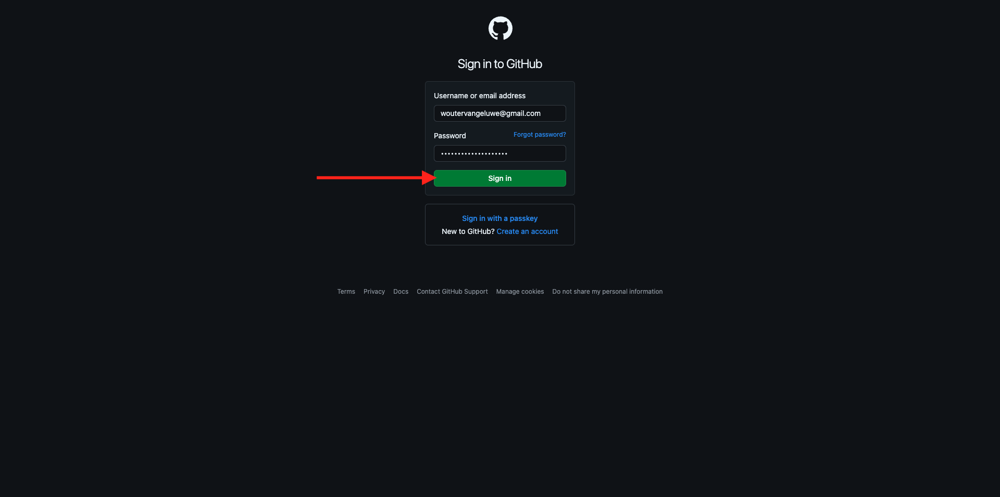{zoomable="yes"}

Once signed in, you'll see your GitHub Dashboard.

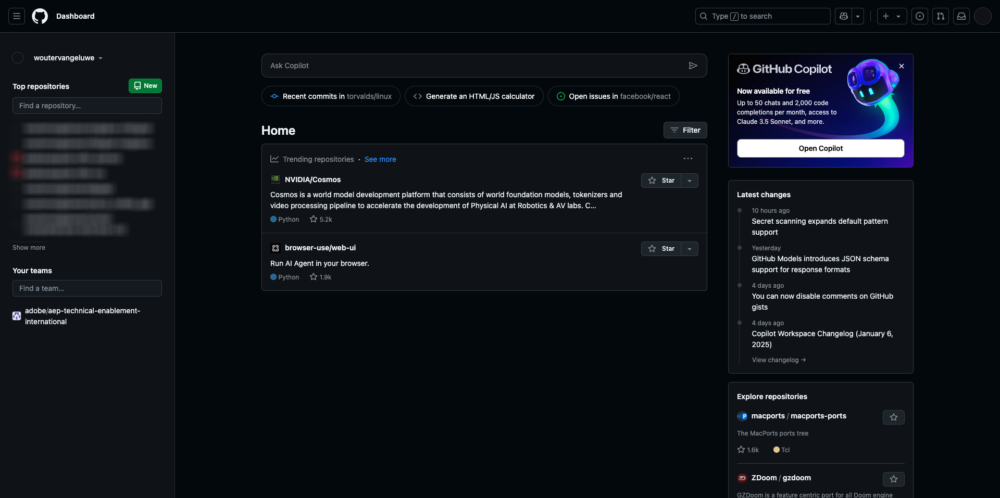{zoomable="yes"}

Go to [https://github.com/AdobeDevXSC/citisignal-one](https://github.com/AdobeDevXSC/citisignal-one){target="_blank"}. You'll then see this. Click **Use this template** and then click **Create a new repository**.

{zoomable="yes"}

For the **Repository name**, use `citisignal`. Set the visibility to **Private**. Click **Create repository**.

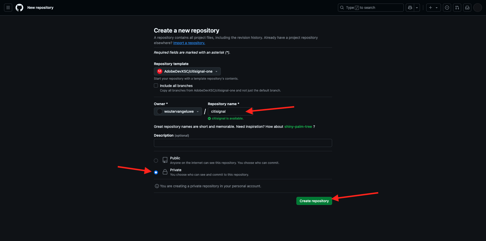{zoomable="yes"}

After a couple of seconds, you'll then have your repository created.

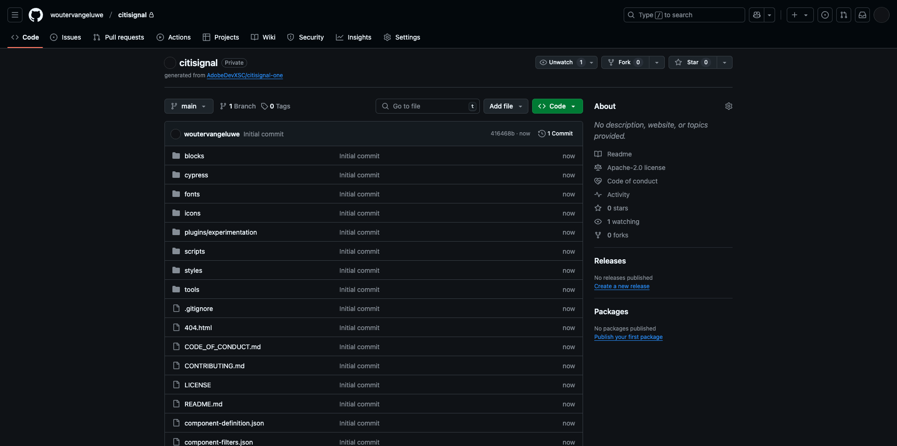{zoomable="yes"}

Next, go to [https://github.com/apps/aem-code-sync](https://github.com/apps/aem-code-sync){target="_blank"}. Click **Configure**.

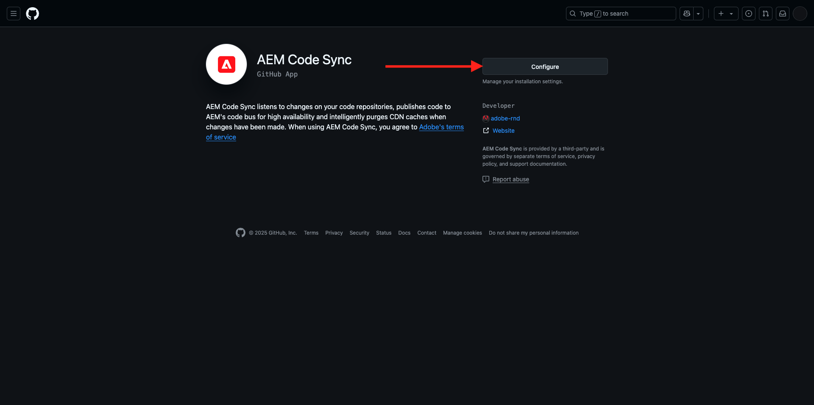{zoomable="yes"}

Click your GitHub account.

{zoomable="yes"}

Click **Only select repositories** and then add the repository that you just created. Next, click **Install**.

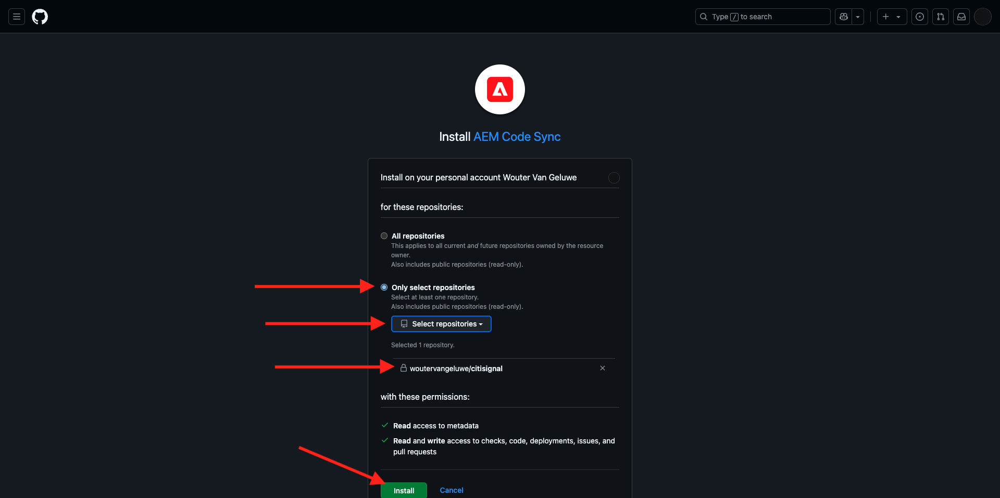{zoomable="yes"}

You'll then get this confirmation.

{zoomable="yes"}

## 2.1.3.2 Update file fstab.yaml

In your GitHub repo, click to open the file `fstab.yaml`.

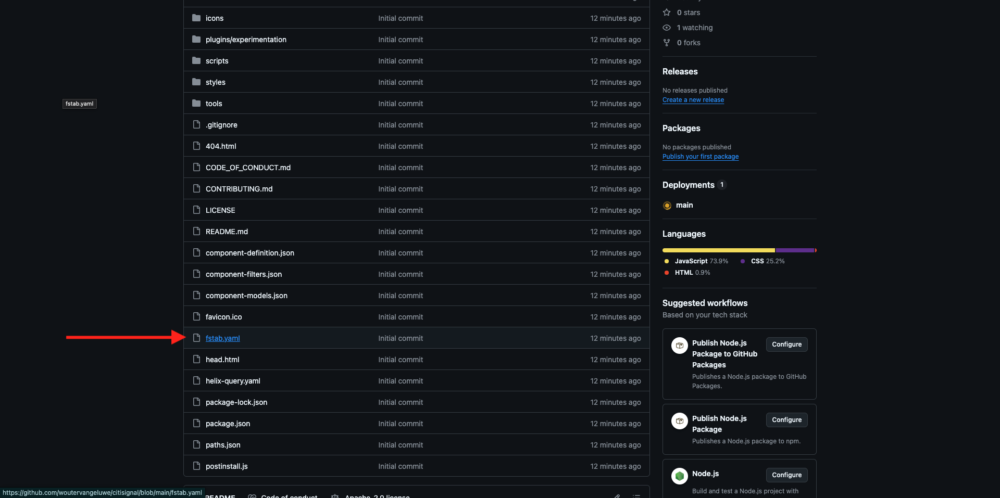{zoomable="yes"}

Click the **edit** icon.

{zoomable="yes"}

You now need to update the value for the field **url** on line 4. 

{zoomable="yes"}

You need to replace the current value by the URL of your specific AEM CS environment in combination with the settings of your GitHub repo. 

This is the current value of the URL: `https://author-p131639-e1282833.adobeaemcloud.com/bin/franklin.delivery/adobedevxsc/citisignal-one/main`.

There are 3 parts of the URL that need to be updated

`https://XXX/bin/franklin.delivery/YYY/ZZZ/main`

XXX should be replaced by the URL of your AEM CS Author environment.

YYY should be replaced by your GitHub user account.

ZZZ should be replaced by the name of the GitHub repository that you used in the previous exercise.

You can find the URL of your AEM CS Author environment by going to [https://my.cloudmanager.adobe.com](https://my.cloudmanager.adobe.com){target="_blank"}. Click your **Program** to open it.

{zoomable="yes"}

Next, click the 3 dots **...** on the **Environments** tab and click **View Details**.

{zoomable="yes"}

You'll then see your environment details, including the URL of your **Author** environment. Copy the URL.

{zoomable="yes"}

XXX = `author-p148073-e1511503.adobeaemcloud.com`

For the GitHub user account name, you can easily find that in the URL of your browser. In this example, the user account name is `woutervangeluwe`.

YYY = `woutervangeluwe`

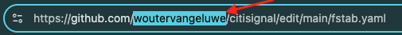{zoomable="yes"}

For the GitHub repository name, you can also find it in the browser window that you have open in GitHub. In this case, the repository name is `citisignal`.

ZZZ = `citisignal`

{zoomable="yes"}

These 3 values combined, lead to this new URL that needs to be configured in the file `fstab.yaml`.

`https://author-p148073-e1511503.adobeaemcloud.com/bin/franklin.delivery/woutervangeluwe/citisignal/main`

Click **Commit changes...**.

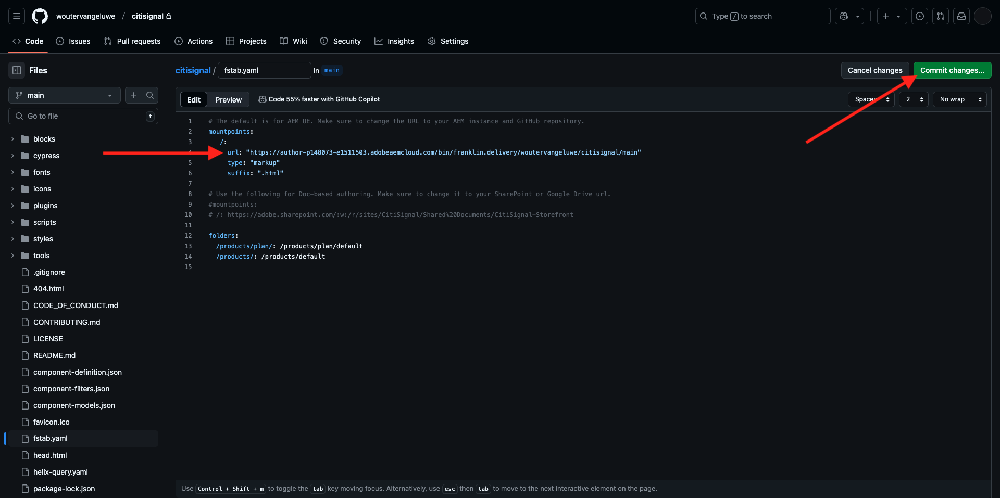{zoomable="yes"}

Click **Commit changes**.

{zoomable="yes"}

The file `fstab.yaml` has now been updated.

## 2.1.3.3 Upload CitiSignal assets

Go to [https://my.cloudmanager.adobe.com](https://my.cloudmanager.adobe.com){target="_blank"}. Click your **Program** to open it.

{zoomable="yes"}

Next, click the URL of your Author environment.

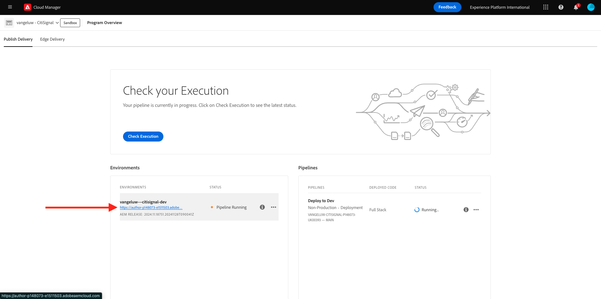{zoomable="yes"}

Click **Sign in with Adobe**.

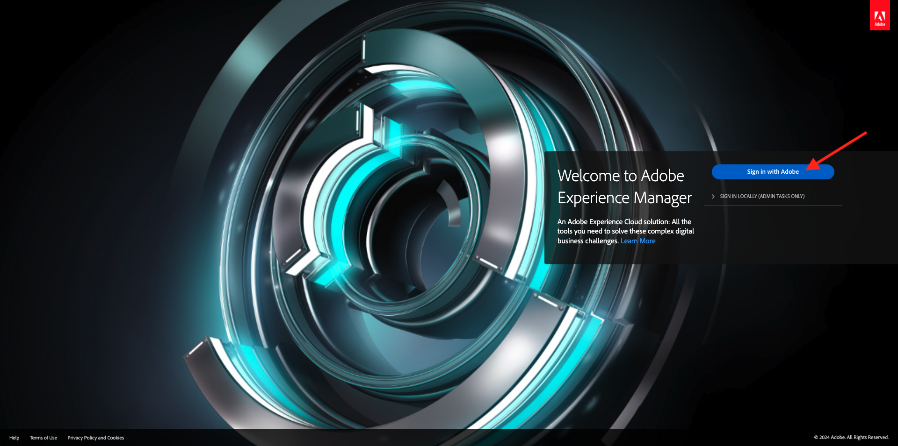{zoomable="yes"}

You'll then see your Author environment.

{zoomable="yes"}

Your URL will look like this: `https://author-p148073-e1511503.adobeaemcloud.com/ui#/aem/aem/start.html?appId=aemshell`

You now need to access the **CRX Package Manager** environment of AEM. To do that, remove `ui#/aem/aem/start.html?appId=aemshell` from the URL and replace it by `crx/packmgr`, which means your URL should look like this now:
`https://author-p148073-e1511503.adobeaemcloud.com/crx/packmgr`. 
Hit **Enter** to load the package manager environment

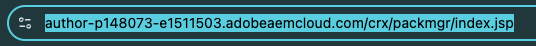{zoomable="yes"}

Next, click **Upload package**.

{zoomable="yes"}

Click **Browse** to locate the package to upload.

The package to upload is called **citisignal-assets.zip** and can be downloaded here: [https://tech-insiders.s3.us-west-2.amazonaws.com/one-adobe/citisignal-assets.zip](https://tech-insiders.s3.us-west-2.amazonaws.com/one-adobe/citisignal-assets.zip){target="_blank"}.

{zoomable="yes"}

Select the package and click **Open**.

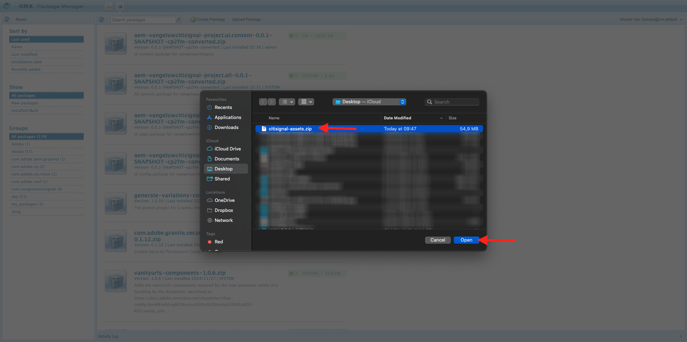{zoomable="yes"}

Next, click **OK**.

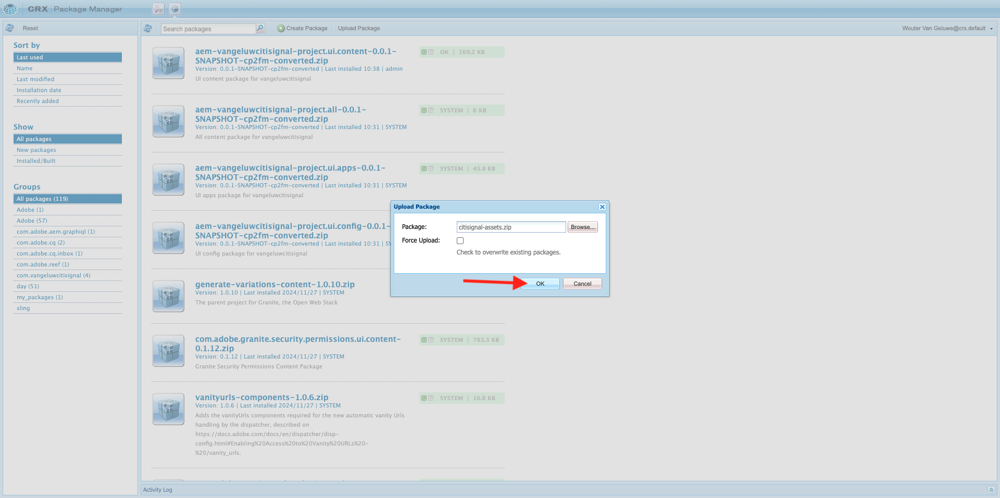{zoomable="yes"}

The package will then be uploaded.

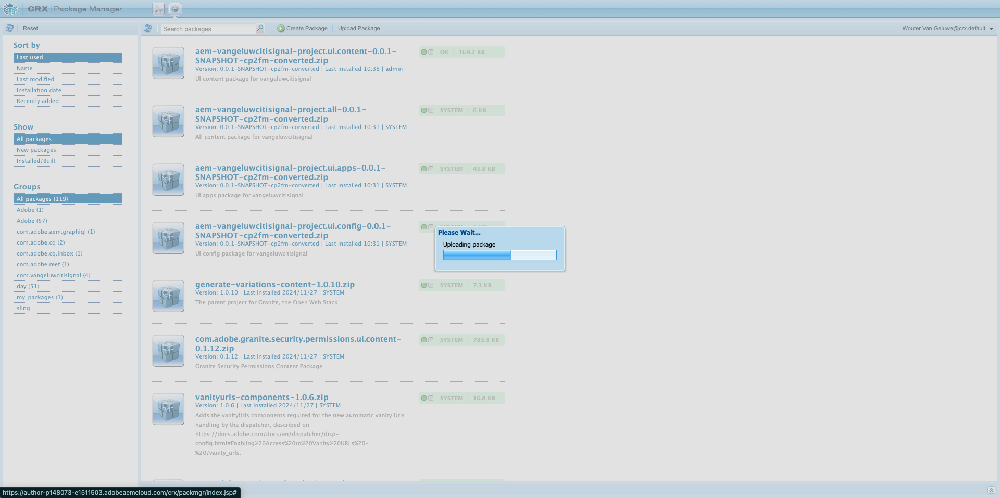{zoomable="yes"}

Next, click **Install** on the package you just uploaded.

{zoomable="yes"}

Click **Install**.

{zoomable="yes"}

After a couple of minutes, your package will then be installed.

{zoomable="yes"}

You can now close this window.

## 2.1.3.4 Publish CitiSignal assets

Go to [https://my.cloudmanager.adobe.com](https://my.cloudmanager.adobe.com){target="_blank"}. Click your **Program** to open it.

{zoomable="yes"}

Next, click the URL of your Author environment.

{zoomable="yes"}

Click **Sign in with Adobe**.

{zoomable="yes"}

You'll then see your Author environment. Click **Sites**.

{zoomable="yes"}

Click **Files**.

{zoomable="yes"}

Click to select the folder **CitiSignal** and then click **Manage Publication**.

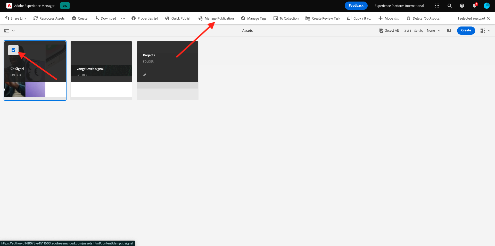{zoomable="yes"}

Click **Next**.

{zoomable="yes"}

Click **Publish**.

{zoomable="yes"}

Your assets have now been published.

## 2.1.3.5 Create CitiSignal website

Go to [https://my.cloudmanager.adobe.com](https://my.cloudmanager.adobe.com){target="_blank"}. Click your **Program** to open it.

{zoomable="yes"}

Next, click the URL of your Author environment.

{zoomable="yes"}

Click **Sign in with Adobe**.

{zoomable="yes"}

You'll then see your Author environment. Click **Sites**.

{zoomable="yes"}

Click **Create** and then click **Site from template**.

{zoomable="yes"}

Click **Import**.

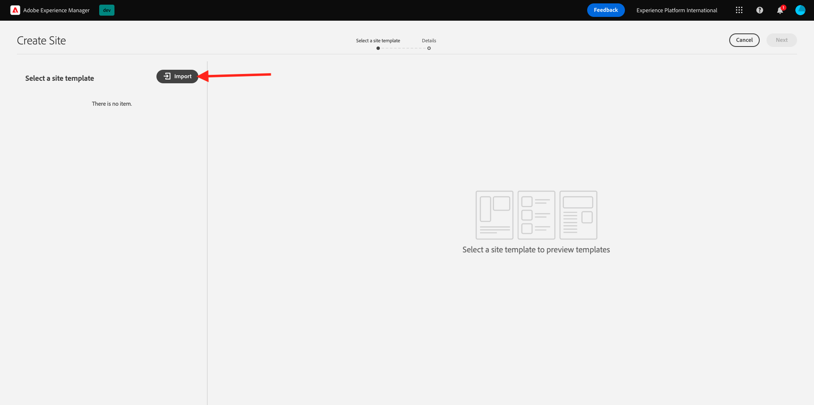{zoomable="yes"}

You now need to import a preconfigured template for your site. You can download the template [here](./../../../assets/aem/citisignal-edge-delivery-services-template-0.0.4.zip){target="_blank"}. Save the file to your desktop.

Next, select the file `citisignal-edge-delivery-services-template-0.0.4.zip` and click **Open**.

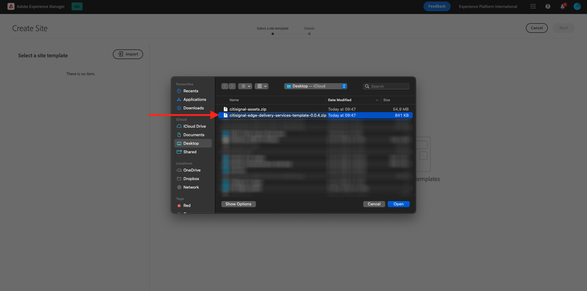{zoomable="yes"}

You'll then see this. Click to select the template you just uploaded and then, click **Next**.

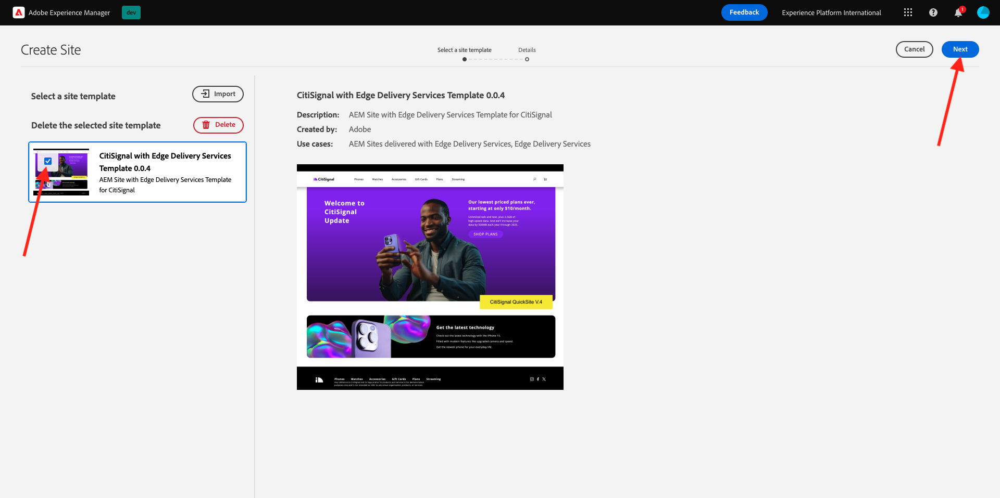{zoomable="yes"}

You now need to fill out some details.

- Site title: use **CitiSignal**
- Site name: use **citisignal-one**
- GitHub URL: copy the URL of the GitHub repo you were using before

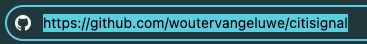{zoomable="yes"}

You'll then have this. Click **Create**.

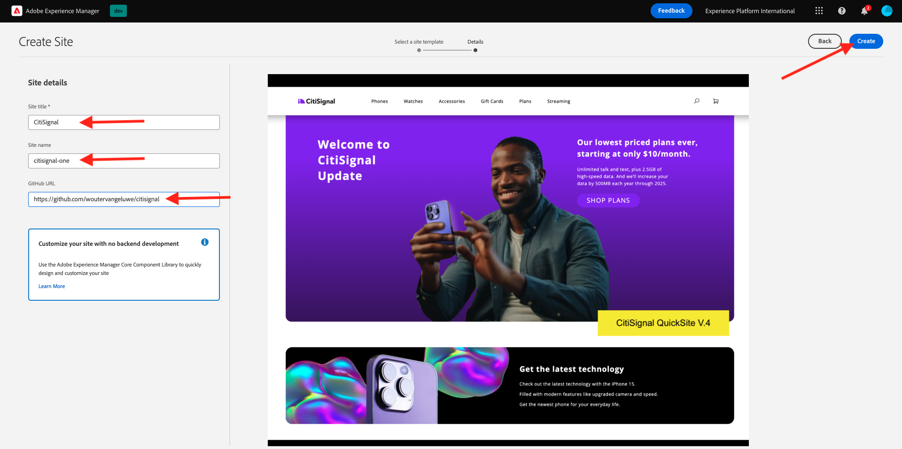{zoomable="yes"}

Your site is now being created. This may take a couple of minutes. Click **Okay**.

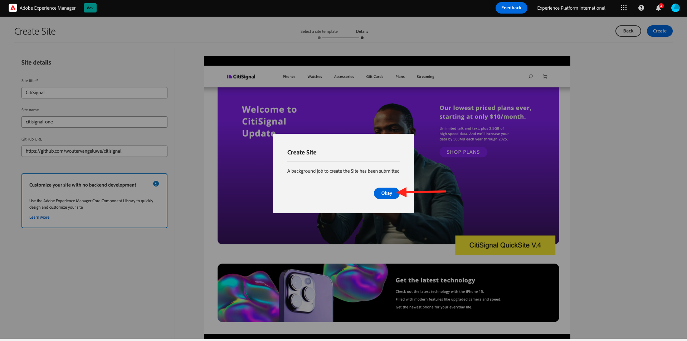{zoomable="yes"}

Refresh your screen after a couple of minutes, you'll then see your newly created CitiSignal website.

{zoomable="yes"}

## 2.1.3.6 Publish CitiSignal website

Next, click the checkbox in front of **CitiSignal**. Then, click **Manage Publication**.

{zoomable="yes"}

Click **Next**.

{zoomable="yes"}

Click **Include Children Settings**.

{zoomable="yes"}

Click to select the checkbox **Include children** and then click to unselect the other checkboxes. Click **OK**.

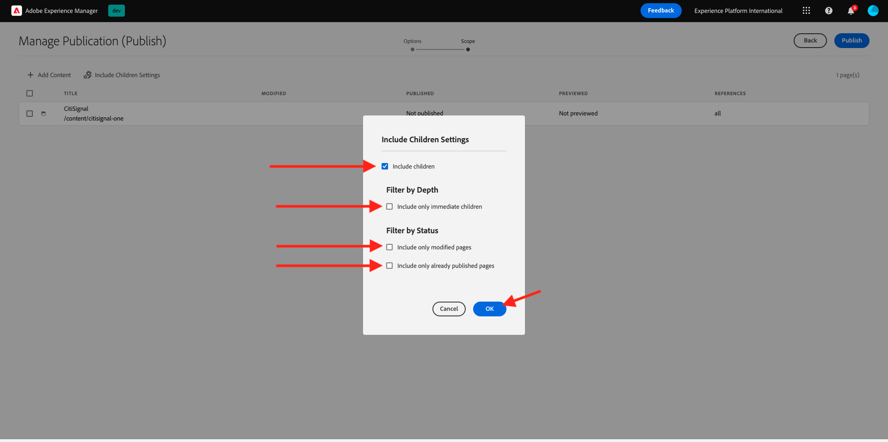{zoomable="yes"}

Click **Publish**.

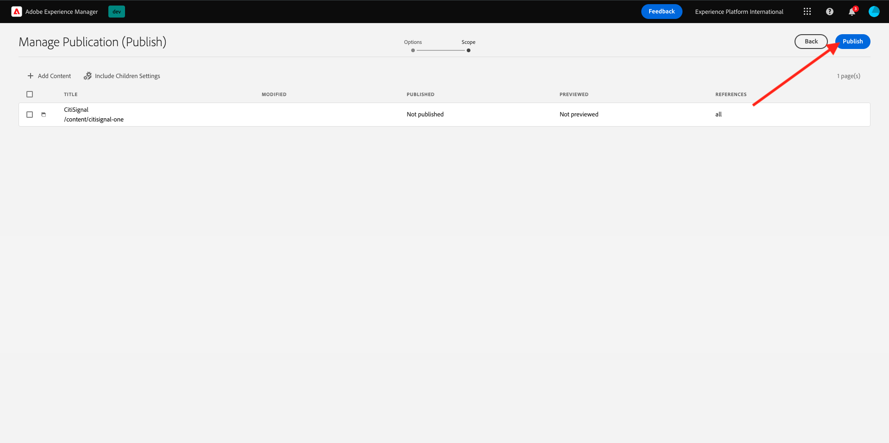{zoomable="yes"}

You'll then be sent back here. Navigate to **CitiSignal** > **us** > **en**. Click the checkbox in front of **index** and then click **Edit**.

{zoomable="yes"}

Your website will then open in the **Universal Editor**.

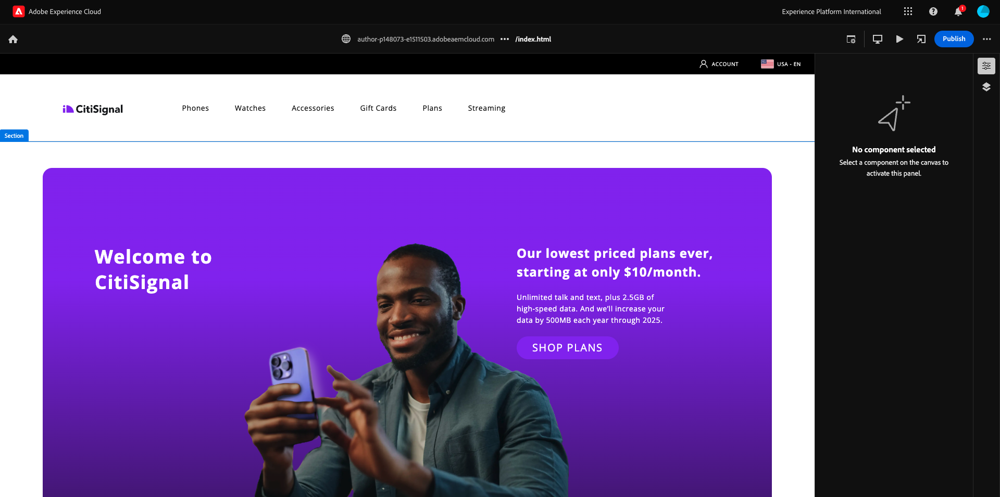{zoomable="yes"}

You will now be able to acces your website by going to `main--citisignal--XXX.aem.page/us/en` and/or `main--citisignal--XXX.aem.live/us/en`, after replacing XXX by your GitHub user account, which in this example is `woutervangeluwe`.

In this example, the full URL becomes this:
`https://main--citisignal--woutervangeluwe.aem.page/us/en` and/or `https://main--citisignal--woutervangeluwe.aem.live/us/en`.

It may take some time before all the assets are shown correctly, as they need to be published first.

You'll then see this:

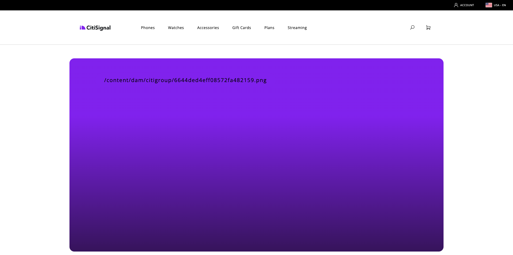{zoomable="yes"}

After a couple of minutes, the assets will all be loading properly.

{zoomable="yes"}

## 2.1.3.7 Test Page Performance

Go to [https://pagespeed.web.dev/](https://pagespeed.web.dev/){target="_blank"}. Enter your URL and click **Analyze**.

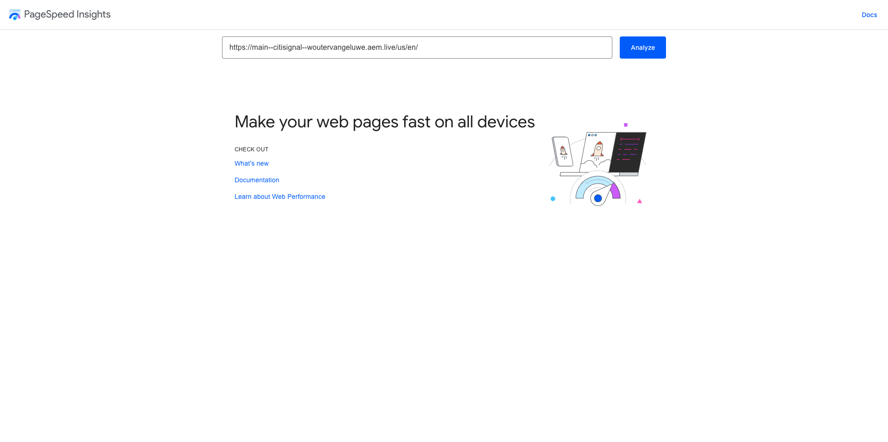{zoomable="yes"}

You'll then see that your website, in both a mobile and desktop visualization, gets a high score:

**Mobile**:

{zoomable="yes"}

**Desktop**:

{zoomable="yes"}

Next Step: [2.1.4 Configure a custom block](./ex4.md){target="_blank"}

[Go Back to Module 2.1](./aemcs.md){target="_blank"}

[Go Back to All Modules](./../../../overview.md){target="_blank"}
