# 2.1.4 Develop a basic custom block

## 2.1.4.1 Setup your local development environment

Go to [https://desktop.github.com/download/](https://desktop.github.com/download/){target="_blank"}, download and install **Github Desktop**.


Once Github Desktop is installed, go to the GitHub repo you created in the previous exercise. Click **<> Code** and then click **Open with GitHub Desktop**.


Your GitHub repo will then be opened in GitHub Desktop. Feel free to change the **Local Path**. Click **Clone**.


A local folder will now be created.


Open Visual Studio Code. Go to **File** > **Open Folder**.


Select the folder that is used by your GitHub setup for **citisignal**.


You'll now see that folder open in Visual Studio Code, you're now ready to create a new block.


## 2.1.4.2 Create a basic custom block

Adobe recommends that you develop blocks in a three-phased approach:

- Create the definition and model for the block, review it, and bring it to production.
- Create content with the new block.
- Implement the decoration and styles for the new block.

### component-definition.json

In Visual Studio Code, open the file **component-definition.json**.

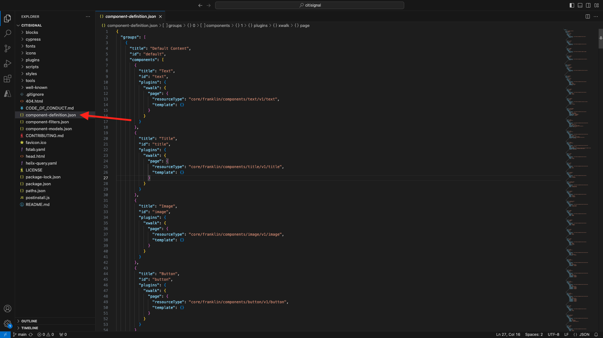

Scroll down until you see the component **Quote**. Set your cursor next to the closing bracket of the last component.


Paste this code and enter a comma **,** after the block of code:

```json
{
  "title": "FiberOffer",
  "id": "fiberoffer",
  "plugins": {
    "xwalk": {
      "page": {
        "resourceType": "core/franklin/components/block/v1/block",
        "template": {
          "name": "FiberOffer",
          "model": "fiberoffer",
          "offerText": "<p>Fiber will soon be available in your region!</p>",
          "offerCallToAction": "Get your offer now!",
          "offerImage": ""
        }
      }
    }
  }
}
```

Save your changes.

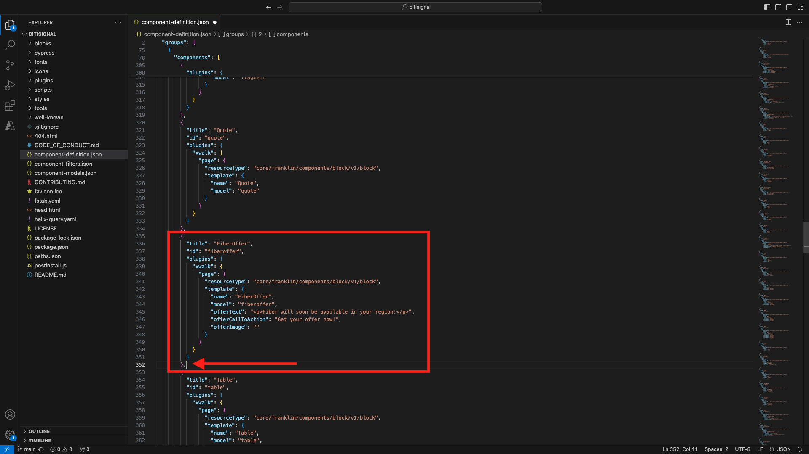

### component-models.json

In Visual Studio Code, open the file **component-models.json**.

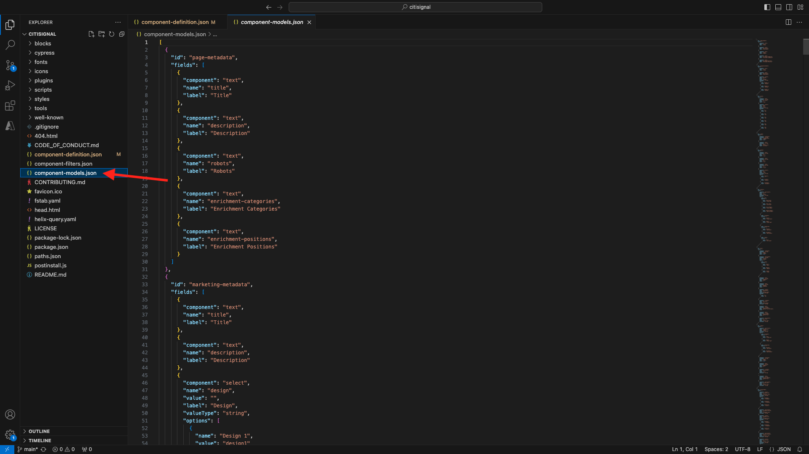

Scroll down until you see the last item. Set your cursor next to the closing bracket of the last component.

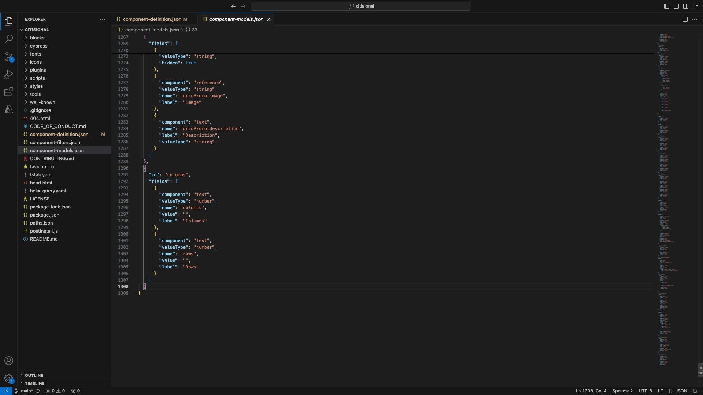

Enter a comma **,**, then push enter and on the next line, paste this code:

```json
{
  "id": "fiberoffer",
  "fields": [
     {
       "component": "richtext",
       "name": "offerText",
       "value": "",
       "label": "Offer Text",
       "valueType": "string"
     },
     {
       "component": "richtext",
       "valueType": "string",
       "name": "offerCallToAction",
       "label": "Offer CTA",
       "value": ""
     },
     {
       "component": "reference",
       "valueType": "string",
       "name": "offerImage",
       "label": "Offer Image",
        "multi": false
     }
   ]
}
```

Save your changes.

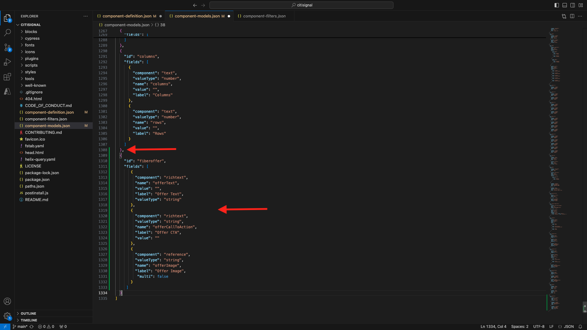

### component-filters.json

In Visual Studio Code, open the file **component-filters.json**.


Under **section**, enter a comma **,** and the id of your component **fiberoffer** after the current last line.

Save your changes.


## 2.1.4.3 Commit your changes

You've now made several changes in your project that need to be committed back to your GitHub repository. To do that, open **GitHub Desktop**.

You should then see the 3 files that you just edited under **Changes**. Review your changes.

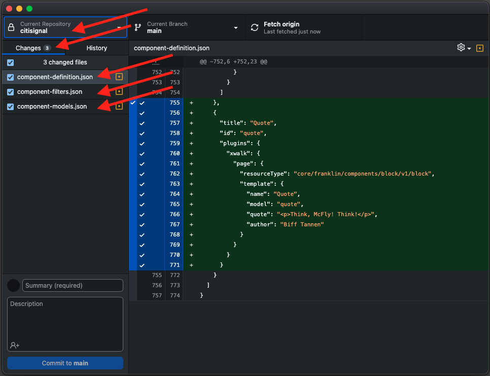

Enter a name for your PR, `Fiber Offer custom block`. Click **Commit to main**.

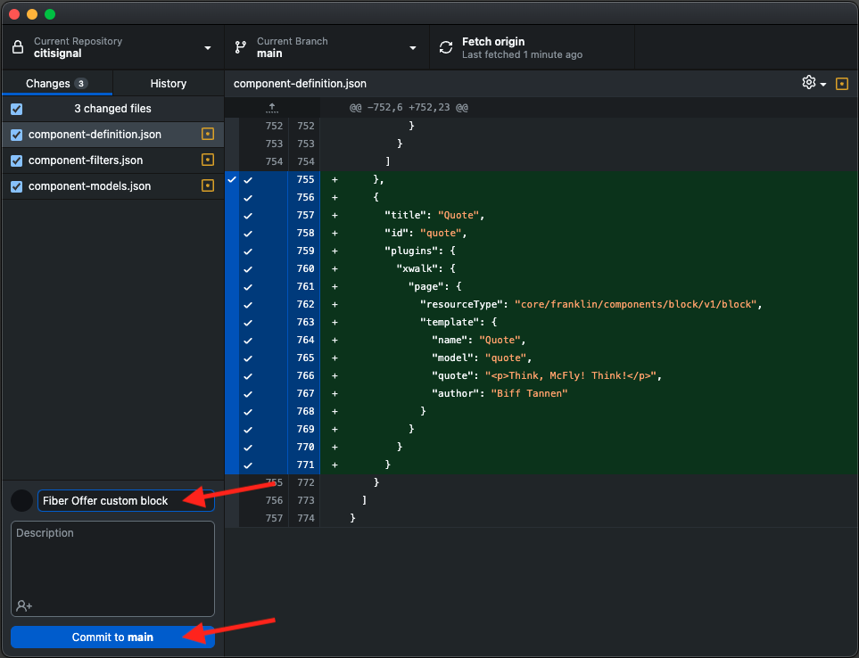

You should then see this. Click **Push origin**.

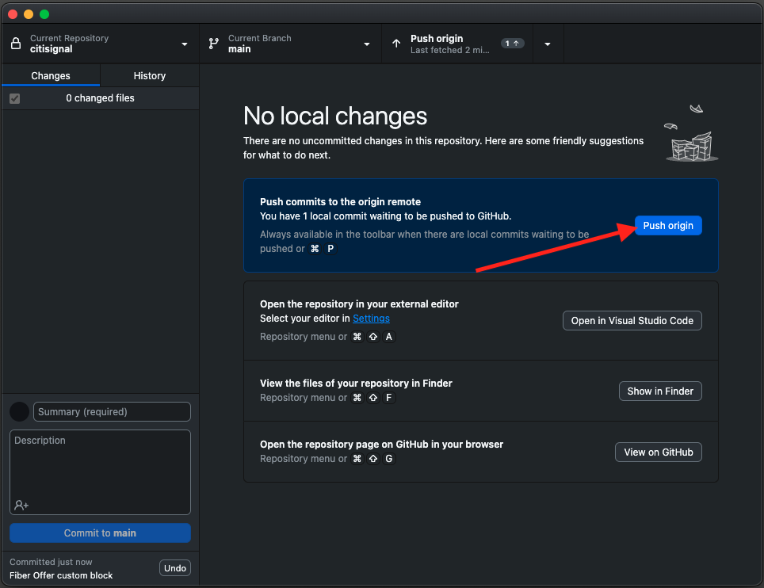

After a couple of seconds, your changes have been pushed to your GitHub repository.

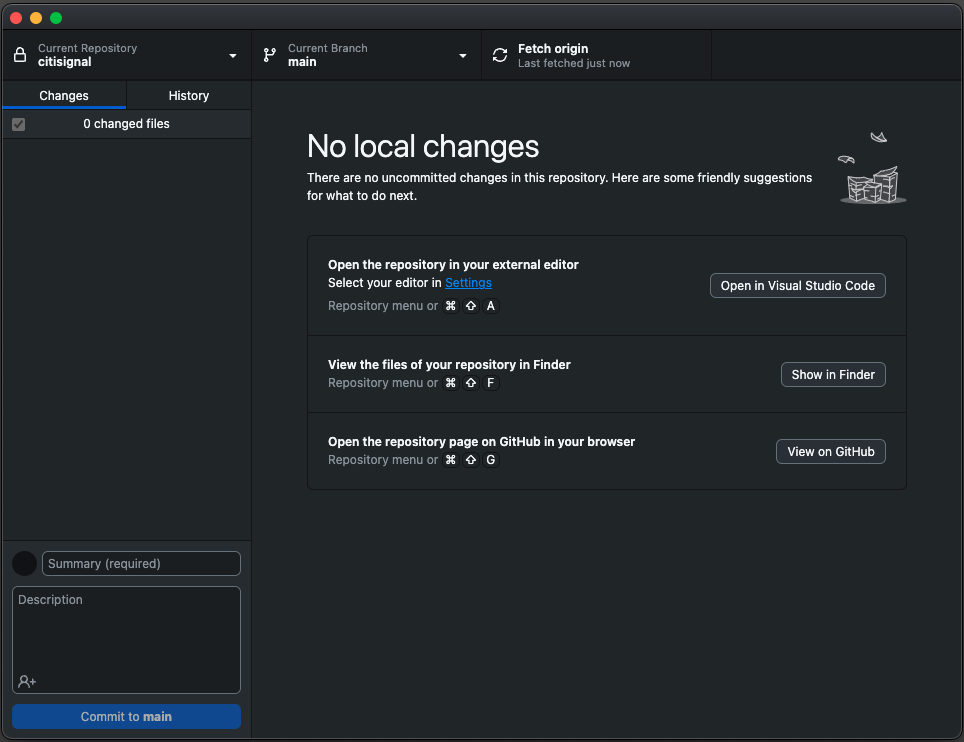

In your browser, go to your GitHub account and to the repository your created for CitiSignal. You should then see something like this, showing that your changes have been received.

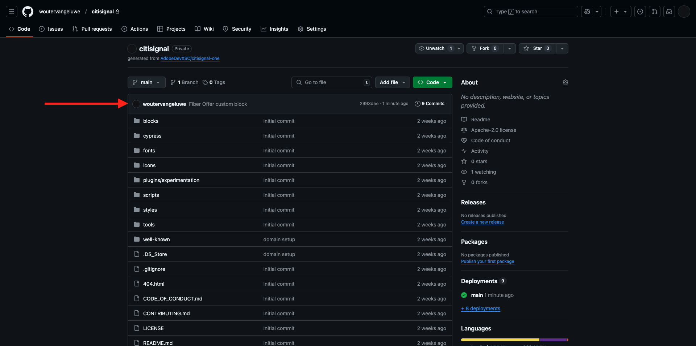

## 2.1.4.4 Commit your changes

Now that your basic quote block is defined and committed to the CitiSignal project, you can add a **fiberoffer** block to an existing page.

Go to [https://my.cloudmanager.adobe.com](https://my.cloudmanager.adobe.com){target="_blank"}. Click your **Program** to open it.


Next, click the 3 dots **...** on the **Environments** tab and click **View Details**.


You'll then see your environment details. Click the URL of your **Author** environment.

>[!NOTE]
>
>It is possible that your environment is hibernated. If that is the case, you'll need to de-hibernate your environment first.


You should then see your AEM Author environment. Go to **Sites**.

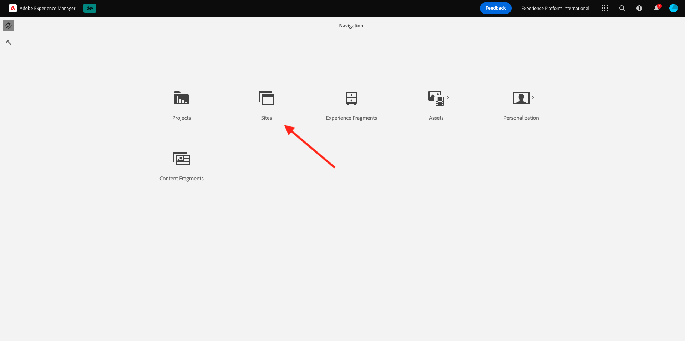

Go to **CitiSignal** > **us** > **en**.

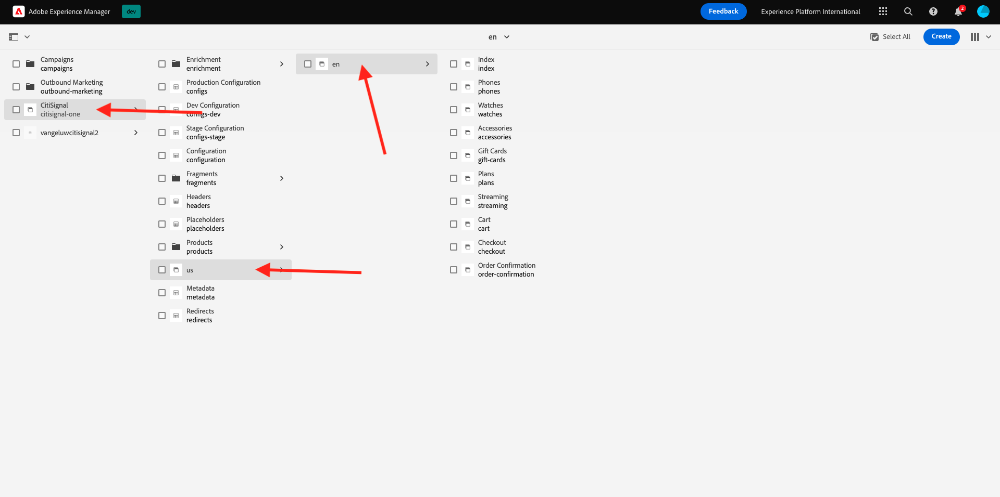

Click **Create** and select **Page**.

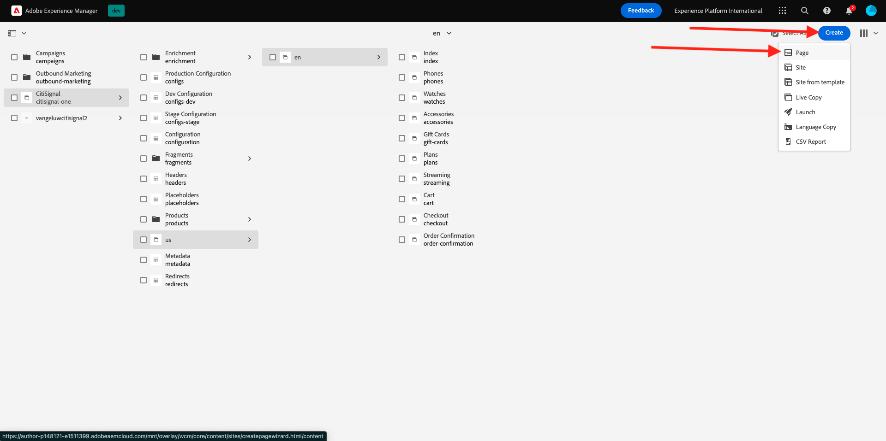

Select **Page** and click **Next**.


Enter the following values:

- Title: **CitiSignal Fiber**
- Name: **citisignal-fiber**
- Page Title: **CitiSignal Fiber**

Click **Create**.


You should then see this.


Click in the blank area to select the **section** component. Then, click the plus **+** icon in the right menu.


You should then see your custom block shown in the list of available blocks. Click to select it.

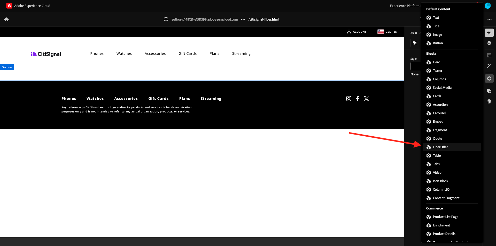

You'll then see fields like **Offer Text**, **Offer CTA** and **Offer Image** being added to the editor.


Your basic custom block is now ready for customisation.

Next Step: [2.1.5 Advanced Custom Block](./ex5.md){target="_blank"}

[Go Back to Module 2.1](./aemcs.md){target="_blank"}

[Go Back to All Modules](./../../../overview.md){target="_blank"}
