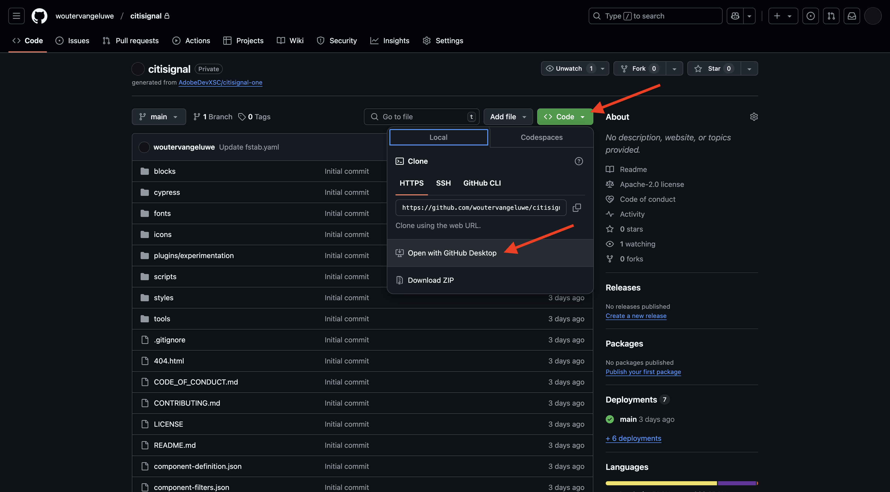
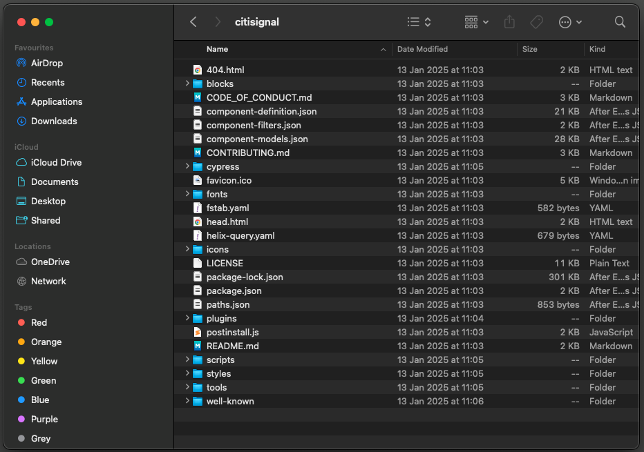

# 2.1.4 Develop a custom block

## 2.1.4.1 Setup your local development environment

Go to [https://desktop.github.com/download/](https://desktop.github.com/download/){target="_blank"}, download and install **Github Desktop**.

Once Github Desktop is installed, go to the GitHub repo you created in the previous exercise. Click **<> Code** and then click **Open with GitHub Desktop**.

Your GitHub repo will then be opened in GitHub Desktop. Feel free to change the **Local Path**. Click **Clone**.

A local folder will now be created.

Open Visual Studio Code. Go to **File** > **Open Folder**.

[Go Back to Module 2.1](./aemcs.md){target="_blank"}

[Go Back to All Modules](./../../../overview.md){target="_blank"}
