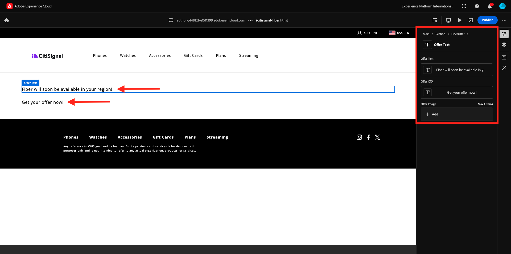

# 2.1.5 Advanced Custom Block

In the previous exercise, you configured a basic custom block called **Fiber Offer** that showcases fields like **Offer Text**, **Offer CTA** and **Offer Image** onto your website.

Next Step: [Summary & Benefits](./summary.md){target="_blank"}

[Go Back to Module 2.1](./aemcs.md){target="_blank"}

[Go Back to All Modules](./../../../overview.md){target="_blank"}
