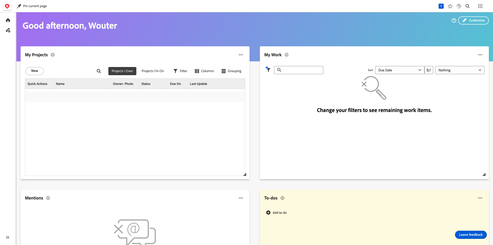

# 2.2.1 Getting started with Workfront

Log in to Adobe Workfront by going to [https://experienceplatform.my.workfront.com/](https://experienceplatform.my.workfront.com/).

You then see this.

## 2.2.1.1 Configure your AEM Assets Integration

Click the 

[Go Back to Module 2.2](./workfront.md)

[Go Back to All Modules](./../../../overview.md)
