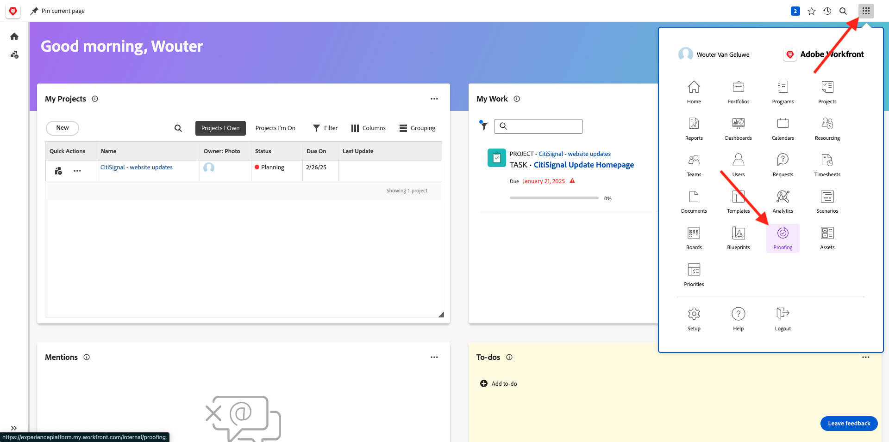
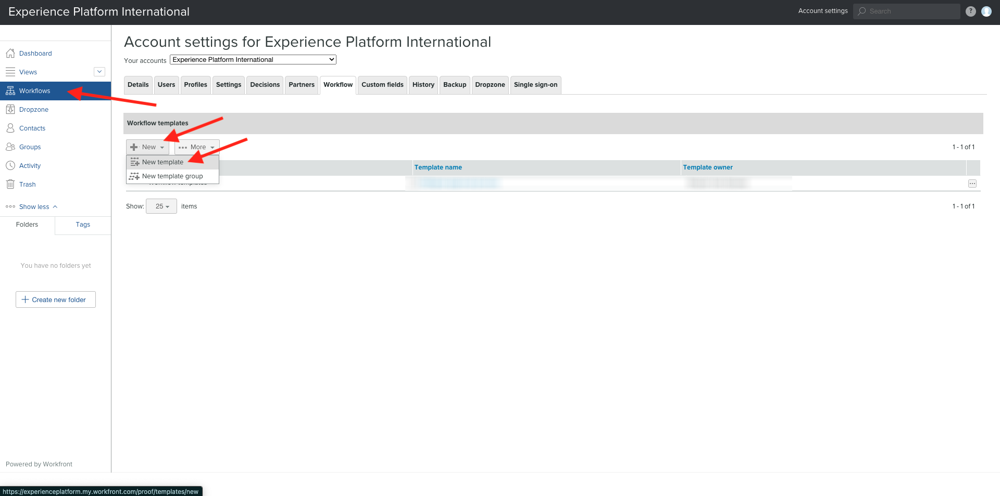

# 2.2.2 Proofing with Workfront

## 2.2.2.1 Create a project

## 2.2.2.1 Configure an approval flow

Go to [https://experienceplatform.my.workfront.com/](https://experienceplatform.my.workfront.com/){target="_blank"}.

Click the 9 dots **hamburger** icon and select **Proofing**.

Go to **Workflows**, click **+ New** and then select **New template**.

[Go Back to Module 2.2](./workfront.md){target="_blank"}

[Go Back to All Modules](./../../../overview.md){target="_blank"}
