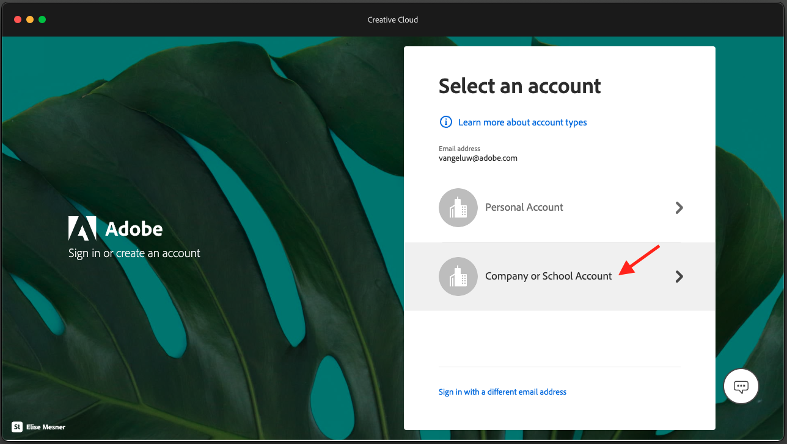
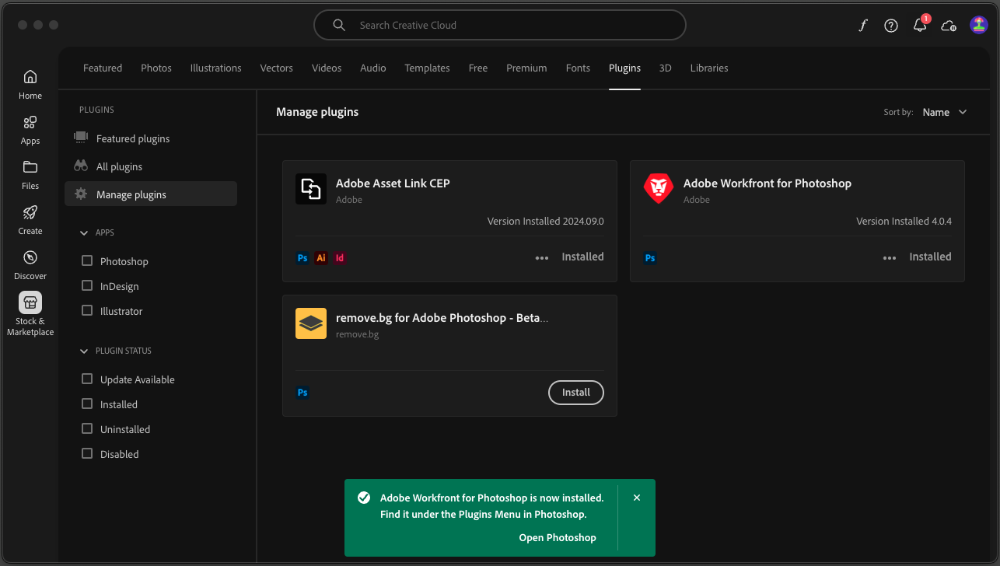

# 2.2.5 Setup Photoshop + Workfront plugin

## 2.2.5.1 Install Workfront for Photoshop plugin

To set up the integration between Workfront and Photoshop, install the Creative Cloud application on your computer. Log in using your Adobe ID.

Select **Company or School Account** and authenticate.

Select a profile to sign in.

You'll then be here. Go to **Stock & Marketplace**.

Clik **Plugins** and then click **Manage plugins**. Click **Install** on the **Adobe Workfront for Photoshop** card.

Click **OK**.

You'll then see this.

## 2.2.5.2 Configure the plugin in Photoshop

Open Photoshop. In the Task Bar, go to **Plugins** > **Workfront for Adobe Photoshop** > click **Adobe Workfront**.

You'll then see this. 

Enter the domain of your Adobe Workfront instance. Click **Login**.

Click **Allow**.

Sign in with your **Adobe ID**.

Select **Company or School Account**.

Click **Allow Access**.

You'll then see this confirmation. 

Go back to Photoshop, and you'll see that the plugin is now ready to be used and is showing your active tasks.

[Go Back to Module 2.2](./workfront.md){target="_blank"}

[Go Back to All Modules](./../../../overview.md){target="_blank"}
