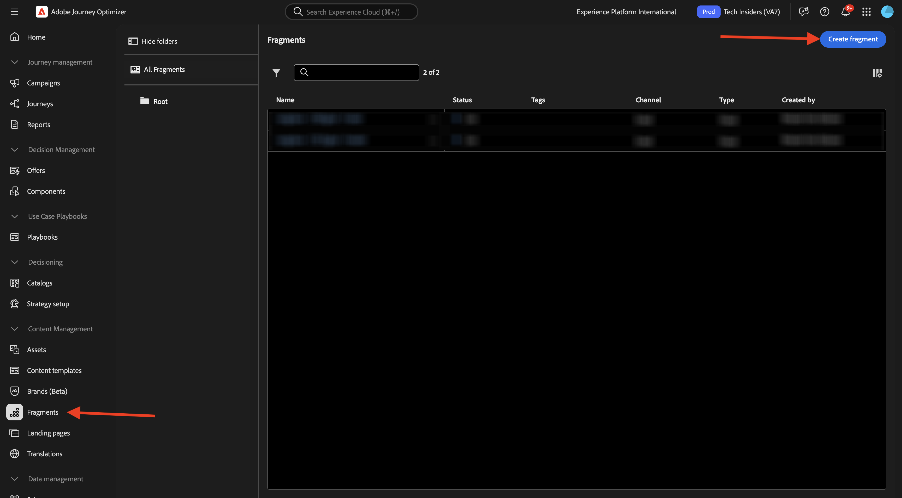
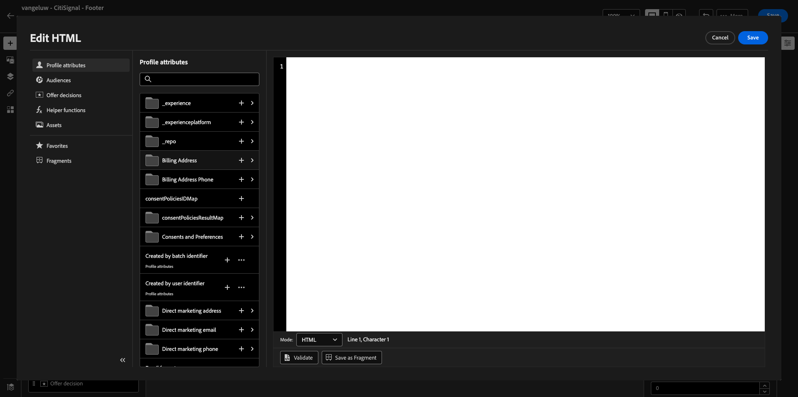
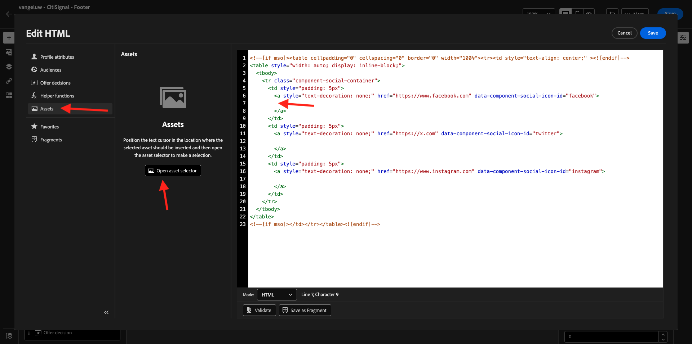
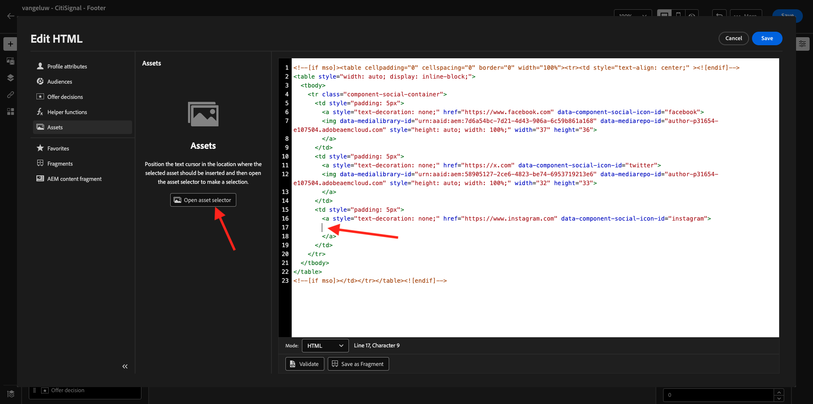
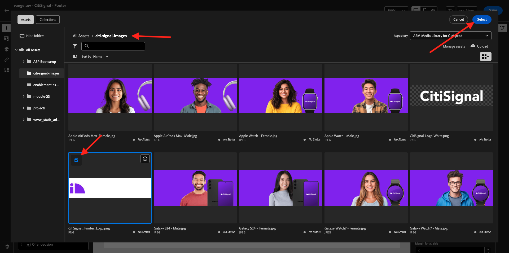
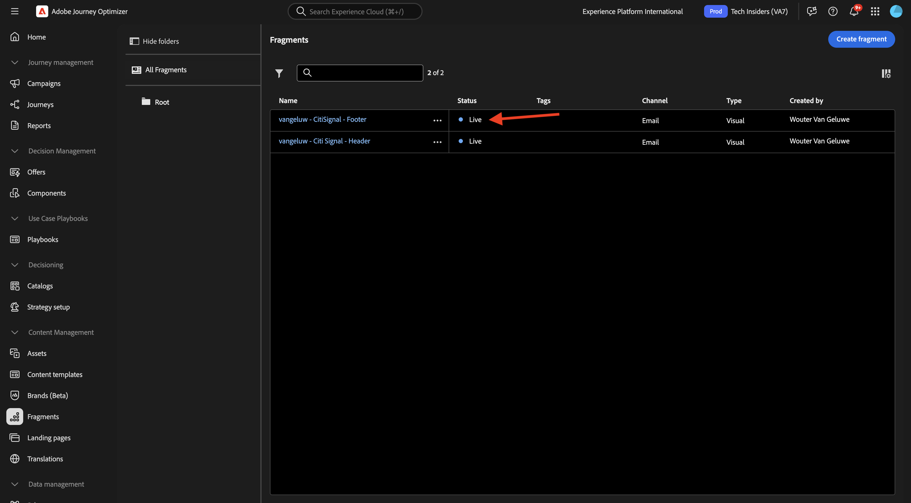

# 3.1.2 Create fragments to be used in your message

In this exercise, you'll configure 2 fragments, 1 for a reusable header and 1 for a reusable footer.

Login to Adobe Journey Optimizer by going to [Adobe Experience Cloud](https://experience.adobe.com). Click **Journey Optimizer**.


You'll be redirected to the **Home**  view in Journey Optimizer. First, make sure you're using the correct sandbox. The sandbox to use is called `--aepSandboxName--`.


## 3.1.2.1 Create your Header fragment

In the left menu, click **Fragments**. A Fragment is a reusable component within Journey Optimizer, which avoids duplication and facilitates future changes that should impact all messages, such as changes to a header or footer in an email message.

Click **Create fragment**.



Enter the name `--aepUserLdap-- - CitiSignal - Header` and select the **Type: Visual Fragment**. Click **Create**.


You'll then see this. In the left menu, you'll find the structure components that you can use to define the structure of the email (rows and columns).

Drag and drop a **1:1 column** from the menu into the canvas. This will be the placeholder for the logo image.


Next, you can use Content Components to add content inside these blocks. Drag and drop an **Image** component in the first cell on the first row. Click **Browse**.


You'll then see a popup opening, showing you your AEM Assets Media Library. Go to the folder **citi-signal-images**, click to select the image **CitiSignal-Logo-White.png** and click **Select**.

>[!NOTE]
>
>If you don't see the Citi Signal images in your AEM Assets Library, you can find them [here](./../../../../assets/ajo/CitiSignal-images.zip). Download them to your desktop, create the folder **citi-signal-images** and upload all the images in that folder.

 

You'll then see this. Your image is white, and isn't showing yet. You should now define a background color to make the image show correctly. Click **Styles**, then click the **Background color** box.


In the popup, change the **Hex** color code to **#8821F4** and then change focus by clicking into the **100%** field. You'll then see the new color applied to the image.


The image is also a bit to big right now. Let's change the width by sliding the **Width** switcher to **40%**.


Your header fragment is now ready. Click **Save** and then click the arrow to go back to the previous screen.


Your fragment needs to be published before it can be used. Click **Publish**.


After a couple of minutes, you'll see that you fragment's status has changed to **Live**. 
Next, you should create a new fragment for the footer of your email messages. Click **Create fragment**.


## 3.1.2.2 Create your Footer fragment

Click **Create fragment**.


Enter the name `--aepUserLdap-- - CitiSignal - Footer` and select the **Type: Visual Fragment**. Click **Create**.


You'll then see this. In the left menu, you'll find the structure components that you can use to define the structure of the email (rows and columns).

Drag and drop a **1:1 column** from the menu into the canvas. This will be the placeholder for the footer content.


Next, you can use Content Components to add content inside these blocks. Drag and drop an **HTML** component in the first cell on the first row. Click the component to select it and then, click the **</>** icon to edit the HTML source code.


You'll then see this.



Copy the below HTML code fragment and paste it in the **Edit HTML** window in Journey Optimizer.

```html
<!--[if mso]><table cellpadding="0" cellspacing="0" border="0" width="100%"><tr><td style="text-align: center;" ><![endif]-->
<table style="width: auto; display: inline-block;">
  <tbody>
    <tr class="component-social-container">
      <td style="padding: 5px">
        <a style="text-decoration: none;" href="https://www.facebook.com" data-component-social-icon-id="facebook">
        
        </a>
      </td>
      <td style="padding: 5px">
        <a style="text-decoration: none;" href="https://x.com" data-component-social-icon-id="twitter">
        
        </a>
      </td>
      <td style="padding: 5px">
        <a style="text-decoration: none;" href="https://www.instagram.com" data-component-social-icon-id="instagram">
         
        </a>
      </td>
    </tr>
  </tbody>
</table>
<!--[if mso]></td></tr></table><![endif]-->
```

You'll then have this. On lines 7, 12 and 17 you now need to insert a image file, using the assets in your AEM Assets library.


Make sure that your cursor is located on line 7, and then click **Assets** in the left menu. Click **Open asset selector** to select your image.



Open the folder **citi-signal-images** and click to select the image **Icon_Facebook.png**. Click **Select**.


Make sure that your cursor is located on line 12, and then click **Open asset selector** to select your image.


Open the folder **citi-signal-images** and click to select the image **Icon_X.png**. Click **Select**.


Make sure that your cursor is located on line 17, and then click **Open asset selector** to select your image.



Open the folder **citi-signal-images** and click to select the image **Icon_Instagram.png**. Click **Select**.


You'll then see this. Click **Save**.


You'll then be back in the editor. Your icons aren't visible yet because the background and the image files are all in white. To change the background color, go to **Styles** and click the **Background color** checkbox.


Change the **Hex** color code to **#000000**.


Change the alignment to be centered.

 

Let's add some other parts to the footer. Drag and drop an **Image** component above the HTML component you just created. Click **Browse**.

 

Click to select the image file **`CitiSignal_Footer_Logo.png`** and click **Select**.



Go to **Styles** and click the **Background color** checkbox, let's change it to black again. Change the **Hex** color code to **#000000**.

 

Change the width to **20%** and verify that the alignment is set to be centered.


Next, drag and drop a **Text** component under the HTML component you created. Click **Browse**.


Copy and paste the below text by replacing the placeholder text.

```

1234 N. South Street, Anywhere, US 12345

Unsubscribe

©2024 CitiSignal, Inc and its affiliates. All rights reserved.

```

Set the **Text alignment** to be centered.


Change the **Font color** to white, **#FFFFFF**.


Change the **Background color** to black, **#000000**.


Select the text **Unsubscribe** in the footer, and click the **Link** icon in the menu bar. Set the **Type** to **External Opt-out/Unsubscription** and set the url to **https://aepdemo.net/unsubscribe.html** (it's not allowed to have a blank URL for the unsubscribe link).


You'll then have this. Your footer is now ready. Click **Save** and then click the arrow to go back to the previous page.


Click **Publish** to publish your footer so it can be used in an email.


After a couple of minutes, you'll see that the status of your footer has changed to **Live**.



You've now finished this exercise.

## Next Steps

Go to [3.1.3 Create your journey and email message](./ex3.md){target="_blank"}

Go back to [Adobe Journey Optimizer: Orchestration](./journey-orchestration-create-account.md){target="_blank"}

Go back to [All modules](./../../../../overview.md){target="_blank"}
