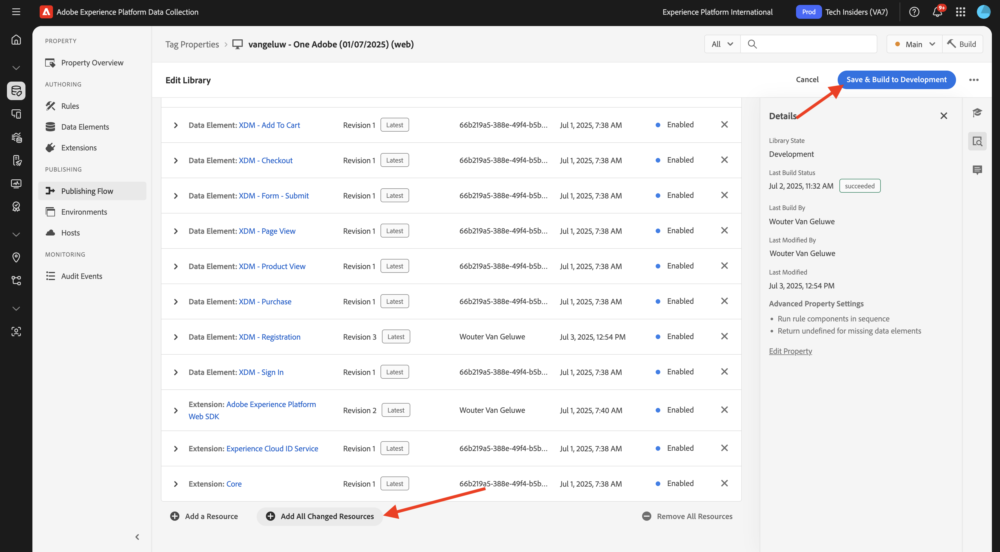

# 3.1.3 Update your Data Collection property and test your journey

## 3.1.3.1 Update your Data Collection property

Go to [Adobe Experience Platform Data Collection](https://experience.adobe.com/data-collection/home) and select **Tags**.

 

In **Getting Started**, Demo System Next created a couple of Tags properties for you, including one for the website and one for the mobile app. Find them by searching for `--aepUserLdap-- - One Adobe` in the **[!UICONTROL Search]** box. Click to open the **Web** property.

You'll then see this.

In the left menu, go to **Rules** and search for the rule **Create account**. Click the rule **Create account** to open it.

You'll then see the details of this rule. Click to open the action **Send "Registration Event" Experience Event**.

You'll then see that when this action is triggered, a specific data element is used to define the XDM data structure. You need to update that data element, and you need to define the **Event ID** of the event that you configured in [Exercise 3.1.1](./ex1.md).

You now need to go update the data element **XDM - Registration Event**. To do so, go to **Data Elements**. Search for **XDM - Registration** and click to open that data element.

You'll then see this:

Navigate to the field `_experience.campaign.orchestration.eventID`. Remove the current value, and paste your eventID there.

As a reminder, the Event ID can be found in Adobe Journey Optimizer under **Configurations > Events** and you'll find the event ID in the sample payload of your even, which looks like this: `"eventID": "d40815dbcd6ffd813035b4b590b181be21f5305328e16c5b75e4f32fd9e98557"`.

After pasting your eventID, your screen should look like this. Next, click **Save** or **Save to Library**.

Finally, you need to publish your changes. Go to **Publishing Flow** in the left menu and click to open your **Main** library.

Click **Add All Changed Resources** and then click **Save & Build to Development**.

Your library will then be updated and after 1-2 minutes you can then go ahead and test your configuration.

## 3.1.3.2 Test your Journey

Go to [https://dsn.adobe.com](https://dsn.adobe.com). After logging in with your Adobe ID, you'll see this. Click the 3 dots **...** on your website project and then click **Run** to open it.

You'll then see your demo website open up. Select the URL and copy it to your clipboard.

Open a new incognito browser window.

Paste the URL of your demo website, which you copied in the previous step. You'll then be asked to login using your Adobe ID.

Select your account type and complete the login process.

You'll then see your website loaded in an incognito browser window. For every exercise, you'll need to use a fresh, incognito browser window to load your demo website URL.

Click the Adobe logo icon in the top left corner of your screen to open the Profile Viewer.
  

Have a look at the Profile Viewer panel and the Real-time Customer Profile with the **Experience Cloud ID** as the primary identifier for this currently unknown customer. Click **Sign In**.
      

Click **CREATE AN ACCOUNT**.
  

  
Fill out your details and click **Register** after which you'll be redirected to the previous page. 

Open the Profile Viewer panel and go to Real-time Customer Profile. On the Profile Viewer panel, you should see all of your personal data displayed, like your newly added email and phone identifiers.
  

  
1 minute after having created your account, you'll receive your account creation email from Adobe Journey Optimizer.

You'll also see the journey entry and progress through the journey on the journey's dashboard in Journey Optimizer.

## Next Steps

Go to [Summary and benefits](./summary.md){target="_blank"}

Go back to [Adobe Journey Optimizer: Orchestration](./journey-orchestration-create-account.md){target="_blank"}

Go back to [All modules](./../../../../overview.md){target="_blank"}
