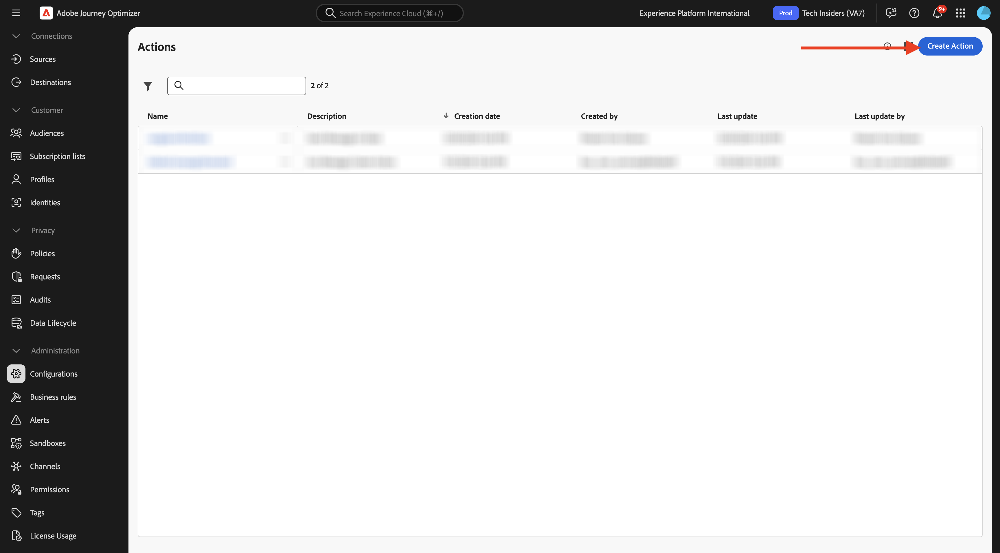
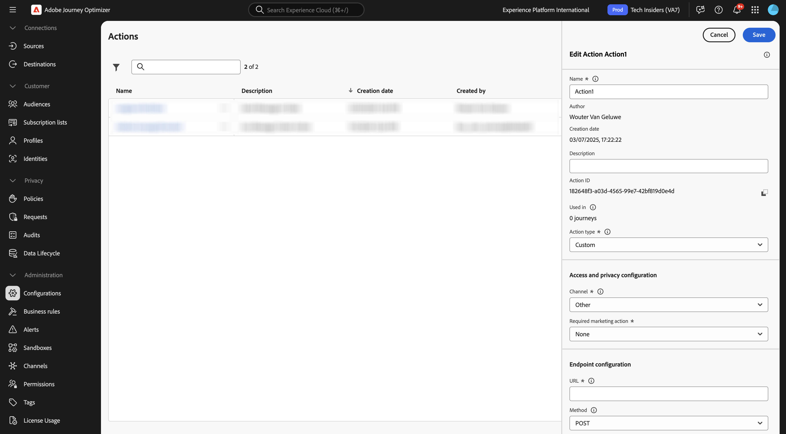
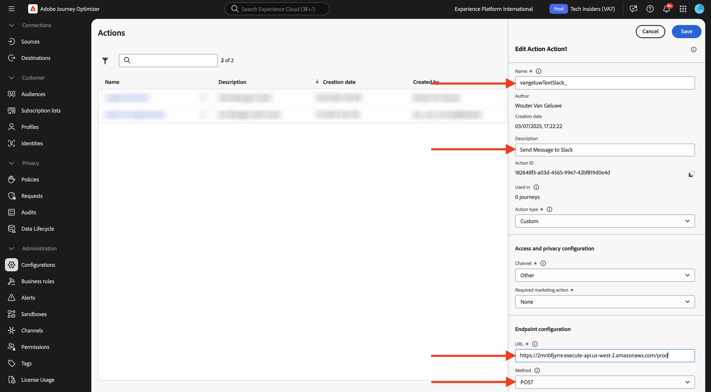
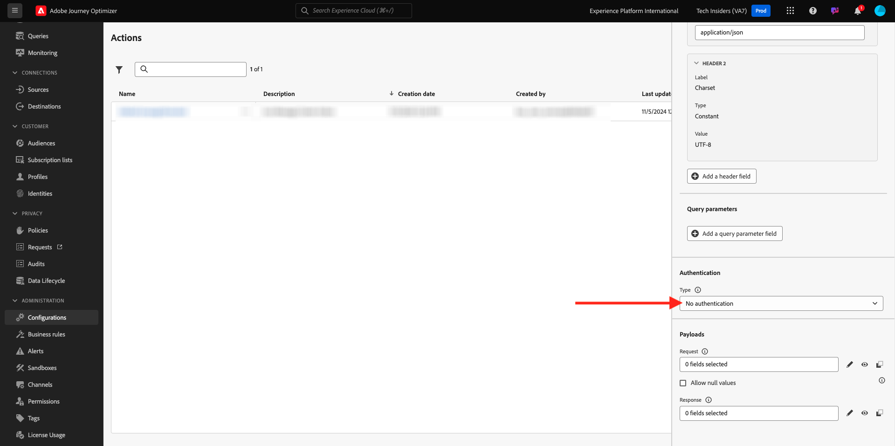
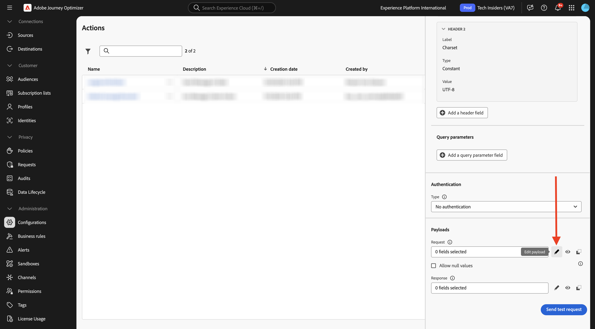
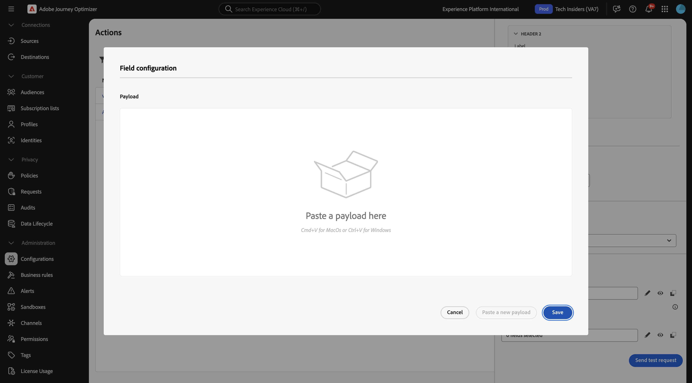
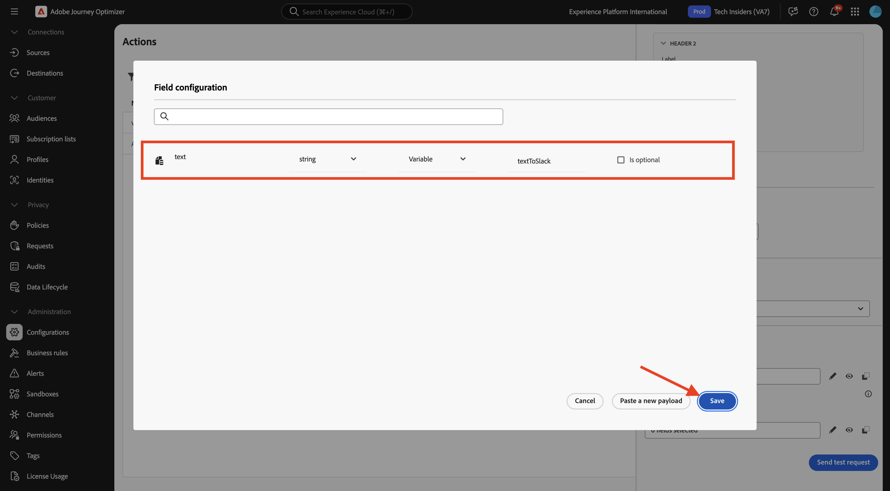
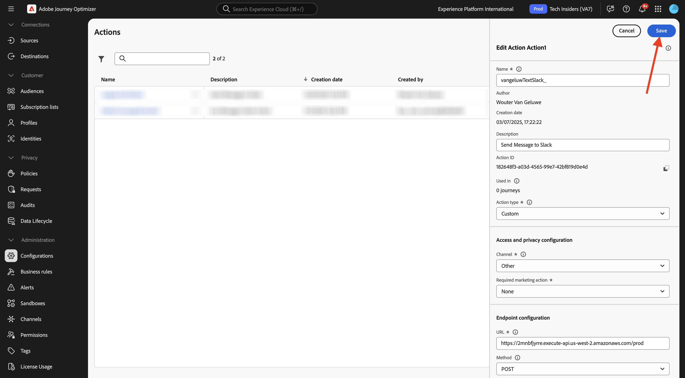
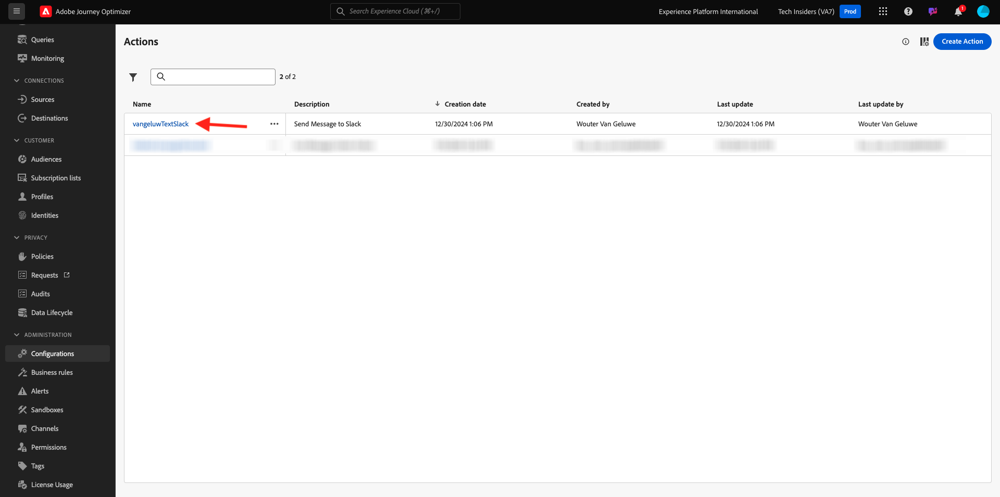

# 3.2.3 Define a custom action

In this exercise, you'll create a custom action to send a message to a Slack channel.

Login to Adobe Journey Optimizer by going to [Adobe Experience Cloud](https://experience.adobe.com). Click **Journey Optimizer**.


You'll be redirected to the **Home**  view in Journey Optimizer. First, make sure you're using the correct sandbox. The sandbox to use is called `--aepSandboxName--`. You'll then be in the **Home** view of your sandbox `--aepSandboxName--`.


You'll now use an existing Slack channel and send messages to that Slack channel. Slack has an easy-to-use API and you'll use Adobe Journey Optimizer to trigger their API.


In the left menu, scroll down and click **Configurations**. Next, click the **Manage** button under **Actions**.


You'll then see the **Actions** list. Click **Create Action**.



You'll see an empty Action popup.



As a Name for the Action, use `--aepUserLdap--TextSlack`.

Set Description to: `Send Message to Slack`.

For the **URL Configuration**, use this:

- URL: `https://2mnbfjyrre.execute-api.us-west-2.amazonaws.com/prod`
- Method: **POST**

>[!NOTE]
>
>The above URL refers to an AWS Lambda function which will then forward your request to the Slack channel as mentioned above. This is done to protect access to an Adobe-owned Slack channel. If you have your own Slack channel, you should create a Slack App through [https://api.slack.com/](https://api.slack.com/), you then need to create an Incoming Webhook in that Slack App, and then replace the above URL by your Incoming Webhook URL.



You don't need to change the Header Fields.


**Authentication** should be set to **No Authentication**.



Under **Payloads**, you need to define which fields should be sent towards Slack. Logically, you want Adobe Journey Optimizer and Adobe Experience Platform to be the brain of personalization, so the text to send to Slack should be defined by Adobe Journey Optimizer and then sent to Slack for execution.

For the **Request**, click the **Edit Payload** icon.



You'll then see an empty popup-window.



Copy the below text and paste it in the empty popup window.

```json
{
 "text": {
  "toBeMapped": true,
  "dataType": "string",
  "label": "textToSlack"
 }
}
```

You'll then see this:



Scroll up and click **Save** one more time to save your action.



Your custom action is now part of the **Actions** list.



You've defined events, an external data sources and actions. Now let's consolidate all of that in one journey.

## Next Steps

Go to [3.2.4 Create your journey and messages](./ex4.md){target="_blank"}

Go back to [Adobe Journey Optimizer: External data sources and custom actions](journey-orchestration-external-weather-api-sms.md){target="_blank"}

Go back to [All modules](./../../../../overview.md){target="_blank"}
