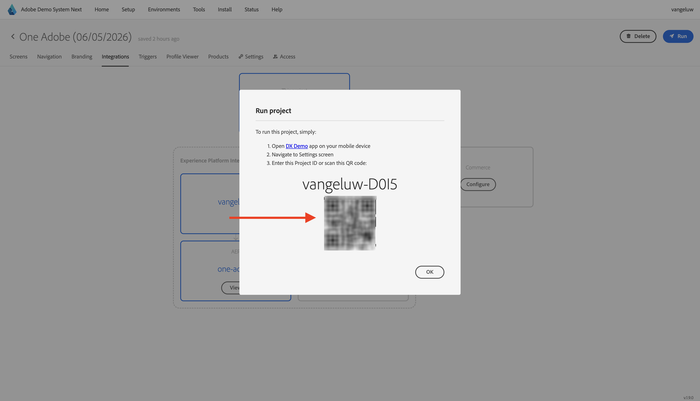

# 3.3.1 Getting Started with push notifications

In order to use push notifications with Adobe Journey Optimizer, there are a number of settings to check and know about.

Here are all the settings to verify:

- Datasets and schemas in Adobe Experience Platform
- Datastream for mobile
- Data collection property for mobile
- App surface for push certificates
- Test your push setup using AEP Assurance

Let's review these one by one.

Login to Adobe Journey Optimizer by going to [Adobe Experience Cloud](https://experience.adobe.com). Click **Journey Optimizer**.

You'll be redirected to the **Home**  view in Journey Optimizer. First, make sure you're using the correct sandbox. The sandbox to use is called `--aepSandboxName--`. You'll then be in the **Home** view of your sandbox `--aepSandboxName--`.

## 3.3.1.1 Push dataset

Adobe Journey Optimizer uses datasets to store things like the push tokens from mobile devices or interactions with push messages (such as: message sent, message opened, etc) in a dataset in Adobe Journey Optimizer.

You can find these datasets by going to **Datasets** in the menu on the left side of your screen. To show system datasets, click the **Enable filters** icon.

Enable the option for **System** and search for **AJO**. You'll then see the datasets used for push notifications.

## 3.3.1.2 Datastream for Mobile

Go to [https://experience.adobe.com/#/data-collection/](https://experience.adobe.com/#/data-collection/). 

In the left menu, go to **Datastreams** and search for your datastream that you created in [Getting Started](./../../../../modules/getting-started/gettingstarted/ex2.md), which is named `--aepUserLdap-- - One Adobe Datastream (Mobile)`. Click to open it.

Click **Edit** on the **Adobe Experience Platform** service.

You'll then see the datastream settings that were defined, and into which datasets events and profile attributes will be stored.

You should also enable the following options if they aren't enabled yet:

- **Offer Decisioning**
- **Personalization Destinations**
- **Adobe Journey Optimizer**

Click **Save**.

## 3.3.1.3 Review your Data Collection property for Mobile

Go to [https://experience.adobe.com/#/data-collection/](https://experience.adobe.com/#/data-collection/), to **Tags**. As part of the [Getting Started](./../../../../modules/getting-started/gettingstarted/ex1.md) module, Data Collection Tags properties were created. 

You've been using these Data Collection Tags properties already as part of previous modules. 

Click to open the Data Collection property for mobile.

In your Data Collection property, go to **Extensions**. You'll then see the various extensions that are needed for the mobile app. Click to select the extension **Adobe Experience Platform Edge Network** and then select **Configure**.

You'll then see that your datastream for mobile is linked here. Next, click **Cancel** to go back to the extensions overview.

You'll then be back back here. You'll see the extension for **AEP Assurance**. AEP Assurance helps you inspect, proof, simulate, and validate how you collect data or serve experiences in your mobile app. You can read more about AEP Assurance here: [https://experienceleague.adobe.com/en/docs/experience-platform/assurance/home](https://experienceleague.adobe.com/en/docs/experience-platform/assurance/home).

Next, click **Configure** to open the extension **Adobe Journey Optimizer**. This extension enables push notifications and measurement for Adobe Journey Optimizer.

You'll then see that this is where the dataset for tracking push events is linked. There's no need to make any changes to your Data Collection property. Click **Cancel** to go back to the previous screen.

## 3.3.1.4 Review your App Surface setup

Go to [https://experience.adobe.com/#/data-collection/](https://experience.adobe.com/#/data-collection/). In the left menu, go to **App Surfaces** and open the App Surface for **DX Demo App APNS**.

You'll then see the configured App Surface for iOS and Android.

## 3.3.1.5 Test push notification setup using AEP Assurance.

You already installed the **DX Demo** mobile application as part of the **Getting Started** module. Once the app is installed, you'll find it on your device's home screen. Click the icon to open the app.

When you're using the app the first time, you'll be requested to log in using your Adobe ID. Complete the login process.

After logging in, you'll see a notification requesting your permission to send notifications. We'll send notifications as part of the tutorial, so click **Allow**.

You'll then see the app's homepage. Go to **Settings**.

In settings, you'll see that currently a **Public Project** is loaded in the app. Click **Custom Project**.

You can now load a custom project. Click the QR code to easily load your project.

After going through the **Getting Started** section, you had this result. Click to open the **Mobile Retail project** that was created for you.

In case you had accidentally closed your browser window, or for future demo or enablement sessions, you can also access your website project by going to [https://dsn.adobe.com/projects](https://dsn.adobe.com/projects). After logging in with your Adobe ID, you'll see this. Click your mobile app project to open it.

Next, click **Run**.

You'll then see this popup, which contains a QR code. Scan this QR-code from within the mobile app.

You'll then see your project ID show in the app, after which you can click **Save**.

Now, go back to **Home** in the app. Your app is now ready to be used.

You now need to scan a QR code to connect your mobile device to your AEP Assurance session. 

To start an AEP Assurance session, Go to [https://experience.adobe.com/#/data-collection/](https://experience.adobe.com/#/data-collection/). Click **Assurance** in the left menu. Then, click **Create Session**.

Select **Deep link connect** and then click **Start**.

Fill out the values:

- Session Name: `--aepUserLdap-- - Push Debugging`
- Base URL: `dxdemo://default`

Click **Next**.

You'll then see a QR code on your screen, which you should scan with your iOS device.

On your mobile device, open the camera app and scan the QR code that is displayed by Assurance.

You'll then see a popup screen, asking you to enter the PIN-code. Copy the PIN-code from your AEP Assurance screen and click **Connect**.

You'll then see this.

In Assurance, you'll now see that a client device is  connected to the Assurance session. Next, click **Configure**.

Scroll down to **Push Debug**. Click the **+** icon and then click **Save**. 

Go to **Push Debug**. You should see this.

Some explanation:

- The first column, **Client**, shows the available identifiers on your iOS device. You'll see an ECID and a Push Token.
- The 2nd column shows the **App Store Credentials & Configuration**
- The second column shows **Profile** information, with additional info on what platform the Push Token lives in (APNS or APNSSandbox). If you click the **Inspect Profile** button, you'll be taken to Adobe Experience Platform and you'll see the full Real-time Customer Profile.

To test your Push configuration setup, go to **Send Test Push Setup** button. Click **Send Test Push Notification**

You need to make sure that the **DX Demo** app isn't open at the time of clicking the **Send Push Notification** button. If the app is open, the push notification might be received in the background and wouldn't be visible.

You'll then see a push notification like this one appear on your mobile device.

If you've received the push notification, that means that your setup is correct and working fine and you can now create a real journey that will result in sending a push message from Journey Optimizer. 

## Next Steps

Go to [3.3.2 Configure a journey with push messages](./ex2.md){target="_blank"}

Go back to [Adobe Journey Optimizer: Push and In-app Messages](ajopushinapp.md){target="_blank"}

Go back to [All modules](./../../../../overview.md){target="_blank"}
