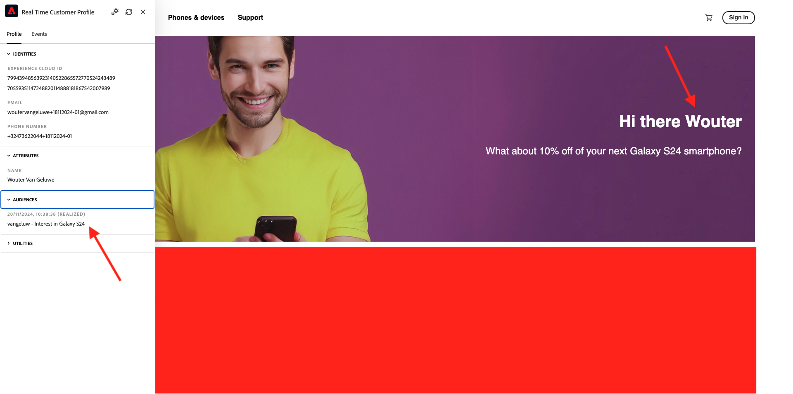
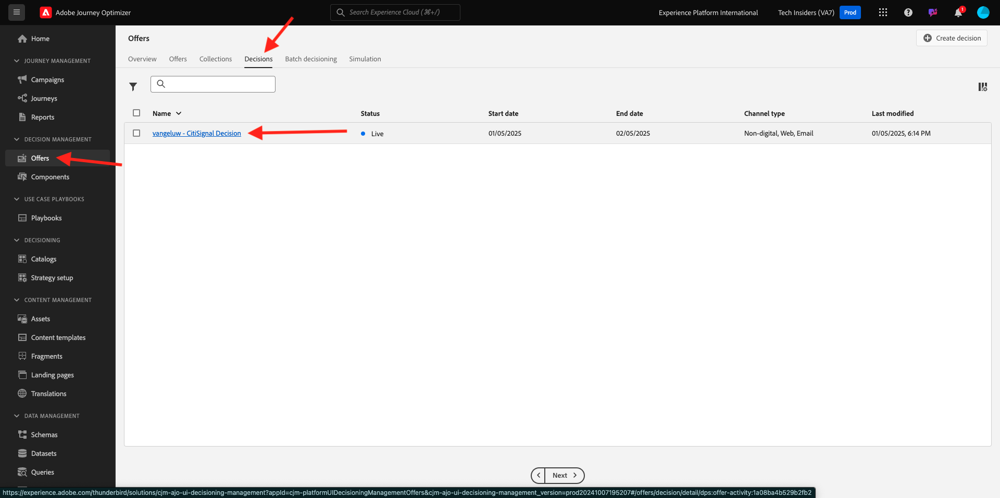
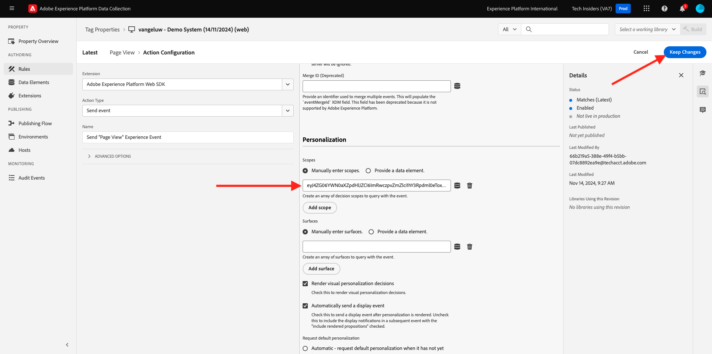
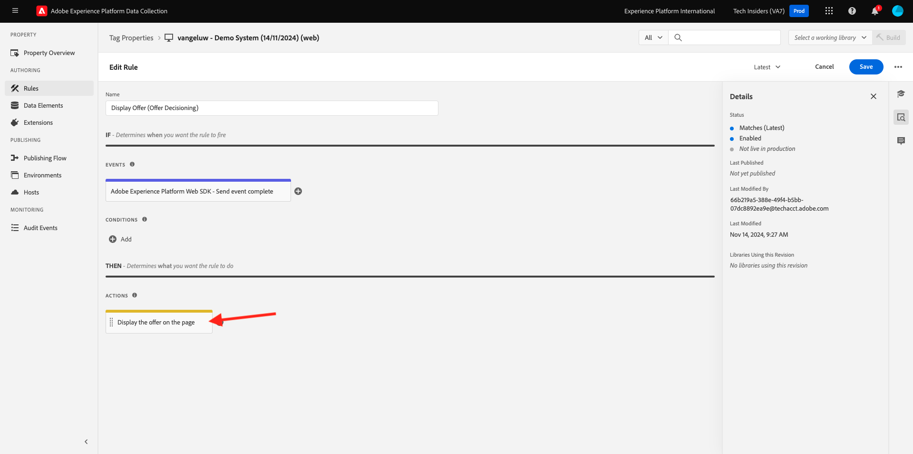
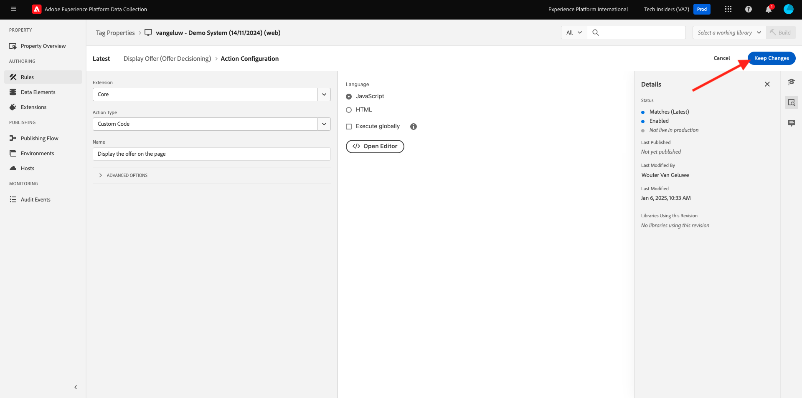
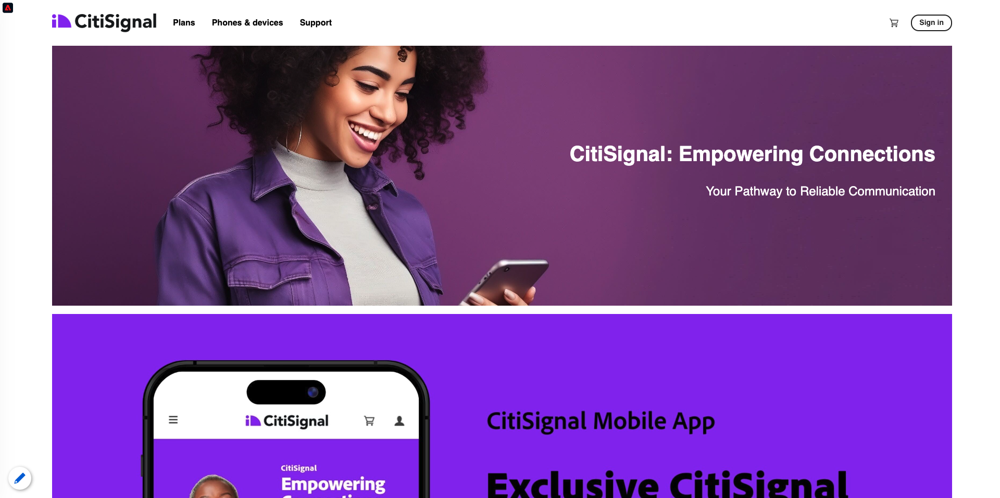

# 3.3.3 Prepare your Adobe Experience Platform Data Collection Client property and Web SDK setup for Offer Decisioning

## 3.3.3.1 Update your Datastream

In [Getting Started](./../../../../modules/getting-started/gettingstarted/ex2.md), you created your own **Datastream**. You then used the name `--aepUserLdap-- - Demo System Datastream`.

In this exercise, you need to configure that **Datastream** to work with **Offer Decisioning**.

To do that, go to [https://experience.adobe.com/#/data-collection/](https://experience.adobe.com/#/data-collection/). You'll then see this. Click **Datastream**. 

In the top right corner of your screen, select your sandbox name, which should be `--aepSandboxName--`.


Search for your **Datastream**, which is named `--aepUserLdap-- - Demo System Datastream`. Click your **Datastream** to open it. 


You'll then see this. Click **...** next to **Adobe Experience Platform** and then click **Edit**.


To enable **Offer Decisioning**, check the box for **Offer Decisioning**. Click **Save**.


Your **Datastream** is now ready to work with **Offer Decisioning**.


## 3.3.3.2 Configure your Adobe Experience Platform Data Collection Client property to request Personalized Offers

Go to [https://experience.adobe.com/#/data-collection/](https://experience.adobe.com/#/data-collection/), to **Tags**. Search for your Data Collection properties, which are named `--aepUserLdap-- - Demo System (DD/MM/YYYY)`. Open your Data Collection client property for web.


In you property, go to **Rules** and open the rule **Page View**. 


Click to open the Action **Send "Page View" Experience Event**.


You'll then see this. Under **Personalization**, you'll notice the option for **Scopes**.


For every request sent to the edge and to Adobe Experience Platform, it's possible to provide one or more **Decision Scopes**. A **Decision Scope** is a combination of two elements:

- Decision ID
- Placement ID

Let's first have a look where you can find those two elements.

### 3.3.3.2.1 Retrieve your Placement ID

The Placement ID identifies the location and type of asset that is required. For instance, the hero image on the CitiSignal website homepage corresponds with the Placement ID for Web - Image.

>[!NOTE]
>
>As part of exercise 2.3.5, you already configured an Adobe Target Experience Targeting activity that will change the image of the hero location on the homepage, as you can see in the screenshot. For this exercise, you'll now make your offers appear on the image below the hero image as indicated in the screenshot. 



To find the Placement ID for Web - Image go to Adobe Journey Optimizer by going to [Adobe Experience Cloud](https://experience.adobe.com). Click **Journey Optimizer**.


You'll be redirected to the **Home**  view in Journey Optimizer. First, make sure you're using the correct sandbox. The sandbox to use is called `--aepSandboxName--`. You'll then be in the **Home** view of your sandbox `--aepSandboxName--`.


Next, go to Components and then to Placements. Click the **Web - Image** placement to see its details.


As you can see in the above image, in this example the Placement ID is `dps:offer-placement:1a08a14ccfe533b6`. Write down the Placement ID for your placement for Web - Image as you'll need it in the next exercise.

### 3.3.3.2.2 Retrieve your Offer decision ID

The **Offer decision ID** identifies which combination of Personalized Offers and Fallback Offer you'd like to use. In the previous exercise, you created your own Decision and named it `--aepUserLdap-- - CitiSignal Decision`.

To find the Offer decision ID for your `--aepUserLdap-- - CitiSignal Decision`, go to Offers and then go to Decisions. Click to select your Decision, which is named `--aepUserLdap-- - CitiSignal Decision`.


As you can see in the above image, in this example the Decision ID is `dps:offer-activity:1a08ba4b529b2fb2`. Write down the Offer decision ID for your decision `--aepUserLdap-- - CitiSignal Decision` as you'll need it in the next exercise.

Now that you've retrieved the two elements you need to create a **Decision Scopes**, you can continue with the next step, which involves encoding the decision scope.

### 3.3.3.2.3 BASE64 Encoding

The **Decision Scope** you need to enter is a BASE64-encoded string. This BASE64-encoded string is a combination of the Placement ID and the Decision ID as you can see below:

```json
{
  "xdm:activityId": "dps:offer-activity:1a08ba4b529b2fb2",
  "xdm:placementId": "dps:offer-placement:1a08a14ccfe533b6"
}
```

You can retrieve the BASE64-encoded string from Adobe Experience Platform. Go to Decisions and click to open your Decision, which is named `--aepUserLdap-- - CitiSignal Decision`.


  
After opening `--aepUserLdap-- - CitiSignal Decision`, you'll see this. Locate the placement Web - Image and click the **Copy** button. Next, click **Encoded decision scope**. The **Decision Scope** is now copied to your clipboard.
    


Next, go back to Launch, to your action **AEP Web SDK - Send Event**.


Paste your encoded decision scope in the input field. Save your changes in the action **AEP Web SDK - Send Event** by clicking **[!UICONTROL Keep Changes]**.



Next, click **[!UICONTROL Save]**.


In Adobe Experience Platform Data Collection, go to **[!UICONTROL Publishing Flow]** and open your **[!UICONTROL Development Library]** which is named **[!UICONTROL Main]**. Click **[!UICONTROL + Add All Changed Resources]** and then click **[!UICONTROL Save & Build for Development]**. Your changes will now be published to your demo website.


Every time you're loading a **General Page** now, like for instance the homepage of the demo website, Offer Decisioning will evaluate what the applicable offer is and will return a response back to the website with the details of the the offer to show. Showing the offer on the website requires additional configuration, which you'll do in the next step.

## 3.3.3.3 Configure your Adobe Experience Platform Data Collection Client property to receive and apply Personalized Offers

Go to [https://experience.adobe.com/#/data-collection/](https://experience.adobe.com/#/data-collection/), to **[!UICONTROL Properties]**. Search for your Data Collection properties, which are named `--aepUserLdap-- - Demo System (DD/MM/YYYY)`. Open your Data Collection property for web.


In you property, go to **Rules**. Search and open the rule **Display Offer (Offer Decisioning)**.


You'll then see this. Open the action **Display the offer on the page**.



Click **[!UICONTROL Open Editor]**


Overwrite the code by pasting the below code in the editor.

```javascript
if (!Array.isArray(event.decisions)) {
  console.log("No personalization decisions");
  return;
}

console.log("Received response from Offer Decisioning", event.decisions);

event.decisions.forEach(function (payload) {
  payload.items.forEach(function (item) {
    console.log("Offer", item.data.deliveryURL);

    if (!item.data || item.data?.deliveryURL==null) {
      return;
    }
    console.log("item.data.deliveryURL", item.data.deliveryURL)
    //document.querySelector(".TopRibbon").innerHTML = item.data.content;
    document.querySelector("#SpectrumProvider > div.App > div > div.Page.home > main > div:nth-child(2)").innerHTML = "";
    document.querySelector("#SpectrumProvider > div.App > div > div.Page.home > main > div:nth-child(2) > img").style.backgroundRepeat="no-repeat";
    document.querySelector("#SpectrumProvider > div.App > div > div.Page.home > main > div:nth-child(2) > img").style.backgroundPosition="center center";
    document.querySelector("#SpectrumProvider > div.App > div > div.Page.home > main > div:nth-child(2) > img").style.backgroundSize = "contain";
  });
});
```

Lines 17 will apply the image that's being returned by Offer Decisioning to the website. Click **[!UICONTROL Save]**.


Click **[!UICONTROL Keep Changes]**.



Next, click **[!UICONTROL Save]**.


In Adobe Experience Platform Data Collection, go to **[!UICONTROL Publishing Flow]** and open your **[!UICONTROL Development Library]** which is named **[!UICONTROL Main]**. Click **[!UICONTROL + Add All Changed Resources]** and then click **[!UICONTROL Save & Build for Development]**. Your changes will now be published to your demo website.


With this change, this rule in Adobe Experience Platform Data Collection will now be listening to the response from Offer Decisioning which is part of the Web SDK response, and when the response is received, the image of the offer will be displayed on the homepage.

Looking at the demo website, you'll see that this image will be replaced now. Instead of the default CitiSignal website images, you will now see an offer like this one. In this case, the fallback offer is displayed.



You've now configured 2 types of personalization:

- 1 Experience Targeting activity using Adobe Target in exercise 2.3.5
- 1 Offer decisioning implementation using your Data Collection property

In the next exercise you'll see how you can combine your offers and decisions that were created in Adobe Journey Optimizer with an Adobe Target Experience Targeting activity.

## Next Steps

Go to [3.3.4 Combine Adobe Target and Offer Decisioning](./ex4.md){target="_blank"}

Go back to [Offer Decisioning](offer-decisioning.md){target="_blank"}

Go back to [All modules](./../../../../overview.md){target="_blank"}
