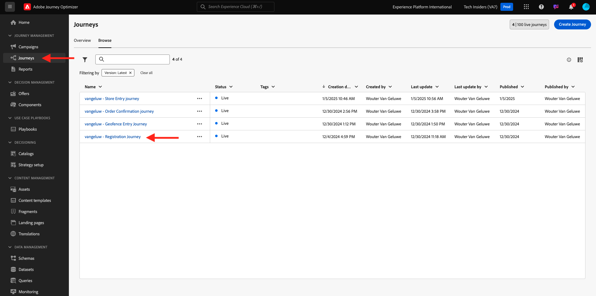
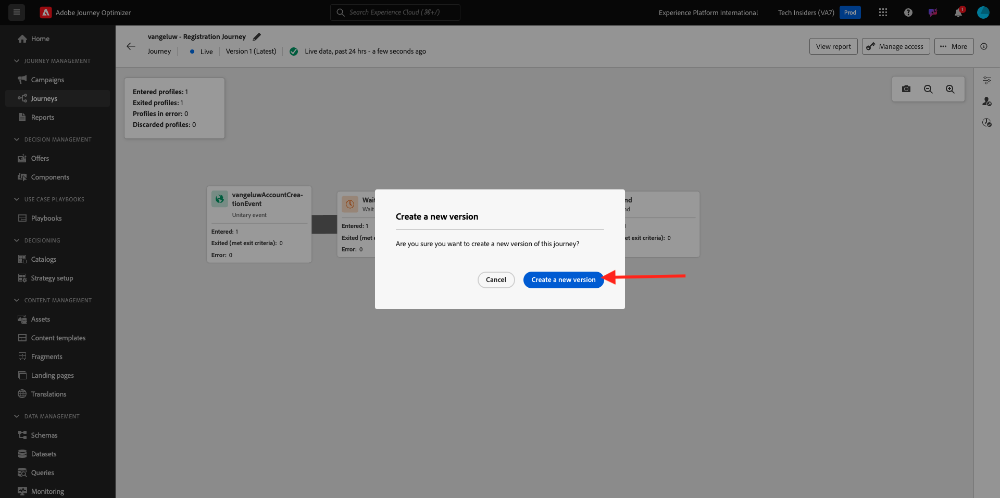
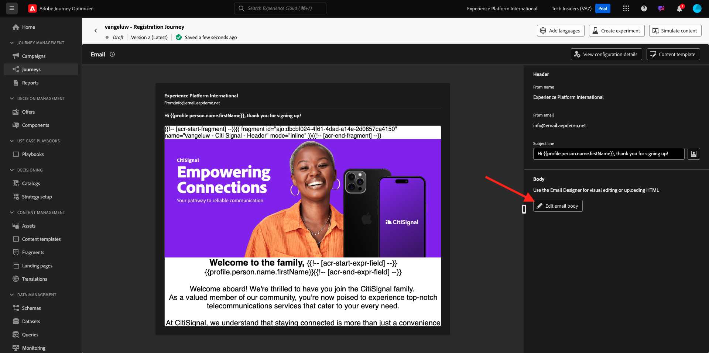
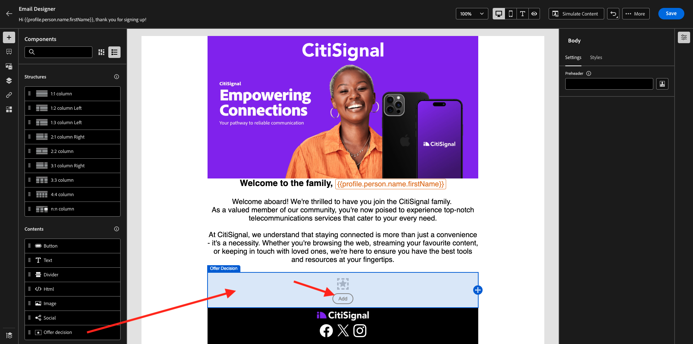
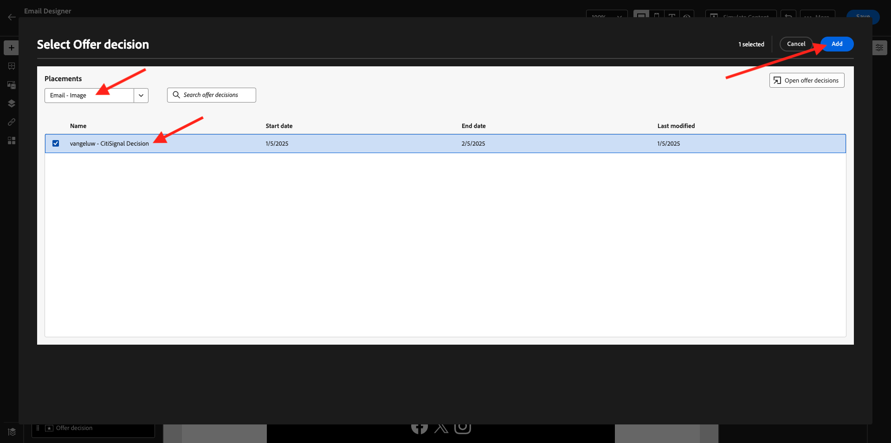
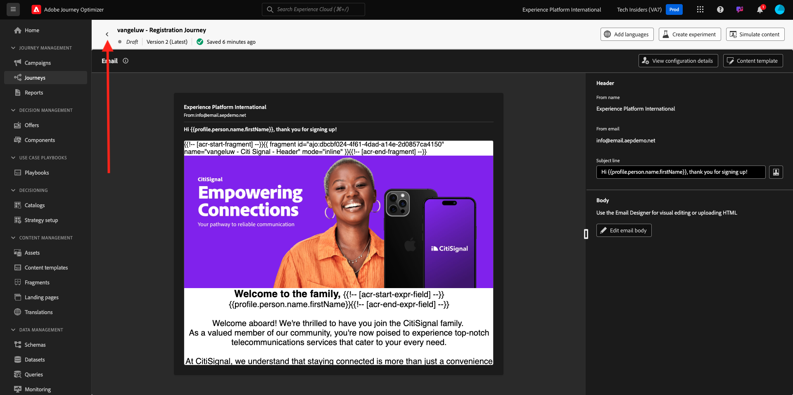
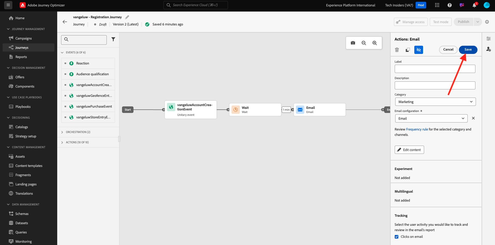
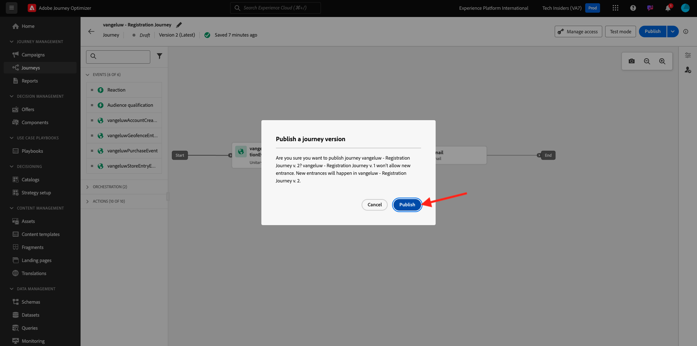
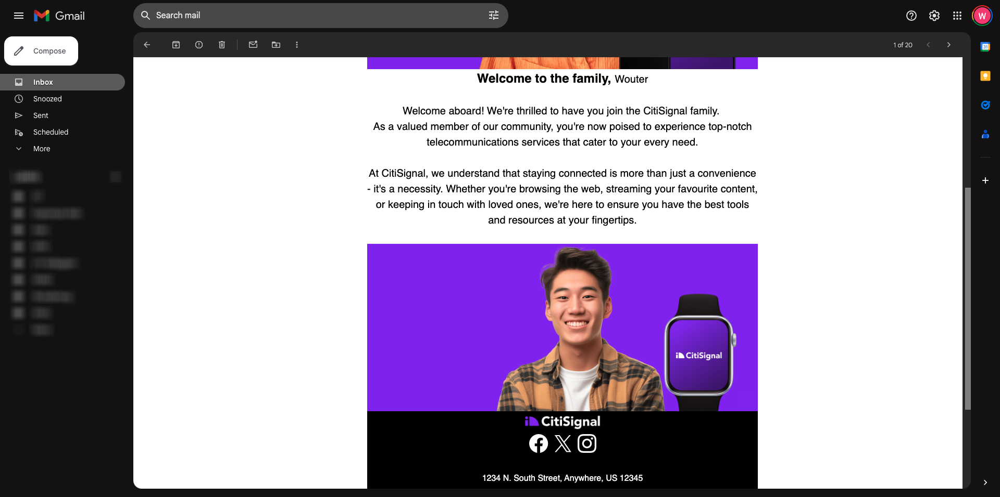

# 3.3.5 Use your decision in an email

In this exercise, you'll use your decision to personalize the delivery of an email and SMS.

Go to **Journeys**. Find the journey you created in exercise 3.1.3, which is named `--aepUserLdap-- - Registration Journey`. Click your journey to open it. 

You'll then see this. Click **... More** and then click **Create a new version**.

Click **Create a new version**.

Click the **Email** action and then click **Edit content**.

You'll then see the message dashboard. Click **Edit email body**.

You'll then see this. Drag a new **1:1 column** structure component onto the canvas.

In the menu, go to **Contents**. Select the **Offer decision** component and drag and drop this component in the email's content offer placeholder as indicated. Then, click **Add**.

Select the type of placement that you want to include in the email. In the **Placements** dropdown menu select **Email - Image**, then select your decision `--aepUserLdap-- - CitiSignal Decision`. Click **Add**.

You can now cycle through all personalized offers and the fallback offer, all of them being visualized inside the email designer. Click **Save**.

Now, click the arrow to go back to the previous screen.

Click the arrow in the top left corner to go back to your journey.

Click **Save** to close your **Email** action.

Click **Publish** to publish your updated journey.

Confirm by clicking **Publish** again.

Your message is now published.

When you create a new account on the demo website, you'll now get this email:

You have finished this exercise. 

## Next Steps

Go to [3.3.6 Test your Decision using the API](./ex6.md){target="_blank"}

Go back to [Offer Decisioning](offer-decisioning.md){target="_blank"}

Go back to [All modules](./../../../../overview.md){target="_blank"}
