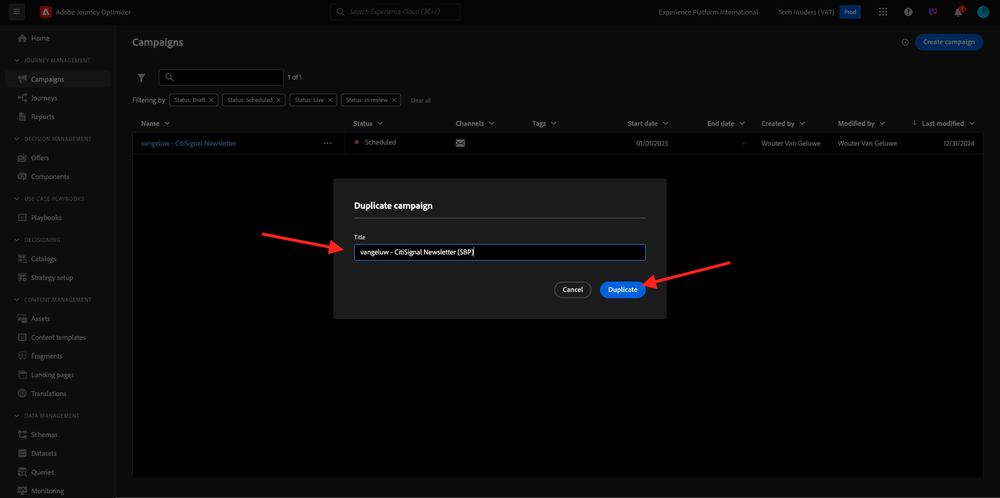
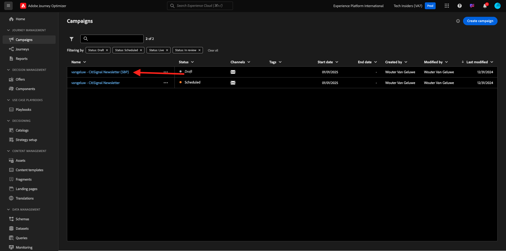
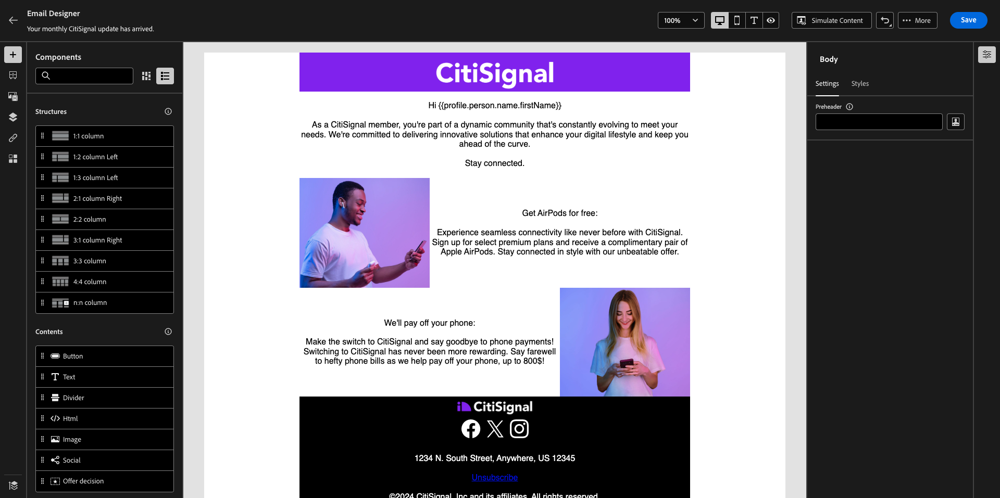
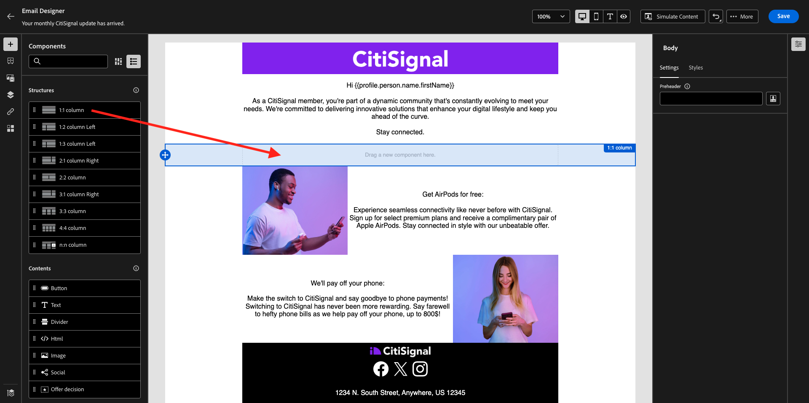
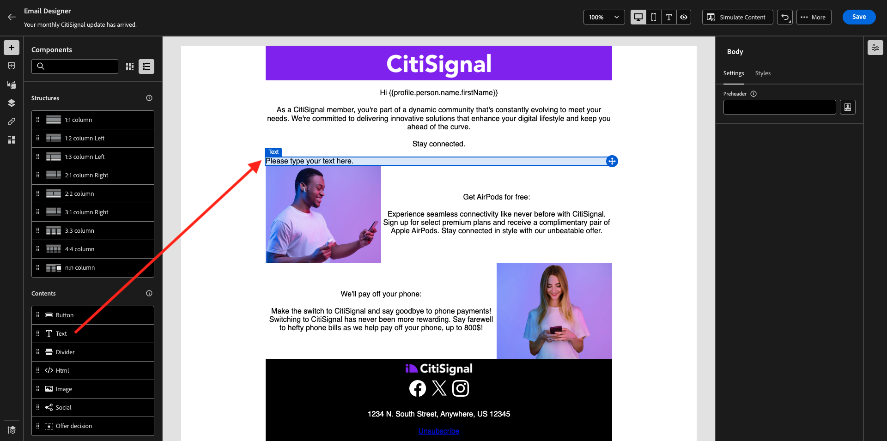
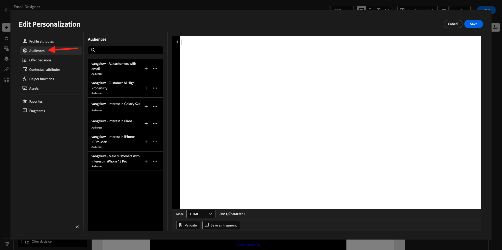
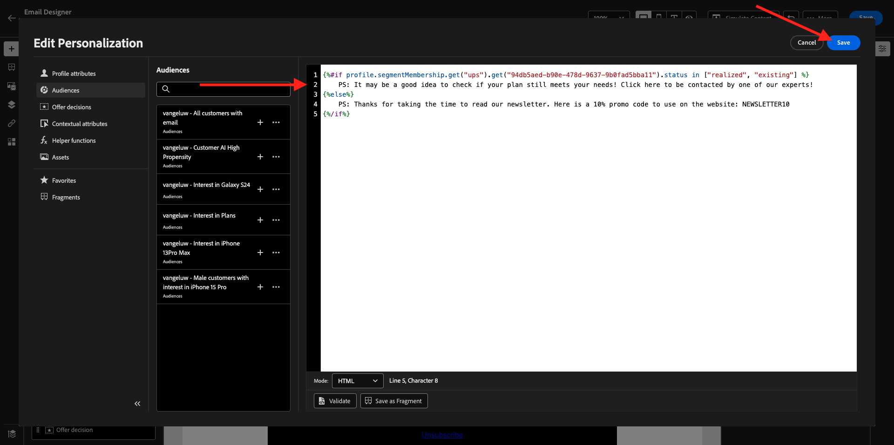
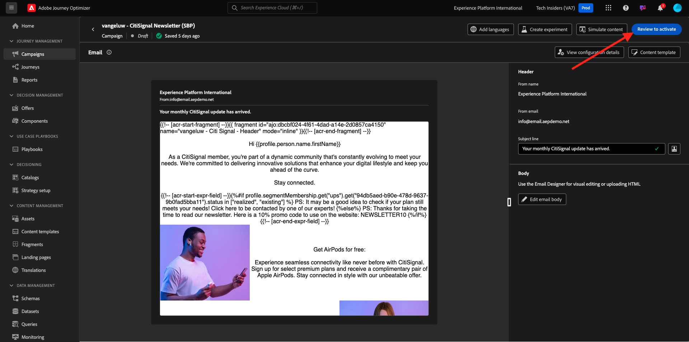

# 3.4.3 Apply segment-based personalization in an email message

Login to Adobe Experience Cloud by going to [Adobe Experience Cloud](https://experience.adobe.com). Click **Adobe Journey Optimizer**.

You'll be redirected to the **Home** view in Journey Optimizer. Before you continue, you need to select a **sandbox**. The sandbox to select is named ``--aepTenantId--``. 

## 3.4.3.1 Segment-based personalization

In this exercise you'll improve the newsletter email message that you created in the previous exercise with a personalized text based on segment membership.

Go to **Campaigns**. Find the newsletter journey that you have created in the previous exercise. Search for `--aepUserLdap-- - CitiSignal Newsletter`. Right-click on the 3 dots **...** and click **Duplicate**.

You'll then see this. Use this for the **Title**: `--aepUserLdap-- - CitiSignal Newsletter (SBP)`. Click **Duplicate**. 

Click the duplicated campaign to open it.

Click **Edit** to change the content.

Click **Edit email body**.

You'll then see this.

Open **Content Components** and drag a **1:1 column** above the AirPods offer. 

Drag and drop a **Text** component into that 1:1 column.

Select the whole default text and delete it. Then click on the **Add personalization** button in the toolbar.

You'll then see this. In the left menu, click **Audiences**.

Select the segment `--aepUserLdap-- - Interest in Plans` and click the **+** icon to add it to the canvas.

You should then leave the first line as it is, and replace line 2 and 3 by this code:

``
    PS: It may be a good idea to check if your plan still meets your needs! Click here to be contacted by one of our experts!

    PS: Thanks for taking the time to read our newsletter. Here is a 10% promo code to use on the website: NEWSLETTER10

``

You'll then have this. Click **Save**.

Change the text alignment to **Center alignment**. 

You can now save this message by clicking the **Save** button in the top-right corner. Then, click **arrow** next to the subject line text in the top-left corner.

Click **Review to activate**.

Click **Activate**.

Your newsletter with segment-based personalization is now published. Your newsletter email message will be sent based on your schedule and your journey will stop as soon as the last email has been sent.

If you qualify for the segment that was used, you'll see this in the email that you'll receive:

You have finished this exercise.

## Next Steps

Go to [3.4.4 Setup and use push notifications for iOS](./ex4.md){target="_blank"}

Go back to [Adobe Journey Optimizer](journeyoptimizer.md){target="_blank"}

Go back to [All modules](./../../../../overview.md){target="_blank"}