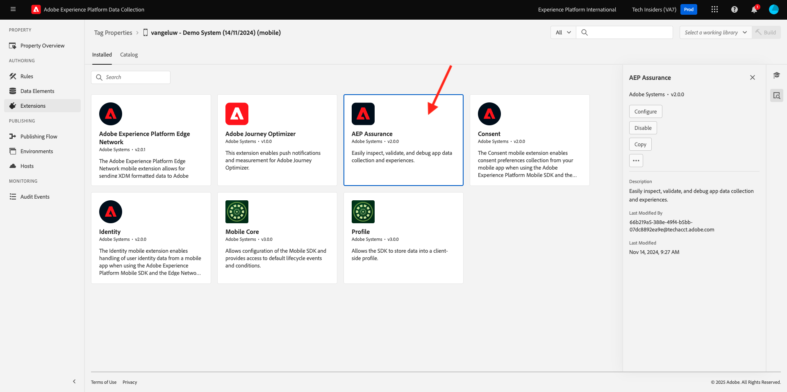
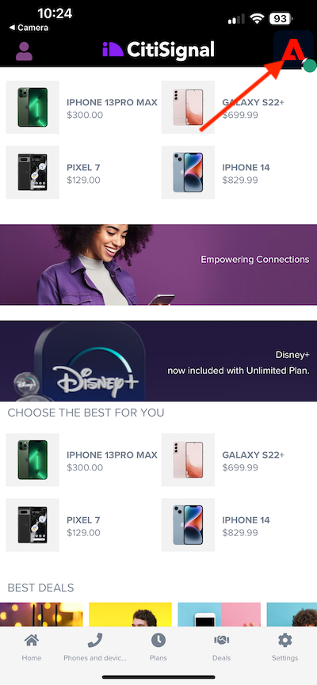
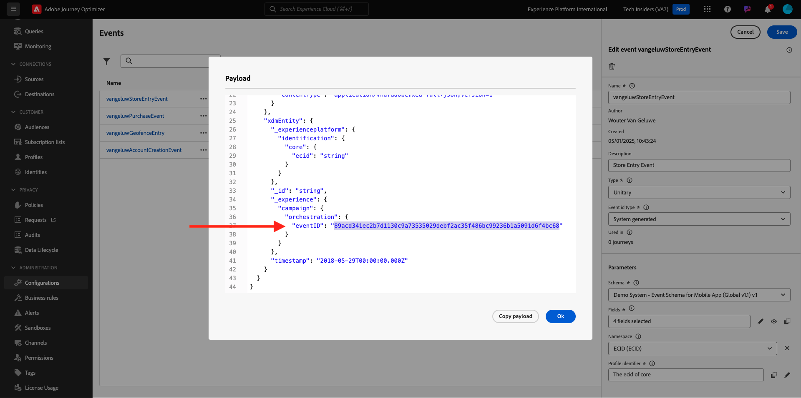

# 3.4.4 Setup and use push notifications for iOS

In order to use push notifications with Adobe Journey Optimizer, there are a number of settings to check and know about.

Here are all the settings to verify:

- Datasets and schemas in Adobe Experience Platform
- Datastream for mobile
- Data collection property for mobile
- App surface for push certificates
- Test your push setup using AEP Assurance

Let's review these one by one.

Login to Adobe Journey Optimizer by going to [Adobe Experience Cloud](https://experience.adobe.com). Click **Journey Optimizer**.

You'll be redirected to the **Home**  view in Journey Optimizer. First, make sure you're using the correct sandbox. The sandbox to use is called `--aepSandboxName--`. You'll then be in the **Home** view of your sandbox `--aepSandboxName--`.

## 3.4.4.1 Push dataset

Adobe Journey Optimizer uses datasets to store things like the push tokens from mobile devices or interactions with push messages (such as: message sent, message opened, etc) in a dataset in Adobe Journey Optimizer.

You can find these datasets by going to **[!UICONTROL Datasets]** in the menu on the left side of your screen. To show system datasets, click the filter icon.

Enable the option **Show system datasets** and search for **AJO**. You'll then see the datasets used for push notifications.

## 3.4.4.2 Datastream for Mobile

Go to [https://experience.adobe.com/#/data-collection/](https://experience.adobe.com/#/data-collection/). 

In the left menu, go to **[!UICONTROL Datastream]** and search for your datastream that you created in [Getting Started](./../../../../modules/getting-started/gettingstarted/ex2.md), which is named `--aepUserLdap-- - Demo System Datastream (Mobile)`. Click to open it.

Click **Edit** on the **Adobe Experience Platform** service.

You'll then see the datastream settings that were defined, and into which datasets events and profile attributes will be stored.

You should also enable the following options if they aren't enabled yet:

- **Offer Decisioning**
- **Personalization Destinations**
- **Adobe Journey Optimizer**

Click **Save**.

## 3.4.4.3 Review your Data Collection property for Mobile

Go to [https://experience.adobe.com/#/data-collection/](https://experience.adobe.com/#/data-collection/). As part of [Getting Started](./../../../../modules/getting-started/gettingstarted/ex1.md), 2 Data Collection properties were created. 
You've been using these Data Collection Client properties already as part of previous modules. 

Click to open the Data Collection property for mobile.

In your Data Collection property, go to **Extensions**. You'll then see the various extensions that are needed for the mobile app. Click to open the extension **Adobe Experience Platform Edge Network**.

You'll then see that your datastream for mobile is linked here. Next, click **Cancel** to go back to your extensions overview.

You'll then be back back here. You'll see the extension for **AEP Assurance**. AEP Assurance helps you inspect, proof, simulate, and validate how you collect data or serve experiences in your mobile app. You can read more about AEP Assurance and Project Griffon here [https://aep-sdks.gitbook.io/docs/beta/project-griffon](https://aep-sdks.gitbook.io/docs/beta/project-griffon).

Next, click **Configure** to open the extension **Adobe Journey Optimizer**.

You'll then see that this is where the dataset for tracking push events is linked.

There's no need to make any changes to your Data Collection property.

## 3.4.4.4 Review your App Surface setup

Go to [https://experience.adobe.com/#/data-collection/](https://experience.adobe.com/#/data-collection/). In the left menu, go to **App Surfaces** and open the App Surface for **DX Demo App APNS**.

You'll then see the configured App Surface for iOS and Android.

## 3.4.4.5 Test push notification setup using AEP Assurance.

Once the app is installed, you'll find it on your device's home screen. Click the icon to open the app.

When you're using the app the first time, you'll be requested to log in using your Adobe ID. Complete the login process.

After logging in, you'll see a notification requesting your permission to send notifications. We'll send notifications as part of the tutorial, so click **Allow**.

You'll then see the app's homepage. Go to **Settings**.

In settings, you'll see that currently a **Public Project** is loaded in the app. Click **Custom Project**.

You can now load a custom project. Click the QR code to easily load your project.

After going through the **Getting Started** section, you had this result. Click to open the **Mobile Retail project** that was created for you.

In case you had accidentally closed your browser window, or for future demo or enablement sessions, you can also access your website project by going to [https://dsn.adobe.com/projects](https://dsn.adobe.com/projects). After logging in with your Adobe ID, you'll see this. Click your mobile app project to open it.

Next, click **Run**.

You'll then see this popup, which contains a QR code. Scan this QR-code from within the mobile app.

You'll then see your project ID show in the app, after which you can click **Save**.

Now, go back to **Home** in the app. Your app is now ready to be used.

You now need to scan a QR code to connect your mobile device to your AEP Assurance session. 

To start an AEP Assurance session, Go to [https://experience.adobe.com/#/data-collection/](https://experience.adobe.com/#/data-collection/). Click **Assurance** in the left menu. Then, click **Create Session**.

Click **Start**.

Fill out the values:

- Session Name: use `--aepUserLdap-- - push debugging` and replace ldap by your ldap
- Base URL: use `dxdemo://default`

Click **Next**.

You'll then see a QR code on your screen, which you should scan with your iOS device.

On your mobile device, open the camera app and scan the QR code that is displayed by AEP Assurance.

You'll then see a popup screen, asking you to enter the PIN-code. Copy the PIN-code from your AEP Assurance screen and click **Connect**.

You'll then see this.

In Assurance, you'll now see that a devicer is to the Assurance session. Click **Done**.

Go to **Push Debug**. 

>[!NOTE]
>
>In case you can't find **Push Debug** in the left menu, click **Configure** in the bottom left corner of your screen and add **Push Debug** to the menu. 

You'll see something like this.

Some explanation:

- The first column, **Client**, shows the available identifiers on your iOS device. You'll see an ECID and a Push Token.
- The 2nd column shows the **App Store Credentials & Configuration**, which was set up as part of exercise **3.4.5.4 Create App Configuration in Launch**
- The second column shows **Profile** information, with additional info on what platform the Push Token lives in (APNS or APNSSandbox). If you click the **Inspect Profile** button, you'll be taken to Adobe Experience Platform and you'll see the full Real-time Customer Profile.

To test your Push configuration setup, go to **Send Test Push Setup** button. Click **Send Test Push Notification**

You need to make sure that the **DX Demo** app isn't open at the time of clicking the **Send Push Notification** button. If the app is open, the Push Notification might be received in the background and wouldn't be visible.

You'll then see a push notification like this one appear on your mobile device.

If you've received the push notification, that means that your setup is correct and working fine and you can now create a real journey that will result in sending a push message from Journey Optimizer. 

## 3.4.4.6 Create a new event

Go to **Journey Optimizer**. In the left menu, go to **Configurations** and click **Manage** under **Events**.

On the **Events** screen, you'll see a view similar to this. Click **Create Event**.

You'll then see an empty event configuration.
First of all, give your Event a Name like this: `--aepUserLdap--StoreEntryEvent` and set description to `Store Entry Event`.
Next is the **Event Type** selection. Select **Unitary**.
Next is the **Event ID Type** selection. Select **System Generated**.

Next is the Schema selection. A schema was prepared for this exercise. Please use the schema `Demo System - Event Schema for Mobile App (Global v1.1) v.1`.

After selecting the Schema, you'll see a number of fields being selected in the **Payload** section. Your event is now fully configured.

Click **Save**.

Your Event is now configured and saved. Click on your event again to open up the **Edit Event** screen again.

Hover over the **Payload** field and click on the **View Payload** icon.

You'll now see an example of the expected payload.

Your Event has a unique orchestration eventID, which you can find by scrolling down in that payload until you see `_experience.campaign.orchestration.eventID`.

The event ID is what needs to be sent to Adobe Experience Platform in order to trigger the Journey that you'll build in the next step. Write down this eventID, as you'll need it in the next step.
`"eventID": "89acd341ec2b7d1130c9a73535029debf2ac35f486bc99236b1a5091d6f4bc68"`

Click **Ok**, followed by **Cancel**.

## 3.4.4.7 Create a journey

In the menu, go to **Journeys** and click **Create Journey**.

You'll then see this. Give your journey a name. Use `--aepUserLdap-- - Store Entry journey`. Click **Save**.

First, you need to add your event as the starting point of your journey. Search for your event `--aepUserLdap--StoreEntryEvent` and drag and drop it onto the canvas. Click **Save**.

Next, under **Actions**, search for the **Push** action. Drag and drop the **Push** action onto the canvas.

Set the **Category** to **Marketing** and select a push surface that enables you to send push notifications. In this case, the email surface to select is **Push-iOS-Android**.

>[!NOTE]
>
>A Channel in Journey Optimizer needs to exist that is using the **App Surface** as reviewed before.

The next step is to create your message. To do that, click **Edit content**.

You'll then see this. Click the **personalization** icon for the **Title** field.

You'll then see this. You can now select any Profile attribute from the Real-time Customer Profile directly.

Search for the field **First Name**, then click the **+** icon next to the field **First Name**. You'll then see the personalization token for First Name being added: **{{profile.person.name.firstName}}**.

Next, add the text **, welcome to our store!** behind **{{profile.person.name.firstName}}**.

Click **Save**.

You now have this. Click the **personalization** icon for the **Body** field.

Enter this text **Click here to get a 10% discount when you buy today!** and click **Save**.

You'll then have this. Click the arrow in the top left corner to go back to your journey.

Click **Save** to close your push action.

Click **Publish**.

Click **Publish** again.

Your journey is now published.

## 3.4.4.8 Test your journey and push message

In your DX Demo 2.0 mobile application, go to the **Settings** screen. Click the **Store Entry** button.

>[!NOTE]
>
>The **Store Entry** button is currently being implemented. You won't yet find it in the app.

Make sure to close the app immediately after clicking the **Store Entry** icon, otherwise the push message won't be shown.

After a couple of seconds, you'll see the message appear.

You have finished this exercise.

## Next Steps

Go to [Summary and benefits](./summary.md){target="_blank"}

Go back to [Adobe Journey Optimizer](journeyoptimizer.md){target="_blank"}

Go back to [All modules](./../../../../overview.md){target="_blank"}
