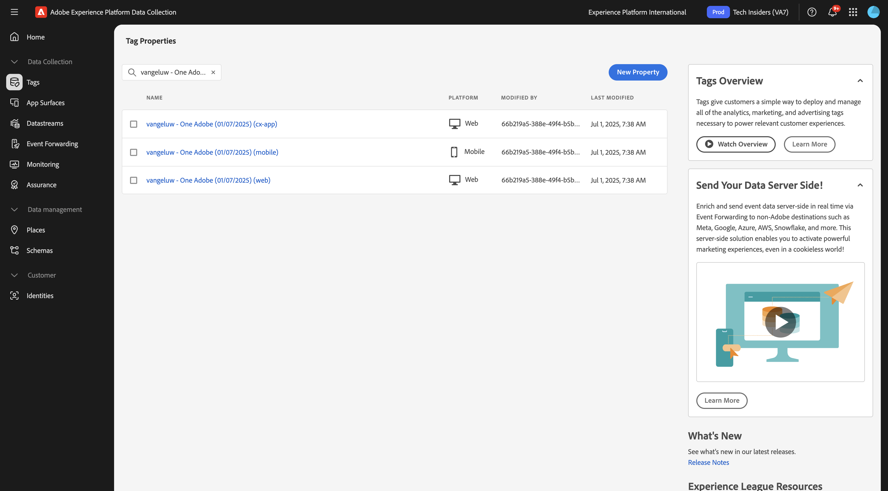

# 3.7.3 Web SDK setup for Experience Decisioning

## 3.7.3.1 Update your Datastream

In [Getting Started](./../../../../modules/getting-started/gettingstarted/ex2.md), you created your own **Datastream**. You then used the name `--aepUserLdap-- - Demo System Datastream`.

## 3.7.3.2 Configure your Adobe Experience Platform Data Collection Client property to request Personalized Offers

Go to [https://experience.adobe.com/#/data-collection/](https://experience.adobe.com/#/data-collection/), to **Tags**. Search for your Data Collection properties, which are named `--aepUserLdap-- - Demo System (DD/MM/YYYY)`. Open your Data Collection client property for web.

## 3.7.3.3 Configure your Adobe Experience Platform Data Collection Client property to receive and apply Personalized Offers

Go to [https://experience.adobe.com/#/data-collection/](https://experience.adobe.com/#/data-collection/), to **[!UICONTROL Properties]**. Search for your Data Collection properties, which are named `--aepUserLdap-- - Demo System (DD/MM/YYYY)`. Open your Data Collection property for web.

In the next exercise you'll see how you can combine your offers and decisions that were created in Adobe Journey Optimizer with an Adobe Target Experience Targeting activity.

## Next Steps

Go to [Summary & Benefits](./summary.md){target="_blank"}

Go back to [Experience Decisioning](ajo-decisioning.md){target="_blank"}

Go back to [All modules](./../../../../overview.md){target="_blank"}
