# 3.8.1 Setting up your relational data foundation

Login to Adobe Journey Optimizer by going to [https://experience.adobe.com](https://experience.adobe.com). Click **Journey Optimizer**.

You'll be redirected to the **Home**  view in Journey Optimizer. First, make sure you're using the correct sandbox. The sandbox to use is called `--aepSandboxName--`.

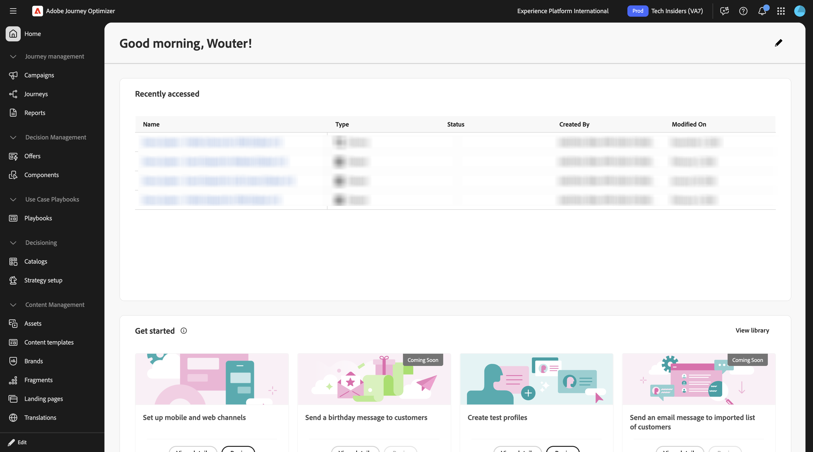

## 3.8.1.1 Relational-based schema setup

A relational-based schema is the formal definition of the model-based data model.

It specifies:

- The set of tables
- The columns in each table
- The constraints
- The relationships across tables

Organizing schemas or tables in a model-based data model is about structuring your data into multiple tables. Ensure each table stores one type of entity/schemas.

When ingesting data into for usage with Adobe Journey Optimizer Orchestrated Campaigns, the following sources are available:

- Amazon S3
- Google Cloud Storage
- SFTP
- Snowflake
- Google BigQuery
- Data Landing Zone
- Azure Databricks
- Local File Upload

The first step in this exercise is the configuration of your relational-based XDM schemas. In the left menu, scroll down to **Data Management** and select **Schemas**. Click **+ Create schema**.

Select **Relational**.

Select **Upload DDL file** and then click **Choose files**.

Download the file [citisignal_ddl_tables_only.sql](./assets/citisignal_ddl_tables_only.sql) to your desktop. 

Select the file **`citisignal_ddl_tables_only.sql`** and click **open**.

You should then see this. Click **Next**.

### Identity

Some of your schemas contain personal identifiers and those fields shuold be marked as **Identity**, and you need to select the **Namespace** that is applicable to that specific type of identity.

**`citisignal_accounts`**

For this schema, go to the field **account_id** and set the **Identity** type to **Demo System - CRMID**.

**`citisignal_recipients`**

For this schema, go to the field **account_id** and set the **Identity** type to **Demo System - CRMID** and go to the field **email** and set the **Identity** type to **Email**.

### Versioning

In order to keep track of updates to the data that will be ingested against these schemas, it is required to set a field that will be used to keep track of the version of the uploaded data. The field that is used for this in all these schemas is the field **lastmodified**, which contains a timestamp of the uploaded data.

You now need to check the checkbox for **Versioning** for the field **lastmodified** in each of these schemas.

**`citisignal_products`**

Check the checkbox for **Versioning** for the field **lastmodified**.

**`citisignal_product_bundles`**

Check the checkbox for **Versioning** for the field **lastmodified**.

**`citisignal_product_relationships`**

Check the checkbox for **Versioning** for the field **lastmodified**.

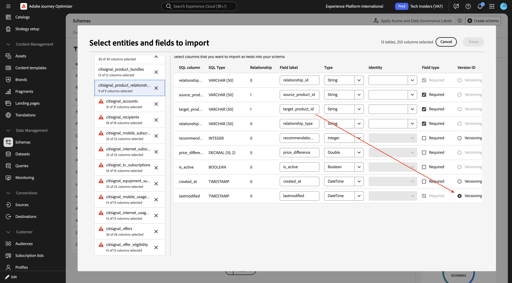

**`citisignal_accounts`**

Check the checkbox for **Versioning** for the field **lastmodified**.

**`citisignal_recipients`**

Check the checkbox for **Versioning** for the field **lastmodified**.

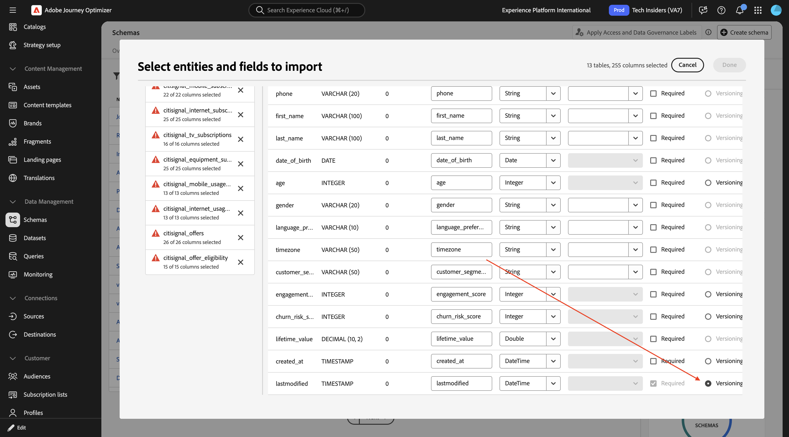

**`citisignal_mobile_subscriptions`**

Check the checkbox for **Versioning** for the field **lastmodified**.

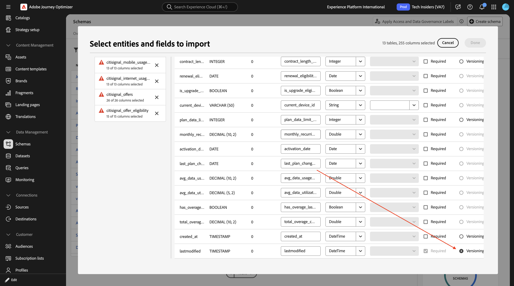

**`citisignal_internet_subscriptions`**

Check the checkbox for **Versioning** for the field **lastmodified**.

**`citisignal_tv_subscriptions`**

Check the checkbox for **Versioning** for the field **lastmodified**.

**`citisignal_equipment_subscriptions`**

Check the checkbox for **Versioning** for the field **lastmodified**.

**`citisignal_mobile_usage_summary`**

Check the checkbox for **Versioning** for the field **lastmodified**.

**`citisignal_internet_usage_summary`**

Check the checkbox for **Versioning** for the field **lastmodified**.

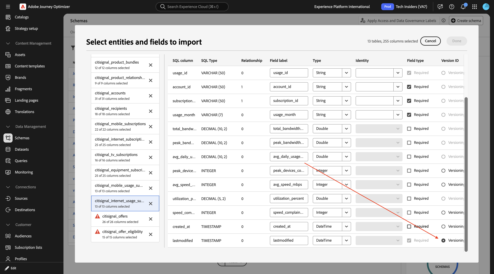

**`citisignal_offers`**

Check the checkbox for **Versioning** for the field **lastmodified**.

**`citisignal_offer_eligibility`**

Check the checkbox for **Versioning** for the field **lastmodified**.

### Schema name

WHen ingesting these schemas for enablement purposes in a shared sandbox, it is required to change the name of each schema so that it's unique in that specific sandbox. The reason for making this change is to avoid schema naming conflicts.

For this lab, you should add your LDAP in front of each schema name, which means that every schema name should have this prefix: `--aepUserLdap--_`

**`citisignal_products`**

Change the name of your schema to`--aepUserLdap--_ citisignal_products`.

**`citisignal_product_bundles`**

Change the name of your schema to`--aepUserLdap--_ citisignal_product_bundles`.

**`citisignal_product_relationships`**

Change the name of your schema to`--aepUserLdap--_ citisignal_product_relationships`.

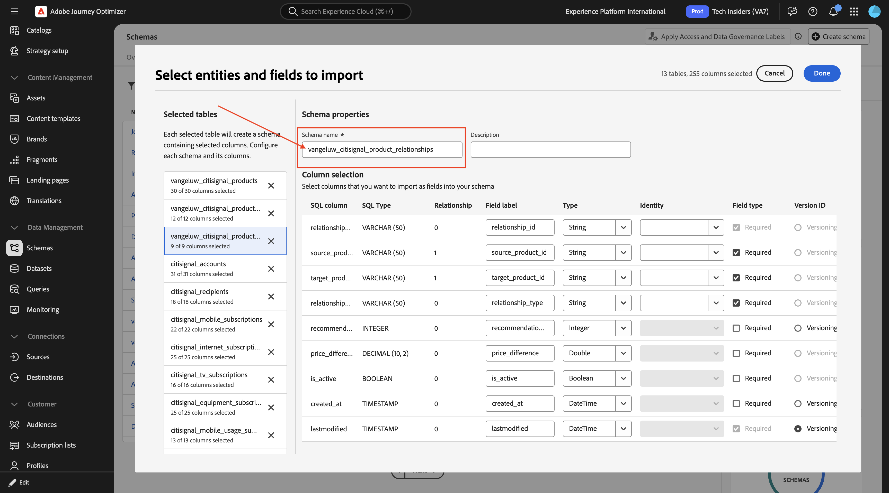

**`citisignal_accounts`**

Change the name of your schema to`--aepUserLdap--_ citisignal_accounts`.

**`citisignal_recipients`**

Change the name of your schema to`--aepUserLdap--_ citisignal_recipients`.

**`citisignal_mobile_subscriptions`**

Change the name of your schema to`--aepUserLdap--_ citisignal_mobile_subscriptions`.

**`citisignal_internet_subscriptions`**

Change the name of your schema to`--aepUserLdap--_ citisignal_internet_subscriptions`.

**`citisignal_tv_subscriptions`**

Change the name of your schema to`--aepUserLdap--_ citisignal_internet_subscriptions`.

**`citisignal_equipment_subscriptions`**

Change the name of your schema to`--aepUserLdap--_ citisignal_equipment_subscriptions`.

**`citisignal_mobile_usage_summary`**

Change the name of your schema to`--aepUserLdap--_ citisignal_mobile_usage_summary`.

**`citisignal_internet_usage_summary`**

Change the name of your schema to`--aepUserLdap--_ citisignal_internet_usage_summary`.

**`citisignal_offers`**

Change the name of your schema to`--aepUserLdap--_ citisignal_offers`.

**`citisignal_offer_eligibility`**

Change the name of your schema to`--aepUserLdap--_ citisignal_offer_eligibility`.

Your schemas are now ready to be saved. Click **Done**.

You should then see this. Click **Save**.

Click **Open jobs**.

You should then see this. You should wait until the job completes successfully before continuing to the next step.

Once the job completes successfully, you can continue with the next step. This may take 5-10 minutes.

Now that your relational XDM schemas are configured and with data being ingested, you can start to use that data to create your orchestrated campaign in the next exercise.

## 3.8.1.2 Data ingestion

Go to **Datasets**. You should then see a dataset that was created for each schema that you created.

Download the file [data.zip](./assets/data.zip) to your desktop and unzip it.

Open the folder **data**. You should see a CSV file for each of the schemas that were created. You now need to upload that data into each corresponding dataset. For this lab, you will be doing that by doing a loal file upload into each dataset.

**`vangeluw_citisignal_products`**

Go to **Sources**, search for `local` and then click **Add data** under **Local File Upload**.

Enable the toggle for **Enable change data capture**.

Select the dataset `vangeluw_citisignal_products`.

Click **Next**.

Click **Choose files**. Select the file **`citisignal_products.csv`** and click **open**.

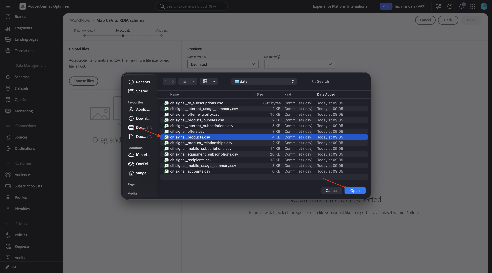

Click **Next**

Click **Finish**.

After a couple of minutes, you can see the data being ingested in your dataset.

**`vangeluw_citisignal_product_bundles`**

Go to **Sources**, search for `local` and then click **Add data** under **Local File Upload**.

Enable the toggle for **Enable change data capture**.

Select the dataset `vangeluw_citisignal_product_bundles`.

Click **Next**.

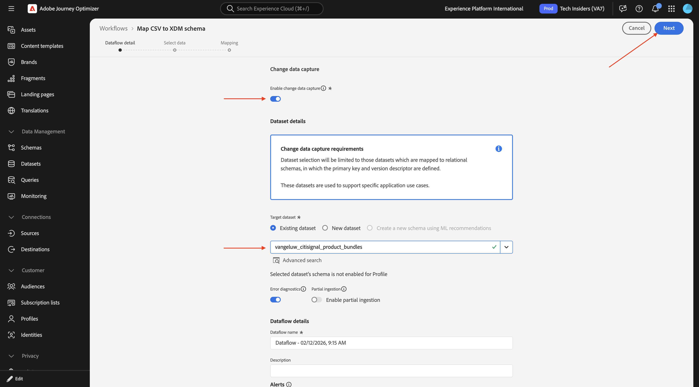

Click **Choose files**. Select the file **`citisignal_product_bundles.csv`** and click **open**.

Click **Next**

Click **Finish**.

After a couple of minutes, you can see the data being ingested in your dataset.

**`vangeluw_citisignal_product_relationships`**

Go to **Sources**, search for `local` and then click **Add data** under **Local File Upload**.

Enable the toggle for **Enable change data capture**.

Select the dataset `vangeluw_citisignal_product_relationships`.

Click **Next**.

Click **Choose files**. Select the file **`citisignal_product_relationships.csv`** and click **open**.

Click **Next**

Click **Finish**.

After a couple of minutes, you can see the data being ingested in your dataset.

**`vangeluw_citisignal_accounts`**

Go to **Sources**, search for `local` and then click **Add data** under **Local File Upload**.

Enable the toggle for **Enable change data capture**.

Select the dataset `vangeluw_citisignal_accounts`.

Click **Next**.

Click **Choose files**. Select the file **`citisignal_accounts.csv`** and click **open**.

Click **Next**

Click **Finish**.

After a couple of minutes, you can see the data being ingested in your dataset.

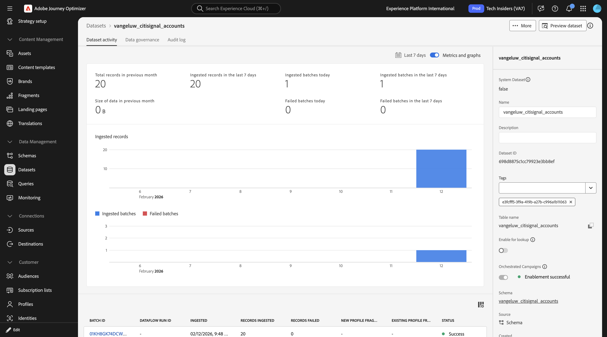

**`vangeluw_citisignal_recipients`**

Go to **Sources**, search for `local` and then click **Add data** under **Local File Upload**.

Enable the toggle for **Enable change data capture**.

Select the dataset `vangeluw_citisignal_recipients`.

Click **Next**.

Click **Choose files**. Select the file **`citisignal_recipients.csv`** and click **open**.

Click **Next**

Click **Finish**.

After a couple of minutes, you can see the data being ingested in your dataset.

**`vangeluw_citisignal_mobile_subscriptions`**

Go to **Sources**, search for `local` and then click **Add data** under **Local File Upload**.

Enable the toggle for **Enable change data capture**.

Select the dataset `vangeluw_citisignal_mobile_subscriptions`.

Click **Next**.

Click **Choose files**. Select the file **`citisignal_mobile_subscriptions.csv`** and click **open**.

Click **Next**

Click **Finish**.

After a couple of minutes, you can see the data being ingested in your dataset.

**`vangeluw_citisignal_internet_subscriptions`**

Go to **Sources**, search for `local` and then click **Add data** under **Local File Upload**.

Enable the toggle for **Enable change data capture**.

Select the dataset `vangeluw_citisignal_internet_subscriptions`.

Click **Next**.

Click **Choose files**. Select the file **`citisignal_internet_subscriptions.csv`** and click **open**.

Click **Next**

Click **Finish**.

After a couple of minutes, you can see the data being ingested in your dataset.

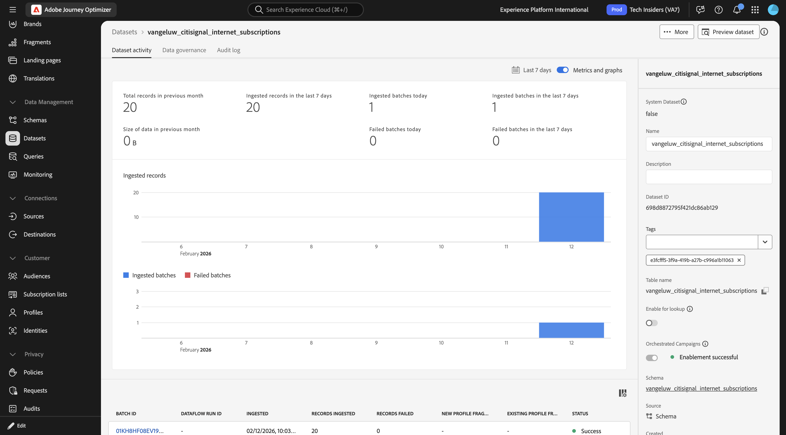

**`vangeluw_citisignal_tv_subscriptions`**

Go to **Sources**, search for `local` and then click **Add data** under **Local File Upload**.

Enable the toggle for **Enable change data capture**.

Select the dataset `vangeluw_citisignal_tv_subscriptions`.

Click **Next**.

Click **Choose files**. Select the file **`citisignal_tv_subscriptions.csv`** and click **open**.

Click **Next**

Click **Finish**.

After a couple of minutes, you can see the data being ingested in your dataset.

**`vangeluw_citisignal_equipment_subscriptions`**

Go to **Sources**, search for `local` and then click **Add data** under **Local File Upload**.

Enable the toggle for **Enable change data capture**.

Select the dataset `vangeluw_citisignal_equipment_subscriptions`.

Click **Next**.

Click **Choose files**. Select the file **`citisignal_equipment_subscriptions.csv`** and click **open**.

Click **Next**

Click **Finish**.

After a couple of minutes, you can see the data being ingested in your dataset.

**`vangeluw_citisignal_mobile_usage_summary`**

Go to **Sources**, search for `local` and then click **Add data** under **Local File Upload**.

Enable the toggle for **Enable change data capture**.

Select the dataset `vangeluw_citisignal_mobile_usage_summary`.

Click **Next**.

Click **Choose files**. Select the file **`citisignal_mobile_usage_summary.csv`** and click **open**.

Click **Next**

Click **Finish**.

After a couple of minutes, you can see the data being ingested in your dataset.

**`vangeluw_citisignal_internet_usage_summary`**

Go to **Sources**, search for `local` and then click **Add data** under **Local File Upload**.

Enable the toggle for **Enable change data capture**.

Select the dataset `vangeluw_citisignal_internet_usage_summary`.

Click **Next**.

Click **Choose files**. Select the file **`citisignal_internet_usage_summary.csv`** and click **open**.

Click **Next**

Click **Finish**.

After a couple of minutes, you can see the data being ingested in your dataset.

**`vangeluw_citisignal_offers`**

Go to **Sources**, search for `local` and then click **Add data** under **Local File Upload**.

Enable the toggle for **Enable change data capture**.

Select the dataset `vangeluw_citisignal_offers`.

Click **Next**.

Click **Choose files**. Select the file **`citisignal_offers.csv`** and click **open**.

Click **Next**

Click **Finish**.

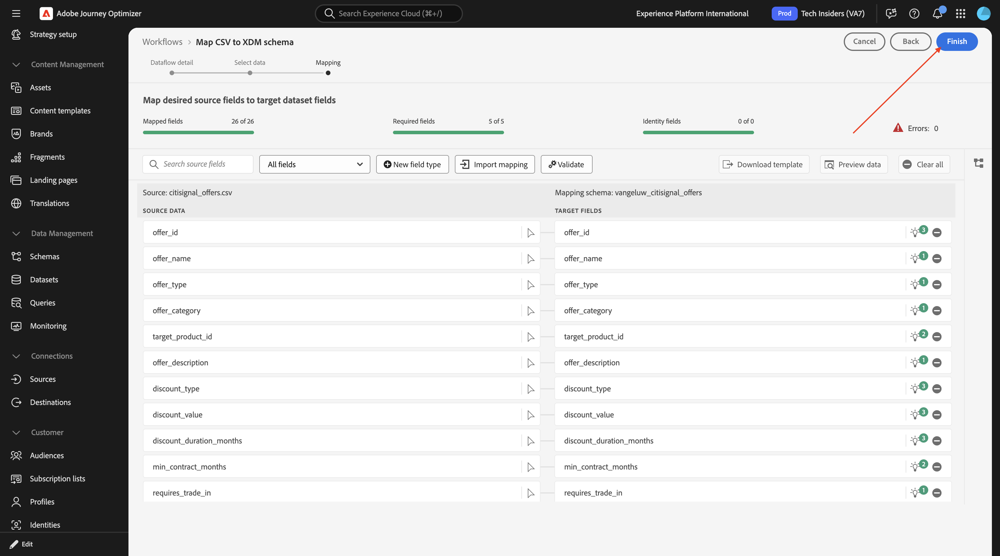

After a couple of minutes, you can see the data being ingested in your dataset.

**`vangeluw_citisignal_offer_eligibility`**

Go to **Sources**, search for `local` and then click **Add data** under **Local File Upload**.

Enable the toggle for **Enable change data capture**.

Select the dataset `vangeluw_citisignal_offer_eligibility`.

Click **Next**.

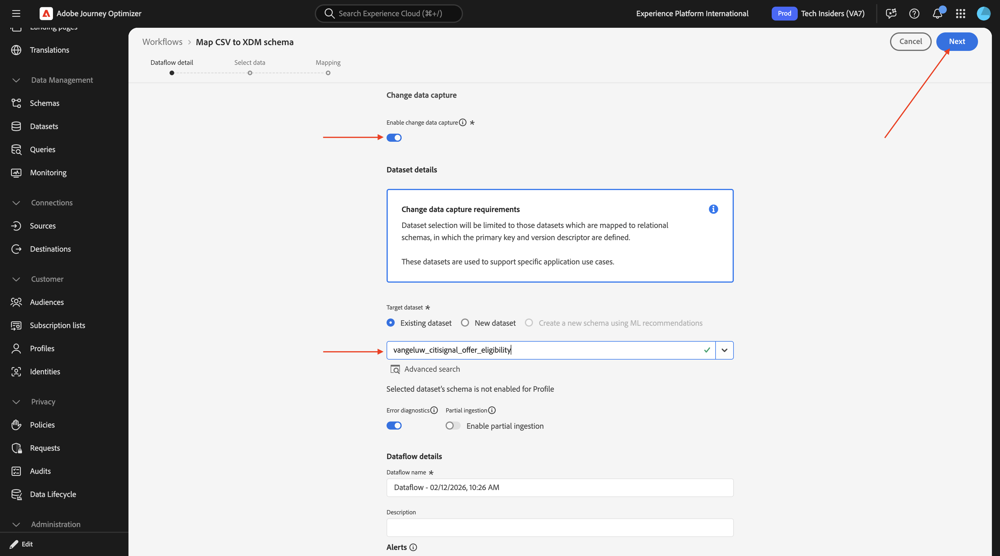

Click **Choose files**. Select the file **`citisignal_offer_eligibility.csv`** and click **open**.

Click **Next**

Click **Finish**.

After a couple of minutes, you can see the data being ingested in your dataset.

All data is now ingested. 

## 3.8.1.3 Profile Target Dimension

With Orchestrated Campaigns, you can design and deliver targeted communications at the entity level, leveraging Adobe Experience Platform’s relational schema capabilities. Experience Platform uses schemas to describe the structure of data in a consistent and reusable way. When data is ingested into Experience Platform, it is structured according to an XDM schema.

Although segmentation for Orchestrated Campaigns operates primarily on relational schemas, the actual message delivery always occurs at the Profile level.

When configuring targeting, you define two key aspects:

- Targetable Schemas: You specify which relational schemas are eligible for targeting. By default, the schema named Recipient is used, but you can configure alternatives such as Visitors, Customers, etc.

- Profile Linkage: The system must understand how the target schema maps to the Profile schema. This is achieved through a shared identity field — one that exists both in the target schema and the Profile schema and is configured as an identity namespace.

You now need to configure your Profile Target Dimensions. Go to **Administration** > **Configuration** and then click **Manage** under **Profile Target Dimension**.

You should then see this. Click **Create**.

For the **Schema**, select `--aepUserLdap--_citisignal_accounts`. For the **Identity value**, select **account_id**.

Click **Save**.

Click **Create** again.

For the **Schema**, select `--aepUserLdap--_citisignal_recipients`. For the **Identity value**, select **account_id**.

Click **Save**.

Click **Create** again.

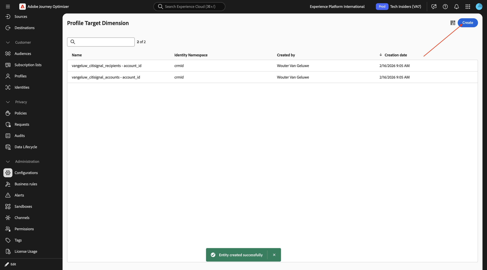

For the **Schema**, select `--aepUserLdap--_citisignal_recipients`. For the **Identity value**, select **email**.

Click **Save**.

You should then have this.

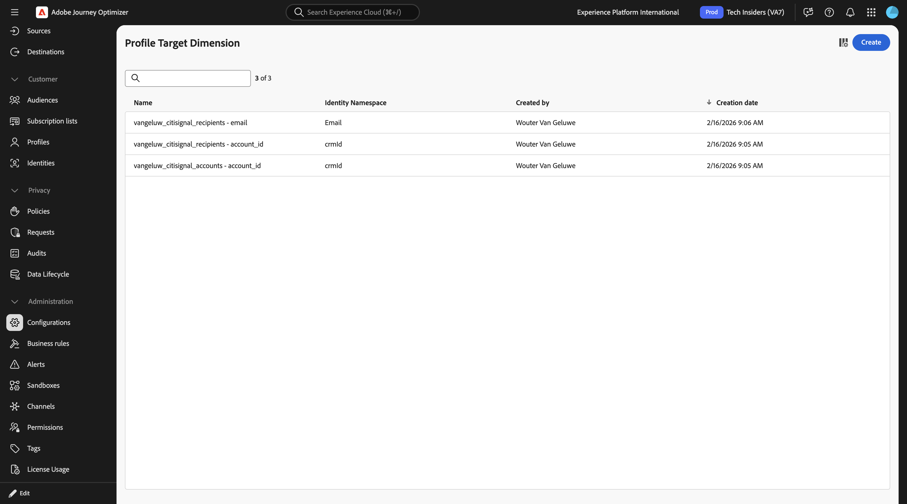

## 3.8.1.4 Email channel

In the left menu, go to **Channels**. Click **Create channel configuration**.

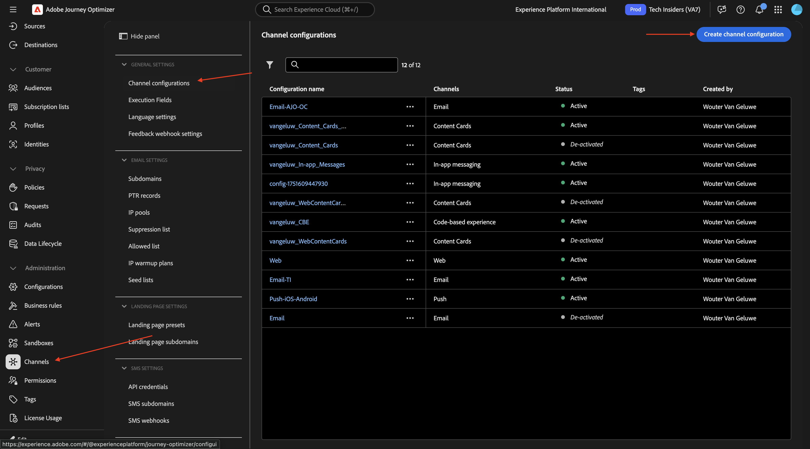

Use the name: `--aepUserLdap---citisignal-email-oc`. Select the channel **Email**

Select an available **subdomain** and **IP pool**.

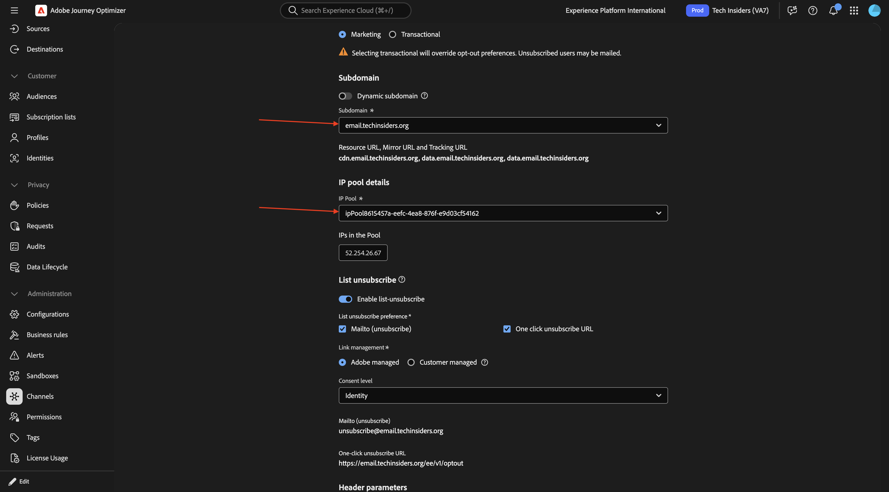

Scroll down and fill out the **Header parameters**.

- **From name**: `info@techinsiders.org`
- **From email prefix**: `info`
- **Reply to name**: `info@techinsiders.org`
- **Reply to email**: `info@techinsiders.org`
- **Error email prefix**: `error`

Scroll down. Go to **Orchestrated campaign**. Check the checkbox for **Enabled**. Select **Targetng dimension**.

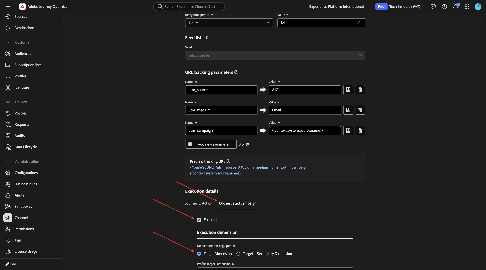

For **Profile Target Dimension**, select `--aepUserLdap--_citisignal_recipients - email`.

Select **Target Dimension** and click the **open folder** icon.

Click `--aepUserLdap--_citisignal_recipients`.

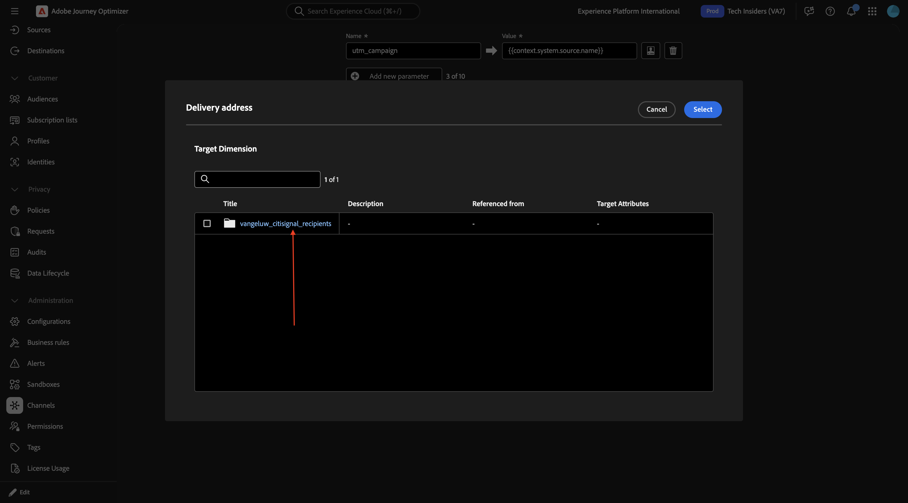

Select the field **email** and click **Select**.

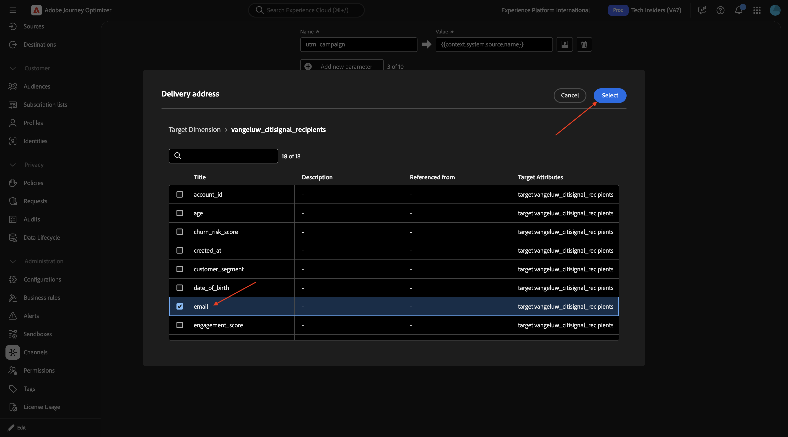

Scroll up and click **Submit**.

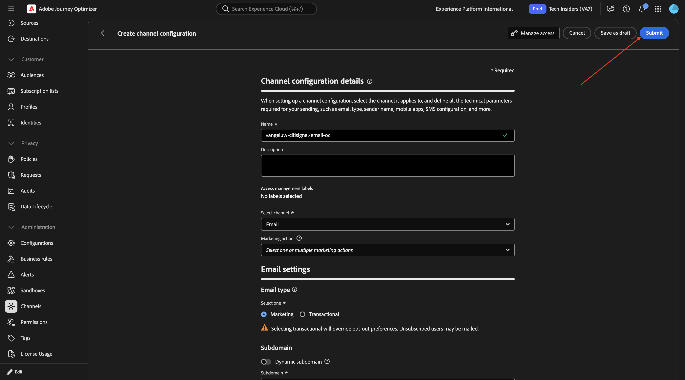

In the next exercise you'll start to use that data as part of an orchestrated campaign.

## Next Steps

Go to [Create your orchestrated campaign](./ex2.md){target="_blank"}

Go back to [Adobe Journey Optimizer: Orchestrated Campaigns](./ajocampaigns.md){target="_blank"}

Go back to [All modules](./../../../../overview.md){target="_blank"}
