# 3.8.2 Create your orchestrated campaign

## 3.8.2.1 Create your Orchestrated Campaign

Go to **Campaigns**. Click **Create campaign**.

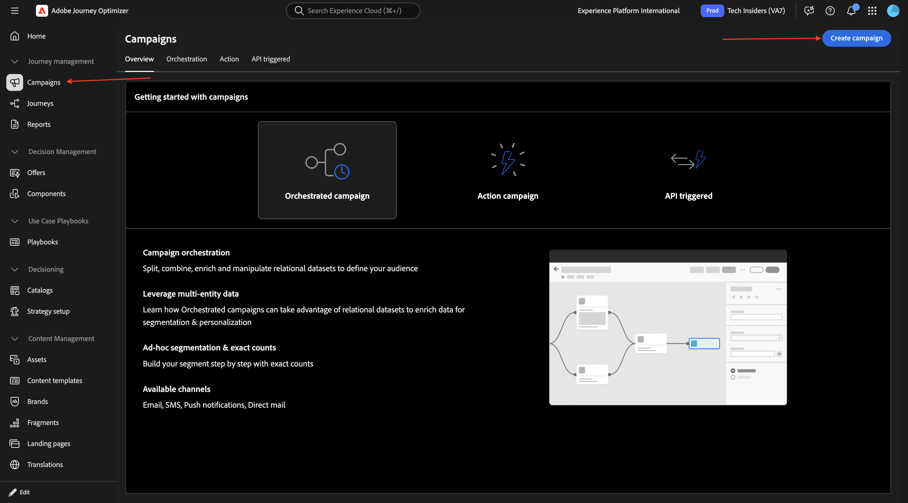

Select **Orchestration - Marketing** and click **Confirm**.

Enter the campaign name: `--aepUserLdap-- - CitiSignal Family Account Optimization Campaign` and click **Save**.

You should then see this. Click the **+** icon.

Select **Fork**.

### Build audience 1

Click the **+** icon and then select **Build Audience**.

Click to open the folder for **Targeting dimension**.

Select **`--aepUserLdap--_citisignal_recipients`** and click **Confirm**.

Click **Create audience**.

Click **Add condition**.

Select **recipient_type** and click **Confirm**.

Enter **`account_holder`** in the field **Value** and click **Calculate**.

You should then see a number for **profiles targeted**. Click somewhere in the grey area as indicated.

Click **Add condition**.

Drill down to **`citisignal_accounts`**.

Select **`account_status`** and click **Confirm**.

Enter **`active`** in the field **Value**. Then, click somewhere in the grey area as indicated.

Click **Add condition**.

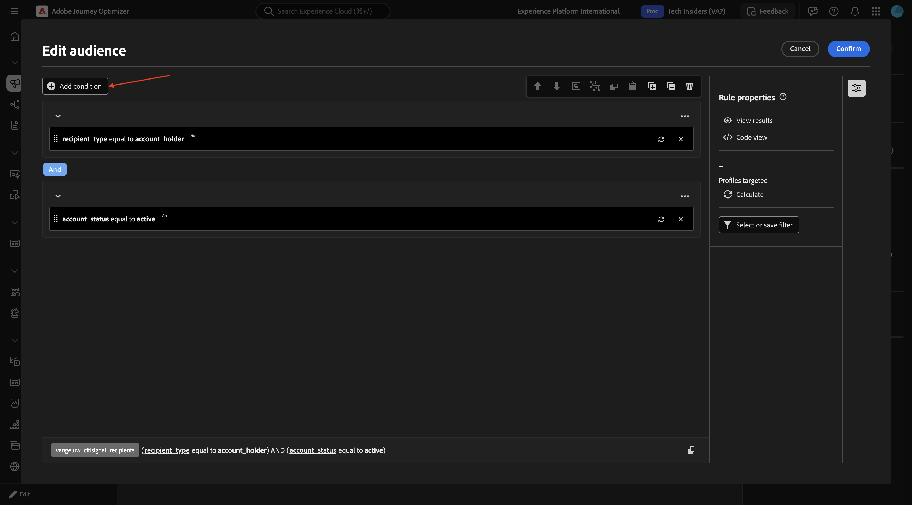

Drill down to **`citisignal_mobile_subscriptions`**.

Select **`subscription_id`** and click **Confirm**.

Enable the switcher for **Aggregate data**. Then select the followibg:

- **Aggregate function**: **Count**
- **Operator**: **greater than or equal to**
- **Value**: **1**

Click **Confirm**.

You should then see this. Click **Confirm**.

### Build audience 2

Click the **+** icon on the next node in the other path.

Select **Build audience**.

Click to open the folder for **Targeting dimension**.

Select **`--aepUserLdap--_mobile_subscriptions`** and click **Confirm**.

Click **Create audience**.

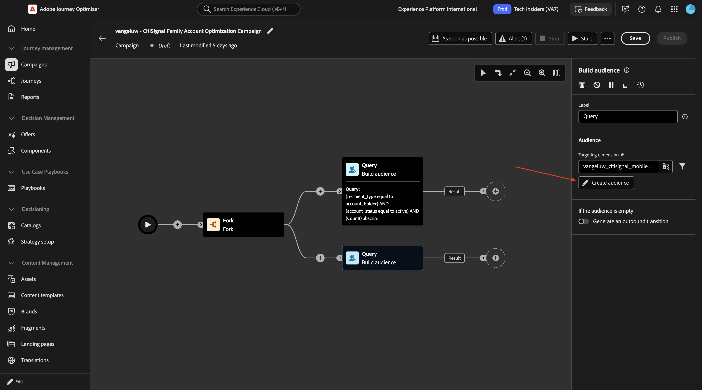

Click **Add condition**.

Select **subscription_status** and click **Confirm**.

Enter **`active`** in the field **Value**. Then, click **Add condition**.

Select **`is_upgrade_eligible`** and click **Confirm**.

Set the **Value** to **true**

Click **Calculate** to see an estimation of the profiles that qualify for this audience. Then, click **Confirm**

### Split

Click the **+** icon and then select **Split**.

Change the field **Label** to **90/10 Treatment vs Control**. Click to open the object **Subset**.

Enable the switcher for **Enable limit** and set the **Limit size** to **10 perecent**.

Click **Add segment** and then you should see the **Result** object being added.

Click **Save**.

### Save audience

Click the **+** icon and then select **Save audience**.

Set the field **Audience label** to **`--aepUserLdap-- - Control Group`**. Click **Add Audience Mapping**.

Drill down to **targeting dimension**.

Select **`account_id`** and click **Confirm**.

### Enrichment: Internet Subscription

Click the **+** icon.

Select **Enrichment**.

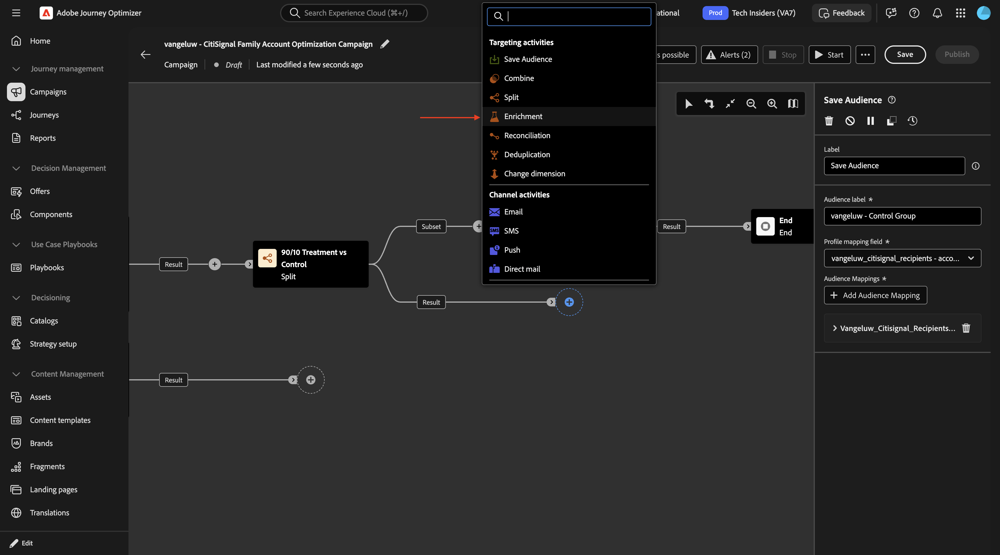

You should then see this. Click **Add enrichment data**.

Drill down to **`Targeting dimension`**.

Drill down to **`citisignal_accounts`**.

Drill down to **`citisignal_internet_subscriptions`**.

Select **`account_id`** and click **Confirm**.

You should then see this. Click **Add attribute**.

Select **`subscription_status`** and click **Confirm**.

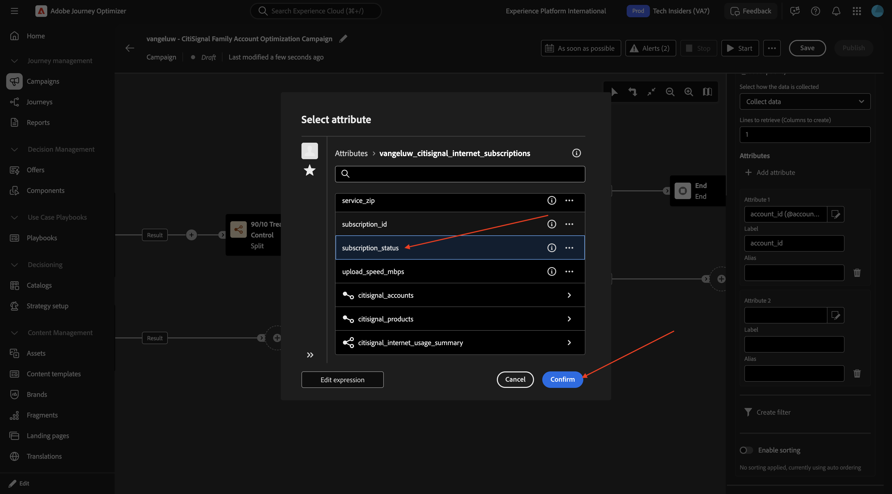

Click **Add attribute**.

Select **`connection_type`** and click **Confirm**.

Click **Add attribute**.

Select **`service_city`** and click **Confirm**.

Click **Add attribute**.

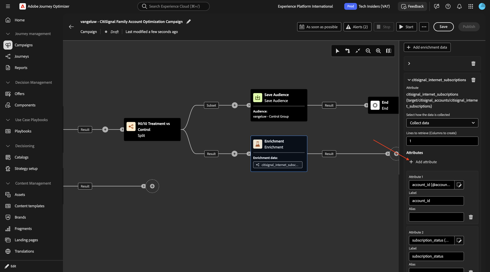

Select **`avg_dowload_usage_gb`** and click **Confirm**.

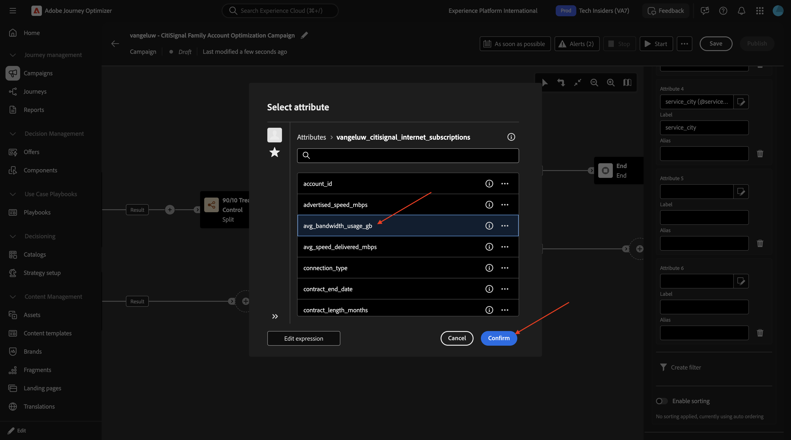

Click **Add attribute**.

Select **`data_cap_gb`** and click **Confirm**.

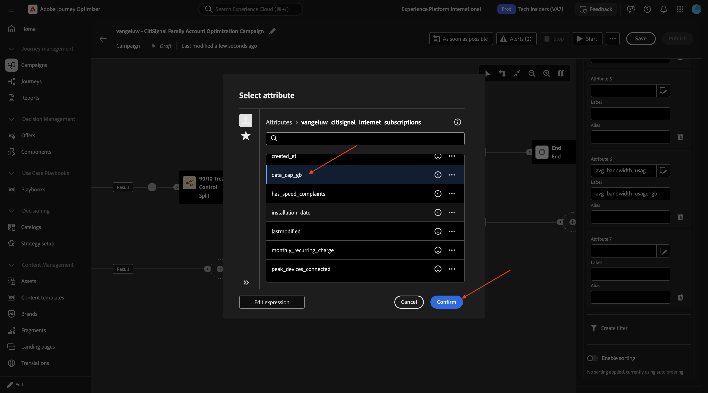

Click **Add attribute**.

Select **`advertised_speed_mbps`** and click **Confirm**.

Click **Add attribute**.

Select **`monthly_recurring_charge`** and click **Confirm**.

Click **Save**.

Scroll up and change the field **Label** to `Enrichment: Internet Subscription`.

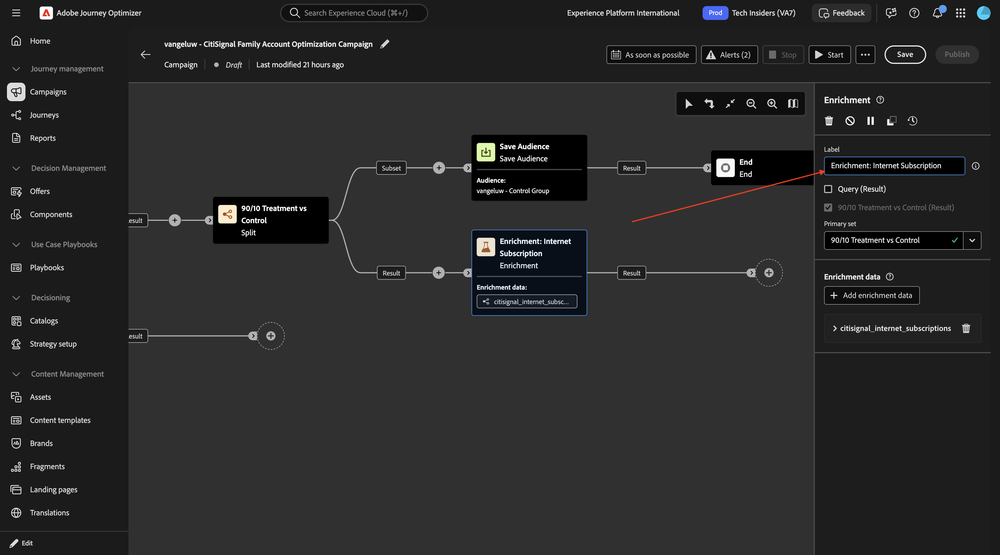

### Enrichment: Mobile Devices Subscription

Click the **+** icon on the next node and select **Enrichment**.

Change the field **Label** to `Enrichment: Mobile Devices Subscription` and then click **Add enrichment data**.

Drill down to **Targeting dimension**.

Drill down to **`citisignal_mobile_subscriptions`**.

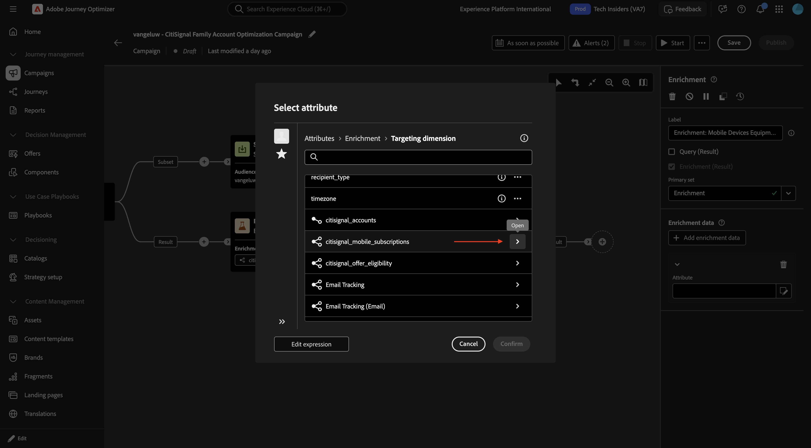

Select **`account_id`** and click **Confirm**.

Click **Add attribute**.

Select **`subscription_id`** and click **Confirm**.

Click **Add attribute**.

Select **`phone_number`** and click **Confirm**.

Click **Add attribute**.

Select **`renewal_eligibility_date`** and click **Confirm**.

Click **Add attribute**.

Select **`line_user_recipient_id`** and click **Confirm**.

Click **Add attribute**.

Select **`is_upgrade_eligible`** and click **Confirm**.

Click **Add attribute**.

Select **`current_device_id`** and click **Confirm**.

Click **Add attribute**.

Select **`contract_start_date`** and click **Confirm**.

Click **Add attribute**.

Drill down to **`citisignal_equipment_subscriptions`**.

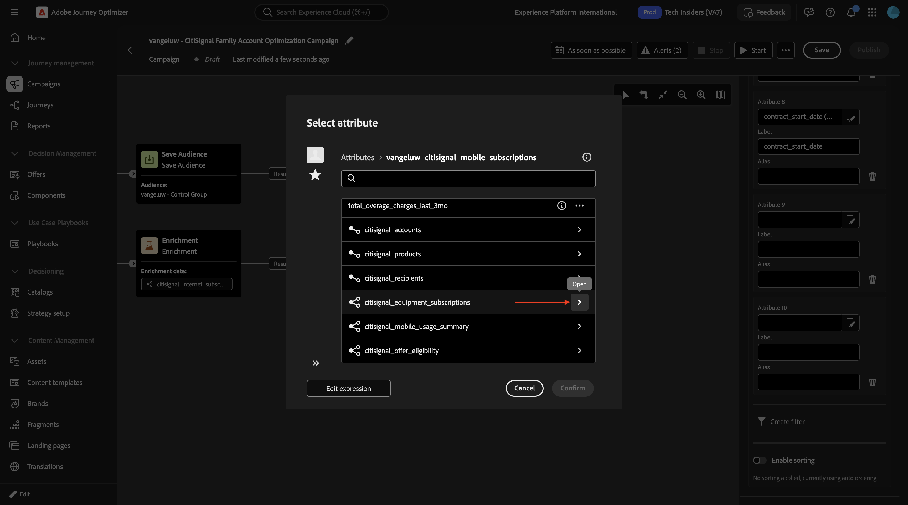

Select **`model`** and click **Confirm**.

Click **Add attribute**.

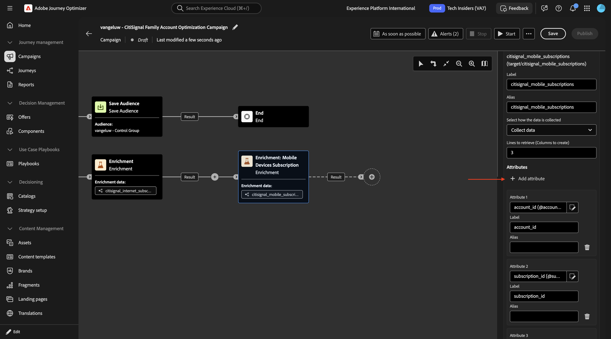

Drill down to **`citisignal_equipment_subscriptions`**.

Select **`manufacturer`** and click **Confirm**.

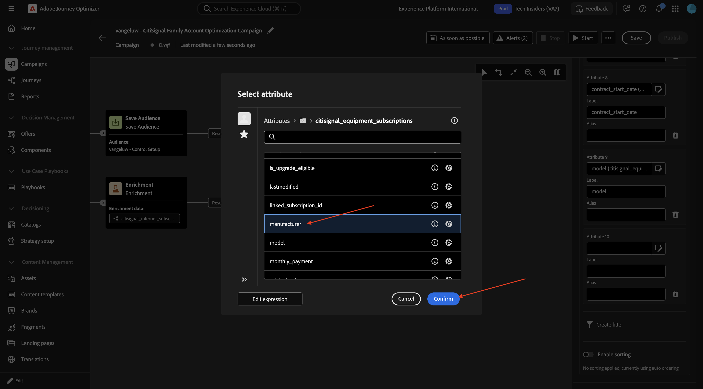

Click **Add attribute**.

Drill down to **`citisignal_equipment_subscriptions`**.

Select **`device_age_months`** and click **Confirm**.

Click **Add attribute**.

Drill down to **`citisignal_equipment_subscriptions`**.

Select **`is_upgrade_eligible`** and click **Confirm**.

Click **Add attribute**.

Drill down to **`citisignal_equipment_subscriptions`**.

Select **`recommended_upgrade_product_id`** and click **Confirm**.

Click **Add attribute**.

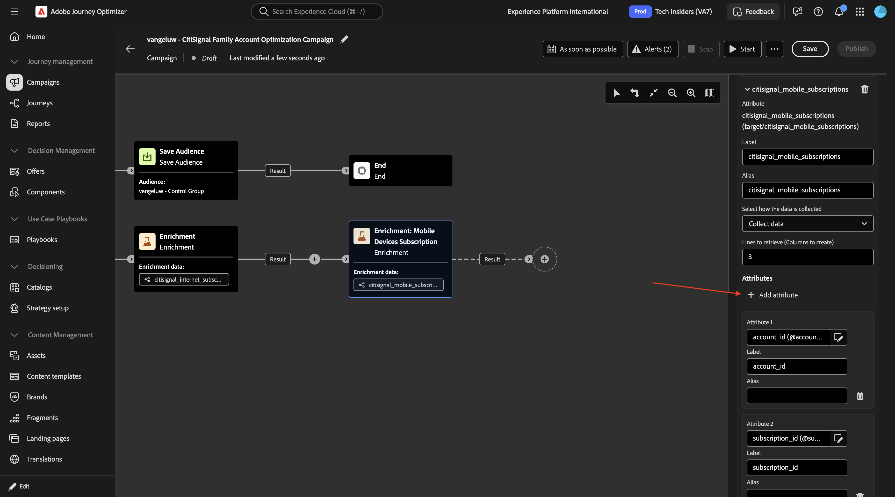

Drill down to **`citisignal_equipment_subscriptions`**.

Select **`monthly_payment`** and click **Confirm**.

Click **Add attribute**.

Drill down to **`citisignal_equipment_subscriptions`**.

Enable the switch for **Enable Sorting**. Click the **Edit** icon.

Select **`phone_number`** and click **Confirm**.

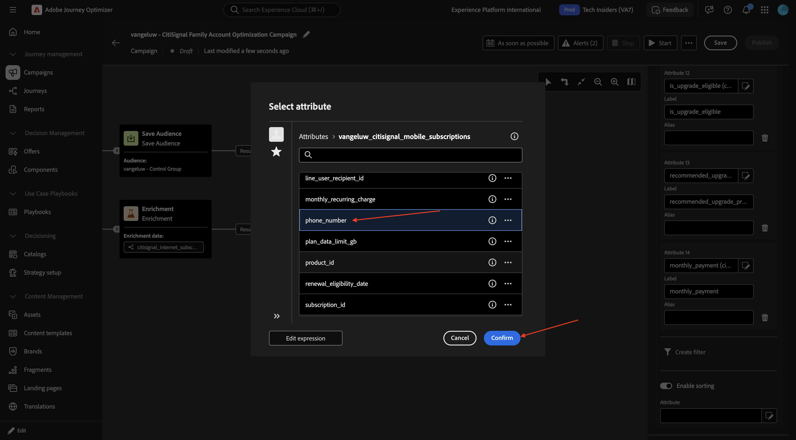

You should then have this.

You should then have this. Click **Save**.

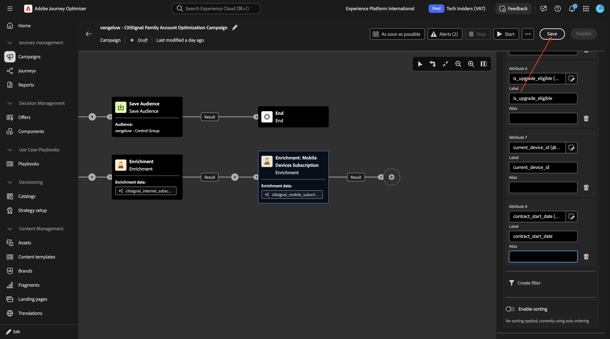

## Next Steps

Go back to [Adobe Journey Optimizer: Orchestrated Campaigns](./ajocampaigns.md){target="_blank"}

Go back to [All modules](./../../../../overview.md){target="_blank"}
