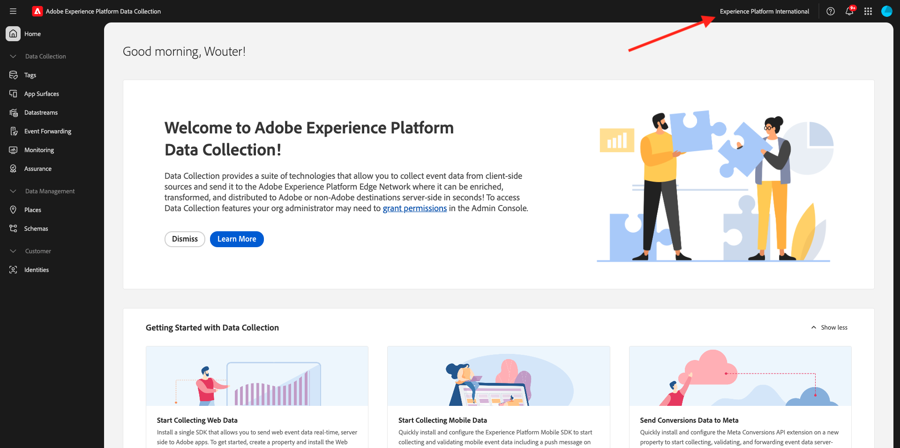
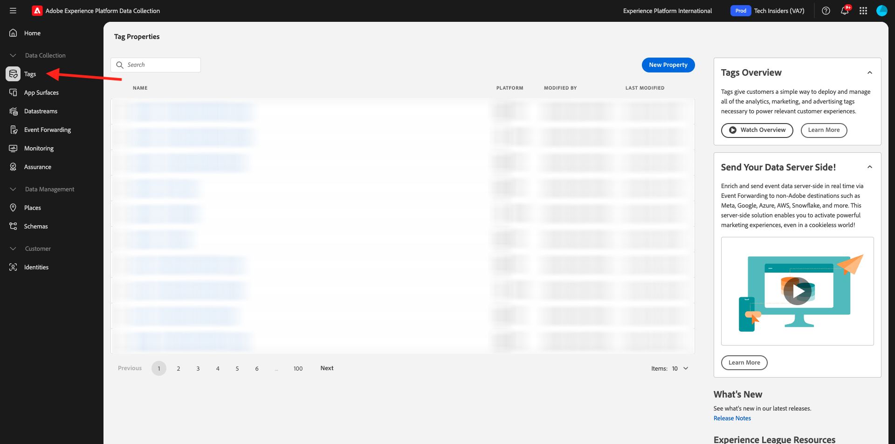
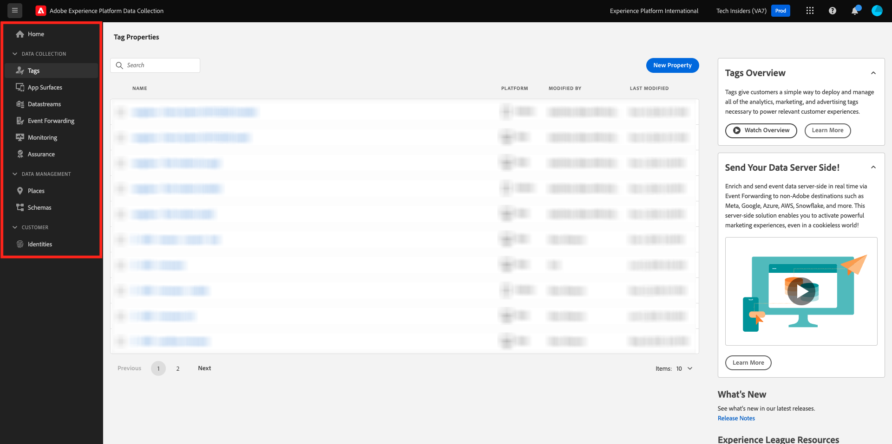

# 1.1.1 Understanding Adobe Experience Platform Data Collection

## Context

Adobe Experience Platform Data Collection is used by brands for a number of use cases. It is a next generation Tag Management System (TMS) that gives customers a simple way to deploy and manage all of the analytics, marketing and advertising solutions necessary to power relevant customer experiences. There is no additional charge for Adobe Experience Platform Data Collection and it's available for any Adobe Experience Cloud customer. A brand could use Adobe Experience Platform Data Collection to:

- Implement Adobe Experience Cloud applications as well as Adobe Experience Platform.
- Manage the different requirements of different parts of the organization by providing each with their own **Property** to manage.
- Allow for testing and lifecycle management.
- Inject custom JavaScript and 3rd party tags, all managed in one place.

## Explore the UI

Go to [Adobe Experience Platform Data Collection](https://experience.adobe.com/#/data-collection/). Ensure that you are using the correct environment, which should be `--aepImsOrgName--`.

>[!NOTE]
>
>This tutorial is documented using the environment **Experience Platform International**. Your environment name is likely different, so whenever you see the name **Experience Platform International** in a screenshot, you should replace that by the name of your own environment, which should be `--aepImsOrgName--`.

Go to **Tags**. Youre now seeing the **[!UICONTROL Properties]** view. Properties listed here are for tutorial management. These properties represent:

- App and Web properties
- Different websites serving customers in different ways. For example Luma Retail would have one property, Luma Travel would have another.
- Legacy as well as current websites
- A specific Adobe Analytics design common to multiple differing websites
- Internal intranet pages alongside external sites

Now, take a look at the left rail.

- **[!UICONTROL Tags]** gives an overview of all client-side properties
- **[!UICONTROL App Surfaces]** gives an overview of all App Configurations to enable Push Notifications (which is used/enabled in combination with Project Sierra)
- **[!UICONTROL Datastreams]** are explored in the [next exercise](./ex2.md)
- **[!UICONTROL Event Forwarding]** gives an overview of all server-side properties which are explored in [Module 2.5 - Real-Time CDP Connections: Event Forwarding](./../../../../modules/delivery-activation/rtcdp-b2c/rtcdpb2c-5/aep-data-collection-ssf.md)
- **[!UICONTROL Monitoring]** gives an overview of the incoming and outgoing event traffic through Event Forwarding
- **[!UICONTROL Assurance]** provides access for debugging an implementation using the Adobe Debugger
- **[!UICONTROL Places]** provides access to manage POI's which become accessible for location-based personalization in mobile applications
- **[!UICONTROL Schemas]** provides access to Adobe Experience Platform's schema editor
- **[!UICONTROL Identities]** provides access to Adobe Experience Platform's Identity Graph setup

## Further Information

Adobe Experience Platform Data Collection is a very advanced tool that has scope beyond an Adobe Experience Platform tutorial. Organizations might not use Adobe Experience Platform Data Collection for its tag management capabilities and instead use non-Adobe tag management solutions for injecting code and managing tags. Using a non-Adobe tag management solution is supported by Adobe and Adobe Professional Services. 
Some further reading for those interested in understanding Adobe Experience Platform Data Collection further are included below.

- [Adobe Experience Platform Data Collection User Guide](https://experienceleague.adobe.com/docs/experience-platform/tags/home.html)
- [Implement Adobe Experience Cloud with Web SDK tutorial](https://experienceleague.adobe.com/docs/platform-learn/implement-web-sdk/overview.html)
- [Set-up user permissions](https://experienceleague.adobe.com/docs/experience-platform/tags/admin/user-permissions.html)
- [API documentation](https://developer.adobelaunch.com/api/)

## Next Steps

Go to [1.1.2 Edge Network, Datastreams and Server Side Data Collection](./ex2.md){target="_blank"}

Go back to [Setup of Adobe Experience Platform Data Collection and the Web SDK tag extension](./data-ingestion-launch-web-sdk.md){target="_blank"}

Go back to [All modules](./../../../../overview.md){target="_blank"}
