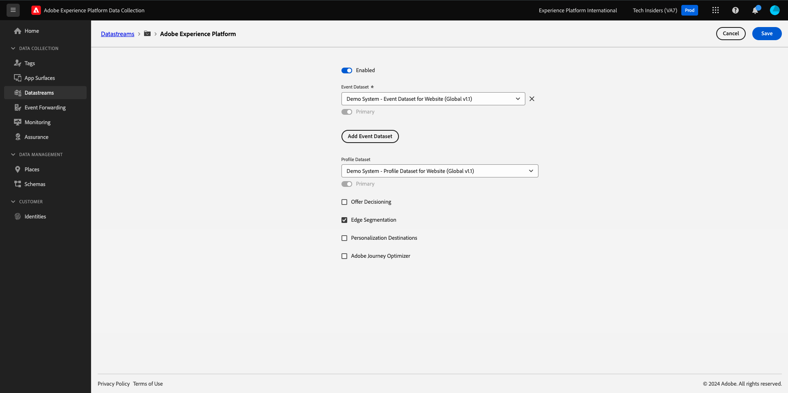

# 1.1.2 Edge Network, Datastreams and Server Side Data Collection

## Context

In this exercise you'll create a **datastream**. A **datastream** tells the Adobe Edge Network servers where to send the data after it is collected by Web SDK. For example, do you want to send the data to Adobe Experience Platform? Adobe Analytics? Adobe Audience Manager? Adobe Target? 

Datastreams are always managed in the Experience Platform Data Collection user interface and are critical to Experience Platform data collection with [Web SDK](https://experienceleague.adobe.com/en/docs/experience-platform/web-sdk/home). Even when you implement Web SDK with a non-Adobe tag management solution, you still need to create a datastream.

You'll be implementing the Web SDK on the browser in the next exercise. It will then be more clear to you what the data that is being collected looks like. For now, we are just telling the datastream where to forward the data.

## Create a datastream

In [Getting Started](./../../../../modules/getting-started/gettingstarted/ex2.md) you already created a datastream, but we didn't discuss the background and reason for which you created it. 

A [datastream](https://experienceleague.adobe.com/en/docs/experience-platform/datastreams/overview) tells the Edge Network servers where to send the data after it is collected by the Web SDK. See the documentation for [adding services to a datastream](https://experienceleague.adobe.com/en/docs/experience-platform/datastreams/configure#add-services) for complete details on where you can send your data through the datastream.

Datastreams are managed in the Experience Platform Data Collection user interface and are critical to data collection with Web SDK, regardless of whether or not you are implementing Web SDK via Adobe Experience Platform Data Collection.

Let's review your **[!UICONTROL datastream]**:

Go to [https://experience.adobe.com/launch/](https://experience.adobe.com/launch/).

Click **[!UICONTROL Datastreams]** in the left menu.

Open your datastream, which is named `--aepUserLdap-- - Demo System Datastream`.

You'll then see the details of your datastream. 

Click **...** next to **Adobe Experience Platform** and click **Edit**.

You'll then see this. At this moment, you've only enabled Adobe Experience Platform. Your configuration will look similar to the configuration below. (Depending on your environment and Adobe Experience Platform instance, the Sandbox Name might be different)

You should interpret the below fields like this:

For this datastream...

- All data that is collected will be stored in the `--aepSandboxName--` sandbox in Adobe Experience Platform
- All Experience Event data is collected by default into the dataset **Demo System - Event Dataset for Website (Global v1.1)**
- All Profile data will be collected by default into the dataset **Demo System - Profile Dataset for Website (Global v1.1)** (ingesting profile data natively with Web SDK currently isn't supported yet by Web SDK)
- **Edge Segmentation** is enabled by default, which means that qualifying audiences will be evaluated at the edge, upon ingestion of incoming traffic
- If you want to use [personalization destinations](https://experienceleague.adobe.com/en/docs/experience-platform/destinations/catalog/personalization/overview), check the box for **Personalization Destinations**.
- If you want to use **Adobe Journey Optimizer**'s capabilities in this datastream, you need to check the box for **Adobe Journey Optimizer**.

For now, no other configuration is needed for your datastream.

## Next Steps

Go to [1.1.3 Introduction to Adobe Experience Platform Data Collection](./ex3.md){target="_blank"}

Go back to [Setup of Adobe Experience Platform Data Collection and the Web SDK tag extension](./data-ingestion-launch-web-sdk.md){target="_blank"}

Go back to [All modules](./../../../../overview.md){target="_blank"}
