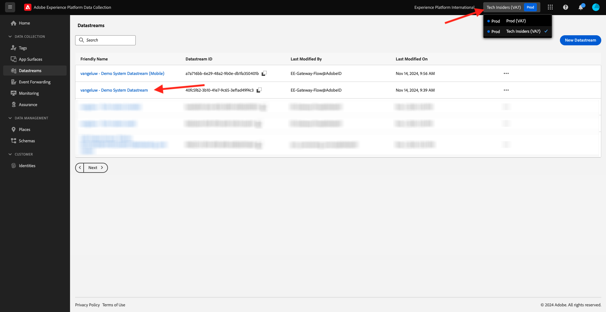
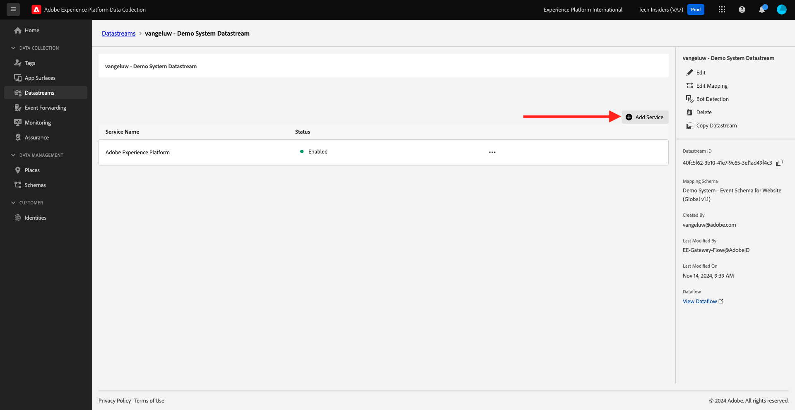
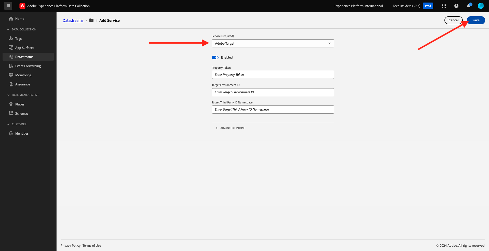

# 1.1.6 Implement Adobe Target

## Update your datastream to use Adobe Target

In case you want to send data collected by Web SDK to Adobe Target and get a response from Adobe Target with a personalized experience for every customer, follow these steps.

Go to [https://experience.adobe.com/launch/](https://experience.adobe.com/launch/) and go to **Datastreams**. 

In the top right corner of your screen, select your sandbox name, which should be `--aepSandboxName--`. Open your specific datastream, which is named `--aepUserLdap-- - Demo System Datastream`.

You'll then see this. To enable Adobe Target, click **Add Service**.

You'll then see this. Select the service **Adobe Target**, after which you can optionally provide additional information. Click **Save**.

## Next Steps

Go to [1.1.7 XDM Schema requirements in Adobe Experience Platform](./ex7.md){target="_blank"}

Go back to [Setup of Adobe Experience Platform Data Collection and the Web SDK tag extension](./data-ingestion-launch-web-sdk.md){target="_blank"}

Go back to [All modules](./../../../../overview.md){target="_blank"}
