# 1.2.1 From unknown to known on the website

## Context

The journey from unknown to known is one of the most important topics amongst brands these days, as is the customer journey from acquisition to retention. 

Adobe Experience Platform plays a huge role in this journey. Platform is the brains for communication, the experience system of record.

Platform is an environment in which the word **customer** is broader than just the **known**-customers. This is a very important thing to mention when speaking to brands: an unknown visitor on the website is also a customer from Platform's perspective and as such, all of the behavior as an unknown visitor is also sent to Platform. Thanks to that approach, when this customer eventually becomes a known customer, a brand can visualize what happened before that moment as well. This helps from an attribution and experience optimization perspective.

## What are you going to do

You will now ingest data into Adobe Experience Platform and that data will be linked to identifiers like ECIDs and email-addresses. The goal of this is to understand the business context of what you're about to do from a configuration perspective. In the next exercise, you'll start configuring everything you need to make all that data ingestion possible in your own sandbox environment.

### Customer Journey flow

Go to [https://dsn.adobe.com](https://dsn.adobe.com). After logging in with your Adobe ID, you'll see this. Click the 3 dots **...** on your website project and then click **Run** to open it.

You'll then see your demo website open up. Select the URL and copy it to your clipboard.

Open a new incognito browser window.

Paste the URL of your demo website, which you copied in the previous step. You'll then be asked to login using your Adobe ID.

Select your account type and complete the login process.

You'll then see your website loaded in an incognito browser window. For every demonstration, you'll need to use a fresh, incognito browser window to load your demo website URL.

Click the Adobe logo icon in the top left corner of your screen to open the Profile Viewer.
  
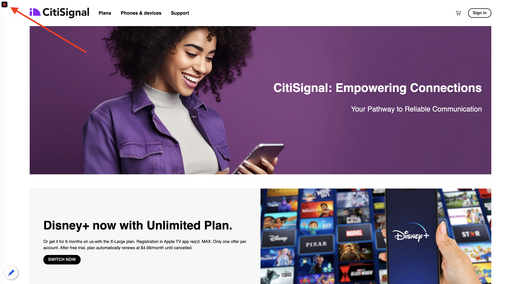

Have a look at the Profile Viewer panel and the Real-time Customer Profile with the **Experience Cloud ID** as the primary identifier for this currently unknown customer.
      
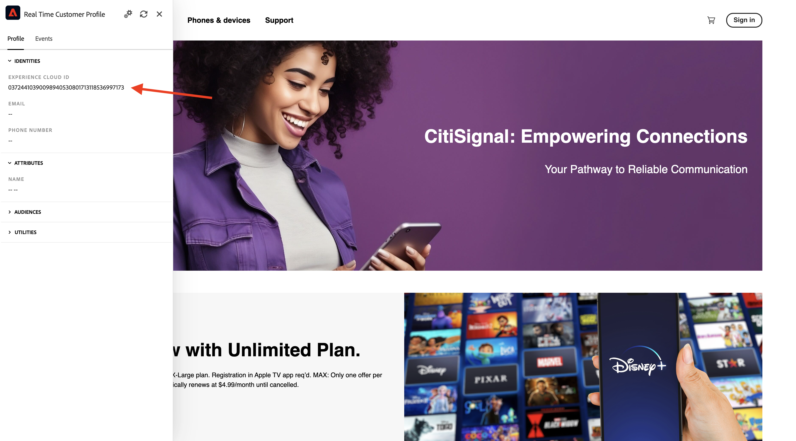

You can also see all the Experience Events that were collected based on the customer's behaviour. The list is currently empty but that will change soon.

Go to the **Phones & devices** product category. Next, click on the product **iPhone 15 Pro**.

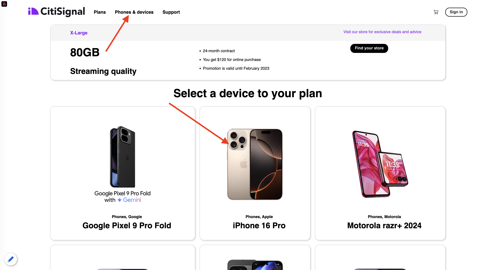

You'll then see the product detail page. An Experience Event of type **Product View** has now been sent to Adobe Experience Platform using the Web SDK implementation that you reviewed in the previous module. 
  
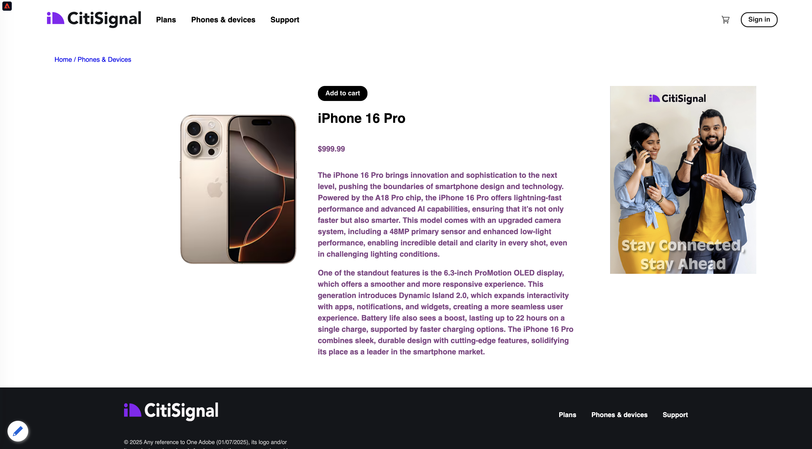
  
Open the Profile Viewer panel and have a look at your **Experience Events**.

>[!NOTE]
>
>If you don't see the event show up immediately, please refresh the page.
  
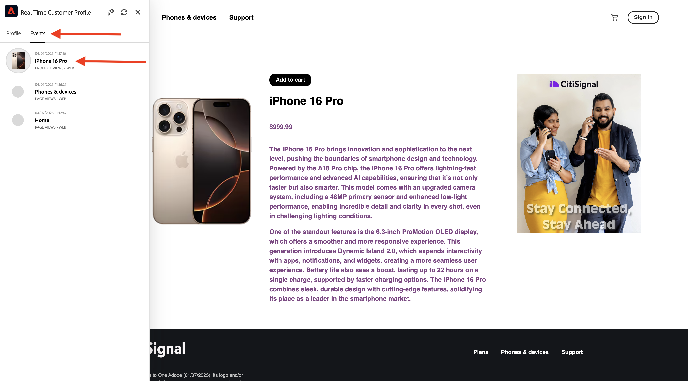
  
Go back to the **Phones & devices** category page, and click another product. Another Experience Event has been sent to Adobe Experience Platform. 
  
Open the Profile Viewer panel. You'll now see 2 Experience Events of type **Product View**. While the behavior is anonymous, with proper consent in place, we're able to track every click and store it in in Adobe Experience Platform. Once the anonymous customer becomes known, we'll be able to merge all anonymous behavior automatically to the know profile.
  
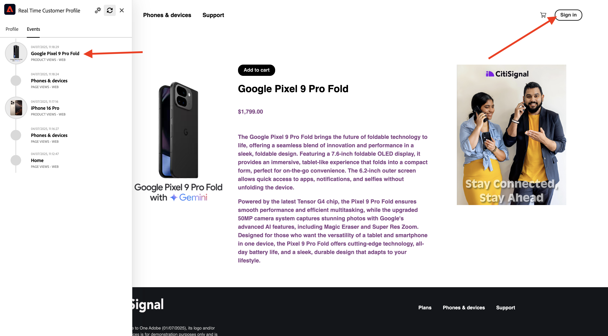

Click **Sign In** to go to the Register/Login page. 

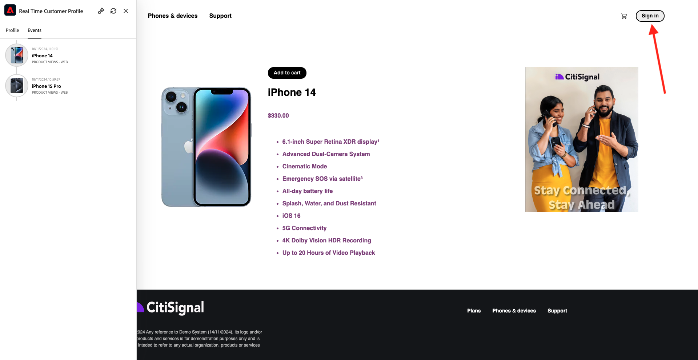

Click **Create an account**.
  
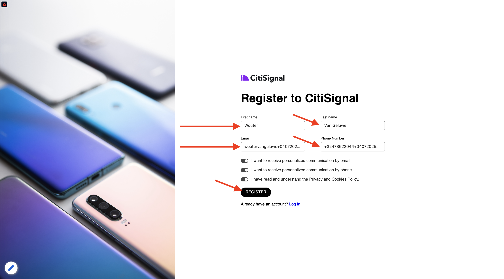
  
Fill out your details and click **Register** after which you'll be redirected to the previous page. 

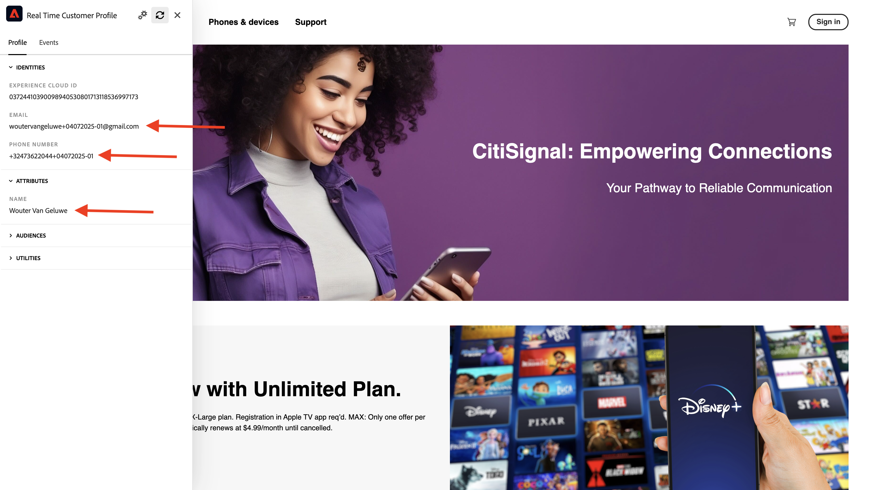

Open the Profile Viewer panel and go to Real-time Customer Profile. On the Profile Viewer panel, you should see all of your personal data displayed, like your newly added email and phone identifiers.
  
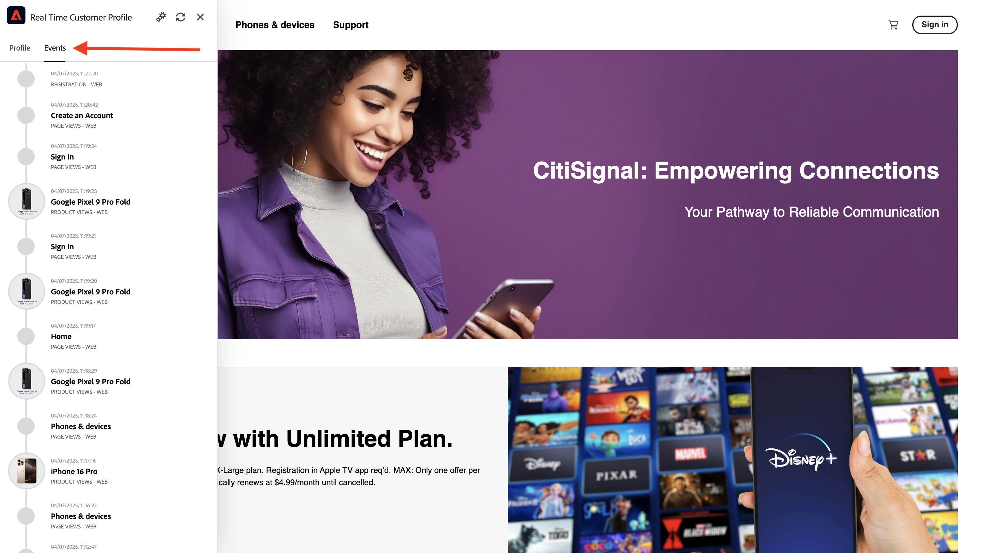

On the Profile Viewer panel, go to Experience Events. You'll see the 2 products that you viewed before on the Profile Viewer panel. Both of these events are now also connected to your 'known' profile.

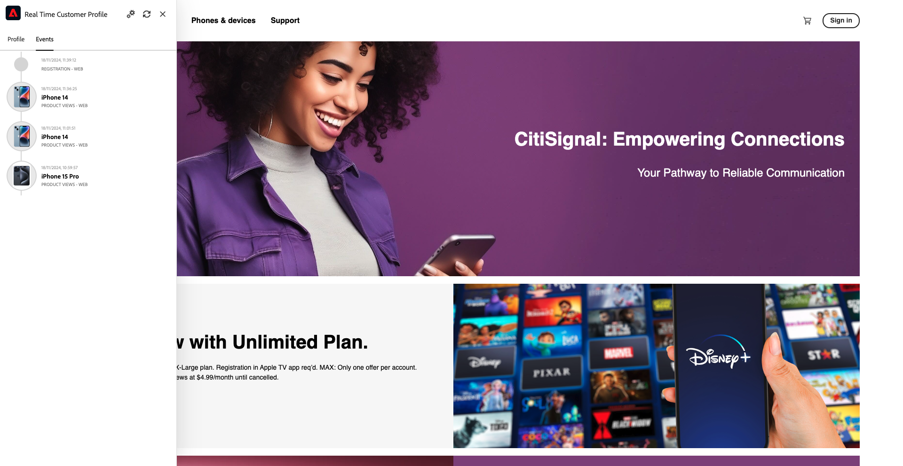
  
You've now ingested data into Adobe Experience Platform and you've linked that data to identifiers like ECIDs and email-addresses. The goal of this is to understand the business context of what you're about to do. In the next exercise, you'll start configuring everything you need to make all that data ingestion possible.

## Next Steps

Go to [1.2.2 Configure Schemas and Set Identifiers](./ex2.md){target="_blank"}

Go back to [Data Ingestion](./data-ingestion.md){target="_blank"}

Go back to [All modules](./../../../../overview.md){target="_blank"}