# 1.2.4 Data Ingestion from Offline Sources

In this exercise, the goal is to onboard external data like CRM Data in Platform.

## Learning Objectives

- Learn how to generate test data
- Learn how to ingest CSV
- Learn how to use the web UI for data ingestion through Workflows
- Understand the data governance features of Experience Platform

## Resources

- Mockaroo: [https://www.mockaroo.com/](https://www.mockaroo.com/)
- Adobe Experience Platform: [https://experience.adobe.com/platform/](https://experience.adobe.com/platform/)

## Tasks

- Create a CSV file with demo data. Ingest the CSV file in Adobe Experience Platform by making use of the available workflows.
- Understand data governance options in Adobe Experience Platform

## Create a CRM Dataset using a data generator tool

For this exercise, you need 1000 sample lines of CRM Data.

Open the Mockaroo Template by going to [https://www.mockaroo.com/12674210](https://www.mockaroo.com/12674210).

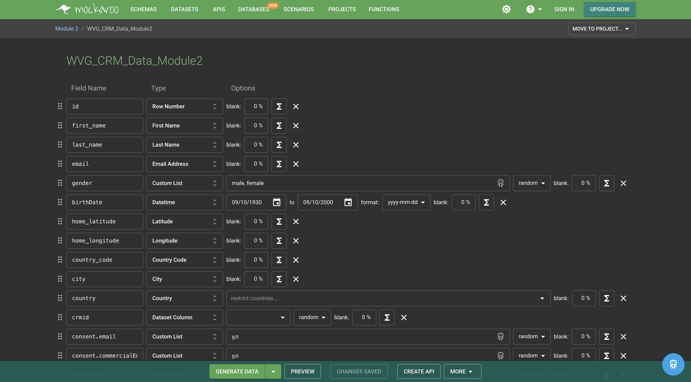

On the template, you'll notice the following fields:

- id
- first_name
- last_name
- email
- gender
- birthDate
- home_latitude
- home_longitude
- country_code
- city
- country
- crmId
- consent.email
- consent.commercialEmail
- consent.any

All these fields have been defined to produce data that is compatible with Platform. 

To generate your CSV-file, click the **[!UICONTROL Generate Data]** button which will create and download a CSV-file with 1000 lines of demo-data. 

Open your CSV-file to visualize its contents.

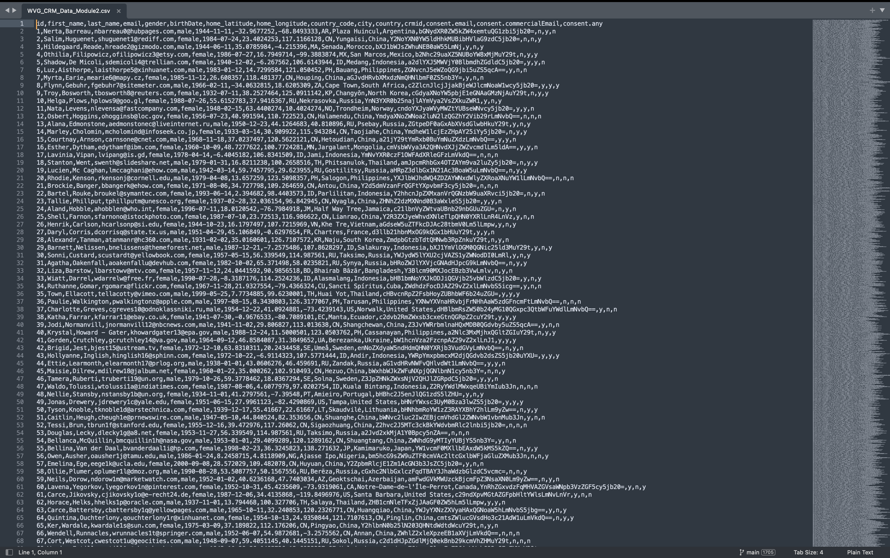

With your CSV-file ready, you can proceed with the ingestion in AEP.

### Verify the dataset

Go to [https://experience.adobe.com/platform](https://experience.adobe.com/platform).

Before you continue, you need to select a **[!UICONTROL sandbox]**. The sandbox to select is named ``--aepSandboxName--``. 

In Adobe Experience Platform, click on **[!UICONTROL Datasets]** in the menu on the left side of your screen.

You'll use a shared dataset. The shared dataset has been created already and is called **[!UICONTROL Demo System - Profile Dataset for CRM (Global v1.1)]**. Click it to open it.

On the overview screen, you can see 3 main pieces of information.

>[!NOTE]
>
>It's possible that the view of your dataset is empty, if no activity has occurred in the last 7 days.

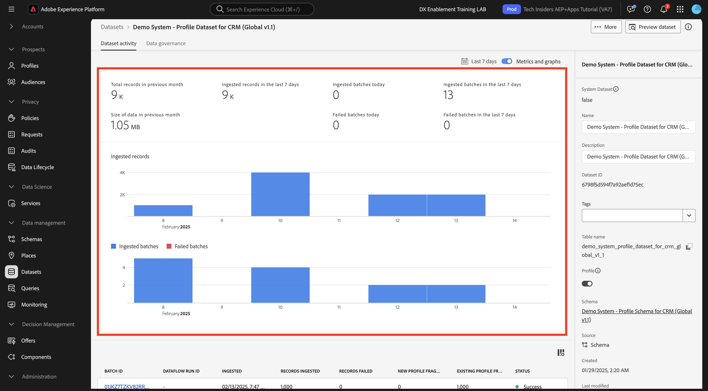

First of all, the [!UICONTROL Dataset Activity] dashboard shows the total number of CRM records in the dataset and the ingested batches and their status

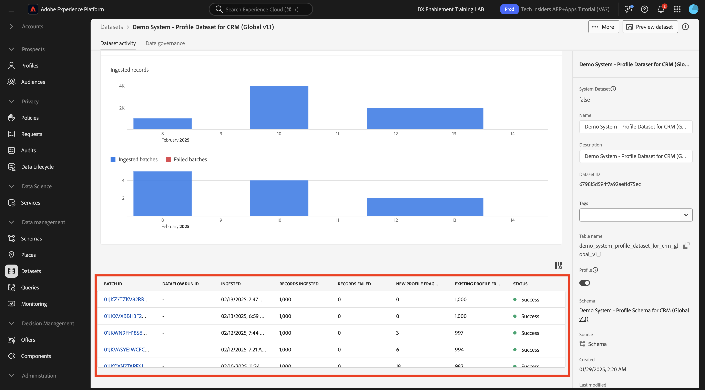

Second, by scrolling down on the page you can check when batches of data were ingested, how many records were onboarded and also, whether or not the batch was successfully onboarded. The **[!UICONTROL Batch ID]** is the identifier for a specific batch job, and the **[!UICONTROL Batch ID]** is important as it can be used for troubleshooting why a specific batch was not successfully onboarded. 

Lastly, the [!UICONTROL Dataset] info tab shows important information like the [!UICONTROL Dataset ID] (again, important from a troubleshooting perspective), the dataset's Name and whether the dataset was enabled for Profile.

 
The most important setting here is the link between the dataset and the Schema. The Schema defines what data can be ingested and how that data should look like. 

In this case, we're using the **[!UICONTROL Demo System - Profile Schema for CRM (Global v1.1)]**, which is mapped against the class of **[!UICONTROL Profile]** and has implemented extensions, also called field groups. 

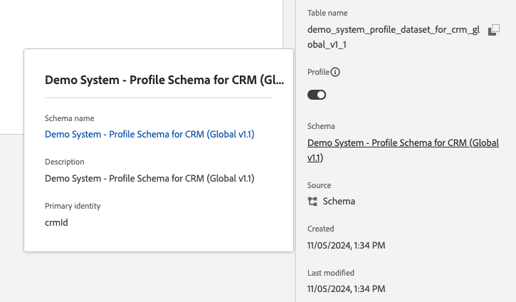

By clicking on the name of the schema, you're taken to the [!UICONTROL Schema] overview were you can see all the fields that have been activated for this schema.

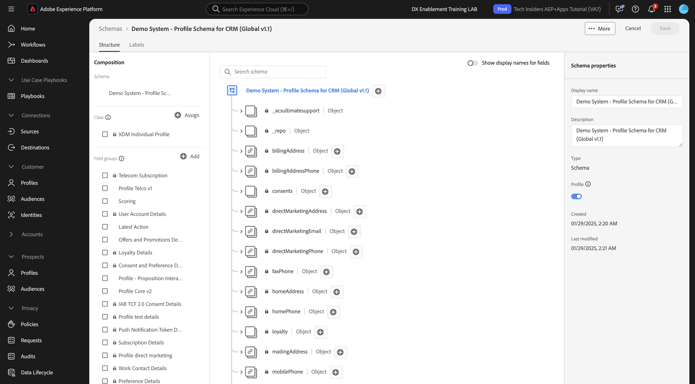

Every schema needs to have a custom, primary descriptor defined. In the case of our CRM dataset, the schema has defined that the field **[!UICONTROL crmId]** should be the primary identifier. If you want to create a schema and link it to the [!UICONTROL Real-time Customer Profile], you need to define a custom [!UICONTROL Field Group] that refers to your primary descriptor.

You can also see that our primary identity is located in `--aepTenantId--.identification.core.crmId`, linked to the [!UICONTROL namespace] of **[!UICONTROL Demo System - CRMID]**.

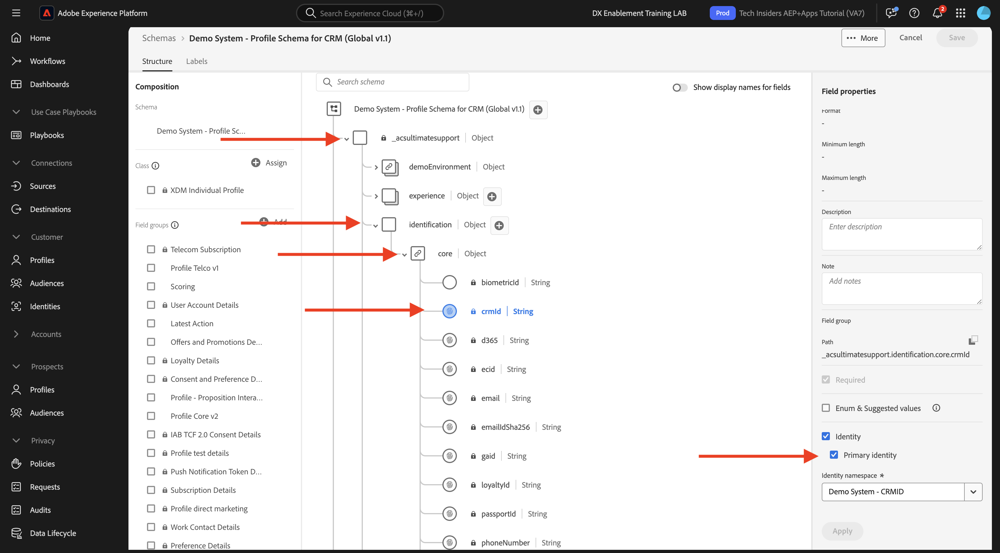

Every schema and as such, every dataset that should be used in the [!UICONTROL Real-time Customer Profile] should have one [!UICONTROL Primary identifier]. This [!UICONTROL Primary Identifier] is the identifier user by the brand for a customer in that dataset. In the case of a CRM dataset it might be the email-address or the CRM ID, in the case of a Call Center dataset it might be the mobile number of a customer.

It is best practice to create a separate, specific schema for every dataset and to set the descriptor for every dataset specifically to match how the current solutions used by the brand operate.

### Using a workflow to map a CSV file to an XDM Schema

The goal of this exercise is to onboard CRM data in AEP. All the data that is ingested in Platform should be mapped against the specific XDM Schema. What you currently have is a CSV dataset with 1000 lines on the one side, and a dataset that is linked to a schema on the other side. To load that CSV file in that dataset, a mapping needs to take place. To facilitate this mapping exercise, we have **[!UICONTROL Workflows]** available in Adobe Experience Platform.

Click **[!UICONTROL Map CSV to XDM Schema]** and then click **[!UICONTROL Launch]** to start the process.

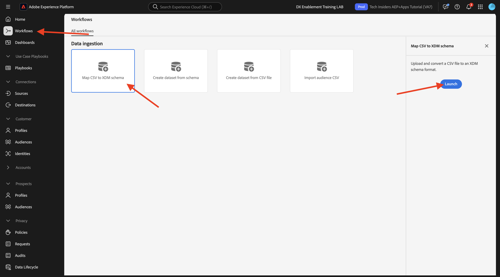

On the next screen, you need to select a dataset to ingest your file in. You have the choice between selecting an already existing dataset or creating a new one. For this exercise, we'll reuse an existing one: please select **[!UICONTROL Demo System - Profile Dataset for CRM (Global v1.1)]** as indicated below and leave the other settings set to default.

Click **Next**.

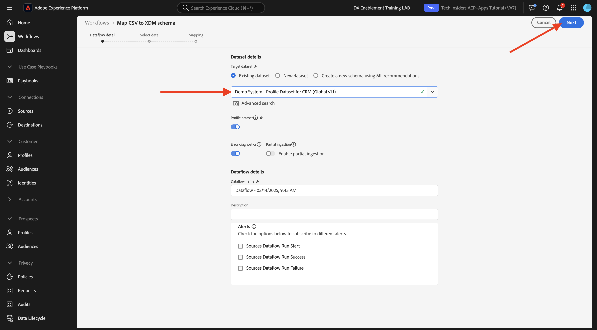

Drag & Drop your CSV-file or click **[!UICONTROL Choose files]** and navigate on your computer to your desktop and select your CSV-file.

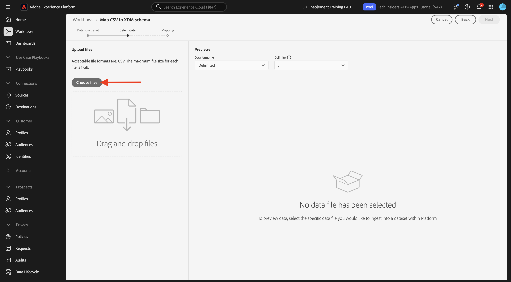

After selecting your CSV-file it will upload immediately and you will see a preview of your file within seconds.

Click **Next**.

You now need to map the column headers from your CSV file with an XDM-property in your **[!UICONTROL Demo System - Profile Dataset for CRM]**.

Adobe Experience Platform has already made some proposals for you, by trying to link the [!UICONTROL Source Attributes] with the [!UICONTROL Target Schema Fields].

>[!NOTE]
>
>If you see any errors on the mapping screen, don't worry. After following the below instructions, those errors will be resolved.

For the [!UICONTROL Schema Mappings], Adobe Experience Platform has tried to link fields together already. However, not all proposals of mapping are correct. You now need to update the **Target Fields** one-by-one.

#### birthDate

The Source Schema field **birthDate** should be linked to the target field **person.birthDate**. 

#### city

The Source Schema field **city** should be linked to the target field **homeAddress.city**. 

#### country

The Source Schema field **country** should be linked to the target field **homeAddress.country**. 

#### country_code

The Source Schema field **country_code** should be linked to the target field **homeAddress.countryCode**.  

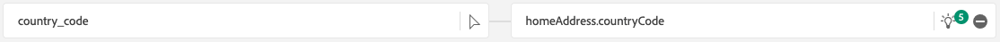

#### email

The Source Schema field **email** should be linked to the target field **personalEmail.address**. 

#### crmid

The Source Schema field **crmid** should be linked to the target field **`--aepTenantId--`.identification.core.crmId**. 

#### first_name

The Source Schema field **first_name** should be linked to the target field **person.name.firstName**. 

#### gender

The Source Schema field **gender** should be linked to the target field **person.gender**. 

#### home_latitude

The Source Schema field **home_latitude** should be linked to the target field **homeAddress._schema.latitude**. 

#### home_longitude

The Source Schema field **home_longitude** should be linked to the target field **homeAddress._schema.longitude**.  

#### id

The Source Schema field **id** should be linked to the target field **_id**. 

#### last_name

The Source Schema field **last_name** should be linked to the target field **person.name.lastName**. 

#### consents.marketing.email.val

The Source Schema field **consent.email** should be linked to the target field **consents.marketing.email.val**. 

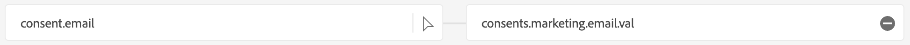

#### consents.marketing.commercialEmail.val

The Source Schema field **consent.commercialEmail** should be linked to the target field **consents.marketing.commercialEmail.val**.

#### consents.marketing.any.val

The Source Schema field **consent.any** should be linked to the target field **consents.marketing.any.val**.

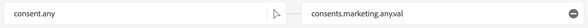

You should now have this. Click **Finish**.

After clicking **[!UICONTROL Finish]**, you'll then see the **Dataflow** overview, and after a couple of minutes you can refresh your screen to see if your workflow completed successfully. Click your **Target dataset name**. 

You'll then see the dataset where your ingestion has processed and you'll see a [!UICONTROL Batch ID] that has been ingested just now, with 1000 records ingested and a status of **[!UICONTROL Success]**. Click **[!UICONTROL Preview Dataset]**.

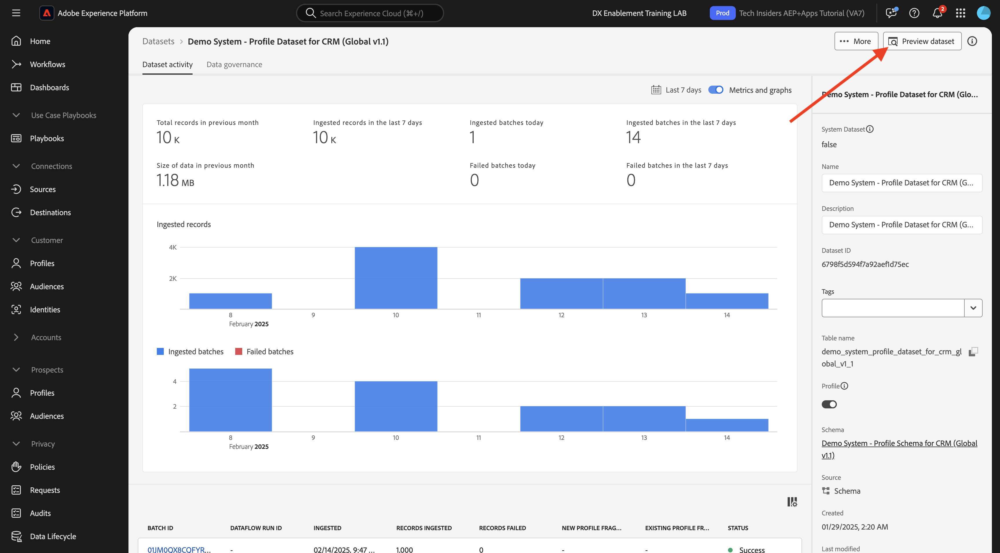

You'll now see a small sample of the dataset to ensure that the loaded data is correct.

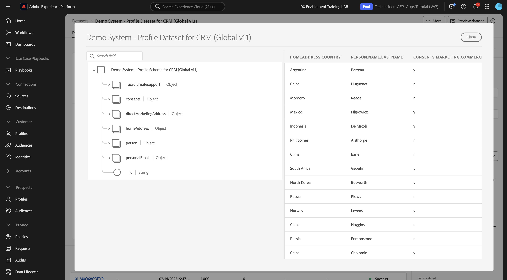

Once data is loaded, you can define the correct data governance approach for our dataset.
   
### Adding data governance to your dataset 

Now that your customer data is ingested, you need to make sure that this dataset is properly governed for usage and export control. Click on the **[!UICONTROL Data Governance]** tab and observe that you can set multiple types of restrictions: Contract, Identity, and Sensitive, Partner Ecosystem and Custom.
 
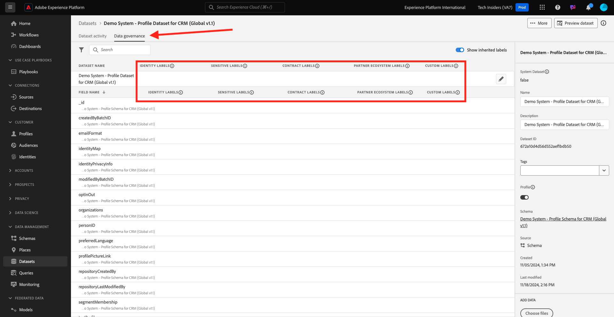

Let's restrict identity data for the entire dataset. Hover over your dataset name, and click the Pencil icon to edit the settings. 

Go to **[!UICONTROL Identity Labels]** and you'll see that the **[!UICONTROL I2]** option is checked - this will assume that all pieces of information in this dataset are at least indirectly identifiable to the person.

Click **[!UICONTROL Save Changes]**.

In another module, we'll do a deepdive on the whom framework of data governance and labels.

With this, you've now successfully ingested and classified CRM Data in Adobe Experience Platform.

## Next Steps

Go to [1.2.5 Data Landing Zone](./ex5.md){target="_blank"}

Go back to [Data Ingestion](./data-ingestion.md){target="_blank"}

Go back to [All modules](./../../../../overview.md){target="_blank"}
