# 1.3.3 Create a federated composition

You can now configure your federated audience composition in AEP.

Log in to Adobe Experience Platform by going to this URL: [https://experience.adobe.com/platform](https://experience.adobe.com/platform).

After logging in, you'll land on the homepage of Adobe Experience Platform.

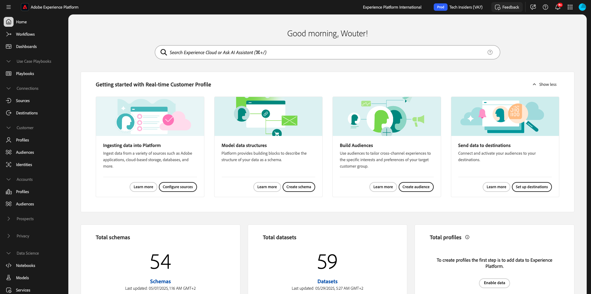

Before you continue, you need to select a **sandbox**. The sandbox to select is named `--aepSandboxName--`. After selecting the appropriate sandbox, you'll see the screen change and now you're in your dedicated sandbox.

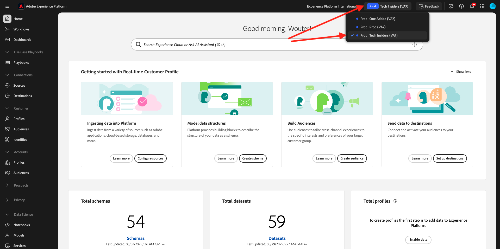

## 1.3.3.1 Create your audience

In the left menu, go to **Audiences** and then go to **Federated compositions**. Click **Create composition**.

For the label, use this: `--aepUserLdap-- - CitiSignal Fiber`. Select the data model that you created in the previous exercise, which is named `--aepUserLdap-- - CitiSignal Snowflake Data Model`. Click **Create**.

You'll then see this.

Click the **+** icon and click **Build audience**.

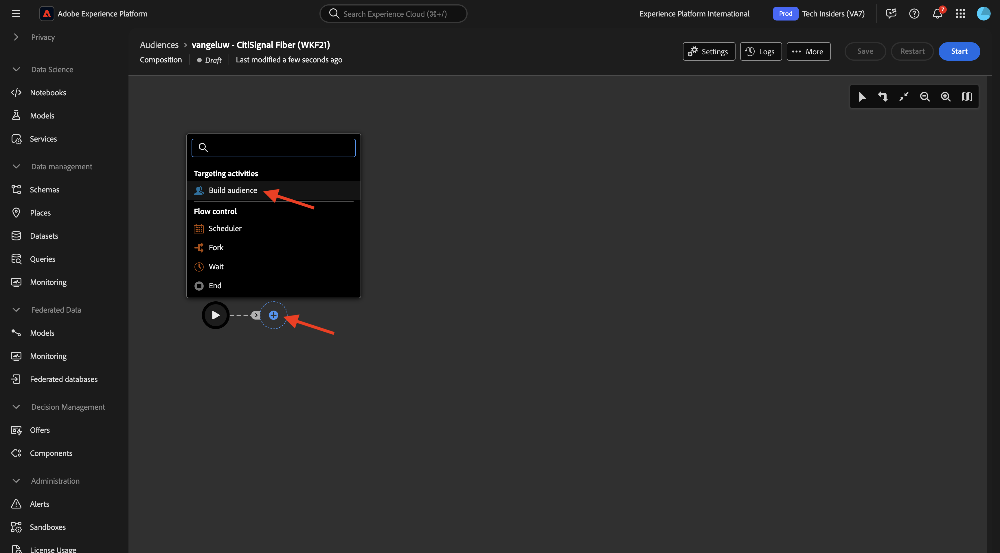

You'll then see this. Select **Create audience**. Click the **search** icon to select a schema.

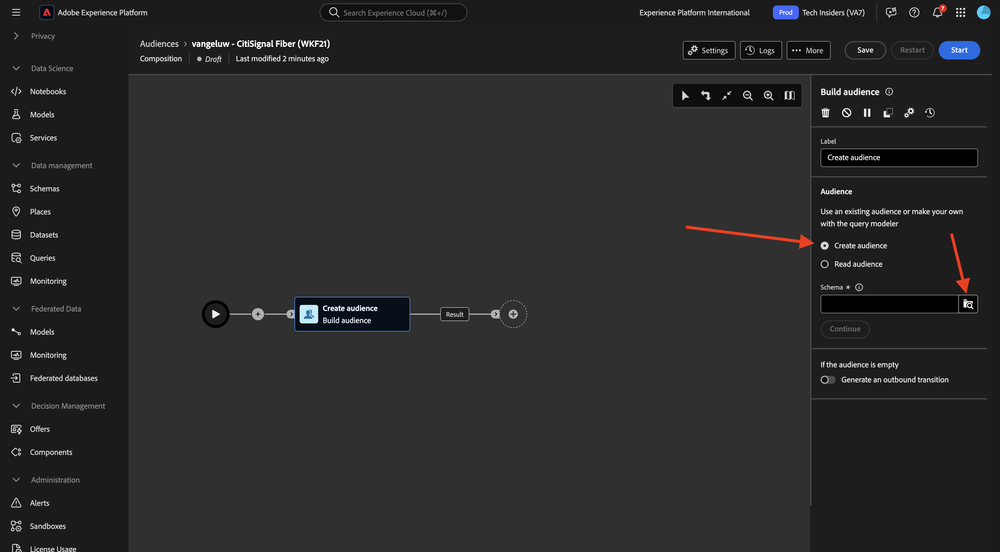

Select the schema **`--aepUserLdap--_HOUSEHOLDS`**. Click **Confirm**.

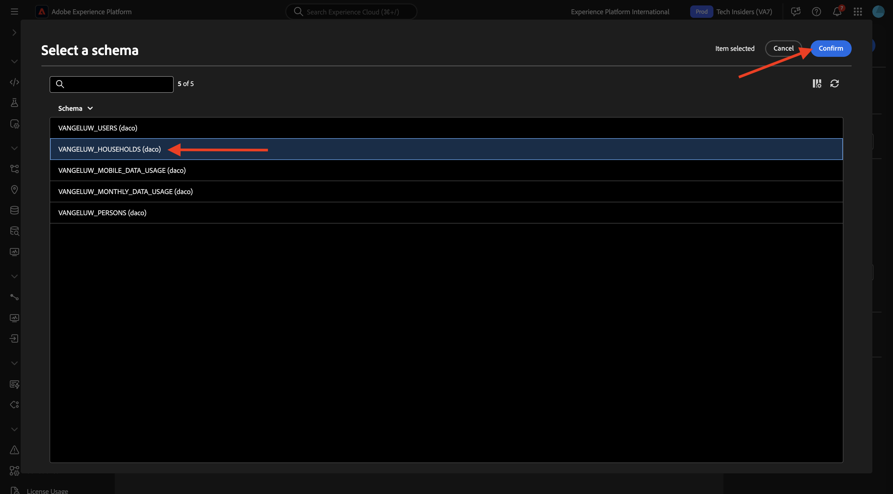

Next, click **Continue**.

You can now start building the query that will be sent to Snowflake. Click the **+** icon and then click **Custom condition**.

Select the attribute **ISELIGIBLEFORFIBER** Click **Confirm**. 

You'll then see this. Set the field **Value** to **True**. Click **Calculate** to push the query down to Snowflake and get an estimation of the profiles that now qualify.

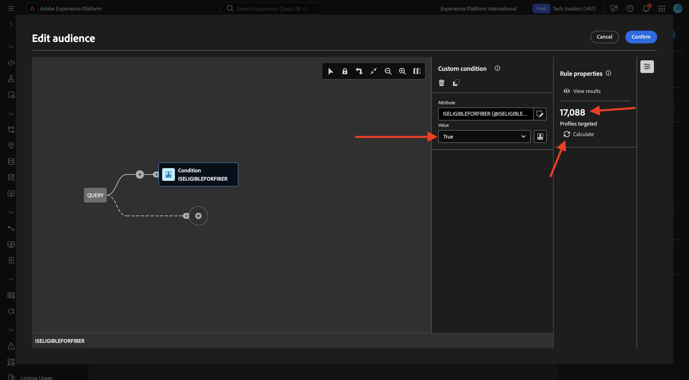

Then, click the **+** icon again and click **Custom condition** again to add another condition.

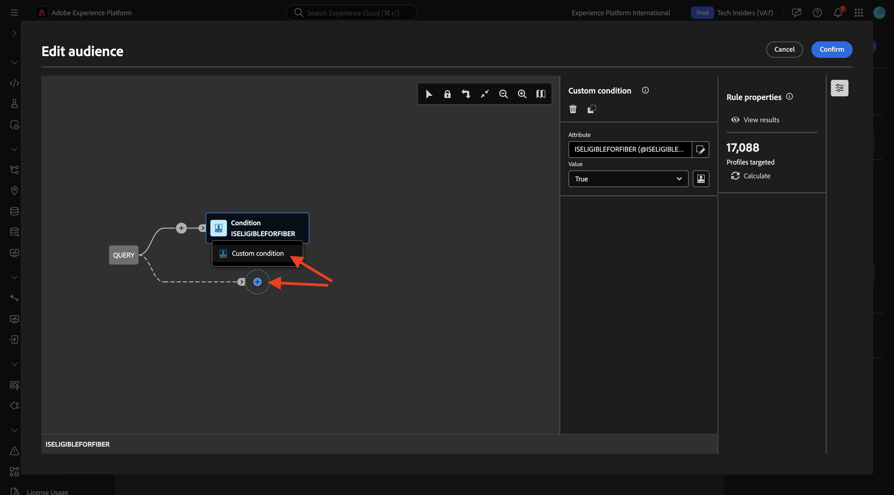

The second condition to add, is: `Is the user an existing CitiSignal Mobile subscriber?`. The way to answer that question is to use the relationship between the household and the primary customer in the household, which is defined in another table, **`--aepUserLdap--_PERSONS`**. You can drill down in the attribute menu using the **household2person** link.

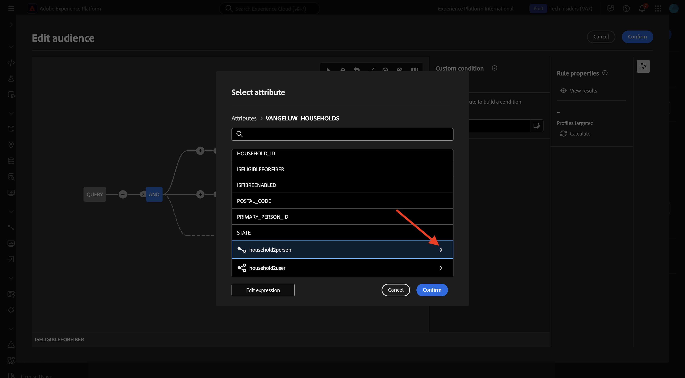

Select the attribute **ISMOBILESUB** and click **Confirm**.

Set the field **Value** to **True** Click **Calculate** again to update the number of profiles that will be targeted. Click **Confirm**.

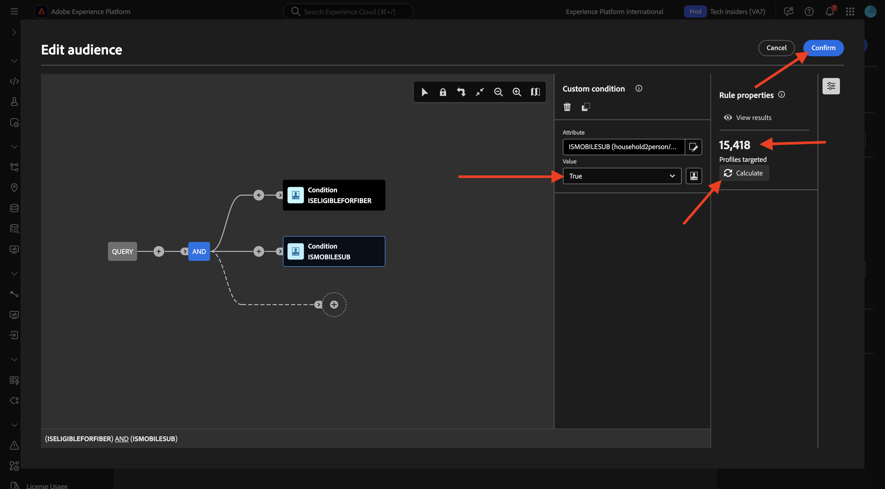

Click the **+** icon and then click **Save Audience**.

Set the **Audience label** to `--aepUserLdap-- - CitiSignal Eligible for Fiber`.

Click **+ Add Audience Mapping**.

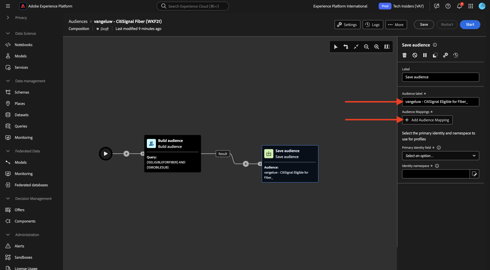

Select **HOUSEHOLD_ID** and click **Confirm**.

Click **+ Add Audience Mapping**.

Drill down by clicking **Targeting dimension**.

Drill down by clicking the link **household2person**. 

Select the field **NAME**. Click **Confirm**.

Click **+ Add Audience Mapping**.

Drill down by clicking **Targeting dimension**.

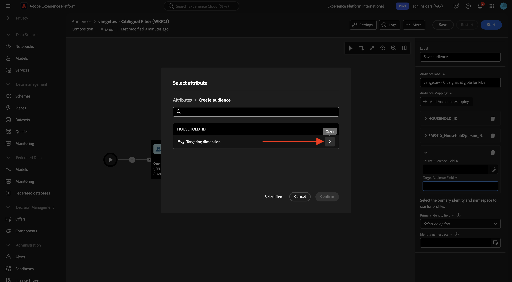

Drill down by clicking the link **household2person**. 

Select the field **EMAIL**. Click **Confirm**.

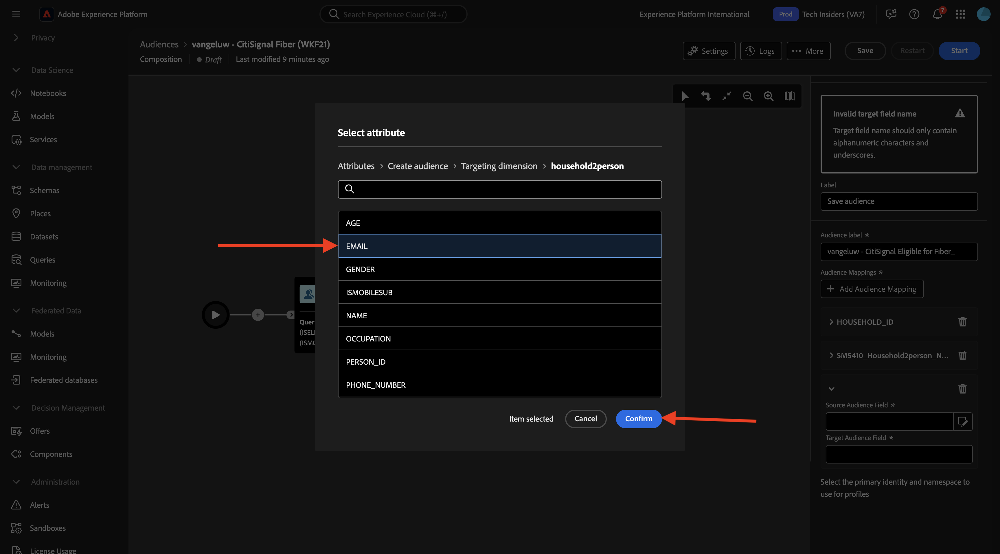

You'll then see this. You now need to set the **Primary identity field**, set it to **Household2person_EMAIL**. Set **Identity Namespace** to **Email**.

Click **Save**.

Your composition is now finished. Click **Start** to run it.

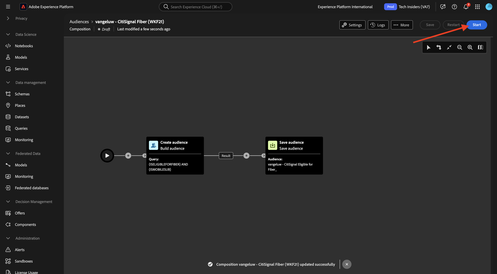

The query will now be pushed down into Snowflake, which will query the source data there. The results will be pushed back into AEP but source data remains in Snowflake. 

The audience is now populated, and the audience is targetable from within the AEP ecosystem.

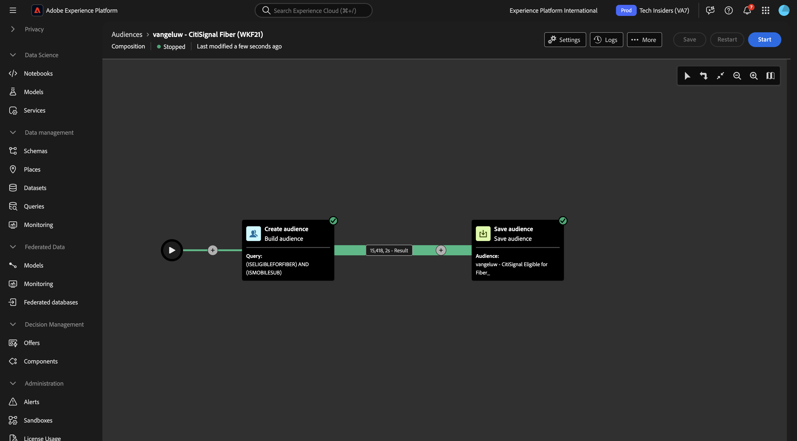

## Next Steps

Go to [Summary & benefits](./summary.md){target="_blank"}

Go back to [Federated Audience Composition](./fac.md){target="_blank"}

Go back to [All modules](./../../../../overview.md){target="_blank"}
