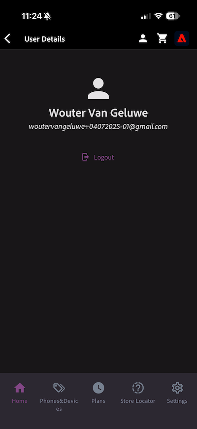

# 2.1.1 From unknown to known on the website

## Context

The journey from unknown to known is one of the most important topics amongst brands these days, as is the customer journey from acquisition to retention. 

Adobe Experience Platform plays a huge role in this journey. Platform is the brains for communication, the "experience system of record."

Platform is an environment in which the word customer is broader than just the known customers. An unknown visitor on the website is also a customer from Platform's perspective and as such, all of the behavior as an unknown visitor is also sent to Platform. Thanks to that approach, when this visitor eventually becomes a known customer, a brand can visualize what happened before that moment as well. This helps from an attribution and experience optimization perspective.

## Customer journey flow

Go to [https://dsn.adobe.com](https://dsn.adobe.com). After logging in with your Adobe ID, you'll see this. Click the 3 dots **...** on your website project and then click **Run** to open it.

You'll then see your demo website open up. Select the URL and copy it to your clipboard.

Open a new incognito browser window.

Paste the URL of your demo website, which you copied in the previous step. You'll then be asked to login using your Adobe ID.

Select your account type and complete the login process.

You'll then see your website loaded in an incognito browser window. For every exercise, you'll need to use a fresh, incognito browser window to load your demo website URL.

Click the Adobe logo icon in the top left corner of your screen to open the Profile Viewer.
  

Have a look at the Profile Viewer panel and the Real-time Customer Profile with the **Experience Cloud ID** as the primary identifier for thi currently unknown customer.
      

You can also see all the Experience Events that were collected based on the customer's behaviour. The list is currently empty but that will change soon.

Go to the **Phones & devices** product category. Next, click on the product **iPhone 16 Pro**.

You'll then see the product detail page. An event of type **Product View** has now been sent to Adobe Experience Platform using the Web SDK implementation that you reviewed in Module 1. 
  

  
Open the Provile Viewer panel and have a look at your **Events**.
  

  
Go back to the **Phones & devices** category page, and click another product. Another Experience Event has been sent to Adobe Experience Platform. Open the Profile Viewer panel. You'll now see 2 events of type **Product View**. While the behavior is anonymous, with proper consent in place, you're able to track every click and store it in in Adobe Experience Platform. Once the anonymous customer becomes known, we'll be able to merge all anonymous behavior automatically to the know profile.

Click **Sign In**.
  

  
Click **Create an account**.
  

Fill out your details and click **Register** after which you'll be redirected to the previous page. 
  

  
Open the Profile Viewer panel and go to Real-time Customer Profile. On the Profile Viewer panel, you should see all of your personal data displayed, like your newly added email and phone identifiers.

On the Profile Viewer panel, go to Experience Events. You'll see the 2 products that you viewed before on the Profile Viewer panel. Both of these events are now also connected to your 'known' profile.
  

  
You've now ingested data into Adobe Experience Platform and you've linked that data to identifiers like ECIDs and email-addresses. The goal of this is to understand the business context of what you're about to do. In the next exercise, you'll start configuring everything you need to make all that data ingestion possible.

### Navigate the mobile app

After becoming a known customer, it's time to start using the mobile app. Open the mobile app on your iPhone and then login to the app.

If you don't have the app installed anymore, or if you can't remember how to install it, please have a look here: [Use the mobile app](../../../getting-started/gettingstarted/ex5.md)

After installing the app as instructed, you'll see the landing page of the app with the Citi Signal brand loaded. Click the account icon in the top-left part of your screen.
  

On the Login screen, log in with the email address you used on the desktop website. Click **Login**.
  

You'll then get a confirmation that you're logged in.

Go to the app's home screen and go to the page **Phones & Devices**.
  

Click any product on the page.

You'll then see the product detail page.
  

Go to the home screen in the app and click the Adobe icon to view the Profile Viewer panel. You'll then see the **Profile Attributes** view, which now shows a combined view of your web and mobile app activity. Go to **Events**

You'll then see the product you just viewed in the **Experience Events** section, along with all the product views from the website session before.

>[!NOTE]
>
>It may take a couple of minutes before you see the consolidated view in the app and on the website.
 

Now go back to your desktop computer and refresh the homepage, after which you'll see the product appear there, too.

>[!NOTE]
>
>It may take a couple of minutes before you see the consolidated view in the app and on the website.

You've now ingested data into Adobe Experience Platform and you've linked that data to identifiers like ECIDs and email addresses. The goal of this exercise was to understand the business context of what you're about to do. You've now effectively built a real-time, cross-device customer profile. In the next exercise, you'll go ahead and visualize your profile in Adobe Experience Platform.

## Next Steps

Go to [2.1.2 Visualize your own real-time customer profile - UI](./ex2.md){target="_blank"}

Go back to [Real-time Customer Profile](./real-time-customer-profile.md){target="_blank"}

Go back to [All modules](./../../../../overview.md){target="_blank"}
