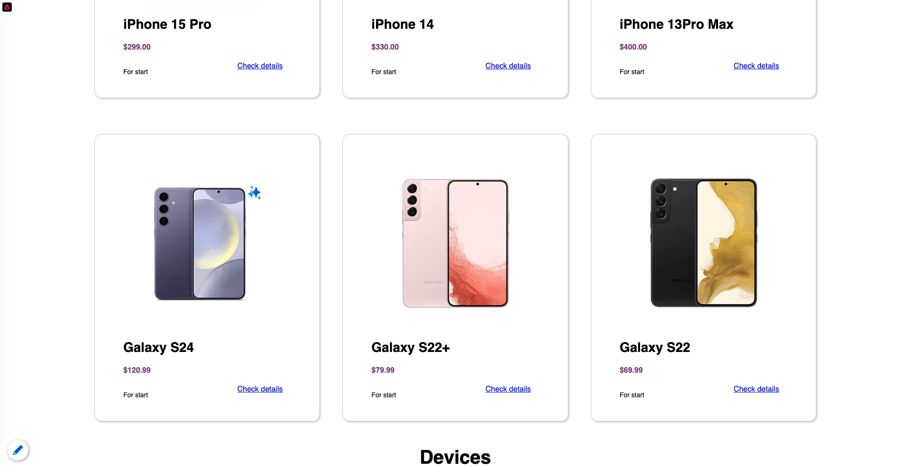
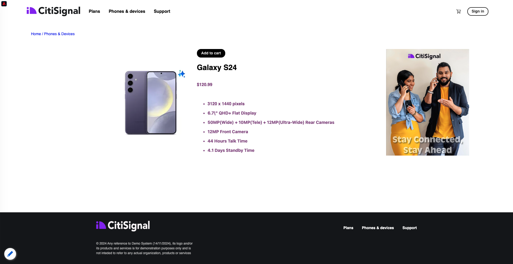
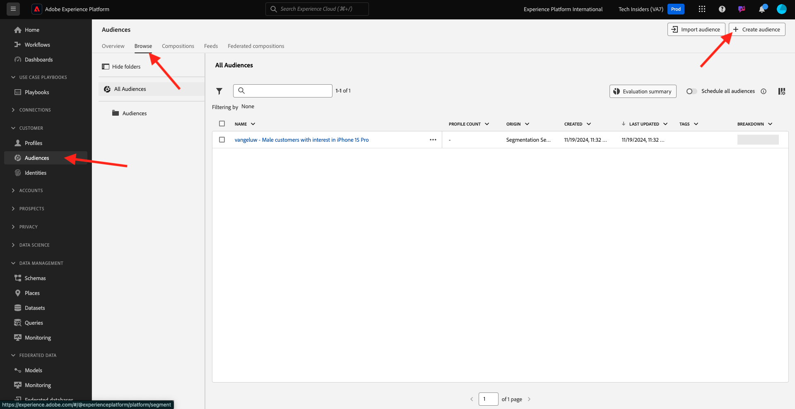
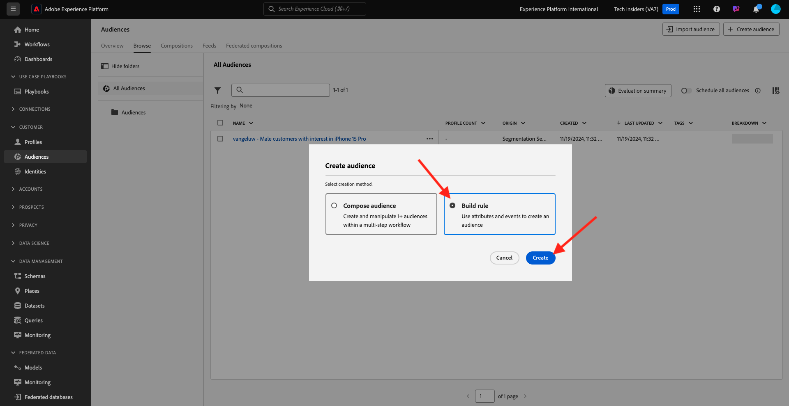
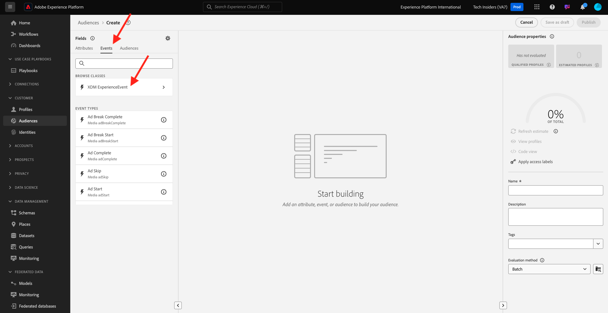
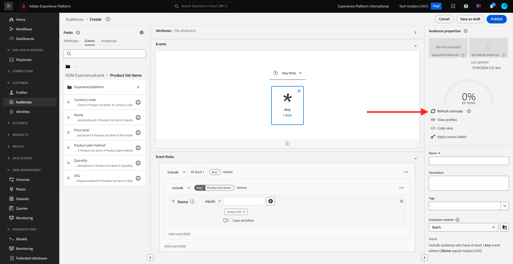
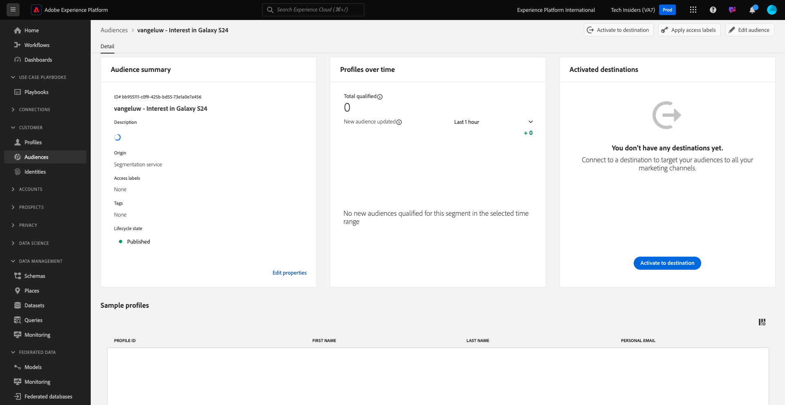

# 2.3.1 Create an audience

In this exercise, you'll create an audience by making use of Adobe Experience Platform's audience builder.

## Context

Responding to a customer's interest needs to be real-time. One of the ways of responding to customer behavior in real-time is by using an audience, on the condition that the audience qualifies in real-time. In this exercise, you need to build out an audience, taking into account real activity on the website that we've been using.

## Identify the behavior you want to react to

Go to [https://dsn.adobe.com](https://dsn.adobe.com). After logging in with your Adobe ID, you'll see this. Click the 3 dots **...** on your website project and then click **Run** to open it.

You'll then see your demo website open up. Select the URL and copy it to your clipboard.

Open a new incognito browser window.

Paste the URL of your demo website, which you copied in the previous step. You'll then be asked to login using your Adobe ID.

Select your account type and complete the login process.

You'll then see your website loaded in an incognito browser window. For every exercise, you'll need to use a fresh, incognito browser window to load your demo website URL.

In this example, you want to respond to a specific customer viewing a specific product.
From the **Citi Signal** homepage, go to **Phones & devices**, and click the product **Galaxy S24**.

So when somebody visits the product page for **Galaxy S24**, you want to be able to take action. The first thing to do to take action, is define an audience.

## Create the audience

Go to [Adobe Experience Platform](https://experience.adobe.com/platform). After logging in, you'll land on the homepage of Adobe Experience Platform.

Before you continue, you need to select a **sandbox**. The sandbox to select is named ``--aepSandboxName--``. After selecting the appropriate [!UICONTROL sandbox], you'll see the screen change and now you're in your dedicated [!UICONTROL sandbox].

In the menu on the left side, go to **Audiences** and then go to **Browse** where you can see an overview of all existing audences. Click on the **Create Audience** button to start creating a new audience.

Select **Build Rule** and click **Create**.

As mentioned above, you need to build an audience out of all customers that have viewed the product **Galaxy S24**.

To build out this audience, you need to add an event. You can find all events by clicking on the **Events** icon in the **Audiences** menu bar.

Next, you'll see the top level **XDM ExperienceEvent** node.

To find customers that have visited the **Galaxy S24** product, click on **XDM ExperienceEvent**.

Scroll down to **Product List Items** and click it.

Select **Name** and drag and drop the **Name** object from the left **Product List Items** menu onto the audience builder canvas into the **Events** section.

The comparison parameter should be **equals** and in the input field, enter `Galaxy S24`.

Your **Event Rules** should now look like this. Every time you add an element to the audience builder, you can click the **Refresh Estimate** button to get a new estimate of the population in your audience.

Give your audience a name and set the **Evaluation Method** to **Edge**.

As a naming convention, use:

- `--aepUserLdap-- - Interest in Galaxy S24`

Next, click the **Publish** button to save your audience.

You'll now be taken back to the audience overview page.

## Next Steps

Go to [2.3.2 Review how to configure DV360 Destination using Destinations](./ex2.md){target="_blank"}

Go back to [Real-time CDP - Build an audience and take action](./real-time-cdp-build-a-segment-take-action.md){target="_blank"}

Go back to [All modules](./../../../../overview.md){target="_blank"}