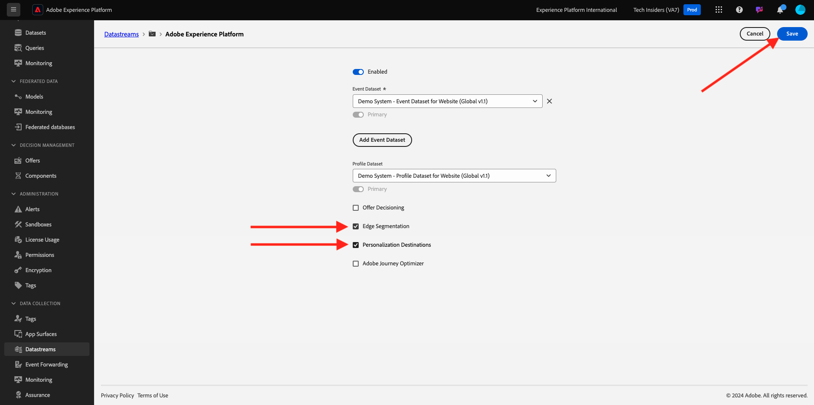
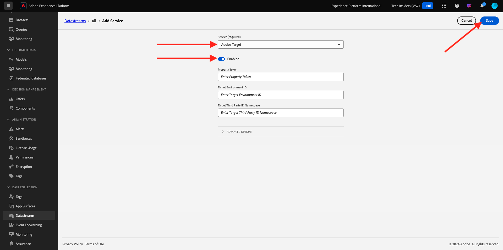

# 2.3.5 Take Action: send your audience to Adobe Target

Go to [Adobe Experience Platform](https://experience.adobe.com/platform). After logging in, you'll land on the homepage of Adobe Experience Platform.


Before you continue, you need to select a **sandbox**. The sandbox to select is named ``--aepSandboxName--``. After selecting the appropriate [!UICONTROL sandbox], you'll see the screen change and now you're in your dedicated [!UICONTROL sandbox].


## Verify your Datastream

The Adobe Target destination in Real-Time CDP is connected to the datastream that is used to ingest data into the Adobe Edge Network. If you want to setup your Adobe Target destination, you first need to verify whether your datastream is already enabled for Adobe Target. Your datastram was configured in [Exercise 0.2 Create your Datastream](./../../../modules/../getting-started/gettingstarted/ex2.md) and was named `--aepUserLdap-- - Demo System Datastream`.

In the left menu, scroll down and click **Datastreams**. In Datastreams, search for your datastream which is named `--aepUserLdap-- - Demo System Datastream`. Click your datastream to open it.


You'll then see this, click **...** next to **Adobe Experience Platform** and then click **Edit**.


Check the checkboxes for both **Edge Segmentation** and **Personalization Destinations**. Click **Save**.



Next, click **+ Add Service**.


Select the service **Adobe Target**. Click **Save**.



Your datastream is now configured for Adobe Target.


## Setup your Adobe Target destination

Adobe Target is available as a destination from Real-Time CDP. To setup your Adobe Target integration, go to **Destinations**, to **Catalog**.

Click **Personalization** in the **Categories** menu. You'll then see the **(v2) Adobe Target** destination card.


Click **Connnect to destination**.


You'll then see this. You need to create your own Adobe Target destination, follow these guidelines:

- Name: use the name `--aepUserLdap-- - Adobe Target v2  (Web)`.
- Datastream ID: you need to select the datastream that you configured in [Exercise 0.2 Create your Datastream](./../../../modules/../getting-started/gettingstarted/ex2.md). The name of your datastream should be: `--aepUserLdap-- - Demo System Datastream`.
- Workspace: this is related to Adobe Target workspaces. If there is no specific workspace you need to use, then select **Default Workspace**.

Click **Next**.


You can now optionally select a data governance policy. Click **Next**.


In the list of available audiences, select the audience you created in  the previous exercise [Create an audience](./ex1.md), which is named `--aepUserLdap-- - Interest in Galaxy S24`. Then, click **Next**.


On the **Mapping** screen, you can map profile attributes to become available in Adobe Target. This helps you add an extra layer of personalization on your website. Click **Add New Field**.


For the new field, select the field **person.name.firstName**. Click **Save**.


You'll then have this. Click **Next**.


Click **Finish**. 


Your audience is now activated towards Adobe Target.


>[!IMPORTANT]
>
>When you've just created your Adobe Target destination in Real-Time CDP, it may take up to an hour for the destination to be live. This is a one-off wait time, due to the setup of the backend configuration. Once the initial 1 hour wait time and backend configuration is done, newly added audiences that are sent to the Adobe Target destination will be available for targeting in real-time.

## Configure your Adobe Target form-based activity 

Now that your Real-Time CDP audience is configured to be sent to Adobe Target, you can configure your Experience Targeting activity in Adobe Target. In this exercise you'll configure a Form-based activity.

Go to the Adobe Experience Cloud homepage by going to [https://experiencecloud.adobe.com/](https://experiencecloud.adobe.com/). Click **Target** to open it.


On the **Adobe Target** homepage, you'll see all existing Activities. Click **Create Activity**, then click **Experience Targeting**.


Select **Web**, **Form** and **No Property Restrictions**. Click **Create**. 


You're now in the Form-based activity composer.


For the field **LOCATION 1**, select **target-global-mbox**.


The default audience is currently **All Visitors**. Click on the **3 dots** next to **All Visitors** and click **Change Audience**.


You're now seeing the list of available audiences, and the Adobe Experience Platform audience that you created earlier and sent to Adobe Target is now part of this list. Select the audience you previously created in Adobe Experience Platform. Click **Assign Audience**.


Your Adobe Experience Platform audience is now part of this Experience Targeting Activity.


Let's now change the Hero Image on the homepage of the website. Click to open the dropdown list next to **Default Content** and click **Create HTML Offer**.


Paste the following code. 

```javascript
<script>document.querySelector("#SpectrumProvider > div.App > div > div.Page.home > main > div.Banner.Banner--alignment-right.Banner--verticalAlignment-middle.main-banner > div.Image > img").src="https://tech-insiders.s3.us-west-2.amazonaws.com/citisignal-new-hero.png"; document.querySelector("#SpectrumProvider > div.App > div > div.Page.home > main > div.Banner.Banner--alignment-right.Banner--verticalAlignment-middle.main-banner > div.Banner__content > div > div > h1").innerHTML="Hi there ";
document.querySelector("#SpectrumProvider > div.App > div > div.Page.home > main > div.Banner.Banner--alignment-right.Banner--verticalAlignment-middle.main-banner > div.Banner__content > div > div > div > div > p").innerHTML="What about 10% off of your next Galaxy S24 smartphone?";
</script>
```


Next, you need to add in a personalization token from Adobe Experience Platform's profile attributes. Remember, when you activated the audience to Adobe Target, you also select the field **person.name.firstName** to be shared with Adobe Target. To retrieve the field, select the source **Adobe Experience Platform**, select your sandbox (which should be `--aepSandboxName--`) and then select the attribute **person.name.firstName**.


Before you click the **Add** button, make sure to go to the line where you see `... > h1").innerHTML="Hi there ";` and put your cursor inside the brackets after the word `there`, like this:

```
... > h1").innerHTML="Hi there ";
```

Then click the **Add** button, which should then add the token, which will update the code like this:

```
... > h1").innerHTML="Hi there ${aep.person.name.firstName}";
```


Click **Next**.


You'll then see the overview of your experience with the new image, for your selected Audience. Click **Next**.


Click the title of your Activity in the upper left corner to rename it, like this: `--aepUserLdap-- - RTCDP - XT (Form)`


On the **Goals & Settings** - page, go to **Goal Metrics**. Set the Primary Goal to **Engagement** - **Time On Site**. Click **Save & Close**.


You're now on the **Activity Overview** page. You still need to activate your Activity. Click on the field **Inactive** and select **Activate**.


You'll then get a visual confirmation that your activity is now live.


Your activity is now live and can be tested on the demo website.

>[!IMPORTANT]
>
>When you've just created your Adobe Target destination in Real-Time CDP, it may take up to an hour for the destination to be live. This is a one-off wait time, due to the setup of the backend configuration. Once the initial 1 hour wait time and backend configuration is done, newly added edge audiences that are sent to the Adobe Target destination will be available for targeting in real-time.

If you now go back to your demo website and visit the product page for Galaxy S24, you'll then qualify for the audience that you created, and you'll see the Adobe Target activity be displayed on the home page in real-time.


## Next Steps

Go to [2.3.6 Destinations SDK](./ex6.md){target="_blank"}

Go back to [Real-time CDP - Build an audience and take action](./real-time-cdp-build-a-segment-take-action.md){target="_blank"}

Go back to [All modules](./../../../../overview.md){target="_blank"}
