# 2.4.2 Configure your Microsoft Azure EventHub environment

Azure Event Hubs is a highly scalable publish-subscribe service that can ingest millions of events per second and stream them into multiple applications. This lets you process and analyze the massive amounts of data produced by your connected devices and applications.

## What is Azure Event Hubs?

Azure Event Hubs is a big data streaming platform and event ingestion service. It can receive and process millions of events per second. Data sent to an event hub can be transformed and stored by using any real-time analytics provider or batching/storage adapters.

Event Hubs represents the **front door** for an event pipeline, often called an event ingestor in solution architectures. An event ingestor is a component or service that sits between event publishers (like Adobe Experience Platform RTCDP) and event consumers to decouple the production of an event stream from the consumption of those events. Event Hubs provides a unified streaming platform with time retention buffer, decoupling event producers from event consumers.

## Create a Event Hubs namespace

Go to [https://portal.azure.com/#home](https://portal.azure.com/#home) and select **Create a resource**. 

In the resource screen, enter **Event** in the search bar. Find the **Event Hubs** card, click **Create** and then click **Event Hubs**..

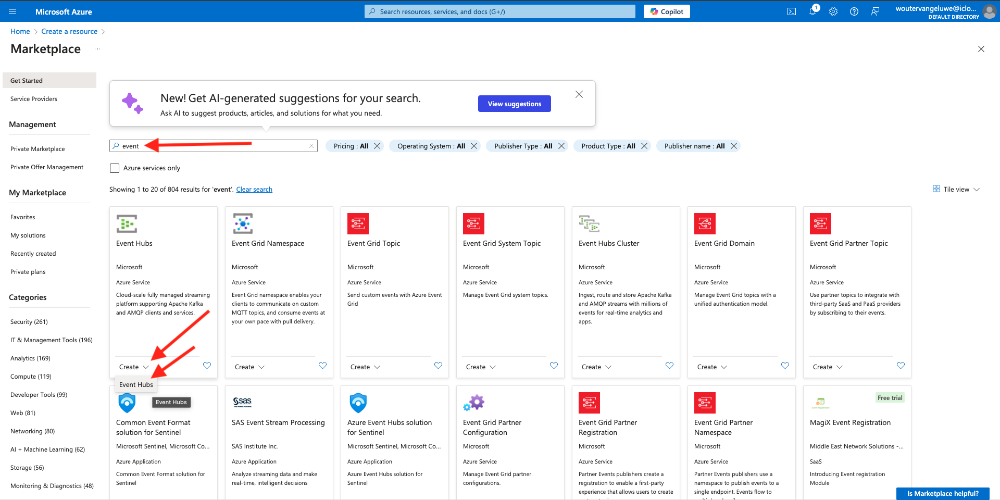

If this is the first time that you create a resource in Azure, you will need to create a new **Resource group**. If you have already a resource group you can select it (or create a new one).

Click **Create new** and name your group `--aepUserLdap---aep-enablement`, click **OK**.

Complete the rest of the fields as indicated:

- Namespace : Define your namespace, it has to be unique, use the following pattern `--aepUserLdap---aep-enablement`
- Location: choose any location
- Pricing tier: **Basic**
- Throughput Units: **1**

Click **Review + create**.

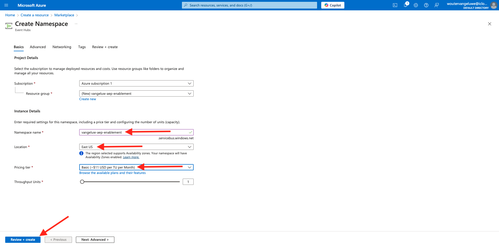

Click **Create**.

The deployment of your resource group can take 1-2 minutes, when successful you will see the following screen:

## Setup your Event Hub in Azure

Go to [https://portal.azure.com/#home](https://portal.azure.com/#home) and select **All resources**. 

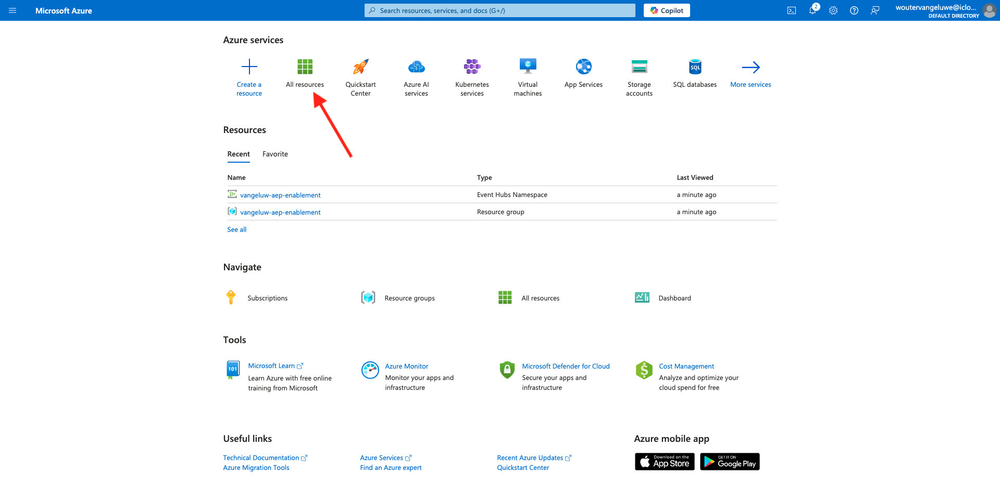

From the resource list, click your `--aepUserLdap---aep-enablement` Event Hubs Namespace:
  
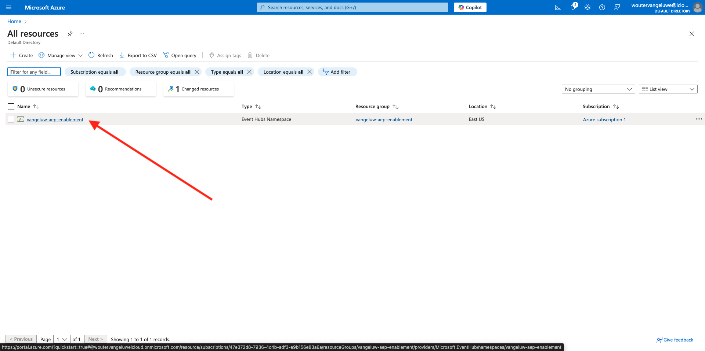
  
In `--aepUserLdap---aep-enablement` detail screen, go to **Entities** and click **Event Hubs**:
  
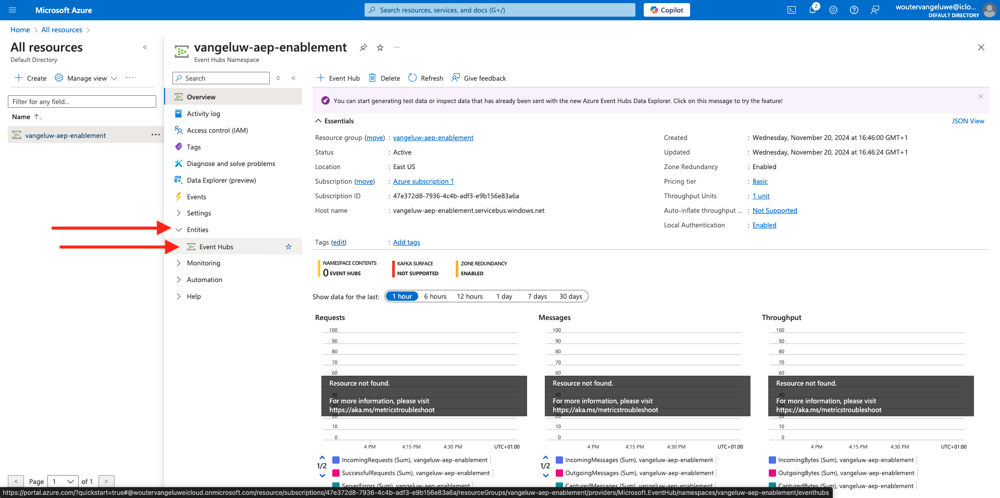

Click **+ Event Hub**.

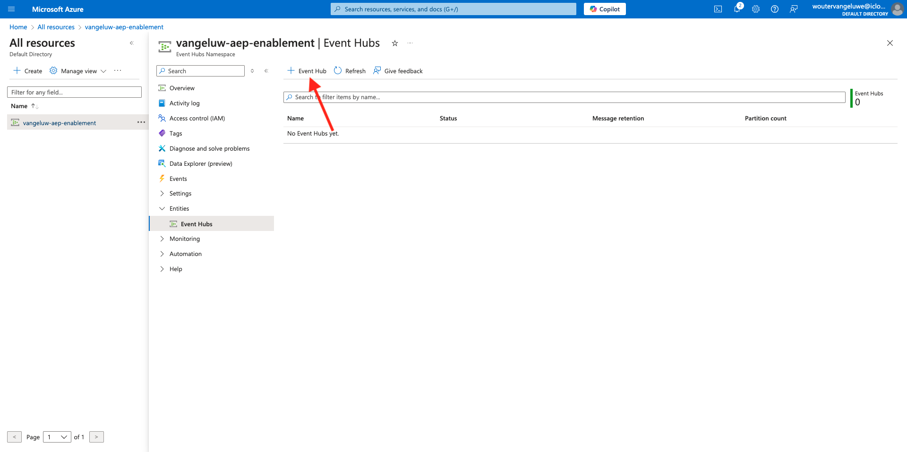

Use `--aepUserLdap---aep-enablement-event-hub` as the name and click **Review + Create**.

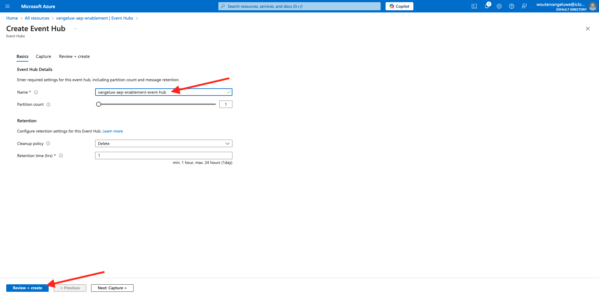

Click **Create**.
  
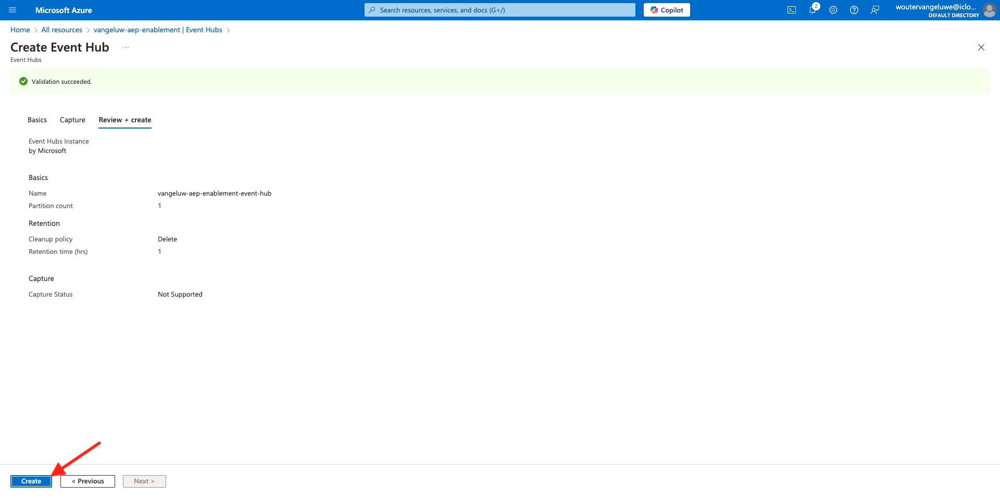

In **Event Hubs** under your event hub namespace, you'll now see your **Event Hub** listed. 

## Setup your Azure Storage Account

To debug your Azure Event Hub function in later exercises, you'll need to provide an Azure Storage Account as part of your Visual Studio Code project setup. You'll now create that Azure Storage Account.

Go to [https://portal.azure.com/#home](https://portal.azure.com/#home) and select **Create a Resource**.

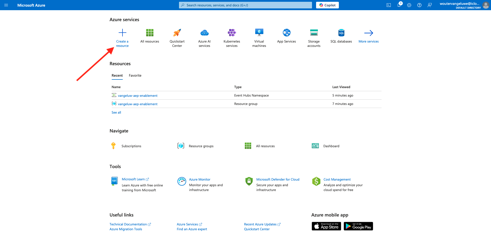

Enter **storage account** in the search, find the card for **Storage Account** and click **Storage account**..

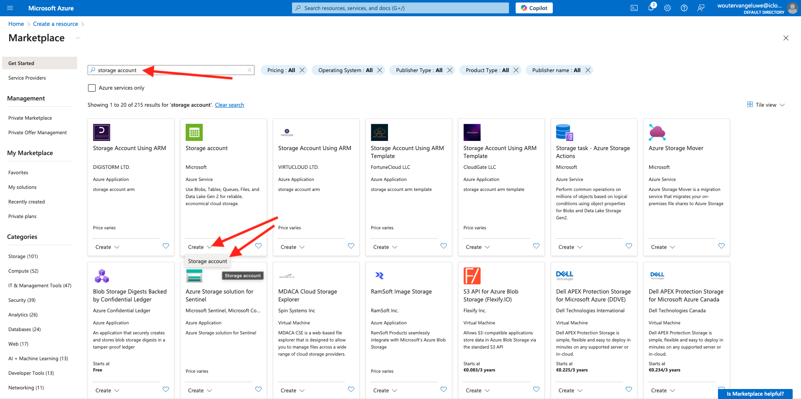

Specify your **Resource Group** (created in the beginning of this exercise), use `--aepUserLdap--aepstorage` as your Storage account name and select **Locally-redundant storage (LRS)**, then click **Review + create**.

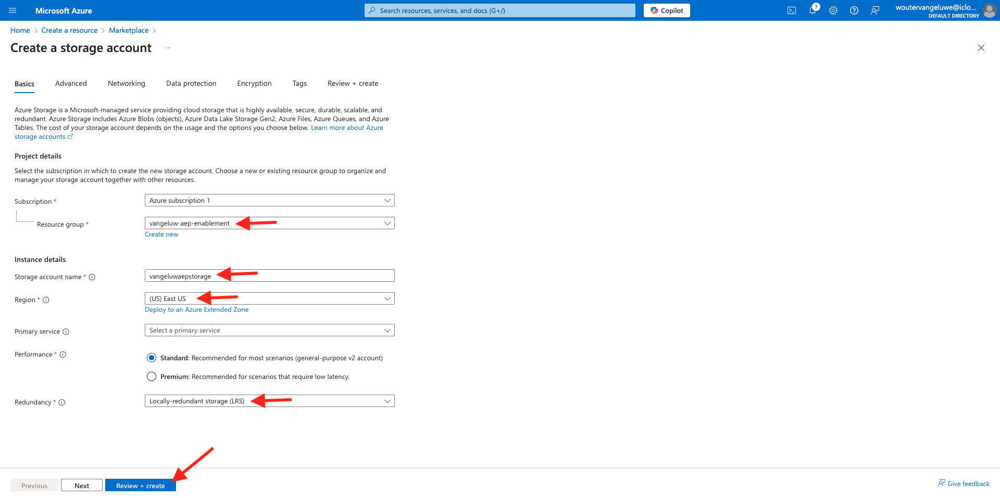

Click **Create**.

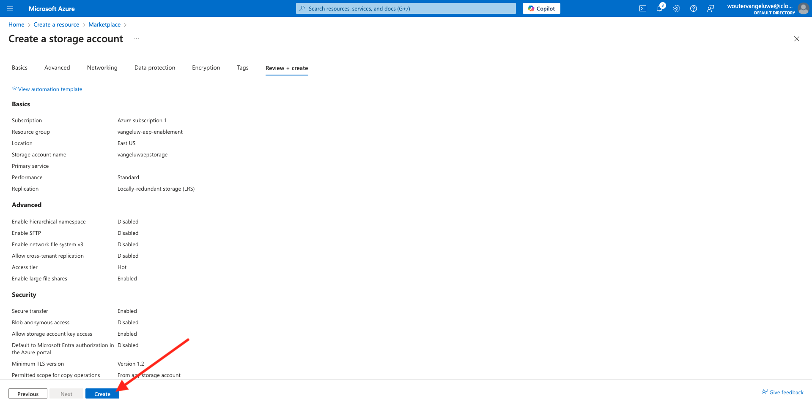

Creation of our storage account will take a couple seconds:

When finished your screen will display the **Go to resource** button.

Click **Home**.

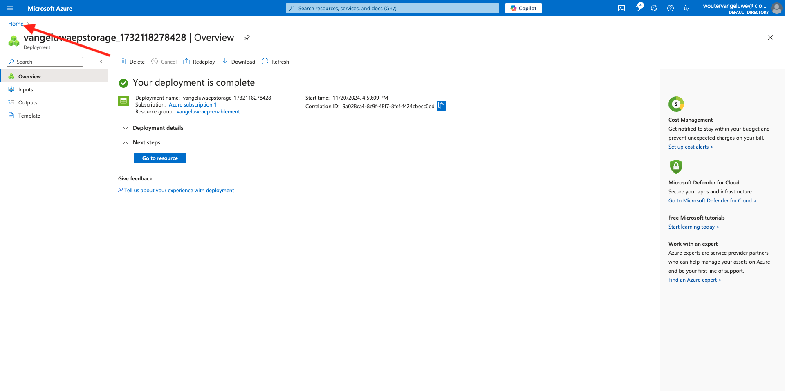

Your Storage Account is now visible under **Recent Resources**.

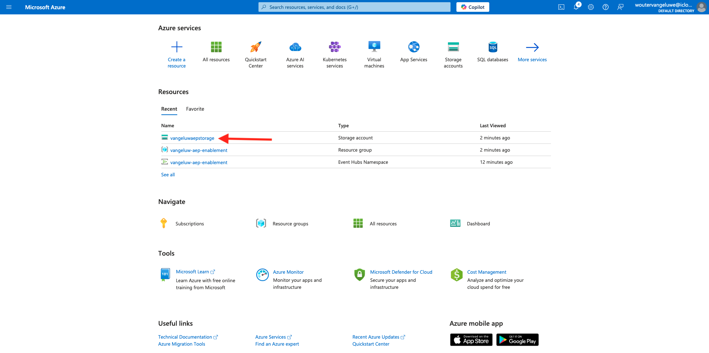

## Next Steps

Go to [2.4.3 Configure your Azure Event Hub Destination in Adobe Experience Platform](./ex3.md){target="_blank"}

Go back to [Real-Time CDP: Audience Activation to Microsoft Azure Event Hub](./segment-activation-microsoft-azure-eventhub.md){target="_blank"}

Go back to [All modules](./../../../../overview.md){target="_blank"}
