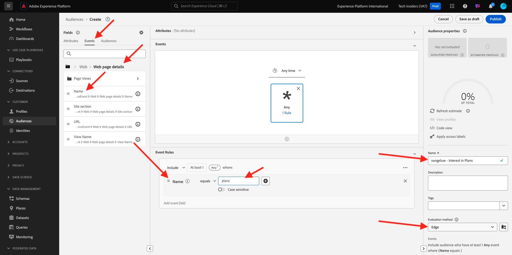
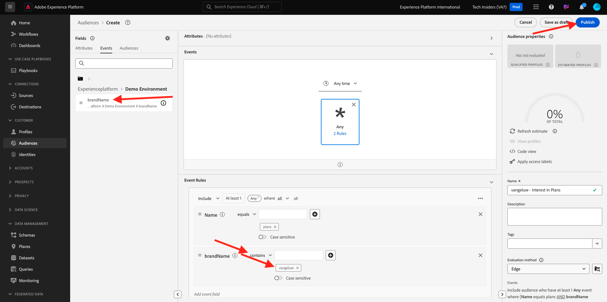

# 2.4.4 Create an audience

## Introduction

You'll create a simple audience:

- **Interest in Plans** for which customers will qualify when they visit the **Plans** page of the CitiSignal demo website. 

### Good to know

Real-time CDP will trigger an activation to a destination when you qualify for an audience that is part of that destination's activation list. When that is the case, the audience qualification payload that will be sent to that destination will contain **all the audiences for which your customer profile qualifies**. 

The goal of this module is to show that your Customer Profile's audience qualification is sent to your Event Hub destination in near real-time. 

### Audience Status

An audience qualification in Adobe Experience Platform always has a **status**-property and can be one of the following:

- **realized**: this indicates a new audience qualification
- **exited**: this indicates that the profile does no longer qualify for the audience

## Build the audience

Log in to Adobe Experience Platform by going to this URL: [https://experience.adobe.com/platform](https://experience.adobe.com/platform).

After logging in, you'll land on the homepage of Adobe Experience Platform.

Before you continue, you need to select a **sandbox**. The sandbox to select is named ``--aepSandboxName--``. After selecting the appropriate sandbox, you'll see the screen change and now you're in your dedicated sandbox.

Go to **Audiences**. Click the **+ Create audience** button.

Select **Build rule** and click **Create**.

Name your audience `--aepUserLdap-- - Interest in Plans`, set the evaluation method to **Edge** and add the page name from the experience event.

Click on **Events**, and drag and drop **XDM ExperienceEvent > Web > Web page details > Name**. Enter **plans** as the value:

Drag and drop **XDM ExperienceEvent > `--aepTenantId--` > demoEnvironment > brandName**. Enter `--aepUserLdap--` as the value, set the comparison parameter to **contains** and click **Publish**:

Your audience is now published.

## Next Steps

Go to [2.4.5 Activate your audience](./ex5.md){target="_blank"}

Go back to [Real-Time CDP: Audience Activation to Microsoft Azure Event Hub](./segment-activation-microsoft-azure-eventhub.md){target="_blank"}

Go back to [All modules](./../../../../overview.md){target="_blank"}