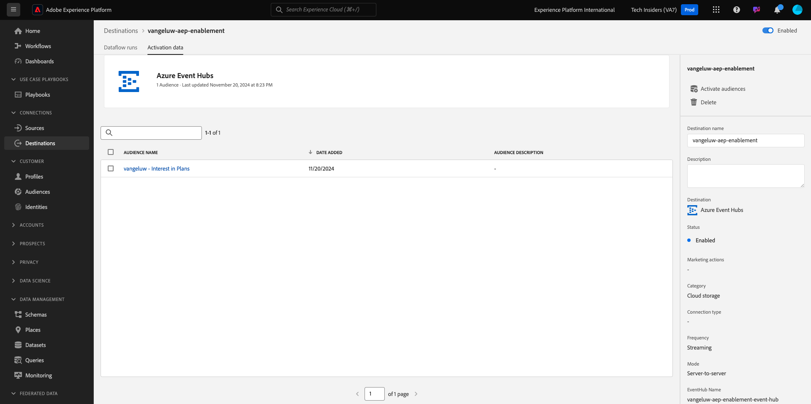

# 2.4.5 Activate your audience

## Add audience to Azure Event Hub Destination

In this exercise you will add your audience `--aepUserLdap-- - Interest in Plans` to your `--aepUserLdap---aep-enablement` Azure Event Hub destination.

Log in to Adobe Experience Platform by going to this URL: [https://experience.adobe.com/platform](https://experience.adobe.com/platform).

After logging in, you'll land on the homepage of Adobe Experience Platform.

Before you continue, you need to select a **sandbox**. The sandbox to select is named ``--aepSandboxName--``. After selecting the appropriate sandbox, you'll see the screen change and now you're in your dedicated sandbox.

Go to **Destinations**, then click **Browse**. You'll then see all available destinations. Locate your destination and click the 3 dots**...** as indicated below, then click **Activate audiences**.

You'll then see this. Search for your audience using your ldap and select `--aepUserLdap-- - Interest in Plans` from the list of audiences.

Click **Next**.

Click **Add new field**, click browse schema and select the field `--aepTenantId--identification.core.ecid` (delete any other field that would be displayed automatically).

Click **Next**.

Click **Finish**.

Your audience is now activated towards your Microsoft Event Hub destination.

## Next Steps

Go to [2.4.6 Create your Microsoft Azure Project](./ex6.md){target="_blank"}

Go back to [Real-Time CDP: Audience Activation to Microsoft Azure Event Hub](./segment-activation-microsoft-azure-eventhub.md){target="_blank"}

Go back to [All modules](./../../../../overview.md){target="_blank"}
