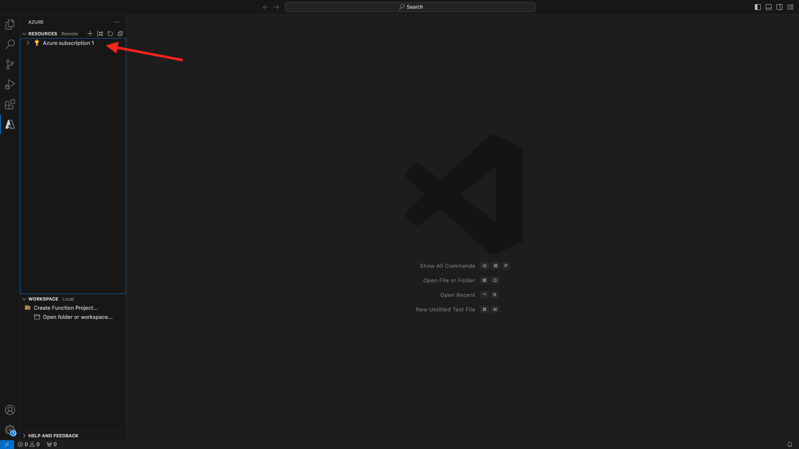
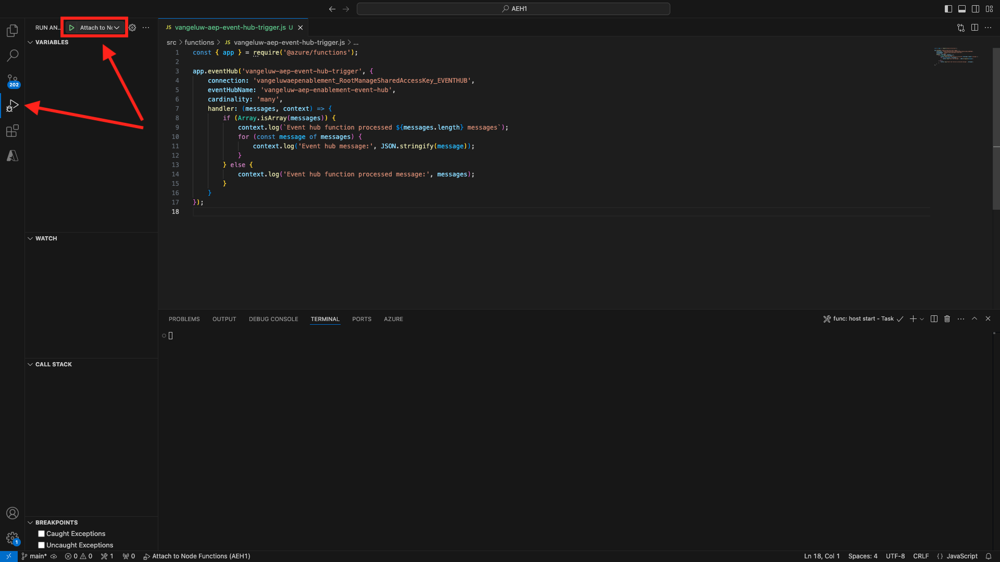
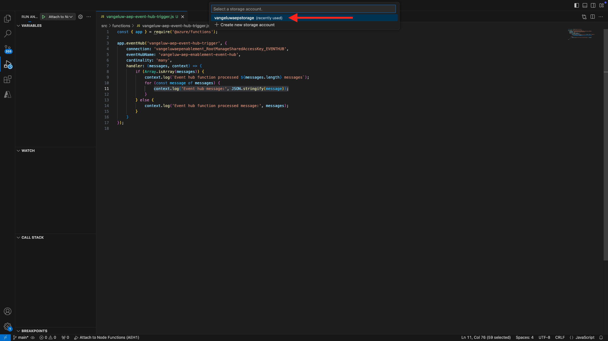

# 2.4.6 Create your Microsoft Azure Project

## Getting familiar with Azure Event Hub functions

Azure Functions allow you to run small pieces of code (called **functions**) without worrying about application infrastructure. With Azure Functions, the cloud infrastructure provides all the up-to-date servers you need to keep your application running at scale.

A function is **triggered** by a specific type of event. Supported triggers include responding to changes in data, responding to messages (for example Event Hubs), running on a schedule, or as the result of an HTTP request.

Azure Functions is a serverless compute service that lets you run event-triggered code without having to explicitly provision or manage infrastructure. 

Azure Event Hubs integrates with Azure Functions for a serverless architecture.

## Open Visual Studio Code and Logon to Azure

Visual Studio Code makes it easy to...

- define and bind Azure functions to Event Hubs
- test locally 
- deploy to Azure
- remote log function execution

### Open Visual Studio Code

### Logon to Azure

When you logon with your Azure account that you used to register in the previous exercise, Visual Studio Code will let you find and bind all Event Hub resources. 

Open Visual Studio Code and click the **Azure** icon. 

Next select **Sign in to Azure**:


You will be redirected to you browser to login. Remember to select the Azure account that you used to register.

When you see the following screen in your browser, you are logged in with Visual Code Studio:


Return to Visual Code Studio (you will see the name of your Azure subscription, for example **Azure subscription 1**):



## Create an Azure Project

Click **Create Function Project...**:


Select or create a local folder of your choice to save the project and click **Select**:


You will now enter the project creation wizard. Click **Javascript** as the language for your project:


Then select **Model v4**.


Select **Azure Event Hub trigger** as your project's first function template:


Enter a name for your function, use the following format `--aepUserLdap---aep-event-hub-trigger` and press enter:
  


Select **Create new local app setting**:


Click to select the Event Hub Namespace that you created earlier, which is named `--aepUserLdap---aep-enablement`.


Next, click to select the Event Hub that you created earlier, which is named `--aepUserLdap---aep-enablement-event-hub`.


Click to select **RootManageSharedAccessKey** as your Event Hub policy:


Select **Add to workspace** on how to open your project:


You may then get a message like this one. In that case, click **Yes, I trust the authors**.


After you project is created, open the file `--aepUserLdap---aep-event-hub-trigger.js` in the editor:


The payload sent by Adobe Experience Platform to your Event Hub will look like this:

```json
{
  "identityMap": {
    "ecid": [
      {
        "id": "36281682065771928820739672071812090802"
      }
    ]
  },
  "segmentMembership": {
    "ups": {
      "94db5aed-b90e-478d-9637-9b0fad5bba11": {
        "createdAt": 1732129904025,
        "lastQualificationTime": "2024-11-21T07:33:52Z",
        "mappingCreatedAt": 1732130611000,
        "mappingUpdatedAt": 1732130611000,
        "name": "vangeluw - Interest in Plans",
        "status": "realized",
        "updatedAt": 1732129904025
      }
    }
  }
}
```

Update the code in your Visual Studio Code's `--aepUserLdap---aep-event-hub-trigger.js` with the code below. This code will be executed each time Real-time CDP sends audience qualifications to your Event Hub destination. In this example, the code is just about displaying incoming payload, but you can imagine any kind of additional function to process audience qualifications in real-time and use thel further down your data pipeline ecosystem.

Line 11 in your file `--aepUserLdap---aep-event-hub-trigger.js` currently shows this:

```javascript
context.log('Event hub message:', message);
```

Change line 11 in `--aepUserLdap---aep-event-hub-trigger.js` to look like this:

```javascript
context.log('Event hub message:', JSON.stringify(message));
```

The total payload should then be like this:

```javascript
const { app } = require('@azure/functions');

app.eventHub('--aepUserLdap---aep-event-hub-trigger', {
    connection: '--aepUserLdap--aepenablement_RootManageSharedAccessKey_EVENTHUB',
    eventHubName: '--aepUserLdap---aep-enablement-event-hub',
    cardinality: 'many',
    handler: (messages, context) => {
        if (Array.isArray(messages)) {
            context.log(`Event hub function processed ${messages.length} messages`);
            for (const message of messages) {
                context.log('Event hub message:', message);
            }
        } else {
            context.log('Event hub function processed message:', messages);
        }
    }
});
```


The result should look like this:


## Run Azure Project

Now it is time to run your project. At this stage we will not deploy the project to Azure. We will run it locally in debug mode. Select the Run icon, click the green arrow. 



The first time you run you project in debug mode, you will need to attach a Azure storage account, click **Select storage account**.


and then select the storage account that you created earlier, which is named `--aepUserLdap--aepstorage`.



Your project is now up and running and is listing for events in the Event Hub. In the next exercise you'll demonstrate behavior on the CitiSignal demo website that will qualify you for audiences. As a result you will receive a audience qualification payload in the terminal of your Event Hub trigger function.


## Stop Azure Project

To stop your project, go to the lenu **CALL STACK** in VSC, click on the arrow on your running project and then click **Stop**.


## Next Steps

Go to [2.4.7 End-to-end scenario](./ex7.md){target="_blank"}

Go back to [Real-Time CDP: Audience Activation to Microsoft Azure Event Hub](./segment-activation-microsoft-azure-eventhub.md){target="_blank"}

Go back to [All modules](./../../../../overview.md){target="_blank"}
