# 2.5.3 Create and configure a custom webhook

## Create your custom webhook

Go to [https://pipedream.com/requestbin](https://pipedream.com/requestbin). You already used this application in [Exercise 2.3.6 Destinations SDK](./../../../../modules/delivery-activation/rtcdp-b2c/rtcdpb2c-3/ex6.md)

If you haven't used that service yet, create an account and then create a workspace. Once the workspace is created, you'll see something similar to this. 

Click **copy** to copy the url. You'll need to specify this url in the next exercise. The URL in this example is `https://eodts05snjmjz67.m.pipedream.net`.

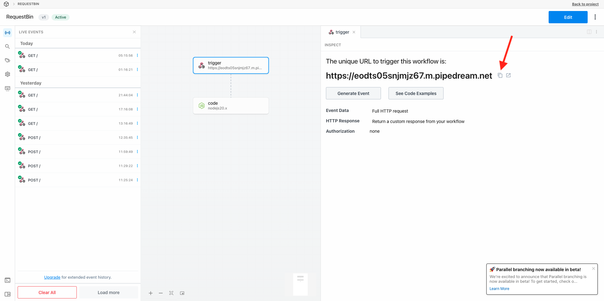

This website has now created this webhook for you, and you'll be able to configure this webhook in your **[!DNL Event Forwarding property]** to start testing the forwarding of events.

## Update your Event Forwarding property: Create a Data Element

Go to [https://experience.adobe.com/#/data-collection/](https://experience.adobe.com/#/data-collection/) and go to **Event Forwarding**. Search your Event Forwarding property and click it to open it.

In the left menu, go to **Data Elements**. Click **Create New Data Element**.

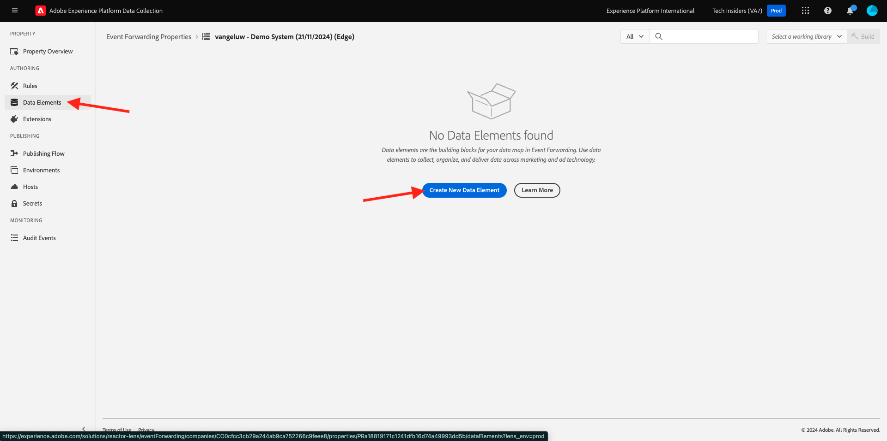

You'll then see a new data element to configure.

Make the following selection:

- As the **Name**, enter **XDM Event**.
- As the **Extension**, select **Core**.
- As the **Data Element Type**, select **Path**.
- As the **Path**, select **Read data from XDM (arc.event.xdm)**. By selecting this path, you'll be filtering out the **XDM** section from the event payload that is sent by the website or mobile app into the Adobe Edge.

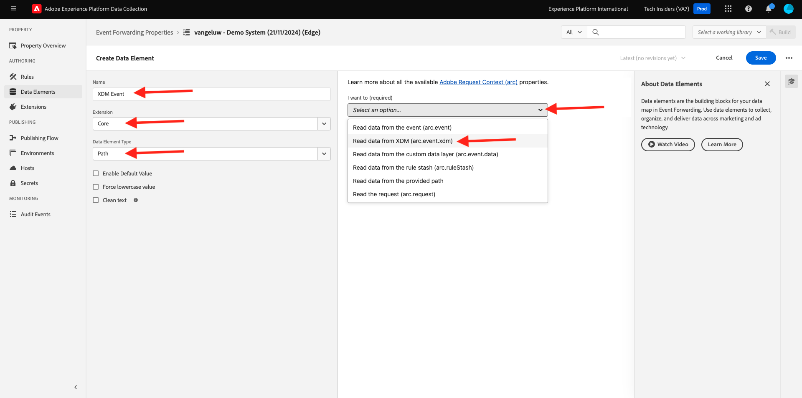

You'll now have this. Click **Save**.

>[!NOTE]
>
>In the above path, a reference is made to **arc**. **arc** stands for Adobe Resource Context and **arc** always stands for the highest available object that is available in the Server Side context. Enrichments and transformations may be added to that **arc** object using Adobe Experience Platform Data Collection Server functions.
>
>In the above path, a reference is made to **event**. **event** stands for a unique event and Adobe Experience Platform Data Collection Server will always evaluate every event individually. Sometimes, you may see a reference to **events** in the payload sent by Web SDK Client Side, but in Adobe Experience Platform Data Collection Server, every event is evaluated individually.

## Update your Adobe Experience Platform Data Collection Server property: Create a Rule

In the left menu, go to **Rules**. Click **Create New Rule**.

You'll then see a new rule to configure. Enter the **Name**: **All Pages**. For this exercise, you won't need to configure a condition. Instead, you'll setup an action. Click the **+ Add** button under **Actions**.

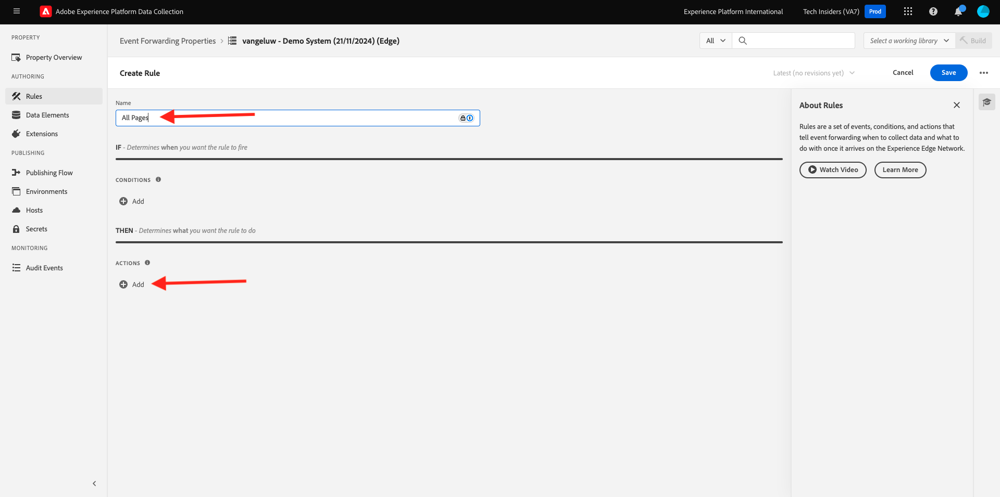

You'll then see this. Make the following selection:

- Select the **Extension**: **Adobe Cloud Connector**.
- Select the **Action Type**: **Make Fetch Call**.

That should give you this **Name**: **Adobe Cloud Connector - Make Fetch Call**. You should now see this:

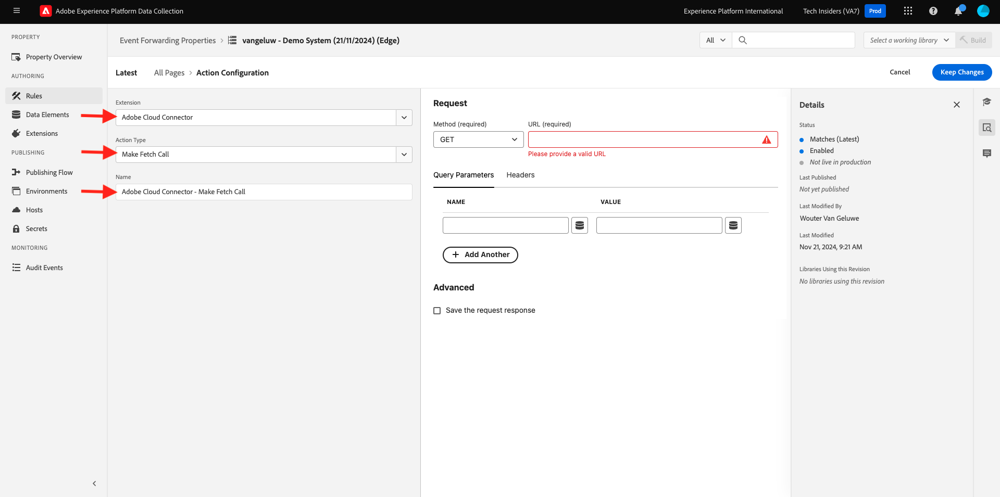

Next, configure the following:

- Change the request method from GET to **POST**
- Enter the URL of the custom webhook you created in one of the previous steps, which looks like this: `https://eodts05snjmjz67.m.pipedream.net`

You should now have this. Next, go to **Body**.

You'll then see this. Click the data element icon as indicated below.

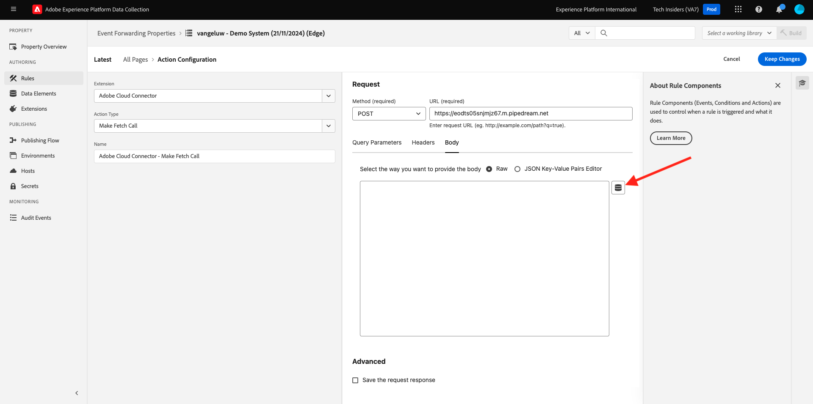

In the popup, select the data element **XDM Event** which you created in the previous step. Click **Select**.

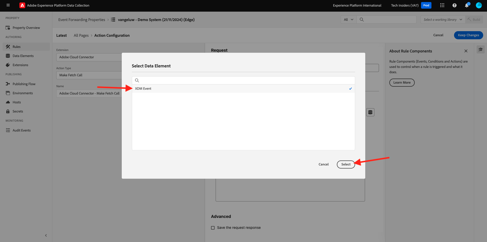

You'll then see this. Click **Keep Changes**.

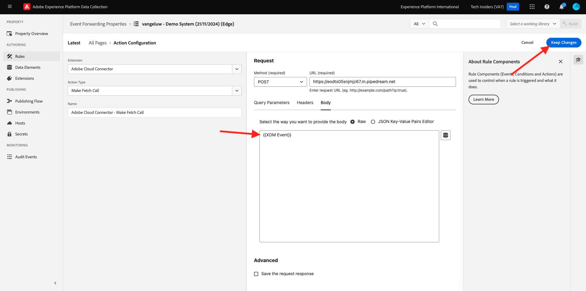

You'll then see this. Click **Save**.

You've now configured your first rule in an Event Forwarding property. Go to **Publishing Flow** to publish your changes.
Open your Development library **Main** by clicking **Edit** as indicated.

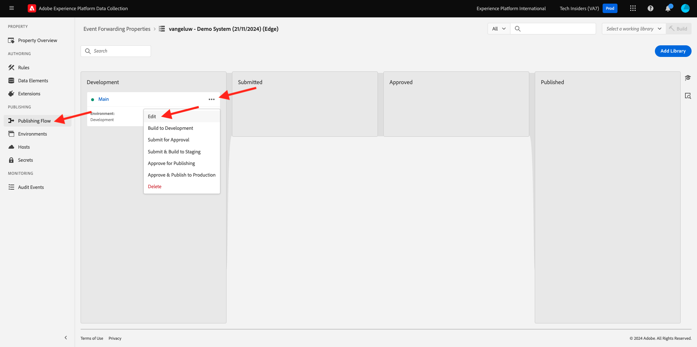

Click the **Add All Changed Resources** button, after which you'll see your Rule and Data Element appear in this library. Next, click **Save & Build for Development**. Your changes are now being deployed.

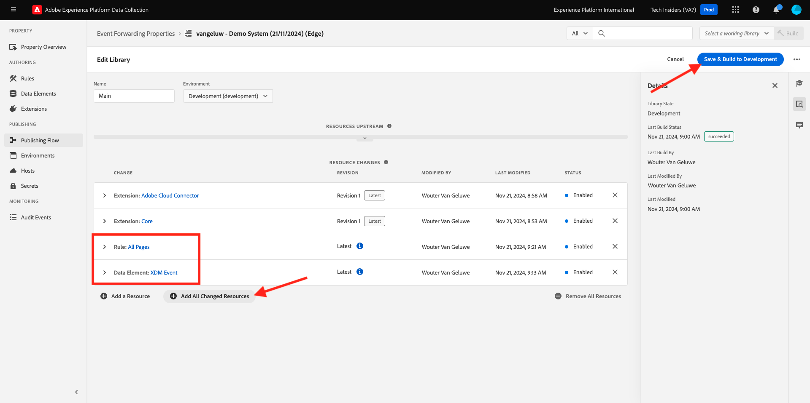

After a couple of minutes, you'll see that the deployment is done and ready to be tested.

## Test your configuration

Go to [https://dsn.adobe.com](https://dsn.adobe.com). After logging in with your Adobe ID, you'll see this. Click the 3 dots **...** on your website project and then click **Run** to open it.

You'll then see your demo website open up. Select the URL and copy it to your clipboard.

Open a new incognito browser window.

Paste the URL of your demo website, which you copied in the previous step. You'll then be asked to login using your Adobe ID.

Select your account type and complete the login process.

You'll then see your website loaded in an incognito browser window. For every exercise, you'll need to use a fresh, incognito browser window to load your demo website URL.

When you open up your browser Developer View, you can inspect Network requests as indicated below. When you use the filter **interact**, you'll see the network requests that are sent by Adobe Experience Platform Data Collection Client to the Adobe Edge.

If you select the raw payload, go to [https://jsonformatter.org/json-pretty-print](https://jsonformatter.org/json-pretty-print) and paste the payload. Click **Minify / Beautify**. You'll then see the JSON payload, the **events** object and the **xdm** object. In one of the previous steps, when you defined the Data Element, you used the reference **arc.event.xdm**, which will result in you parsing out the **xdm** object of this payload.

Switch your view to your custom webhook [https://pipedream.com/requestbin](https://pipedream.com/requestbin) which you used in one of the previous steps. You should now have a view similar to this one, with network requests being shown in the left menu. You're seeing the **xdm** payload that was filter out of the network request that was shown above. 

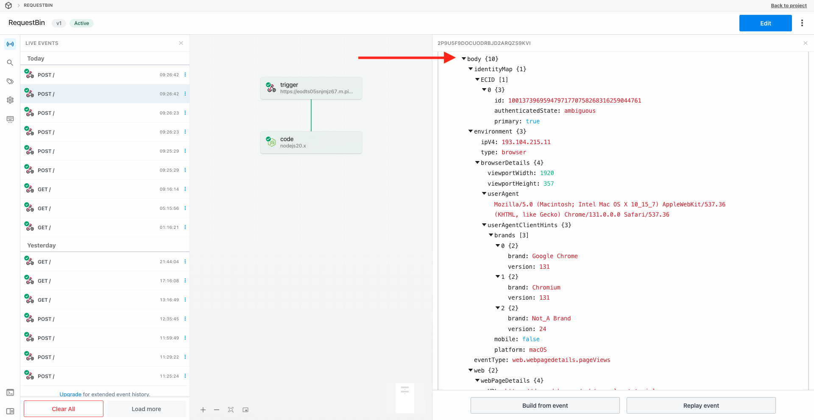

Scroll down a bit in the payload to find the page name, which in this case is **home**.

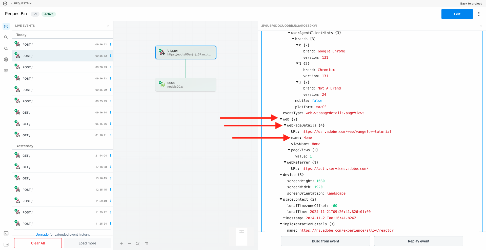

If you now navigate across the website, you'll see additional network requests becoming available on this custom webhook in real-time.

You've now configured the server side Event Forwarding of Web SDK/XDM payloads to an external custom webhook. In the next exercises, you'll configure a similar approach, and you'll be sending that same data towards Google Cloud Platform and AWS.

## Next Steps

Go to [2.5.4 Forward events to GCP Pub/Sub](./ex4.md){target="_blank"}

Go back to [Real-Time CDP Connections: Event Forwarding](./aep-data-collection-ssf.md){target="_blank"}

Go back to [All modules](./../../../../overview.md){target="_blank"}