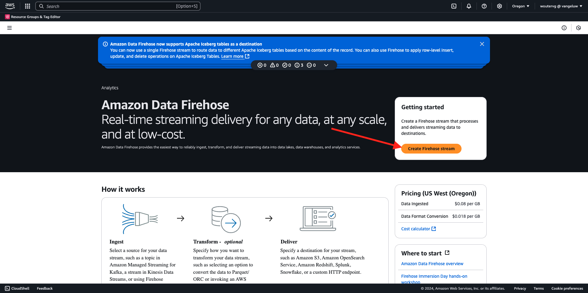

# 2.5.5 Forward events to AWS Kinesis & AWS S3

>[!IMPORTANT]
>
>Completion of this exercise is optional and a cost is involved to use AWS Kinesis. While AWS provides a free tier account which lets you test and configure many services without a cost, AWS Kinesis isn't part of that free tier account. So in order to implement and test this exercise, a cost will be involved to use AWS Kinesis.

## Good to know

Adobe Experience Platform supports various Amazon services as destination. 
Kinesis and  S3 are both [profile export destinations](https://experienceleague.adobe.com/docs/experience-platform/destinations/destination-types.html?lang=en) and can be used as part of Adobe Experience Platform's Real-Time CDP.
You can easily feed high-value segment events and associated profile attributes into your systems of choice.

In this exercise, you'll learn how to setup your own Amazon Kinesis stream to stream event data coming from the Adobe Experience Platform Edge ecosystem to a cloud storage destination, such as Amazon S3. This is useful in case you'd like to collect experience events from web and mobile properties and push them into your datalake for analysis and operational reporting. Datalakes generally ingest data in a batch fashion with large daily file imports, they do not expose public http endpoint which could be used in conjunction with event forwarding.

Supporting the above use cases implies that streamed data need to be buffered or placed in a queue before being written to a file. Care has to be taken to not open file for write access across multiple process. Delegating this task to dedicated system is ideal to scale nicely while ensuring a great level of service, this is where Kinesis comes to the rescue.

Amazon Kinesis Data Streams focuses on ingesting and storing data streams. Kinesis Data Firehose focuses on delivering data streams to select destinations, such as S3 buckets. 

As part of this exercise, you'll...

- Perform a basic setup of a Kinesis data stream
- Create a Firehose delivery stream and use S3 bucket as destination
- Configure Amazon API gateway as a rest api endpoint to receive your event data
- Forward raw event data from Adobe's Edge to your Kinesis stream

## Configure your AWS S3 bucket

Go to [https://console.aws.amazon.com](https://console.aws.amazon.com) and sign in with your Amazon-account.

After logging in, you'll be redirected to the **AWS Management Console**.

In the **Find Services** menu, search for **s3**. Click the first search result: **S3 - Scalable Storage in the Cloud**.

You'll then see the **Amazon S3** homepage. Click **Create Bucket**.

In the **Create Bucket** screen, you need to configure two things:
  
- Name: use the name `eventforwarding---aepUserLdap--`. 

Leave all the other default settings as they are. Scroll down and click **Create bucket**.

You'll then see your bucket being created and will be redirected to the Amazon S3 homepage.

## Configure your AWS Kinesis Data Stream

In the **Find Services** menu, search for **kinesis**. Click the first search result: **Kinesis - Work with Real-Time Streaming Data**.

Select **Kinesis Data Streams**. Click **Create data stream**.

For the **Data stream name**, use `--aepUserLdap---datastream`.

There's no need to change any of the other settings. Scroll down and click **Create data stream**.

You'll then see this. Once your data stream is succesfully created, you can move forward to the next exercise.

## Configure your AWS Firehose Delivery Stream

In the **Find Services** menu, search for **kinesis**. Click **Kinesis Data Firehose**.

Click **Create Firehose stream**.

For **Source**, select **Amazon Kinesis Data Streams**. For **Destination**, select **Amazon S3**. Click **Browse** to select your data stream.

Select your data stream. Click **Choose**.

You'll then see this. Remember the **Firehose stream name** as you'll need it later.

Scroll down until you see **Destination Settings**. Click **Browse** to select your S3 bucket.

Select your S3 bucket and click **Choose**.

You'll then see something like this. Update the following settings:

- New line delimiter: set to **Enabled**
- Dynamic partitioning: set to **Not enabled**

Scroll down a bit more and click **Create Firehose stream**

After a couple of minutes, your Firehose stream will be created and **Active**.

## Create IAM user

In the left AWS IAM menu, click **Users**. You'll then see the **Users** screen. Click **Create user**.

Next, configure your user:

- User Name: use `--aepUserLdap--_kinesis_forwarding`

Click **Next**.

You'll then see this permissions screen. Click **Attach policies directly**.

Enter the search term **kinesisfirehose** to see all related policies. Select the policy **AmazonKinesisFirehoseFullAccess**. Scroll down and click **Next**.

Review your configuration. Click **Create User**.

You'll then see this. Click **View User**.

Click **Add permissions** and click **Create inline policy**.

You'll then see this. Select the service **Kinesis**.

Go to **Write** and check the checkbox for **PutRecord**.

Scroll down to **Resources** and select **All**. Click **Next**.

Name your policy kike this: **Kinesis_PutRecord** and click **Create policy**.

You'll then see this. Click **Security credentials**.

Click **Create access key**.

Select **Application running outside AWS**. Scroll down and click **Next**.

Click **Create access key**

You'll then see this. Click **Show** to see your Secret access key:

Your **Secret access key** is now being shown.

>[!IMPORTANT]
>
>Store your credentials in a text-file in your computer.
>
> - Access key ID: ...
> - Secret access key: ...
>
> Once you click **Done** you'll never see your credentials again!

Click **Done**. 

You've now successfully created an IAM user with proper permimssions, which you'll need to specify when configuring the AWS extension in your Event Forwarding property.

## Update your Event Forwarding property: Extension

With your Secret and Data Element configured, you can now set up the extension for Google Cloud Platform in your Event Forwarding property.

Go to [https://experience.adobe.com/#/data-collection/](https://experience.adobe.com/#/data-collection/), go to **Event Forwarding** and open your Event Forwarding property.

Next, go to **Extensions**, to **Catalog**. Click the **AWS** extension and click **Install**.

Enter the IAM user credntials that you generated in the previous exercise. Click **Save**.

Next, you need to configure a rule that starts forwarding event data to Kinesis.

## Update your Event Forwarding property: Rule

In the left menu, go to **Rules**. Click to open the rule **All Pages** which you created in one of the previous exercises.

You'll then see this. Click the **+** icon to add a new action.

You'll then see this. Make the following selection:

- Select the **Extension**: **AWS**
- Select the **Action Type**: **Send Data to Kinesis Data Stream**
- Name: **AWS - Send Data to Kinesis Data Stream**

You should now see this:

Next, configure the following:

- Stream Name: `--aepUserLdap---datastream`
- AWS Region: check your region in your AWS Data Stream setup
- Partition Key: **0**

You can see your AWS Region here:

You should now have this. Next, click the data element icon for the **Data** field.

Select **XDM Event** and click **Select**.

You'll then have this. Click **Keep Changes**.

You'll then see this. Click **Save**.

Go to **Publishing Flow** to publish your changes.
Open your Development library by clicking **Main**.

Click the **Add All Changed Resources** button, after which you'll see your Rule and Data Element changes appear in this library. Next, click **Save & Build for Development**. Your changes are now being deployed.

After a couple of minutes, you'll see that the deployment is done and ready to be tested.

## Test your configuration

Go to [https://dsn.adobe.com](https://dsn.adobe.com). After logging in with your Adobe ID, you'll see this. Click the 3 dots **...** on your website project and then click **Run** to open it.

You'll then see your demo website open up. Select the URL and copy it to your clipboard.

Open a new incognito browser window.

Paste the URL of your demo website, which you copied in the previous step. You'll then be asked to login using your Adobe ID.

Select your account type and complete the login process.

You'll then see your website loaded in an incognito browser window. For every exercise, you'll need to use a fresh, incognito browser window to load your demo website URL.

Switch your view to **AWS**. By opening your data stream and going into the **Monitoring** tab, you'll now see incoming traffic.

When you then open your Data Firehose stream and go into the **Monitoring** tab, you'll also see incoming traffic.

Finally, when you have a look at your S3 bucket, you'll now notice files being created there as a consequence of your data ingestion.

When you download such a file and open it using a text editor, you'll see that it contains the XDM payload from the events that were forwarded.

>[!IMPORTANT]
>
>Once your setup is working as expected, don't forget to turn of your AWS Kinesis Data Stream and Data Firehose to avoid being charged!

## Next Steps

Go to [Summary and benefits](./summary.md){target="_blank"}

Go back to [Real-Time CDP Connections: Event Forwarding](./aep-data-collection-ssf.md){target="_blank"}

Go back to [All modules](./../../../../overview.md){target="_blank"}