# Install the Chrome extension for the Experience League documentation

## About the Chrome extension

This tutorial has been made generic so that it can easily be reused by anyone, using any Adobe Experience Cloud instance. 

In order to make the documentation reusable, **Environment Variables** were introduced in the tutorial, which means that you'll find the below **placeholders** in the documentation. Every placeholder is a specific variable for a specific environment, and the Chrome extension will change that variable for you to make it easy for you to copy code and text from the tutorial pages and paste it in the various user interfaces that you'll be using as part of the tutorial.

An example of such values can be found below. Currently, these values can't be used yet but as soon as you install and activate the Chrome extension, you'll see these variables change into normal text that you can copy and reuse.

| Name     | Key | Example |
|:-------------:| :---------------:| :---------------:|
| CX Enterprise IMS Org Name         | `--aepImsOrgName--` |`Adobe Tech Insiders`|
| CX Enterprise IMS Org ID         | `--aepImsOrgId--` |`907075E95BF479EC0A495C73@AdobeOrg`|
| AEP Tenant ID         | `--aepTenantId--` | `_experienceplatform` |
| AEP Sandbox Name         | `--aepSandboxName--` | `one-adobe` |
| Learner Profile LDAP        | `--aepUserLdap--` | `vangeluw`|
| User Number        | `--userNumber--` | `1`|

As an example, in the below screenshot you can see a reference to `aepImsOrgName`.

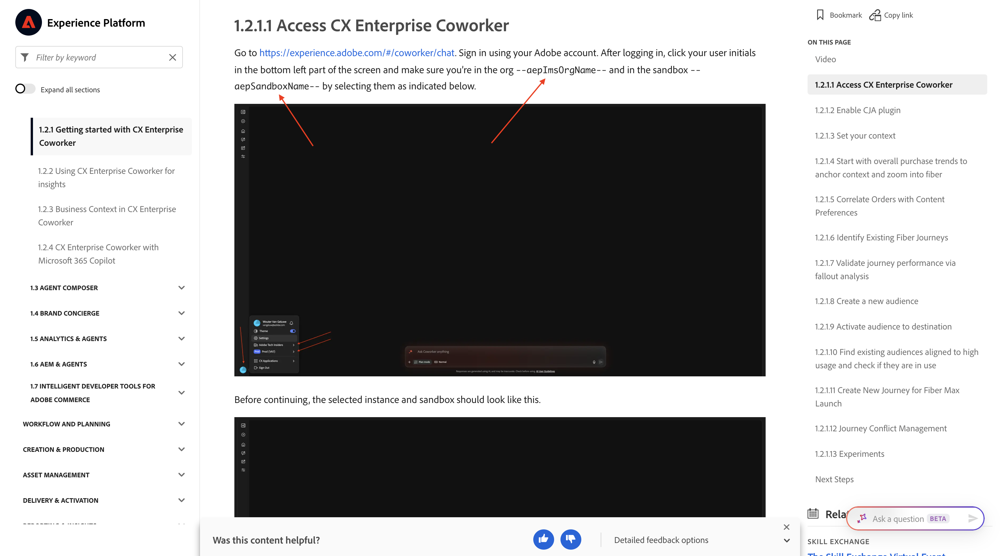

Once the extension is installed, that same text will be changed automatically to reflect your instance-specific values.

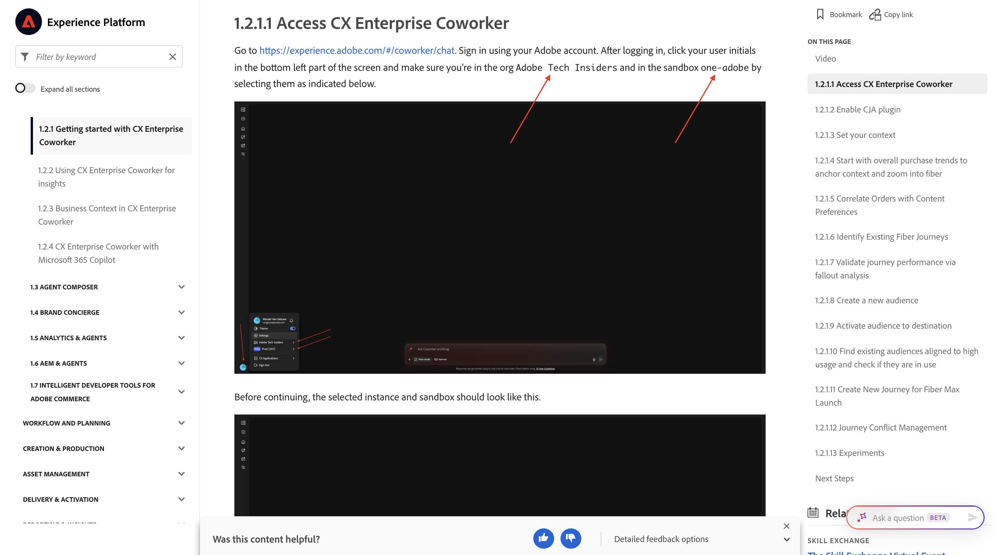

## Install the Chrome extension

To install that Chrome extension, open your Chrome browser and go to: [https://chromewebstore.google.com/detail/tech-insiders-learning-fo/hhnbkfgioecmhimdhooigajdajplinfi](https://chromewebstore.google.com/detail/tech-insiders-learning-fo/hhnbkfgioecmhimdhooigajdajplinfi). You'll then see this. 

Click **Add to Chrome**.

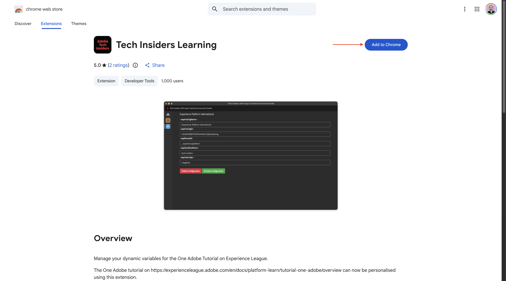

You'll then see this. Click **Add extension**.

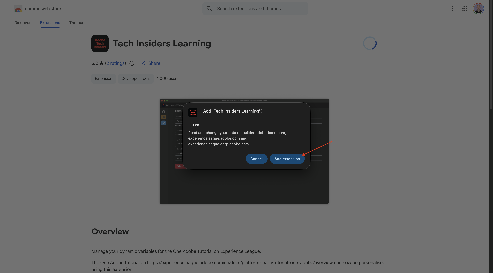

The extension will then be installed, and you'll see a similar notification.

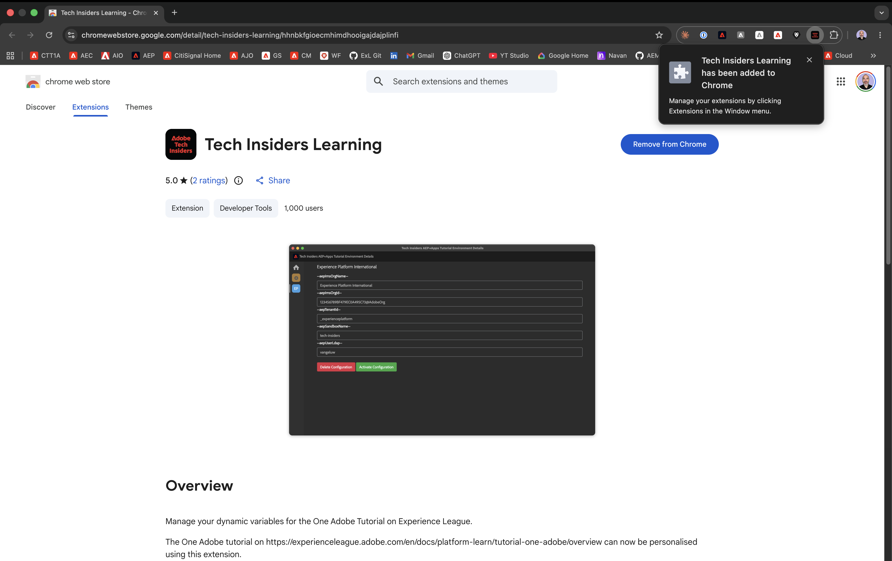

In the **extensions** menu, click the **puzzle piece** icon and pin the **Tech Insiders Learning** extension to the extension menu.

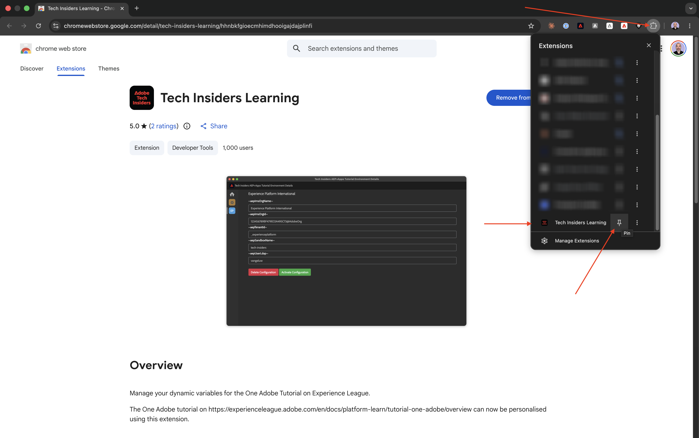

## Configure the Chrome extension

Go to [https://experienceleague.adobe.com/en/docs/platform-learn/tutorial-one-adobe/overview](https://experienceleague.adobe.com/en/docs/platform-learn/tutorial-one-adobe/overview) and then click the extension icon to open it.

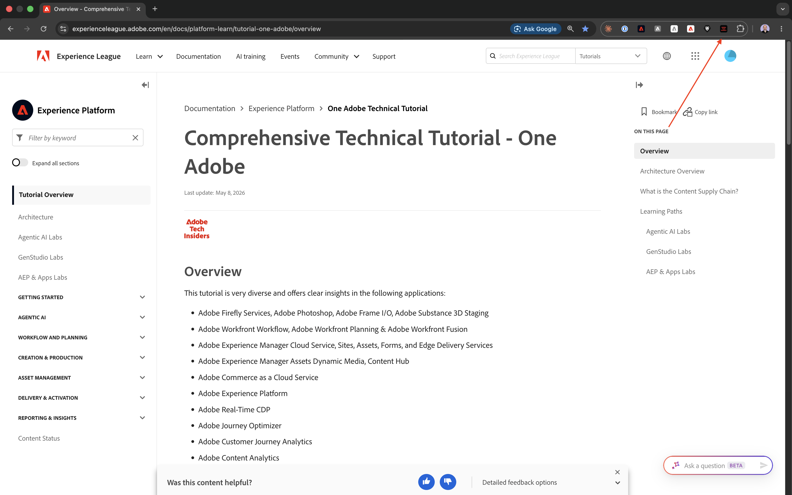

You'll then see this popup. Click the **+** icon.

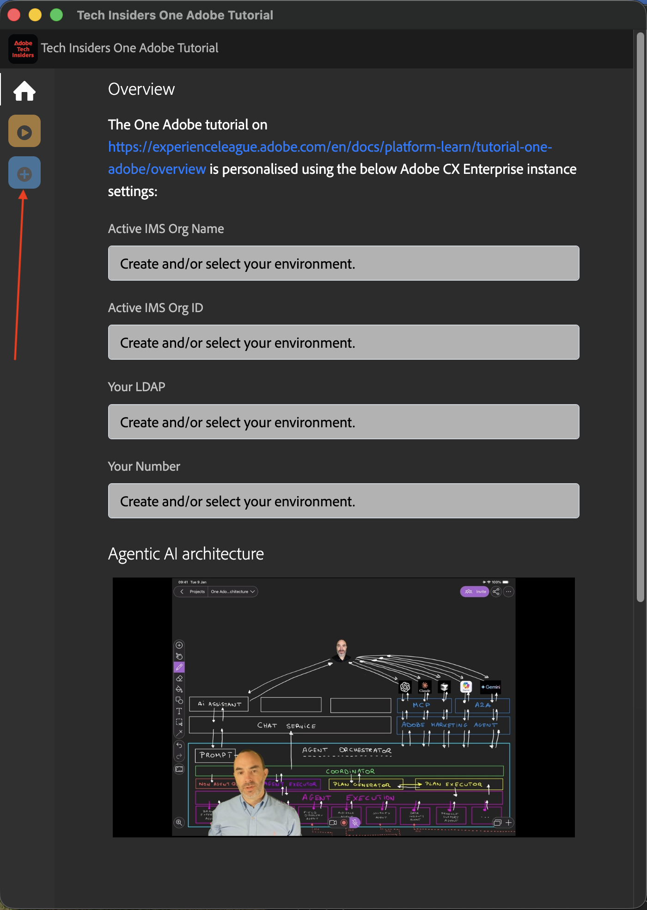

Enter the values as indicated below, which are all related to your CX Enterprise organisation. 

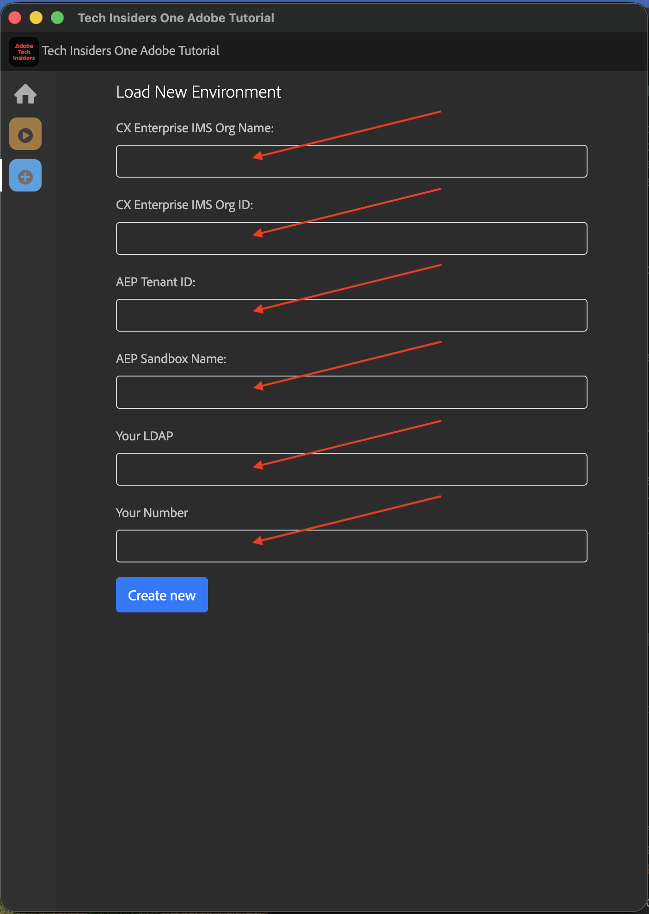

If you're attending one of the below events, please use the below values as indicated.

| Name     | Partner Tech Labs New Orleans | Tech Insiders In-Person Workshop | Tech Insiders On-Demand Enablement |
|:-------------:| :---------------:| :---------------:|:---------------:|
| CX Enterprise IMS Org Name          |`Adobe Tech Insiders`|`Adobe Tech Insiders`|`CXO Enablement Training LAB`|
| CX Enterprise IMS Org ID            |`907075E95BF479EC0A495C73@AdobeOrg`|`907075E95BF479EC0A495C73@AdobeOrg`|`0B6930256441790E0A495FFE@AdobeOrg`|
| AEP Tenant ID         | `_experienceplatform` |`_experienceplatform` |`_acsultimatesupport` |
| AEP Sandbox Name      | `one-adobe` |`one-adobe` |`one-adobe` |
| Learner Profile LDAP  | `XXX`|`XXX`|`XXX`|
| User Number  | `XX`|`XX`|`XX`|

**Your Learner Profile LDAP**

This is the username that will be used as part of the tutorial. In this example, the LDAP is based off of the email address of this user. If the email address is **vangeluw@adobe.com**, the LDAP becomes **vangeluw**.

If you're attending the Partner Tech Labs event in New Orleans, please apply the same logic and use the first part of your email address as the LDAP.

The LDAP is used to ensure that the configuration you'll be doing will be linked to you, and won't conflict with other users that may be using the same instance and sandbox that you're using.

**Your User Number**

If you have been assigned a user number, enter it here. 
If you haven't been assigned a user number yet, use the value `XX` for now.

Your values should look similar to these.
Finally, click **Create New**.

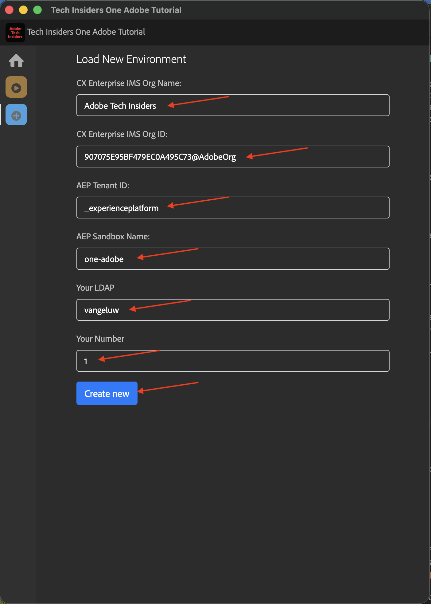

In the left menu of the extension, you'll now see a new icon with the initials of your environment. Click it. You'll then see the mapping between the **Environment Variables** and your specific Adobe Experience Platform instance values. Click **Activate Configuration**.

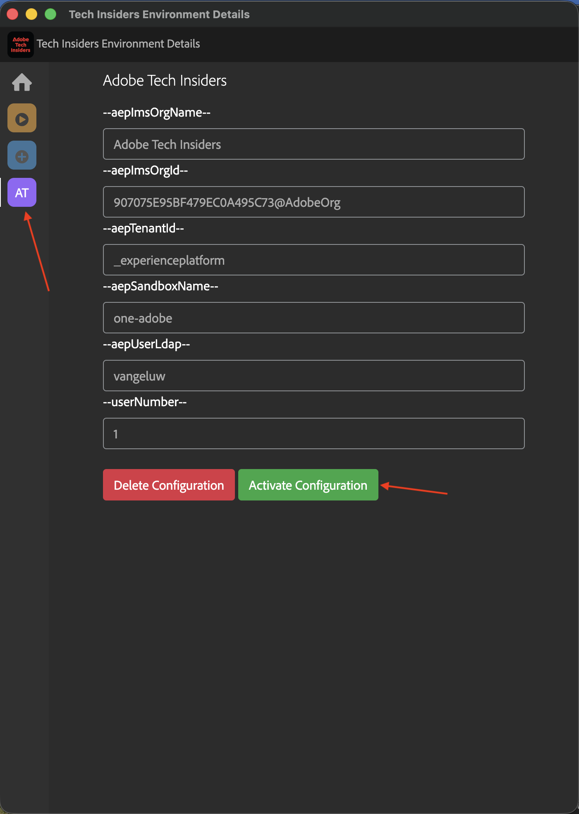

After activating your configuration, you'll see a green dot next to the initials of your environment. This means that your environment is now active.

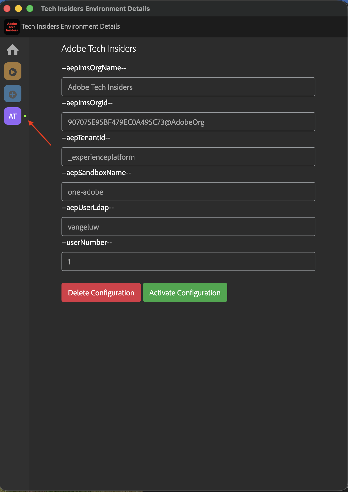

## Verify tutorial content

As a test, go to [this page](https://experienceleague.adobe.com/en/docs/platform-learn/tutorial-one-adobe/agents/agents1/ex1){target="_blank"}.

You should now see that all **Environment Variables** on this page have been replaced by their true values, based on the activated environment in the chrome extension.

You should now have a similar view to the below, where the environment variable `aepSandboxName` has been replaced by your real AEP Sandbox Name, which in this case is **one-adobe**. 

## Next Steps

Go to [Applications to install](./ex2.md){target="_blank"}

Go back to [Getting started - Agentic AI](./getting-started-agentic-ai.md){target="_blank"}

Go back to [All modules](./../../../overview.md){target="_blank"}
