# Install the Chrome extension for the Experience League documentation

## About the Chrome extension

The documentation has been made generic so that it can easily be reused by anyone, using any Adobe Experience Platform instance. 
In order to make the documentation reusable, **Environment Variables** were introduced in the documentation, which means that you'll find the below **placeholders** in the documentation. Every placeholder is a specific variable for a specific environment, and the Chrome extension will change that variable for you to make it easy for you to copy code and text from the tutorial pages and paste it in the various user interfaces that you'll be using as part of the tutorial.

An example of such values can be found below. Currently, these values can't be used yet but as soon as you install and activate the Chrome extension, you'll see these variables change into normal text that you can copy and reuse.

| Name     | Key | Example |
|:-------------:| :---------------:| :---------------:|
| AEP IMS Org ID         | `--aepImsOrgId--` |`907075E95BF479EC0A495C73@AdobeOrg`|
| AEP IMS Org Name         | `--aepImsOrgName--` |`Experience Platform International`|
| AEP Tenant ID         | `--aepTenantId--` | `_experienceplatform` |
| AEP Sandbox Name         | `--aepSandboxName--` | `one-adobe` |
| Learner Profile LDAP        | `--aepUserLdap--` | `vangeluw`|

As an example, in the below screenshot you can see a reference to `aepSandboxName`.

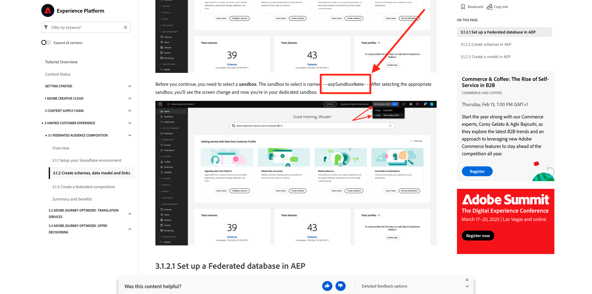

Once the extension is installed, that same text will be changed automatically to reflect your instance-specific values.

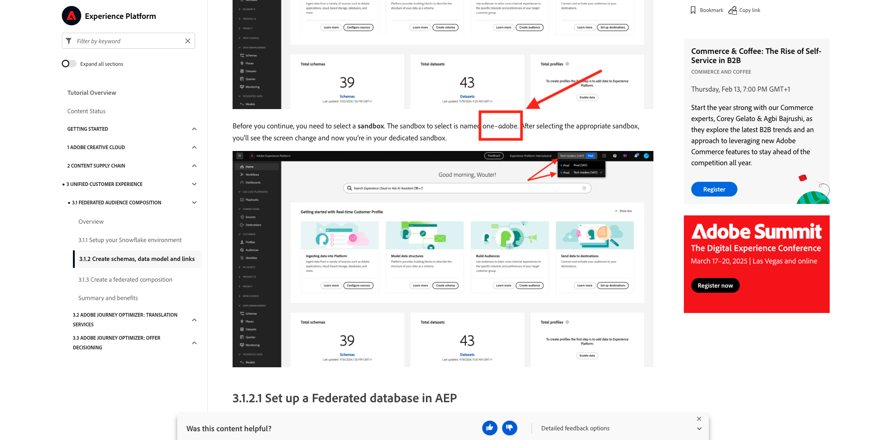

## Install the Chrome extension

To install that Chrome extension, open your Chrome browser and go to: [https://chromewebstore.google.com/detail/tech-insiders-learning-fo/hhnbkfgioecmhimdhooigajdajplinfi](https://chromewebstore.google.com/detail/tech-insiders-learning-fo/hhnbkfgioecmhimdhooigajdajplinfi){target="_blank"}. You'll then see this. 

Click **Add to Chrome**.

You'll then see this. Click **Add extension**.

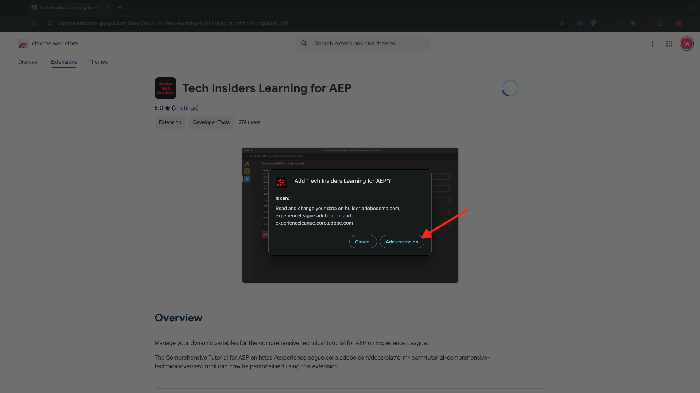

The extension will then be installed, and you'll see a similar notification.

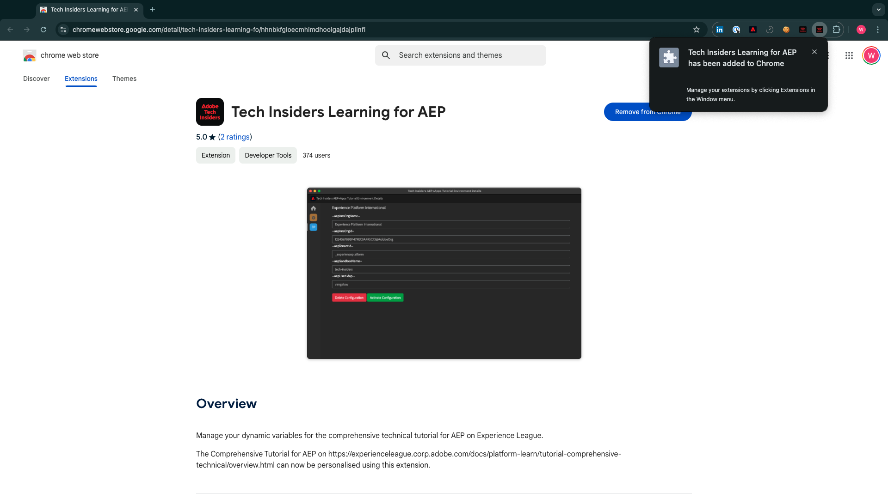

In the **extensions** menu, click the **puzzle piece** icon and pin the **Platform Learn - Configuration** extension to the extension menu.

## Configure the Chrome extension

Go to [https://experienceleague.adobe.com/en/docs/platform-learn/tutorial-comprehensive-technical/overview](https://experienceleague.adobe.com/en/docs/platform-learn/tutorial-comprehensive-technical/overview){target="_blank"} and then click the extension icon to open it.

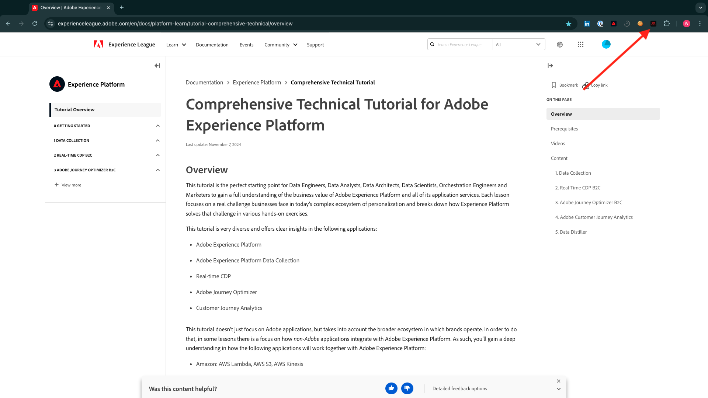

You'll then see this popup. Click the **+** icon.

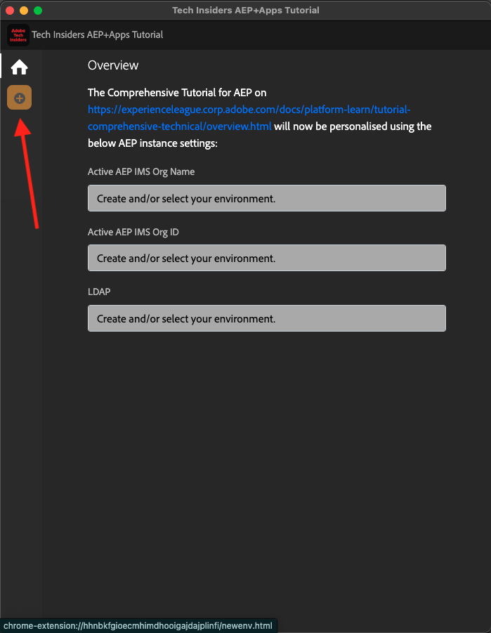

Enter the values as indicated below, which are all related to your Adobe Experience Platform instance. 

If you aren't sure what values to enter for these fields, follow the below guidance.

**AEP IMS Org Name**

When you log in to your Adobe Experience Platform instance on [https://platform.adobe.com/](https://platform.adobe.com/){target="_blank"}, you'll find the name of your instance in the top right corner of your screen.

**AEP IMS Org ID**

The IMS Org ID is the unique identifier for your Adobe Experience Cloud instance, and it's referenced in multiple locations throughout this tutorial.

Finding your IMS Org ID can be done in multiple ways. If you're not sure, check with one of the system administrators of your instance to find the ID.

You may be able to find it by going to [Admin Console](https://adminconsole.adobe.com/){target="_blank"}, where you can find it as part of the URL.

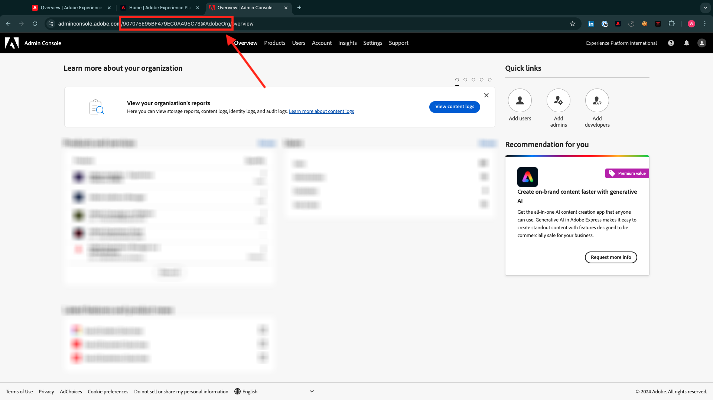

You may also be able to find it by going to **Data Management > Queries** in your AEP menu, where you can find it under **Username**.

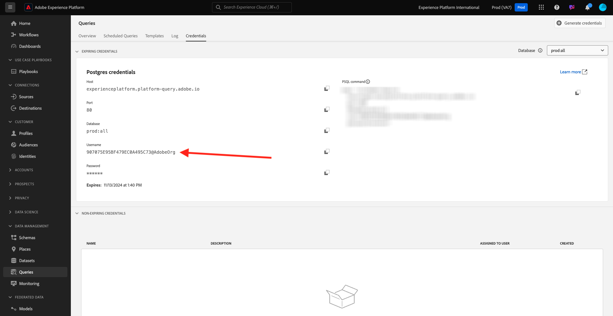

Please ensure to copy and paste the **@AdobeOrg** part along with the ID.

**AEP Tenant ID**

Your Tenant ID is the unique identifier for your organisation's AEP instance. When you log in to your Adobe Experience Platform instance on [https://platform.adobe.com/](https://platform.adobe.com/){target="_blank"}, you'll find the tenant id in the URL.

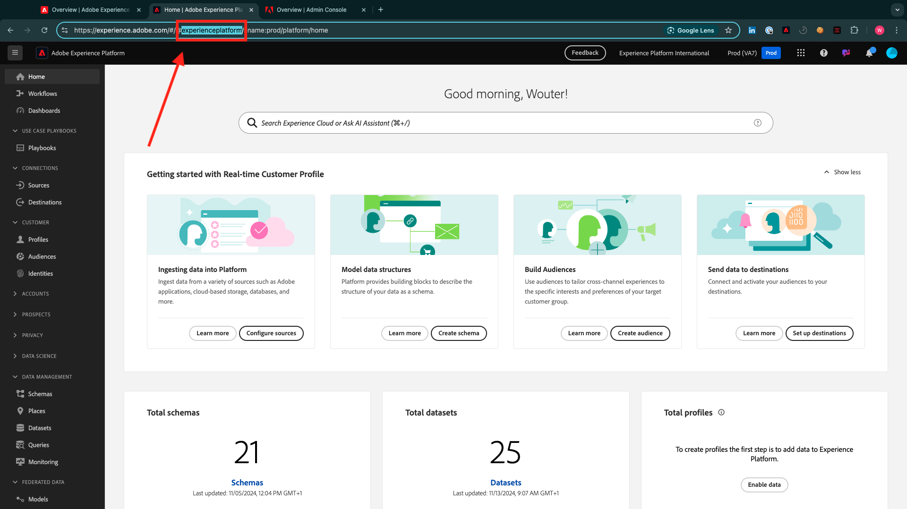

When you enter it in the Chrome extension, you should ensure that an underscore is added as a prefix, so in this example **experienceplatform** becomes **_experienceplatform**.

**AEP Sandbox Name**

Your sandbox name is the name of the environment you'll be using in your AEP instance. When you log in to your Adobe Experience Platform instance on [https://platform.adobe.com/](https://platform.adobe.com/){target="_blank"}, you'll find the tenant id in the URL. 

Before taking the sandbox name from the URL, you should ensure you're in the sandbox that you should use for this tutorial. You can switch to the right sandbox by clicking the sandbox switcher menu in the top right corner of your screen.

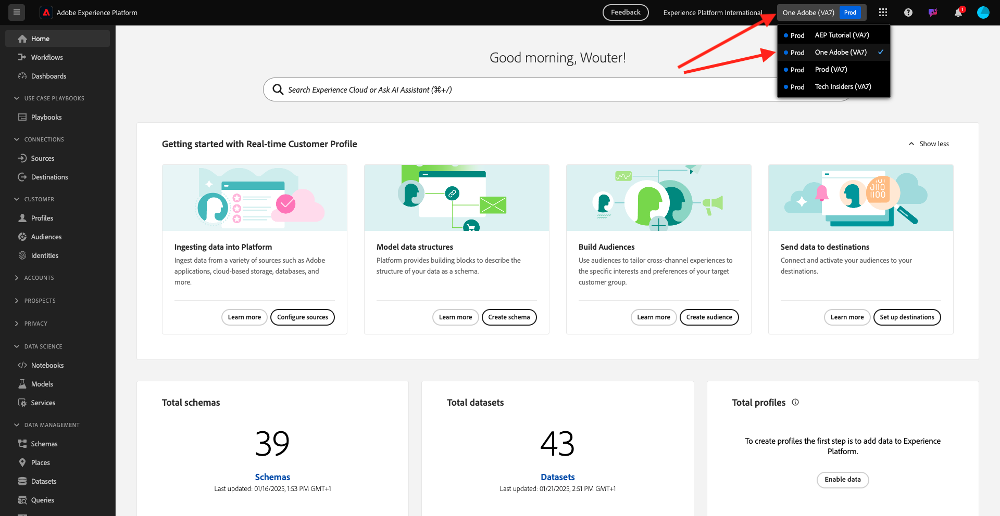

In this example, the AEP Sandbox Name is **one-adobe**.

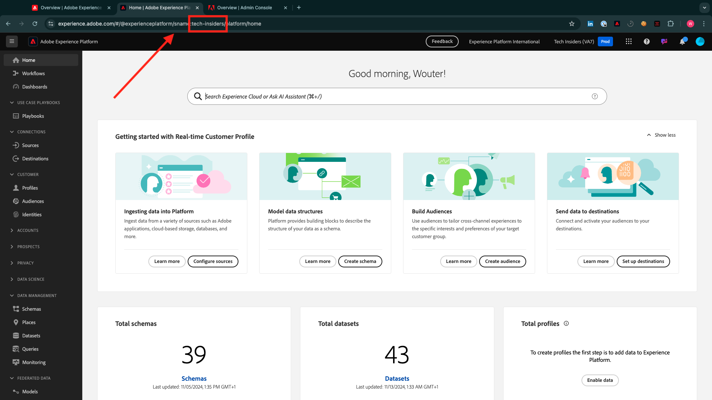

**Your LDAP**

This is the username that will be used as part of the tutorial. In this example, the LDAP is based off of the email address of this user. The email address is **vangeluw@adobe.com** so the LDAP becomes **vangeluw**.

The LDAP is used to ensure that the configuration you'll be doing will be linked to you, and won't conflict with other users that may be using the same instance and sandbox that you're using.

Your values should look similar to these.
Finally, click **Create New**.

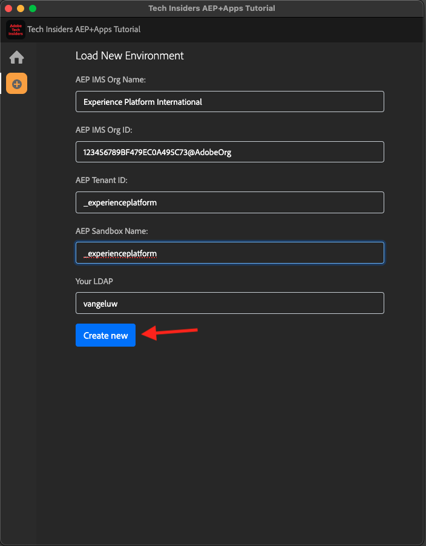

In the left menu of the extension, you'll now see a new icon with the initials of your environment. Click it. You'll then see the mapping between the **Environment Variables** and your specific Adobe Experience Platform instance values. Click **Activate Configuration**.

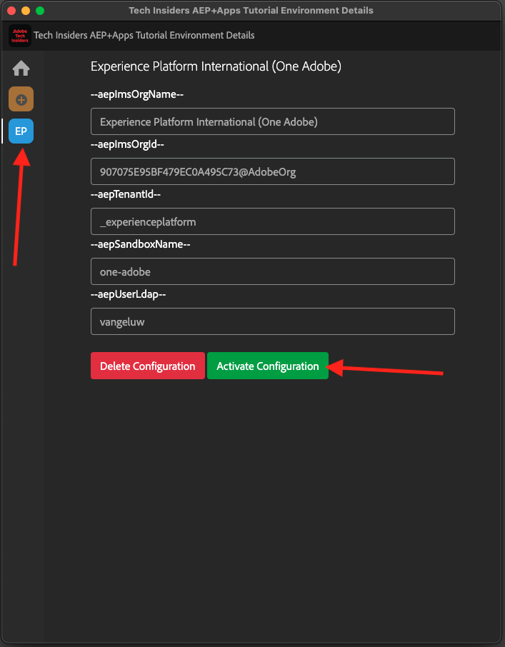

After activating your configuration, you'll see a green dot next to the initials of your environment. This means that your environment is now active.

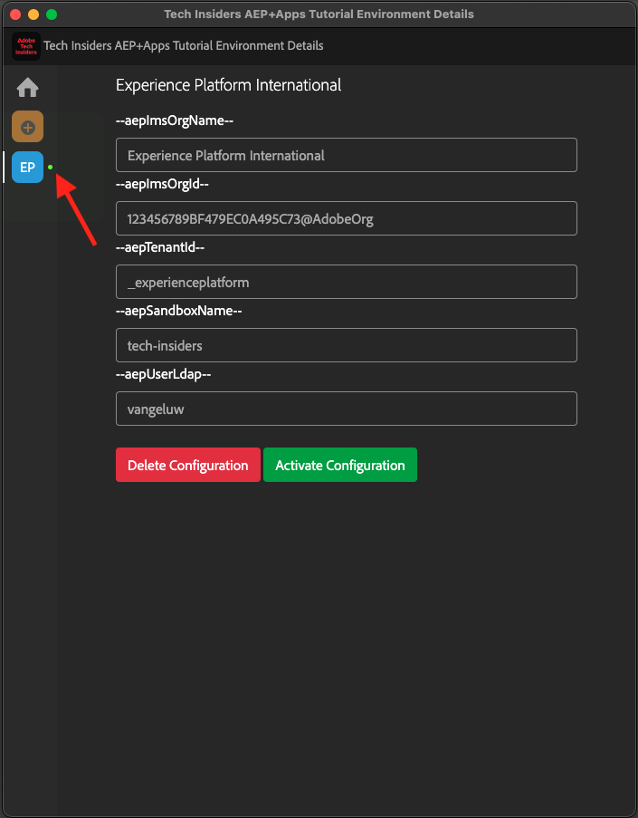

## Verify tutorial content

As a test, go to [this page](https://experienceleague.adobe.com/en/docs/platform-learn/tutorial-one-adobe/activation/dc/dc13/ex2){target="_blank"}.

You should now see that all **Environment Variables** on this page have been replaced by their true values, based on the activated environment in the chrome extension.

You should now have a similar view to the below, where the environment variable `aepSandboxName` has been replaced by your real AEP Sandbox Name, which in this case is **one-adobe**. 

## Next Steps

Go to [Use Demo System Next to setup your Adobe Experience Platform Data Collection client property](./ex2.md){target="_blank"}

Go back to [Getting Started](./getting-started.md){target="_blank"}

Go back to [All modules](./../../../overview.md){target="_blank"}
