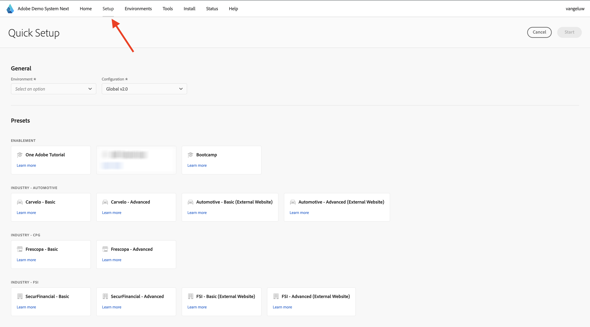
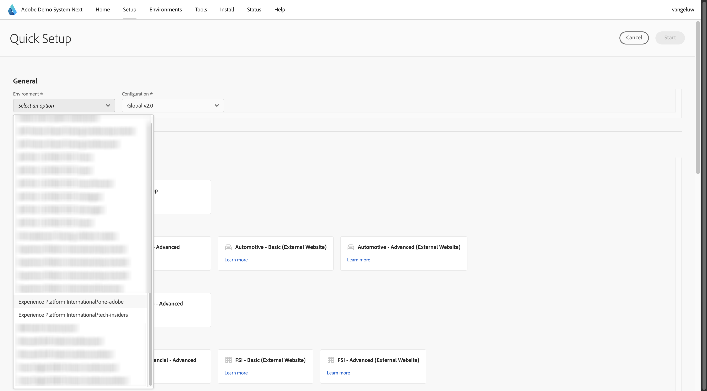
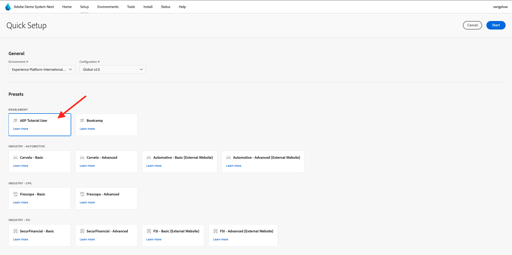
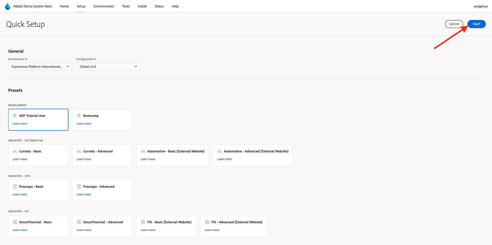
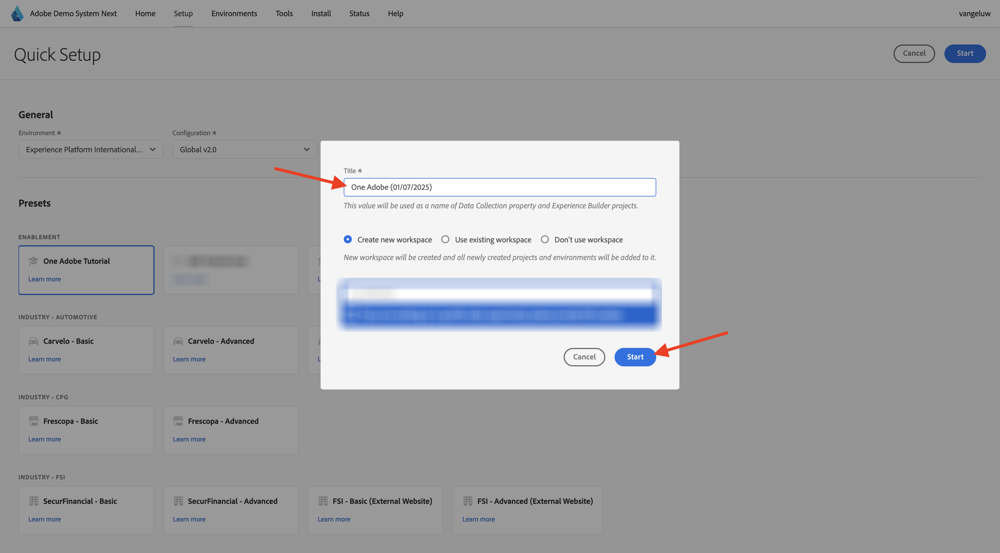
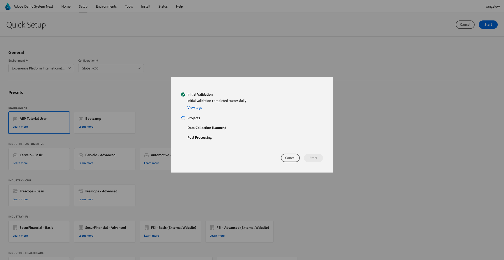
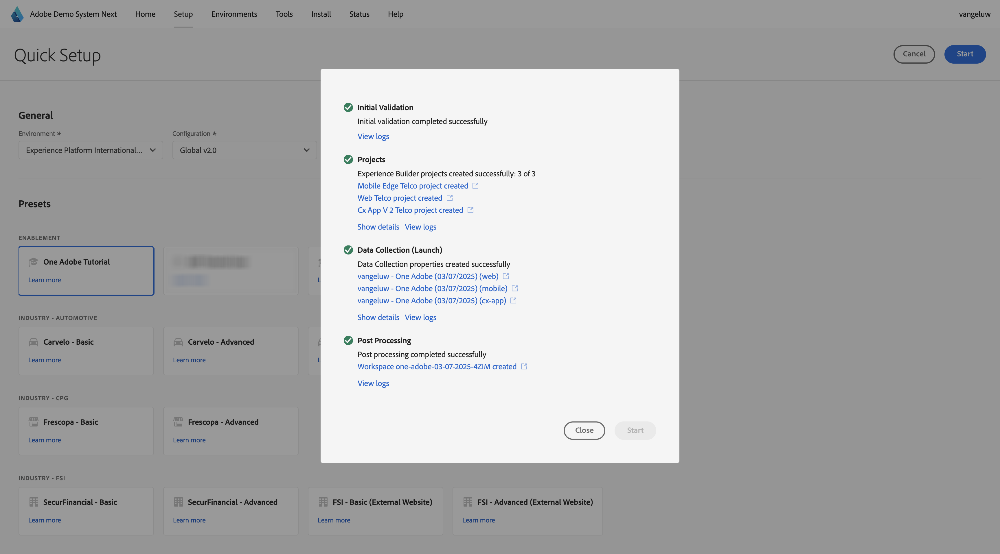

# Use Demo System Next to setup your Adobe Experience Platform Data Collection client property

In order to visualize the learnings in this tutorial and to make it possible for you to test your configuration in a safe environment, this tutorial is using Adobe's Demo System Next tools. In order to get the most of this tutorial, your AEP instance needs to be configured to be integrated with Demo System Next. 

Once you've got access to Demo System Next, proceed with the below steps.

Go to [https://dsn.adobe.com/](https://dsn.adobe.com/) and navigate to **Setup**.

In the **Environment** dropdown, select your AEP isntance and sandbox.

Next, select the preset **AEP Tutorial User**.

Next, click **Start**.

In the popup, enter a name for your Data Collection properties and Experience Builder projects. Please use this naming convention: **Demo System (DD/MM/YYYY)**. FYI: your LDAP will be appended automatically, you do not need to add it yourself.

Click **Start**.

You'll then see this popup, which is showing you the progress while creating your website and mobile app projects and your data collection properties.

Once the quick setup process has completed, you'll have:

- 1 web project, which makes it possible to use a demo website with a telco demo brand
- 1 mobile app project, which makes it possible to use a demo mobile app with a telco demo brand
- 1 CX App project, which makes it possible to use a call center app with a telco demo brand
- 1 Data Collection property for web, which you'll use to collect data from the website
- 1 Data Collection property for mobile, which you'll use to collect data from the mobile app

Keep this screen open as you'll need it in the next steps.

Next Step: [Create your Datastream](./ex3.md)

[Go Back to Getting Started](./getting-started.md)

[Go Back to All Modules](./../../../overview.md)
