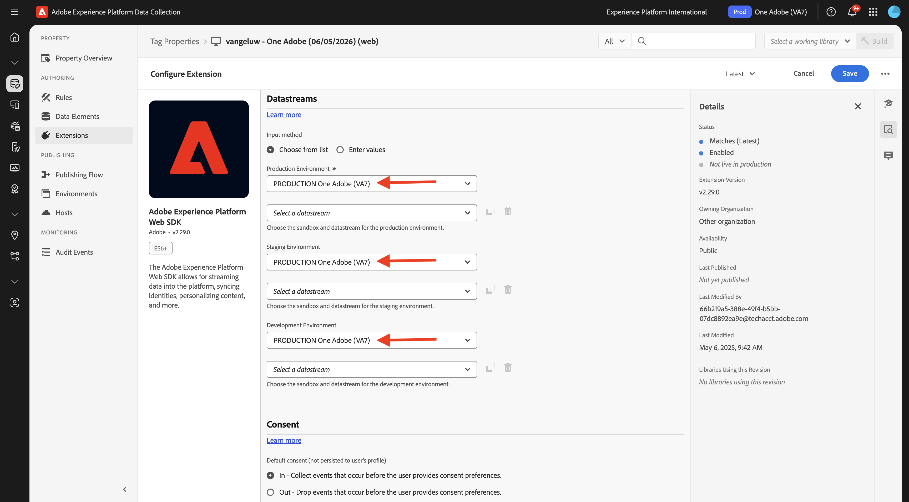
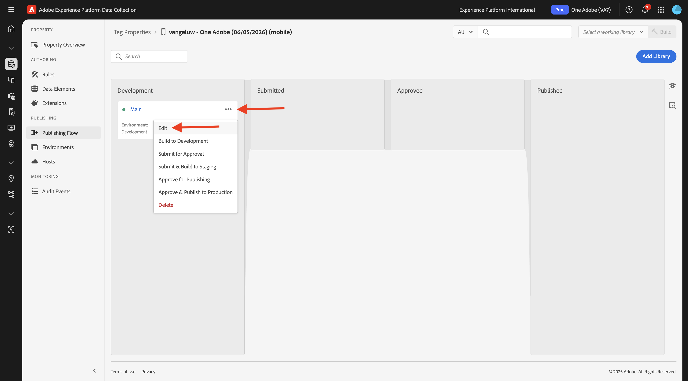

# Create your Datastream

Go to [https://experience.adobe.com/#/data-collection/](https://experience.adobe.com/#/data-collection/). 

In the left menu, click **[!UICONTROL Tags]**. After the previous exercise, you now have two Data Collection properties: one for web and one for mobile.

These properties are almost ready to be used, but before you can start collecting data using these properties you need to set up a datastream. You'll get more information around the concept of what a datastream is and what it means in a later exercise in the Data Collection module.

For now, please follow these steps.

## Create your Datastream for Web

Click **[!UICONTROL Datastreams]**.

In the top right corner of your screen, select your sandbox name, which should be `--aepSandboxName--`.

Click **[!UICONTROL New Datastream]**.

For the **[!UICONTROL Name]**, and for the optional description, enter `--aepUserLdap-- - Demo System Datastream`. For **Mapping Schema**, select **Demo System - Event Schema for Website (Global v1.1)**. Click **Save**.

You'll then see this. Click **Add Service**.

Select the service **[!UICONTROL Adobe Experience Platform]**, which will expose additional fields. You'll then see this. 

For Event Dataset, select **Demo System - Event Dataset for Website (Global v1.1)** and for Profile Dataset, select **Demo System - Profile Dataset for Website (Global v1.1)**. Click **Save**.

You'll now see this.

In the left menu, clik **[!UICONTROL Tags]**.

Filter the search results to see your two Data Collection properties. Open the property for **Web** by clicking it.

You'll then see this. Click **Extensions**.

First, click the Adobe Experience Platform Web SDK extension and then click **Configure**.

You'll then see this. Have a kook at the **Datastreams** menu and make sure the right sandbox is selected, which in you case should be `--aepSandboxName--`.

Open the **Datastreams** dropdown, and select the Datastream you created earlier.

Make sure to have selected your **Datastream** in all three different environments. Then, click **Save**.

Go to **Publishing Flow**.

Click the **...** for **Main**, then click **Edit**.

Click **Add All Changed Resources** and then click **Save & Build for Development**.

Your changes are now being published and will be ready in a couple of minutes, after which you'll see the green dot next to **Main**.

## Create your Datastream for Mobile

Go to [https://experience.adobe.com/#/data-collection/](https://experience.adobe.com/#/data-collection/). 

Click **[!UICONTROL Datastreams]**.

In the top right corner of your screen, select your sandbox name, which should be `--aepSandboxName--`.

Click **[!UICONTROL New Datastream]**.

For the **[!UICONTROL Friendly Name]**, and for the optional description, enter `--aepUserLdap-- - Demo System Datastream (Mobile)`. For **Mapping Schema**, select **Demo System - Event Schema for Mobile App (Global v1.1)**. Click **Save**.

Click **[!UICONTROL Save]**.

You'll then see this. Click **Add Service**.

Select the service **[!UICONTROL Adobe Experience Platform]**, which will expose additional fields. You'll then see this.

For Event Dataset, select **Demo System - Event Dataset for Mobile App (Global v1.1)** and for Profile Dataset, select **Demo System - Profile Dataset for Mobile App (Global v1.1)**. Click **Save**.

You'll then see this.

Your datastream is now ready to be used in your Adobe Experience Platform Data Collection Client property for Mobile.

Go to **Tags** and filter the search results to see your two Data Collection properties. Open the property for **Mobile** by clicking it. 

You'll then see this. Click **Extensions**.

Click the **Adobe Experience Platform Edge Network** extension and then click **Configure**.

You'll then see this. You now need to select the correct sandbox and datastream that you just configured. The sandbox to use is `--aepSandboxName--` and the datastream is called `--aepUserLdap-- - Demo System Datastream (Mobile)`. 

For the **Edge Network domain**, please use the default domain.

Click **Save** to save your changes.

Go to **Publishing Flow**.

Click the **...** next to **Main**, then click **Edit**.

Click **Add All Changed Resources**, then click **Save & Build for Development**.

Your changes are now being published and will be ready in a couple of minutes, after which you'll see the green dot next to **Main**.

Next Step: [Use the website](./ex4.md)

[Go Back to Getting Started](./getting-started.md)

[Go Back to All Modules](./../../../overview.md)
