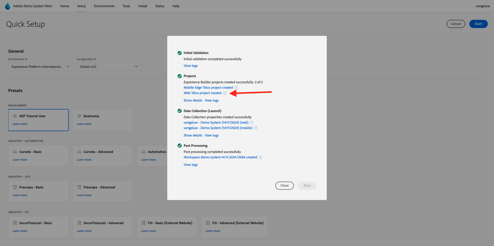
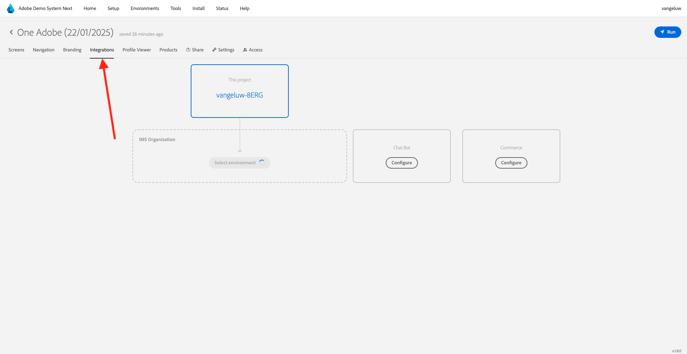
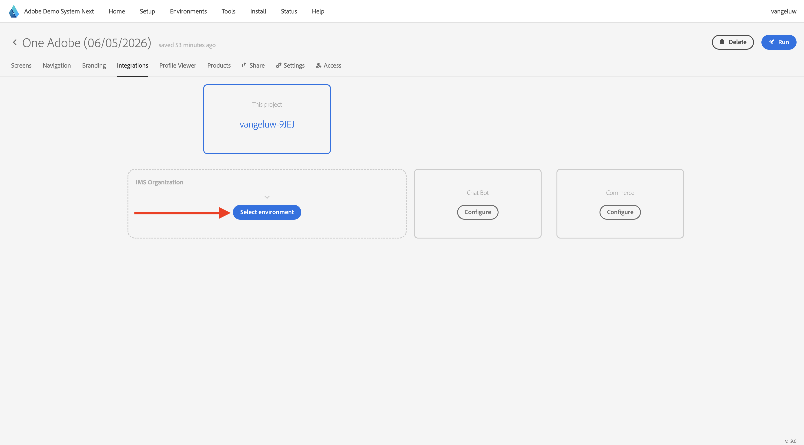
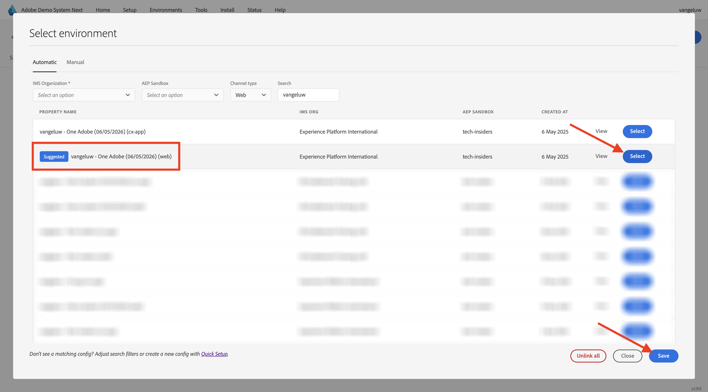
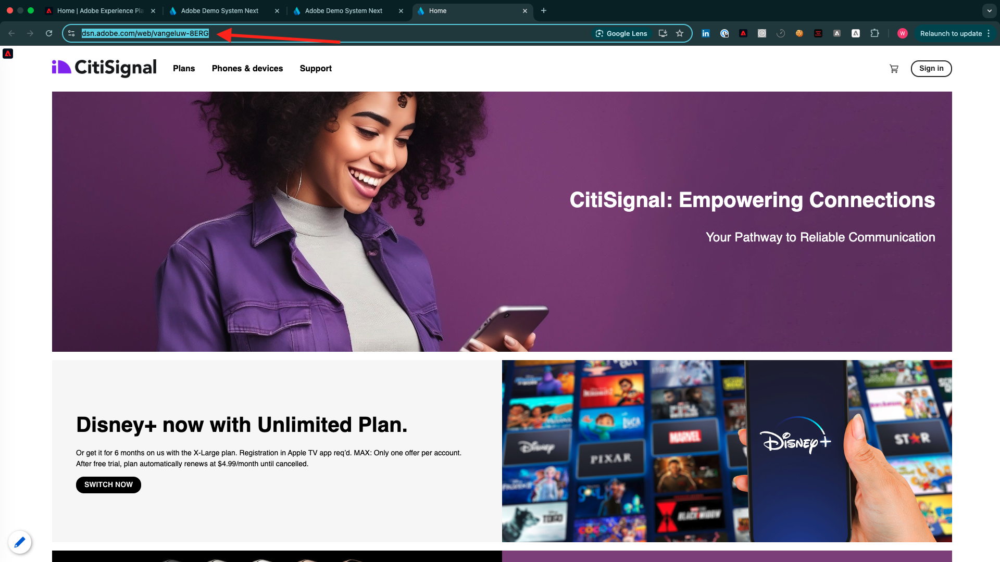
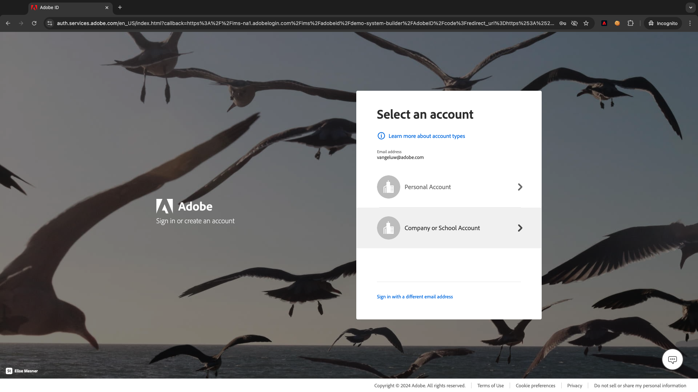
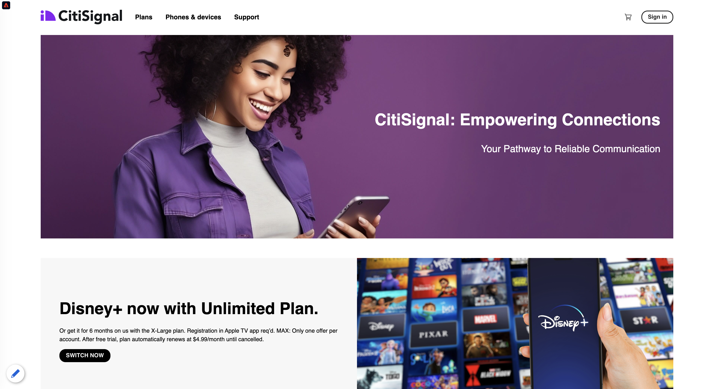
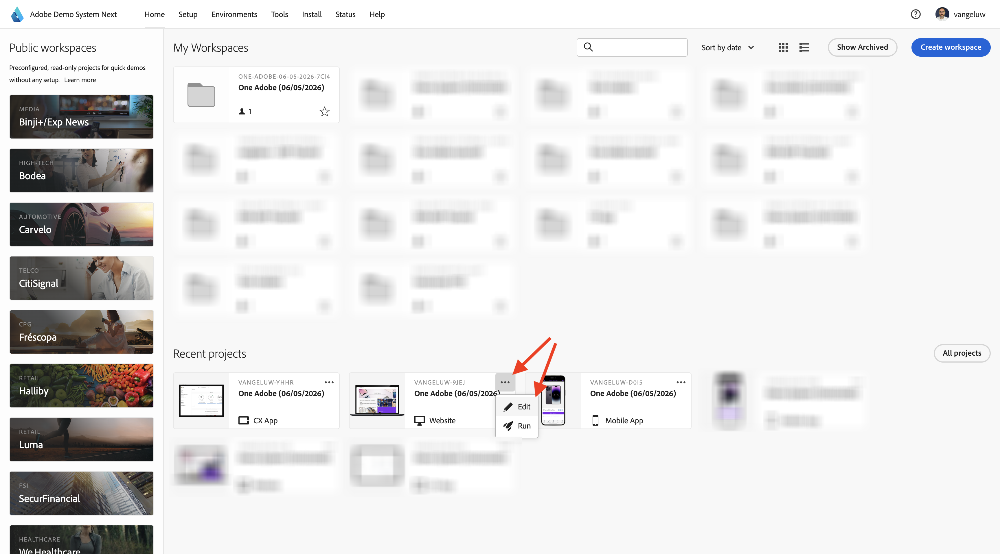

# Use the website

## Option 1: Continue from previous exercise

>[!NOTE]
>
>If you don't have the below screen open anymore, go to option 2 instead.

After the previous exercise, you had this result. Click to open the **Web Telco project** that was created for you.

You'll then see this. Click **Integrations**.

On the **Integrations** page, you need to select the Data Collection property that was created in the previous exercise. To do that, click **Select environment**. 

Click **Select** on the Data Collection property that was created in the previous step, which is named `--aepUserLdap-- - Demo System (DD/MM/YYYY) (web)`. Click **Save**.

You'll then see this. Click **Run** to open the demo website.

You'll then see your demo website open up. Select the URL and copy it to your clipboard.

Open a new incognito browser window.

Paste the URL of your demo website, which you copied in the previous step. You'll then be asked to login using your Adobe ID.

Select your account type and complete the login process.

You'll then see your website loaded in an incognito browser window. For every demonstration, you'll need to use a fresh, incognito browser window to load your demo website URL.

## Option 2: Start with a new incognito browser window

In case you had accidentally closed your browser window, or for future sessions, you can also access your website project by going to [https://dsn.adobe.com/](https://dsn.adobe.com/). After logging in with your Adobe ID, you'll see this. Click the 3 dots **...** on your website project and then click **Edit**.

You can now follow the below flow to access the website. Click **Integrations**.

On the **Integrations** page, you need to select the Data Collection property that was created in the previous exercise. To do that, click **Select environment**. 

Click **Select** on the Data Collection property that was created in the previous step, which is named `--aepUserLdap - Demo System (DD/MM/YYYY) (web)`.

You'll then see this. Click **Run** to open the demo website.

You'll then see your demo website open up. Select the URL and copy it to your clipboard.

Open a new incognito browser window.

Paste the URL of your demo website, which you copied in the previous step. You'll then be asked to login using your Adobe ID.

Select your account type and complete the login process.

You'll then see your website loaded in an incognito browser window. For every demonstration, you'll need to use a fresh, incognito browser window to load your demo website URL.

Next Step: [Use the mobile app](./ex5.md)

[Go Back to Getting Started](./getting-started.md)

[Go Back to All Modules](./../../../overview.md)
