# Use the mobile app

## Download the app

Go to [https://bit.ly/dx-demo-app](https://bit.ly/dx-demo-app){target="_blank"} on your computer. You'll then see this.

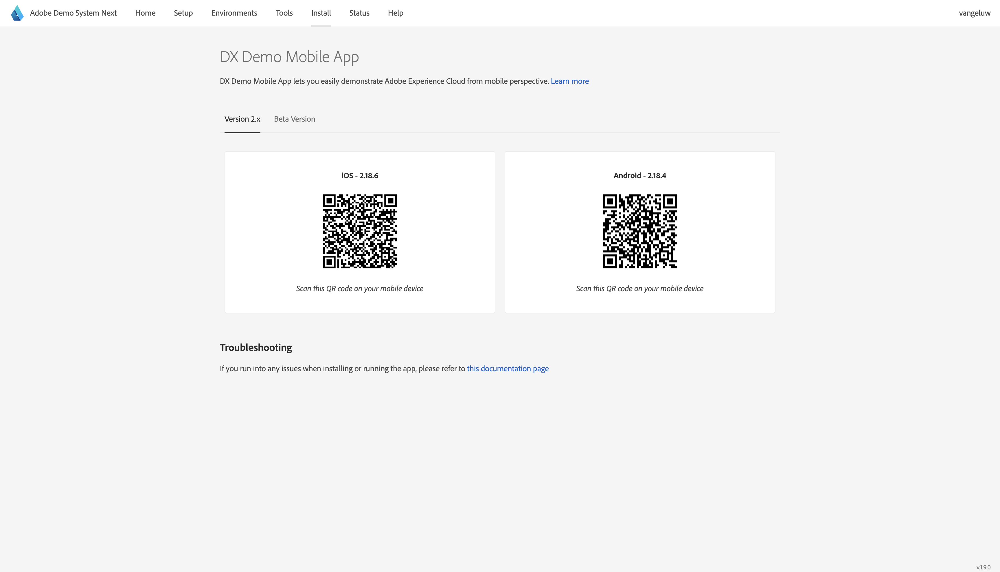

Use the **Camera** app on your smartphone to install the mobile app for your device's OS. For this enablement, you need to install the **Version 2.x** which uses the Adobe Experience Platform Mobile SDK's.

>[!NOTE]
>
>After installing the app for the first time on an iOS device, you might get an error message when trying to open the app which says: **Untrusted Enterprise Developer**. In order to fix this, you need to go to **Settings > General > VPN & Device Management > Adobe Systems Inc.** and click **Trust Adobe Systems Inc.**.

Once the app is installed, you'll find it on your device's home screen. Click the icon to open the app.

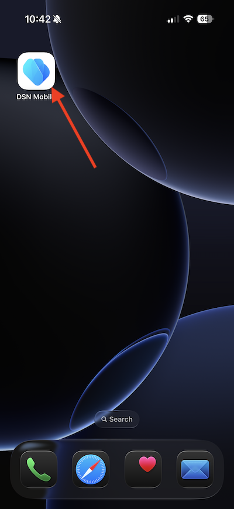

When you're using the app the first time, you'll be requested to log in using your Adobe ID. Complete the login process.

After logging in, you'll see a notification requesting your permission to send notifications. We'll send notifications as part of the tutorial, so click **Allow**.

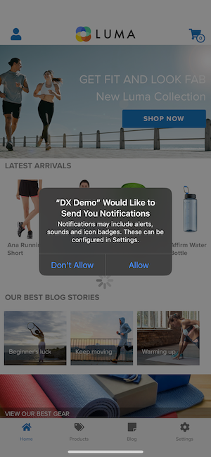

You'll then see the app's homepage. Go to **Settings**.

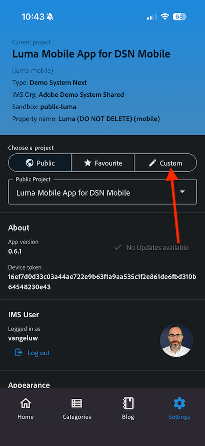

In settings, you'll see that currently a **Public Project** is loaded in the app. Click **Custom Project**.

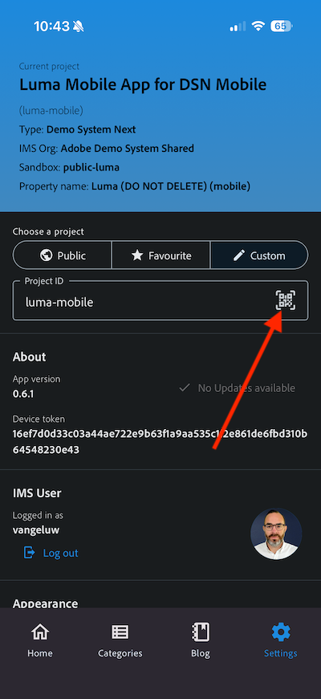

You can now load a custom project. Click the QR code to easily load your project.

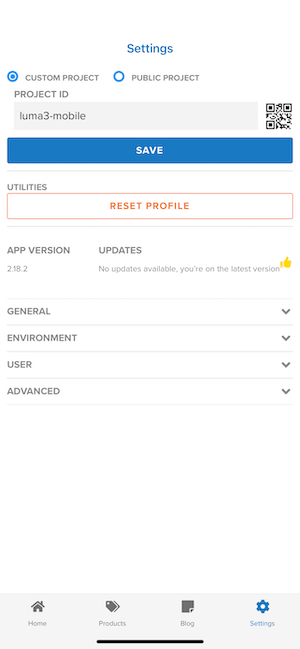

After the previous exercise, you had this result. Click to open the **Mobile Edge Telco project** that was created for you.

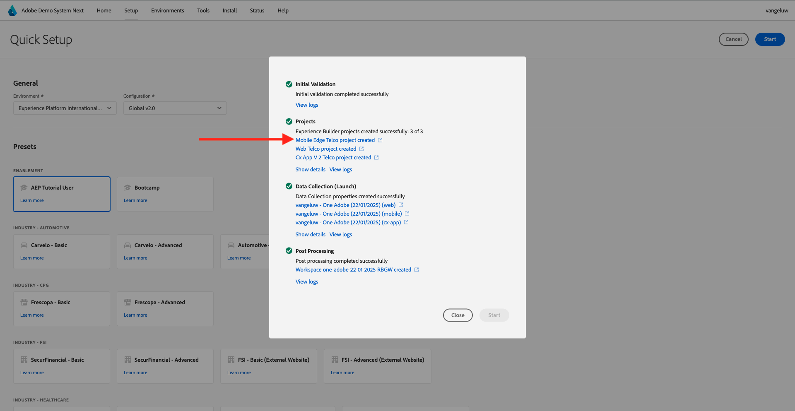

In case you had accidentally closed your browser window, or for future demo or enablement sessions, you can also access your website project by going to [https://dsn.adobe.com](https://dsn.adobe.com){target="_blank"}. After logging in with your Adobe ID, you'll see this. Click the three dots **...** on your mobile app project and then click **Edit**.

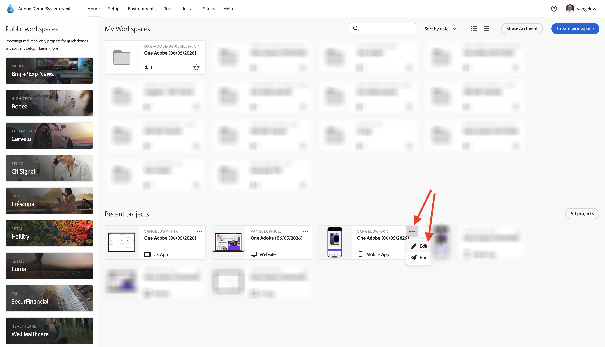

On the **Integrations** page, you need to select the Data Collection property that was created in the previous exercise. To do that, click **Select environment**. 

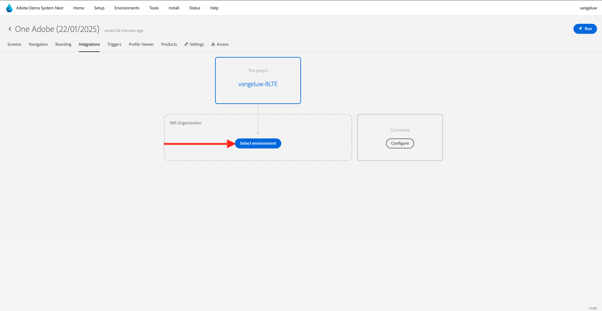

Click **Select** on the Data Collection property that was created in the previous step, which is named `--aepUserLdap - One Adobe (DD/MM/YYYY) (mobile)`. Then, click **Save**.

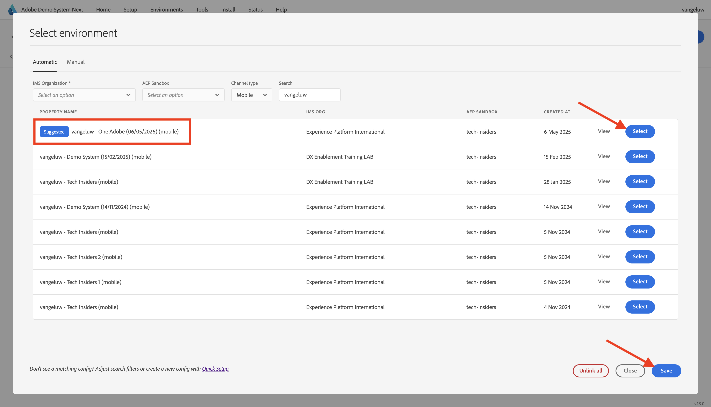

You'll then see this. Next, click **Run**.

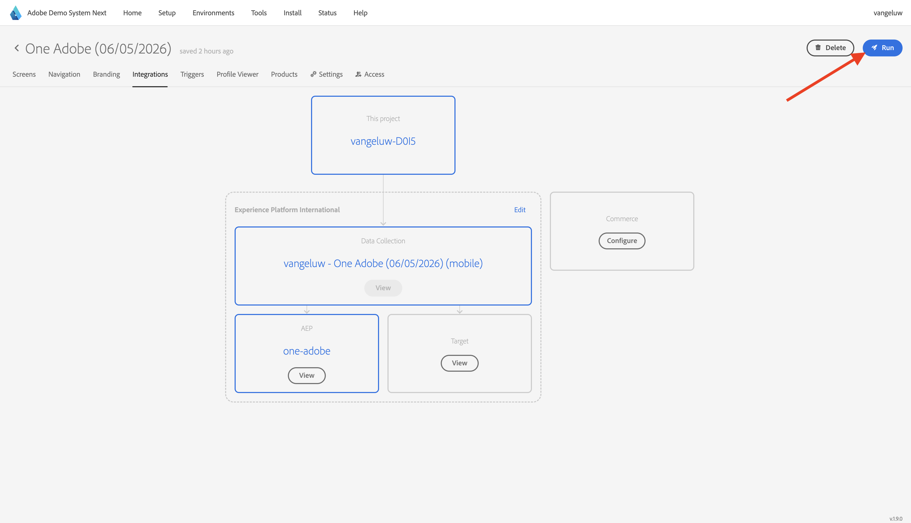

You'll then see this popup, which contains a QR code. Scan this QR-code from within the mobile app.

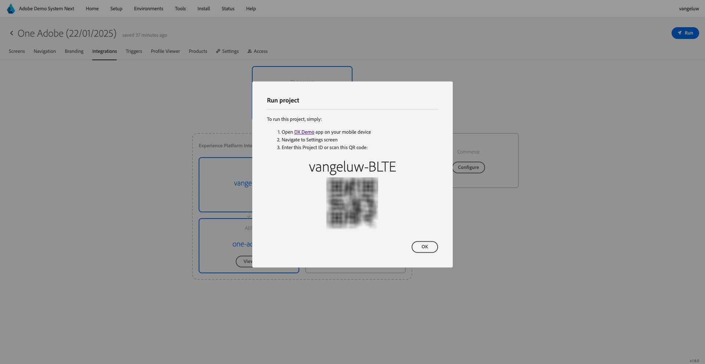

You'll then see your project ID show in the app, after which you can click **Save**.

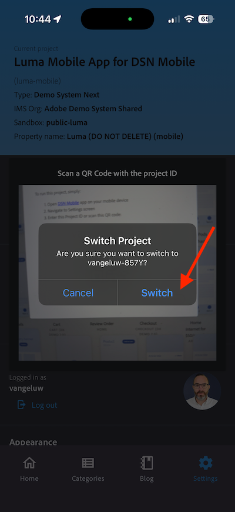

Now, go back to **Home** in the app. Your app is now ready to be used.

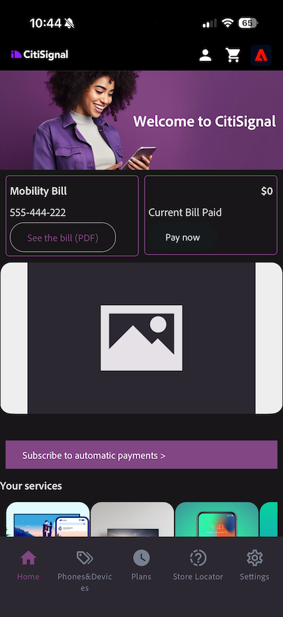

## Next Steps

Go to [Configure your Adobe I/O project](./ex6.md){target="_blank"}

Go back to [Getting Started](./getting-started.md){target="_blank"}

Go back to [All modules](./../../../overview.md){target="_blank"}